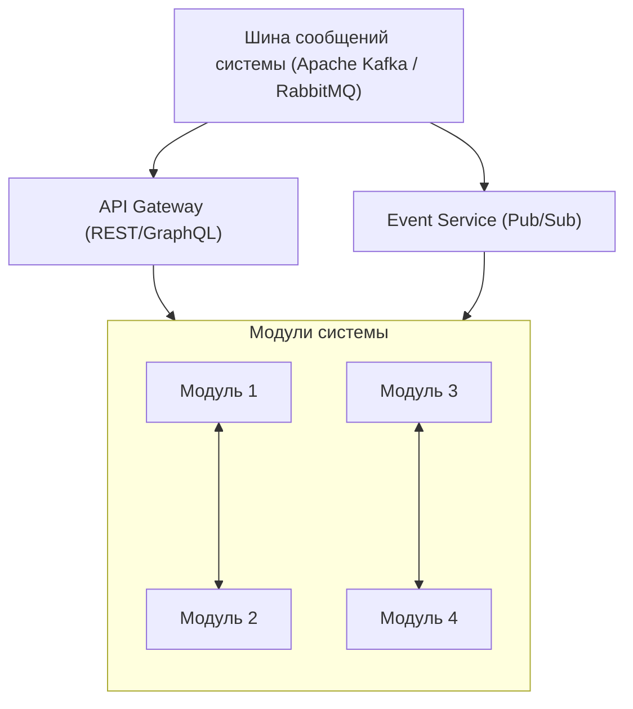
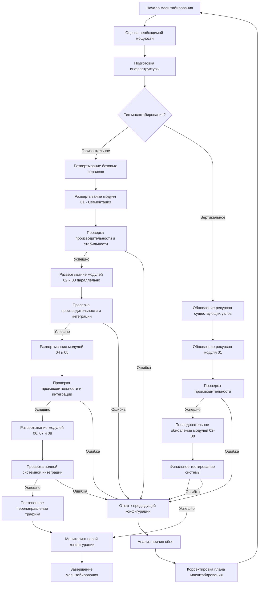

# Система интеграции и управления зависимостями между модулями

## 1. Архитектура интеграции

### 1.1. Общий подход к интеграции модулей

Система машинного перевода построена на принципах слабой связанности и высокой сплоченности компонентов. Для обеспечения эффективного взаимодействия и минимизации проблем интеграции используются следующие подходы:

- **Контрактное программирование**: каждый модуль определяет четкий контракт своих входных и выходных интерфейсов
- **Механизм событий**: асинхронная коммуникация между модулями через систему публикации/подписки
- **Стандартизированные форматы данных**: унифицированные структуры для обмена информацией
- **Версионирование интерфейсов**: поддержка обратной совместимости при обновлениях

### 1.2. Система коммуникации между модулями

### 1.3. Стратегии синхронизации и согласованности данных

- **Двухфазная фиксация (2PC)** для обеспечения целостности данных при обновлении нескольких модулей
- **Компенсирующие транзакции** для обработки ошибок в распределенных операциях
- **Оптимистическая блокировка** для параллельного редактирования с контролем версий
- **Кэширование с инвалидацией** для повышения производительности при сохранении согласованности

### 1.4. Управление версиями интерфейсов

- **Семантическое версионирование** API (MAJOR.MINOR.PATCH)
- **Поддержка устаревших версий** API в течение переходного периода
- **Документация изменений** при каждом обновлении интерфейсов
- **Автоматические тесты совместимости** для проверки соответствия контрактам

## 2. Матрица зависимостей модулей

|Модуль|Предоставляет (выходные интерфейсы)|Потребляет (входные зависимости)|Критичность зависимостей|
|---|---|---|---|
|01 - Сегментация|SegmentedDocumentAPI|DocumentProcessingAPI (К), ConfigurationAPI (Н)|Базовый модуль|
|02 - Извлечение терминов|ExtractedTerminologyAPI|SegmentedDocumentAPI (К), ConfigurationAPI (Н)|Средняя|
|03 - Работа с пользовательскими данными|ProcessedUserResourcesAPI, TranslationPrepDataAPI|SegmentedDocumentAPI (К), UserAuthenticationAPI (К)|Высокая|
|04 - Перевод и утверждение глоссария|TranslatedGlossaryAPI, GlossaryEventsAPI|ExtractedTerminologyAPI (К), ProcessedUserResourcesAPI (Н), TranslationEngineAPI (К)|Средняя|
|05 - Машинный перевод|TranslatedDocumentAPI, TranslationFeedbackAPI|SegmentedDocumentAPI (К), TranslatedGlossaryAPI (Н), ProcessedUserResourcesAPI (Н), TranslationEngineProvidersAPI (К)|Высокая|
|06 - Ревизия, редактирование и корректура|RevisedDocumentAPI, EditingInsightsAPI|TranslatedDocumentAPI (К), TranslatedGlossaryAPI (Н), StyleGuideAPI (Н), QualityAssuranceAPI (К)|Средняя|
|07 - Пользовательское редактирование|UserEditedDocumentAPI, FeedbackCollectionAPI|RevisedDocumentAPI (К), TranslatedGlossaryAPI (Н), ProcessedUserResourcesAPI (К), QualityCheckAPI (Н)|Высокая|
|08 - Интеграция и обработка TM/TB|EnhancedTranslationMemoryAPI, InternalGlossaryAPI, ModelTrainingDataAPI|UserEditedDocumentAPI (К), TranslatedGlossaryAPI (Н), FeedbackCollectionAPI (Н), TranslationEngineAPI (К)|Средняя|

**Примечание**: (К) - критическая зависимость, (Н) - некритическая зависимость

## 3. Процедуры обновления и развертывания

### 3.1. Стратегия согласованного обновления модулей

- **Определение зависимостей**: анализ матрицы зависимостей перед обновлением
- **Порядок обновления**: обновление модулей в порядке их зависимостей (сначала базовые компоненты)
- **Частичное развертывание**: поддержка работы старых и новых версий модулей в переходный период
- **Канареечное развертывание**: тестирование обновлений на ограниченном наборе пользователей

### 3.2. Блок-схема последовательности развертывания модулей при масштабировании системы

### 3.3. Мониторинг целостности системы

- **Проверки работоспособности**: регулярные проверки доступности и корректности интерфейсов
- **Мониторинг метрик**: отслеживание времени отклика, успешности вызовов и других KPI
- **Алертинг**: настроенные уведомления при обнаружении проблем совместимости
- **End-to-end тесты**: комплексная проверка всех критических путей после обновлений

### 3.4. Процедуры отката и восстановления

- **Версионированные артефакты**: хранение всех версий компонентов в репозитории
- **Сохранение состояния системы**: резервные копии данных перед обновлением
- **Автоматизированные процедуры отката**: скрипты для быстрого восстановления предыдущей версии
- **Анализ инцидентов**: процедуры для выявления и документирования причин проблем интеграции

## 4. Практические аспекты реализации

### 4.1. Инструменты интеграции и тестирования

- **API Gateway**: Kong/Spring Cloud Gateway для централизованного управления API
- **Система сообщений**: Kafka/RabbitMQ для асинхронной коммуникации
- **Инструменты контрактного тестирования**: Pact/Spring Cloud Contract
- **Системы непрерывной интеграции**: Jenkins/CircleCI/GitHub Actions

### 4.2. Документирование интерфейсов

- **API-спецификации**: OpenAPI/Swagger для документирования REST API
- **Схемы сообщений**: Protobuf/Avro для определения структуры сообщений
- **Централизованное хранилище документации**: автоматически обновляемый портал
- **Примеры использования**: демонстрация взаимодействия с интерфейсами

### 4.3. Стратегии разрешения конфликтов

- **Приоритизация модулей**: определены приоритеты при конфликтующих изменениях
- **Согласование изменений**: процесс рецензирования изменений интерфейсов
- **Политика обратной совместимости**: требования к поддержке существующих клиентов
- **Механизмы разрешения конфликтов данных**: алгоритмы объединения противоречивых данных

### 4.4. Обеспечение безопасности интеграций

- **Аутентификация и авторизация**: между модулями с использованием JWT/OAuth
- **Шифрование в транзите**: TLS для всех взаимодействий между компонентами
- **Проверка валидности данных**: проверка входных данных на каждом интерфейсе
- **Аудит взаимодействий**: логирование всех межмодульных коммуникаций

### 4.5. Метрики эффективности системной интеграции

- Ключевые показатели производительности интеграций (время отклика API, пропускная способность)
- Метрики надежности (процент успешных транзакций, время безотказной работы, MTTR)
- Метрики масштабируемости (поведение системы при увеличении нагрузки)
- Показатели согласованности данных между модулями
- Метрики эффективности кэширования (hit/miss ratio, среднее время доступа)
- Показатели стабильности при обновлениях (количество инцидентов при релизах)

## 5. Мониторинг производительности взаимодействия между модулями

### 5.1. Ключевые метрики латентности

- **Время отклика между модулями (P50, P95, P99)**: измерение времени выполнения межмодульных запросов
- **Латентность очередей сообщений**: мониторинг задержек в системе обмена сообщениями
- **Время end-to-end обработки запросов**: общее время прохождения запроса через цепочку модулей
- **Задержки на сетевом уровне**: время передачи данных между физическими узлами системы

### 5.2. Инструменты мониторинга производительности

- **Распределенная трассировка**: использование Jaeger/Zipkin для отслеживания запросов через модули
- **Метрики в реальном времени**: Prometheus/Grafana для визуализации производительности
- **Логи производительности**: структурированные журналы с временными метками для аналитики
- **Синтетические тесты**: регулярные проверки производительности ключевых путей интеграции

### 5.3. Пороговые значения и SLA для взаимодействий

|Тип взаимодействия|Нормальная латентность|Предупреждение|Критическое значение|SLA доступности|
|---|---|---|---|---|
|Синхронные REST API|< 200 мс|200-500 мс|> 500 мс|99.9%|
|Асинхронные сообщения|< 2 с|2-10 с|> 10 с|99.5%|
|Потоковая обработка|< 5 с|5-30 с|> 30 с|99.5%|
|Пакетная обработка|< 5 мин|5-15 мин|> 15 мин|99.0%|

### 5.4. Анализ и оптимизация производительности

- **Автоматическое обнаружение узких мест**: алгоритмы выявления проблемных интеграций
- **Профилирование взаимодействий**: периодический анализ наиболее ресурсоемких операций
- **Оптимизация паттернов взаимодействия**: пересмотр архитектуры проблемных интеграций
- **Мониторинг влияния обновлений**: сравнение производительности до и после внесения изменений

## 6. Механизмы деградации функциональности при недоступности модулей

### 6.1. Стратегии деградации по типам модулей

|Модуль|Стратегия деградации при недоступности|
|---|---|
|01 - Сегментация|Использование кэшированных результатов предыдущей сегментации; упрощенная сегментация на основе правил без ML-компонентов|
|02 - Извлечение терминов|Переход к базовому извлечению по словарю без использования контекстного анализа; использование только встроенных словарей|
|03 - Работа с пользовательскими данными|Переход в режим "только чтение" для пользовательских данных; использование кэшированных данных|
|04 - Перевод и утверждение глоссария|Автоматическое использование последнего утвержденного глоссария без возможности обновления|
|05 - Машинный перевод|Переключение на резервные провайдеры перевода; отключение специализированных моделей в пользу общих|
|06 - Ревизия и корректура|Отключение углубленной проверки, переход к базовой проверке орфографии и грамматики|
|07 - Пользовательское редактирование|Ограничение функций совместного редактирования; переход в режим однопользовательского редактирования|
|08 - Интеграция TM/TB|Использование только локальных копий памяти переводов без синхронизации с внешними системами|

### 6.2. Приоритизация функциональности при деградации

- **Критическая функциональность**: сохраняется при любых условиях (базовый перевод, сохранение данных)
- **Важная функциональность**: отключается только при серьезных проблемах (качество перевода, проверки)
- **Вспомогательная функциональность**: первая подвергается деградации (аналитика, расширенные функции)
- **Администраторская функциональность**: ограничивается в пользу пользовательских функций

### 6.3. Технические механизмы деградации

- **Circuit Breaker**: предотвращение каскадных сбоев при недоступности зависимых сервисов
- **Fallback-механизмы**: предопределенные альтернативные реализации для критичных функций
- **Кэширование и использование устаревших данных**: система определяет допустимый "возраст" данных
- **Очереди с приоритетами**: обеспечение обработки критичных операций при перегрузке

### 6.4. Уведомление пользователей о деградации

- **Система индикации статуса**: визуальное отображение состояния и доступности функций
- **Предупреждения о функциональных ограничениях**: уведомления пользователей о работе в деградированном режиме
- **Оценка времени восстановления**: информирование о примерных сроках возвращения к полной функциональности
- **Руководства по обходным путям**: инструкции для пользователей по работе в условиях ограниченной функциональности

### 6.5. Автоматическое восстановление функциональности

- **Периодические проверки доступности**: регулярное тестирование недоступных компонентов
- **Пошаговое восстановление**: приоритизированное включение функций при восстановлении работоспособности
- **Синхронизация данных после восстановления**: обновление данных, накопленных в период деградации
- **Валидация целостности**: проверка согласованности данных перед полным восстановлением