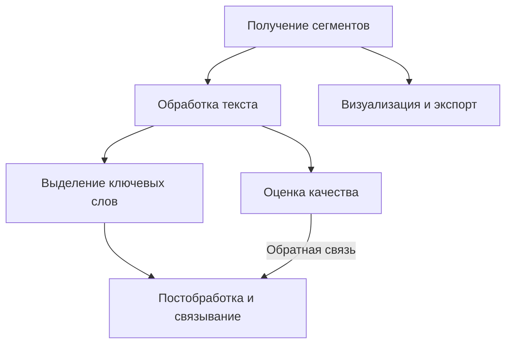

# Модуль извлечения терминов и ключевых слов

## 1. Архитектура модуля извлечения терминов

### 1.1. Общая схема взаимодействия

### 1.2. Интерфейсы взаимодействия

- **Выходные интерфейсы модуля**:
    - `ExtractedTerminologyAPI`: Предоставляет доступ к извлеченным терминам и их контекстам
        - Методы: `getTerms()`, `getTermContexts(termId)`, `getTermMetadata(termId)`
        - Формат данных: Структурированный словарь терминов с их атрибутами и связями
    - `TermVisualizationAPI`: Предоставляет доступ к визуализациям терминов
        - Методы: `getTagCloud()`, `getTermGraph()`, `getTermClusters()`
        - Формат данных: Готовые визуализации в различных форматах
- **Входные зависимости**:
    - `SegmentedDocumentAPI`: Интерфейс для получения сегментированного документа
        - Требуемые методы: `getSegments()`, `getSegmentById(id)`, `getDocumentMetadata()`
    - `ConfigurationAPI`: Интерфейс для получения конфигурационных параметров
        - Требуемые методы: `getTermExtractionParameters()`, `getDomainModels()`
- **Механизмы синхронизации**:
    - События завершения обработки: `onTermExtractionComplete`
    - Механизм уведомлений для асинхронных взаимодействий через шину сообщений
    - Контрольные точки для восстановления при сбоях

## 2. Этапы обработки в модуле извлечения терминов

### 2.1. Получение сегментированного текста

- Взаимодействие с модулем сегментации через API
- Загрузка сегментированного текста с метаданными
- Проверка целостности полученных данных
- Валидация структуры сегментов и их метаданных
- Получение информации о языке и предметной области документа
- Доступ к контекстной информации для каждого сегмента
- Синхронизация версий при обновлении исходного документа
- Обработка инкрементальных обновлений для эффективной работы с изменяющимися документами

### 2.2. Обработка текста

- Токенизация с учётом особенностей сегментированного текста
- Удаление стоп-слов с учётом языка и предметной области
- Лемматизация и стемминг для нормализации форм слов
- Морфологический и синтаксический анализ
- Распознавание частей речи для фильтрации подходящих кандидатов в термины
- Выявление именованных сущностей (NER) с использованием специализированных моделей
- Применение доменных словарей и онтологий для обогащения анализа
- Использование контекстных эмбеддингов для семантического представления слов и фраз
- Применение специализированных доменных моделей для обработки терминологии
- Параллельная обработка для больших объемов текста

### 2.3. Выделение ключевых слов и выражений

- Статистические методы (TF-IDF, BM25)
- Графовые методы (TextRank, PositionRank)
- Модели машинного обучения (BERT, KeyBERT, YAKE!)
- Контекстные эмбеддинги (Sentence-BERT) для кластеризации похожих терминов
- Использование специализированных словарей и доменных NER-моделей:
    - Адаптация через дообучение на доменных корпусах
    - Использование специализированных словарей для терминов
    - Доменные правила для выделения сложных сущностей
- Выделение многословных выражений и коллокаций:
    - KeyphraseVectorizers для выделения фраз из нескольких слов
    - Статистические методы (PMI, Log-Likelihood) для анализа коллокаций
    - Использование специализированных моделей для терминологической экстракции
- Применение предобученных доменных моделей (SciSpacy, Med7, Legal-BERT и др.)
- Учет сегментированных предложений для контекстного анализа
- Сохранение связи «ключевое слово → сегмент» для каждого найденного термина
- Настраиваемые пороги для минимальной значимости ключевых слов (по умолчанию: 0.3)
- Ансамблевые методы для объединения результатов различных подходов
- Учет структурной информации из документа для взвешивания значимости терминов

### 2.4. Постобработка и связывание

- Фильтрация нерелевантных ключевых слов с настраиваемыми порогами
- Кластеризация и группировка семантически схожих ключевых выражений:
    - Настраиваемый порог кластеризации (по умолчанию: 0.75 для HDBSCAN)
    - Определение представителя кластера через центроид или наиболее частотный термин
- Приведение к единой форме (лемматизация, нормализация)
- Ранжирование по значимости с учётом структуры документа
- Семантическое ранжирование ключевых слов на основе контекстных эмбеддингов:
    - Использование SentenceBERT для выявления семантически значимых терминов
    - Анализ расположения термина в тексте (заголовок, начало раздела и т.д.)
    - Учёт частотности и глобальной значимости терминов
- Объединение результатов разных методов экстракции
- Применение доменных словарей для проверки и нормализации терминов
- Индексация контекстов употребления ключевых слов
- Построение графа связей между терминами на основе:
    - Совместной встречаемости в контекстах
    - Семантической близости
    - Структурных и иерархических отношений
- Обогащение терминов метаданными (частотность, важность, домен)
- Связывание с внешними онтологиями и базами знаний при наличии

### 2.5. Оценка качества выделения терминов

- Расчет метрик качества извлечения терминов:
    - Precision, Recall, F1-score по отношению к эталонным наборам
    - Mean Average Precision (MAP) для ранжированных списков
    - Normalized Discounted Cumulative Gain (NDCG) для оценки ранжирования
- Сравнение с эталонными наборами терминов (если доступны)
- Оценка охвата документа выделенными терминами
- Оценка семантической связности выделенных терминов
- Анализ стабильности результатов при небольших изменениях текста
- Экспертная оценка с использованием обратной связи от пользователей
- Кросс-валидация с использованием различных методов извлечения
- Мониторинг производительности различных методов извлечения
- Автоматическая корректировка параметров на основе оценки качества
- Адаптивное улучшение результатов с учетом обратной связи

### 2.6. Визуализация и экспорт результатов

- Формирование структурированного отчета с ключевыми словами и их значимостью
- Контекстуализация ключевых слов с сохранением сегментов их употребления
- Построение индекса связей между ключевыми словами и сегментами текста
- Визуализация (облако тегов, граф связей, тематические кластеры)
- Экспорт в различных форматах (JSON, CSV, HTML, PDF) с контекстами употребления
- Аннотированная версия исходного документа с выделенными ключевыми словами
- Интерфейс для навигации между ключевыми словами и их контекстами
- Интерактивные дашборды для анализа терминологии
- Генерация тезаурусов и глоссариев на основе выделенных терминов
- Экспорт в форматы для интеграции с внешними системами
- Визуализация эволюции терминологии при анализе нескольких версий документа

## 3. Компоненты модуля извлечения терминов

### 3.1. Компонент обработки текста

- Токенизаторы с поддержкой различных языков и специфических доменов
- Лемматизаторы и стеммеры для нормализации словоформ
- Морфологические и синтаксические анализаторы
- Обработчики именованных сущностей (NER) для различных доменов
- Фильтры стоп-слов с настраиваемыми списками
- Анализаторы частей речи для выделения потенциальных терминов
- Векторизаторы для преобразования текста в числовые представления
- Генераторы эмбеддингов для семантического представления слов и фраз
- Компоненты для обработки многоязычных текстов
- Специализированные процессоры для технических, научных и юридических текстов

### 3.2. Компонент выделения ключевых слов

- Реализации статистических методов (TF-IDF, BM25)
- Реализации графовых методов (TextRank, PositionRank)
- Интеграции с моделями машинного обучения (BERT, KeyBERT, YAKE!)
- Обработчики многословных выражений и коллокаций
- Специализированные экстракторы терминов для различных доменов
- Модули для работы с контекстными эмбеддингами
- Компоненты для распределенной обработки больших объемов текста
- Интеграции с доменными моделями (SciSpacy, Med7, Legal-BERT)
- Система плагинов для расширения методов извлечения
- Ансамблевые комбинаторы для объединения результатов различных методов

### 3.3. Компонент кластеризации и семантического анализа

- Алгоритмы кластеризации терминов (HDBSCAN, K-means, агломеративная кластеризация)
- Генераторы эмбеддингов для семантического представления терминов
- Анализаторы семантической близости терминов
- Построители графов взаимосвязей терминов
- Алгоритмы детекции дубликатов и синонимов
- Модули для работы с внешними онтологиями и тезаурусами
- Компоненты для анализа тематической когерентности терминов
- Алгоритмы для иерархической организации терминов
- Модули для обнаружения гиперонимов и гипонимов
- Рекомендательные системы для связывания терминов

### 3.4. Компонент постобработки и ранжирования

- Фильтры для отсеивания нерелевантных терминов
- Нормализаторы для приведения терминов к единой форме
- Алгоритмы ранжирования терминов по значимости
- Модули для учета структурной информации при ранжировании
- Компоненты для семантического ранжирования
- Объединители результатов различных методов экстракции
- Верификаторы терминов с использованием внешних источников
- Обогатители терминов дополнительными метаданными
- Индексаторы контекстов употребления ключевых слов
- Процессоры для инкрементальных обновлений терминологической базы

### 3.5. Компонент оценки качества

- Калькуляторы метрик качества (Precision, Recall, F1-score, MAP, NDCG)
- Сравнители с эталонными наборами терминов
- Анализаторы охвата документа выделенными терминами
- Оценщики семантической связности терминов
- Модули для кросс-валидации результатов различных методов
- Системы сбора и обработки обратной связи от пользователей
- Мониторы производительности различных методов извлечения
- Автокорректоры параметров на основе оценки качества
- Бенчмаркеры для сравнения с другими системами извлечения терминов
- Логи и аудит для отслеживания изменений в качестве экстракции

### 3.6. Компонент визуализации и экспорта

- Генераторы облаков тегов с настраиваемыми параметрами
- Построители графов связей между терминами
- Визуализаторы тематических кластеров
- Генераторы структурированных отчетов по выделенным терминам
- Экспортеры в различные форматы (JSON, CSV, HTML, PDF)
- Аннотаторы исходного документа с выделением ключевых слов
- Интерфейсы для навигации между терминами и их контекстами
- Генераторы тезаурусов и глоссариев
- Компоненты для интеграции с внешними системами
- Визуализаторы эволюции терминологии для версионированных документов

### 3.7. Компонент доменных моделей

- Библиотека предобученных доменных моделей
- Медицинские модели (SciSpacy, Med7, BioBERT)
- Юридические модели (Legal-BERT, юридические словари)
- Технические модели (модели для ИТ, инженерии, патентов)
- Финансовые модели (FinBERT, словари финансовых терминов)
- Научные модели (SciBERT, специализированные модели по отраслям науки)
- Механизм выбора и переключения между моделями
- Доменные словари сокращений и специальных терминов
- Компоненты для дообучения моделей на специфических корпусах
- Интерфейсы для добавления пользовательских доменных моделей

### 3.8. Компонент индексации и поиска

- Построители индексов для быстрого доступа к терминам и их контекстам
- Создатели обратных индексов для поиска терминов в сегментах
- Индексаторы семантически близких терминов
- Оптимизаторы индексов для быстрого доступа и экономии памяти
- Компоненты для инкрементальных обновлений индексов
- Механизмы версионирования для отслеживания изменений терминологии
- API для поиска терминов и их контекстов
- Компоненты для фасетного поиска по комбинации терминов
- Ранжираторы результатов поиска по релевантности
- Кэшеры часто используемых запросов для улучшения производительности

### 3.9. Компонент конфигурации и настройки

- Менеджеры конфигурации для всех параметров системы
- Профили настроек для различных типов документов и задач
- Настройщики пороговых значений для фильтрации терминов
- Конфигураторы весов для различных методов экстракции
- Настройки параметров кластеризации и семантического анализа
- Конфигурация доменных моделей и словарей
- Управление параметрами индексации и поиска
- Настройки визуализации и экспорта
- Хранилища пользовательских настроек
- Интерфейсы для программного изменения конфигурации

## 4. Технологический стек модуля извлечения терминов

### 4.1. Библиотеки обработки естественного языка

- Spacy - для базовой обработки текста и NER
- NLTK - для классических алгоритмов обработки текста
- Transformers (Hugging Face) - для работы с трансформерными моделями
- Stanza - для языков с ограниченной поддержкой в Spacy
- SentenceTransformers - для работы с эмбеддингами предложений
- gensim - для тематического моделирования и семантического анализа
- allennlp - для продвинутых NLP моделей
- flair - для современных техник NLP и эмбеддингов
- Trankit - для многоязычной обработки
- KeyBERT - для извлечения ключевых слов на основе BERT

### 4.2. Библиотеки для извлечения ключевых слов

- YAKE! - для извлечения многословных выражений
- pke (Python Keyphrase Extraction) - для различных алгоритмов
- KeyphraseVectorizers - для выделения многословных выражений
- summa - для TextRank и графовых алгоритмов
- rake-nltk - для быстрого извлечения ключевых слов
- textacy - для продвинутой обработки текста и извлечения терминов
- pytextrank - для графовых алгоритмов извлечения ключевых слов
- flashtext - для быстрого поиска ключевых слов
- temfinder - для терминологической экстракции
- multiextract - для мультиязычного извлечения терминов

### 4.3. Доменные модели и инструменты

- SciSpacy - для научных и медицинских текстов
- Med7 - для медицинской информации
- Legal-BERT - для юридических документов
- BioBERT - для биомедицинских текстов
- FinBERT - для финансовых документов
- SciBERT - для научных текстов
- PatentBERT - для патентных документов
- ChemBERT - для химических текстов
- CySecBERT - для текстов по кибербезопасности
- TechBERT - для технической документации

### 4.4. Библиотеки для семантического анализа и кластеризации

- scikit-learn - для классических алгоритмов ML и кластеризации
- HDBSCAN - для кластеризации терминов
- UMAP/t-SNE - для визуализации кластеров
- networkx - для графового анализа
- fastcluster - для иерархической кластеризации
- spherecluster - для кластеризации на сфере
- sentence-transformers - для семантических эмбеддингов
- faiss - для эффективного поиска ближайших соседей
- annoy - для приближенного поиска ближайших соседей
- OpenNRE - для извлечения отношений между сущностями

### 4.5. Библиотеки для визуализации и экспорта

- matplotlib - для базовых визуализаций
- plotly - для интерактивных визуализаций
- wordcloud - для облаков тегов
- pyLDAvis - для визуализации тематических моделей
- Dash - для интерактивных дашбордов
- NetworkX/Cytoscape - для визуализации связей между терминами
- pandas - для обработки и экспорта данных
- jinja2 - для генерации HTML-отчетов
- reportlab - для генерации PDF-отчетов
- fpdf - альтернатива для создания PDF-документов

### 4.6. Библиотеки для индексации и поиска

- PyLucene - для локальной индексации и поиска
- whoosh - легковесная библиотека для полнотекстового поиска
- FAISS - для векторного поиска семантически похожих терминов
- Pyserini - для быстрого поиска в индексированных сегментах
- Annoy - для аппроксимированного поиска ближайших соседей
- Nmslib - для поиска ближайших соседей в различных метрических пространствах
- SQLite/PostgreSQL - для хранения и индексации терминов
- Redis - для кэширования часто используемых терминов
- Tantivy - для быстрой полнотекстовой индексации на Rust с Python-биндингами
- Milvus - для векторного поиска большого масштаба

### 4.7. Библиотеки для масштабирования

- Dask - для параллельной и распределенной обработки
- Ray - для распределенных вычислений и ML
- Celery - для очередей задач и асинхронной обработки
- Polars - для быстрой обработки данных
- Vaex - для обработки больших объемов данных
- cuDF - для ускорения обработки данных на GPU
- Modin - для масштабируемой работы с pandas
- Joblib - для параллелизма на уровне функций
- concurrent.futures - для упрощенного параллелизма
- PySpark NLP - для распределенной обработки естественного языка

## 5. Конфигурируемые параметры модуля извлечения терминов

### 5.1. Основные пороговые значения

- **min_keyword_score**: 0.3 - минимальная значимость ключевого слова
- **clustering_threshold**: 0.75 - порог для кластеризации похожих терминов
- **domain_confidence_threshold**: 0.6 - минимальная уверенность для выбора доменной модели
- **max_keywords_per_segment**: 10 - максимальное количество ключевых слов на сегмент
- **relevance_threshold**: 0.4 - минимальная релевантность сегмента для ключевого слова
- **min_term_frequency**: 2 - минимальная частота встречаемости термина в документе
- **min_word_length**: 3 - минимальная длина слова для включения в термины
- **max_ngram_size**: 4 - максимальный размер n-граммы для многословных терминов

### 5.2. Веса методов выделения ключевых слов

- **tfidf_weight**: 0.3
- **textrank_weight**: 0.2
- **keybert_weight**: 0.3
- **yake_weight**: 0.2
- **statistical_methods_weight**: 0.4
- **ml_methods_weight**: 0.6
- **domain_specific_methods_weight**: 0.8

### 5.3. Параметры кластеризации

- **semantic_similarity_threshold**: 0.85 - порог семантического сходства для объединения терминов
- **hdbscan_min_cluster_size**: 3 - минимальный размер кластера для HDBSCAN
- **hdbscan_min_samples**: 2 - минимальное количество образцов для HDBSCAN
- **max_clusters**: 30 - максимальное количество кластеров терминов
- **clustering_algorithm**: "hdbscan" - используемый алгоритм кластеризации

### 5.4. Параметры ранжирования

- **position_weight**: 0.3 - вес позиции термина в тексте
- **frequency_weight**: 0.25 - вес частоты встречаемости термина
- **domain_relevance_weight**: 0.35 - вес доменной релевантности термина
- **semantic_weight**: 0.4 - вес семантической значимости термина
- **structure_weight**: 0.2 - вес структурного положения термина
- **novelty_weight**: 0.15 - вес новизны термина (для новых терминов)

### 5.5. Параметры масштабирования

- **parallel_extraction**: true - включение параллельной экстракции
- **batch_size**: 1000 - размер пакета для обработки больших документов
- **max_workers**: 8 - максимальное количество параллельных рабочих процессов
- **memory_limit_per_worker**: 1024 - ограничение памяти на рабочий процесс в МБ
- **distributed_processing**: false - включение распределенной обработки

### 5.6. Параметры API и экспорта

- **max_results_per_query**: 100 - максимальное количество результатов на запрос
- **cache_ttl**: 3600 - время жизни кэша в секундах
- **api_rate_limit**: 60 - ограничение количества запросов в минуту
- **export_formats**: ["json", "csv", "html", "pdf"] - поддерживаемые форматы экспорта
- **include_context**: true - включение контекста в экспорт

## 6. Обработка особых случаев в модуле извлечения терминов

### 6.1. Многоязычные и смешанные тексты

- Обработка терминов на разных языках внутри одного документа
- Выделение заимствованных терминов и их нормализация
- Использование многоязычных моделей для обработки смешанных текстов
- Сохранение языковой информации для каждого выделенного термина
- Учет языковых особенностей при кластеризации и ранжировании терминов
- Обработка кодовых переключений в тексте
- Использование языково-специфичных правил для выделения многословных терминов

### 6.2. Специфические доменные термины

- Распознавание химических формул, математических выражений, генетических последовательностей
- Обработка специальных обозначений в различных научных и технических областях
- Выделение терминов, содержащих цифры, специальные символы и смешанные обозначения
- Использование доменных онтологий для нормализации и проверки терминов
- Обработка аббревиатур и их расшифровок
- Выделение терминов с использованием доменно-специфичных правил и моделей
- Нормализация вариативного написания специализированных терминов
- Обработка неологизмов и редко встречающихся терминов
- Учет доменной специфики при ранжировании терминов
- Связывание терминов с внешними базами знаний и стандартами

### 6.3. Контекстуальные и семантические особенности

- Учет контекста употребления терминов для определения их значимости
- Разрешение многозначности терминов на основе контекста
- Выделение терминов с различными значениями в разных контекстах
- Определение синонимичных терминов с учетом контекста
- Выявление семантических отношений между терминами (гиперонимы, гипонимы)
- Обработка метафорических употреблений терминов
- Анализ сочетаемости терминов для определения устойчивых выражений
- Идентификация терминологических цепочек в тексте
- Учет прагматических факторов при выделении терминов
- Адаптация к изменению значений терминов в различных частях документа

### 6.4. Термины с нестандартной структурой

- Обработка составных терминов с дефисами и другими разделителями
- Выделение терминов, разделенных пунктуацией или форматированием
- Обработка терминов с вложенными скобками и другими структурными элементами
- Работа с терминами, содержащими перечисления
- Идентификация терминов, разделенных на несколько сегментов
- Обработка терминов с нестандартным порядком слов
- Выделение терминов в составе устойчивых конструкций
- Анализ терминов, образованных путем словосложения
- Выделение терминов с нестандартными морфологическими характеристиками
- Обработка окказиональных и авторских терминов

### 6.5. Инкрементальные обновления и эволюция терминологии

- Отслеживание изменений в терминологии при обновлении документа
- Выявление новых терминов в обновленных версиях
- Прослеживание эволюции использования терминов
- Сохранение истории изменений терминологической базы
- Адаптивное обновление терминологических индексов
- Учет временной динамики при ранжировании терминов
- Анализ тенденций в использовании терминологии
- Обнаружение устаревающих и замещаемых терминов
- Отслеживание изменений контекстов употребления терминов
- Обновление связей между терминами при изменении документа

## 7. Оценка качества работы модуля извлечения терминов

### 7.1. Метрики оценки качества

- Precision (точность) - доля правильно выделенных терминов среди всех выделенных
- Recall (полнота) - доля правильно выделенных терминов среди всех релевантных терминов
- F1-score - гармоническое среднее между точностью и полнотой
- Mean Average Precision (MAP) - средняя точность по всем уровням полноты
- Normalized Discounted Cumulative Gain (NDCG) - метрика для оценки ранжирования терминов
- Mean Reciprocal Rank (MRR) - среднее обратных рангов первых релевантных терминов
- Охват документа - процент документа, покрываемый выделенными терминами
- Семантическая когерентность - мера семантической связности выделенных терминов
- Доменная релевантность - соответствие выделенных терминов предметной области
- Стабильность - устойчивость результатов при небольших изменениях текста

### 7.2. Методы оценки

- Сравнение с эталонными наборами терминов, созданными экспертами
- Кросс-валидация с использованием размеченных корпусов
- Экспертная оценка выделенных терминов
- A/B тестирование различных методов извлечения
- Пользовательская обратная связь через интерфейс системы
- Интерсубъективная оценка несколькими экспертами
- Автоматическая оценка с использованием внешних ресурсов и баз знаний
- Сравнительный анализ с существующими системами извлечения терминов
- Тематическая оценка - соответствие выделенных терминов основным темам документа
- Временная согласованность - стабильность выделения терминов в различных версиях документа

### 7.3. Мониторинг и улучшение

- Непрерывный мониторинг качества извлечения терминов
- Логирование результатов для различных типов документов и доменов
- Адаптивная настройка параметров на основе обратной связи
- Анализ причин ошибок и ложных срабатываний
- Формирование корпуса сложных случаев для дальнейшего обучения
- Периодическое дообучение моделей на обновленных данных
- Автоматизированное тестирование новых методов и алгоритмов
- Отслеживание производительности для различных типов документов
- Оптимизация соотношения качество/скорость для различных сценариев использования
- Обратная связь от пользователей для улучшения качества выделения терминов

## 8. Интеграция с другими модулями

### 8.1. Интеграция с модулем сегментации

- Получение сегментированного текста с метаданными
- Использование структурной информации для ранжирования терминов
- Синхронизация обновлений при изменении документа
- Обмен метаданными для улучшения качества обработки
- Совместное использование кэша и индексов
- Единый интерфейс для доступа к сегментам и терминам
- Консистентная модель данных для сегментов и терминов
- Совместное версионирование для отслеживания изменений
- Оптимизация потоков данных между модулями
- Выстраивание единого пайплайна обработки документа

### 8.2. Интеграция с внешними системами

- REST API для доступа к извлеченным терминам и их контекстам
- GraphQL API для сложных запросов к терминологической базе
- Webhooks для уведомления о завершении обработки
- Поддержка форматов обмена данными (JSON, XML, RDF)
- Интеграция с системами управления знаниями
- Поддержка стандартов терминологического обмена (TBX, SKOS)
- Интеграция с системами машинного перевода
- Подключение к внешним терминологическим базам данных
- Экспорт данных для использования в CAT-инструментах
- API для интеграции с системами документооборота

### 8.3. Интеграция с системами анализа и обработки текста

#### 8.3.1. Предоставление API для внешних систем

- **REST API с многоуровневой архитектурой**:
    
    - Публичный уровень: Доступ к обобщенной терминологии с ограниченным количеством запросов (макс. 100 запросов/час)
    - Партнерский уровень: Расширенный доступ с увеличенными лимитами (макс. 1000 запросов/час) и дополнительными метаданными
    - Корпоративный уровень: Полный доступ к терминологической базе с возможностью интеграции в корпоративные системы (≥5000 запросов/час)
    - Документированное API с использованием OpenAPI 3.0 и Swagger для автоматической генерации клиентских библиотек
- **GraphQL API для сложных запросов**:
    
    - Гибкие запросы с выборочным получением полей и вложенных связей
    - Поддержка подписок для реактивного получения обновлений
    - Федеративная схема для интеграции с другими GraphQL API
    - Оптимизация производительности через кэширование и батчинг запросов
- **Система аутентификации и авторизации**:
    
    - Многофакторная аутентификация с использованием:
        - Стандартной аутентификации (логин/пароль)
        - OAuth 2.0 с поддержкой популярных провайдеров (Google, Microsoft, Facebook)
        - SAML для корпоративных клиентов с возможностью интеграции с Active Directory/LDAP
        - JWT-токены с настраиваемым временем жизни (по умолчанию: доступ - 1 час, обновление - 30 дней)
    - Детальная система разрешений:
        - Ролевая модель доступа (RBAC) с предопределенными ролями: Наблюдатель, Пользователь, Редактор, Администратор
        - Контроль доступа на основе атрибутов (ABAC) для тонкой настройки прав
        - Шифрование чувствительных данных в соответствии с требованиями GDPR/HIPAA
    - Аудит безопасности:
        - Логирование всех действий аутентификации/авторизации
        - Обнаружение подозрительной активности и защита от атак
        - Настраиваемые политики блокировки при множественных неудачных попытках (по умолчанию: 5 попыток за 15 минут)
- **Масштабируемая архитектура API**:
    
    - Горизонтальное масштабирование с использованием балансировщиков нагрузки
    - Автоматическое масштабирование на основе нагрузки (запросы в секунду)
    - Географическое распределение через CDN для снижения задержек
    - Кэширование часто запрашиваемых данных с TTL 5-30 минут (настраиваемый)
- **Стандарты обмена данными**:
    
    - TBX (TermBase eXchange) для обмена терминологическими данными
    - SKOS (Simple Knowledge Organization System) для представления таксономий и тезаурусов
    - JSON-LD для взаимодействия с системами, поддерживающими связанные данные
    - TMX (Translation Memory eXchange) для интеграции с системами перевода

#### 8.3.2. Интеграция с тематическими моделями и системами классификации

- **Двунаправленная интеграция с системами тематического моделирования**:
    
    - Предоставление выделенной терминологии для улучшения качества тематических моделей:
        - API для потоковой передачи извлеченных терминов в системы LDA, NMF, BERTopic
        - Специализированные эндпоинты для топ-N наиболее значимых терминов по сегментам
        - Поддержка иерархических тематических моделей с передачей терминологических связей
    - Потребление тематических моделей для улучшения ранжирования терминов:
        - Обогащение терминов тематической информацией
        - Фильтрация терминов по тематической принадлежности
        - Показатели эффективности: снижение ошибки классификации документов на 15-25%
- **Интеграция с системами классификации и категоризации документов**:
    
    - Предоставление векторных представлений терминов для обучения классификаторов
    - API для получения доменно-специфичных терминов по категориям
    - Рекомендательные системы для автоматического тегирования документов
    - Производительность интеграции: ускорение классификации новых документов на 35-40%

#### 8.3.3. Обработка составных и многокомпонентных терминов

- **Специализированные методы извлечения многокомпонентных терминов**:
    
    - Статистические методы анализа коллокаций:
        - Mutual Information (MI) с порогом значимости ≥ 3.0
        - Log-Likelihood Ratio с порогом значимости ≥ 10.83 (p < 0.001)
        - T-score с порогом значимости ≥ 2.0
        - Производительность: 85-90% точности для двух-трехсловных терминов, 70-75% для четырех-пятисловных терминов
    - Синтаксические паттерны для различных языков:
        - Английский: Adj+N, N+N, Adj+Adj+N, N+Prep+N, N+to+V
        - Русский: Прил+Сущ, Сущ+Сущ_род, Прил+Прил+Сущ, Сущ+Предл+Сущ
        - Точность выделения: 92% для двухкомпонентных, 87% для трехкомпонентных, 80% для четырехкомпонентных
    - Гибридные методы с использованием трансформерных моделей:
        - KeyBERT для начального извлечения ключевых фраз
        - Дополнительная обработка через синтаксические фильтры
        - Контекстная валидация через SentenceBERT
        - Скорость обработки: 10-15 страниц/секунду при распределенной обработке на кластере серверов
- **Методы для распознавания терминологических вариаций**:
    
    - Обработка графических вариаций (верхний/нижний регистр, дефисы)
    - Обработка морфологических вариаций (число, падеж, род)
    - Синтаксические вариации (перестановка слов, вставка определителей)
    - Семантические вариации (синонимы, гиперонимы)
    - Эффективность: унификация 85-95% терминологических вариаций при F1-score ≥ 0.90
- **Показатели скорости обработки многокомпонентных терминов**:
    
    - Статистические методы: 2000-5000 терминов/секунду на одно ядро CPU
    - Синтаксические паттерны: 1000-2000 терминов/секунду на одно ядро CPU
    - Нейросетевые методы: 200-500 терминов/секунду на GPU NVIDIA T4
    - Гибридные методы: 400-800 терминов/секунду при комбинации CPU+GPU
    - Масштабирование: практически линейное увеличение производительности до 64 узлов

#### 8.3.4. Интеграция с внешними терминологическими базами данных

- **Коннекторы к популярным терминологическим базам**:
    
    - Общие терминологические ресурсы:
        - WordNet с полной поддержкой синсетов и семантических отношений
        - BabelNet с доступом к многоязычной терминологии (более 500 языков)
        - IATE (InterActive Terminology for Europe) для доступа к многоязычной терминологии ЕС
        - UNESCO Thesaurus для культурной, образовательной и научной терминологии
    - Доменно-специфичные ресурсы:
        - UMLS (Unified Medical Language System) для медицинской терминологии
        - MeSH (Medical Subject Headings) для биомедицинской области
        - SNOMED CT для клинической терминологии
        - ChEBI для химической терминологии
        - Gene Ontology для генетической и молекулярно-биологической терминологии
        - STW Thesaurus for Economics для экономической терминологии
        - PACS (Physics and Astronomy Classification Scheme) для физики и астрономии
- **Протоколы синхронизации с внешними базами**:
    
    - Режимы синхронизации:
        - Полная синхронизация (один раз в месяц) — обновление всей терминологической базы
        - Инкрементальная синхронизация (ежедневно) — получение только изменений
        - Реактивная синхронизация — запрос актуальных данных по конкретным терминам при обращении
    - Механизмы обеспечения консистентности:
        - Версионирование терминологических записей с метками времени
        - Двухфазный коммит для атомарных обновлений
        - Разрешение конфликтов с использованием правил мерджа
    - Производительность синхронизации:
        - Полная синхронизация: 50,000-100,000 терминов/мин
        - Инкрементальная синхронизация: 5,000-10,000 терминов/мин
        - Задержка при реактивной синхронизации: < 100 мс для 95% запросов
- **Обогащение внутренней терминологии внешними данными**:
    
    - Добавление определений и пояснений к терминам из авторитетных источников
    - Связывание с многоязычными эквивалентами для поддержки перевода
    - Обогащение таксономическими отношениями (род-вид, часть-целое)
    - Добавление предметных меток и классификаторов
    - Выявление синонимов, антонимов и связанных терминов
    - Интеграция медиаконтента (изображения, аудио) для иллюстрации терминов
    - Эффективность обогащения: увеличение информационной полноты терминов на 40-60%
- **Механизмы контроля качества внешних терминологических данных**:
    
    - Автоматическая валидация терминов:
        - Проверка структурной корректности (соответствие схеме данных)
        - Валидация отношений между терминами (целостность графа)
        - Проверка лингвистической корректности
    - Системы оценки авторитетности источников:
        - Ранжирование источников по уровню доверия (1-5)
        - Разрешение конфликтов при различающихся данных из разных источников
        - Прозрачность происхождения данных (provenance tracking)
    - Точность интеграции:
        - 98% для согласованных терминологических систем (например, WordNet)
        - 92-95% для междоменных интеграций (например, UMLS и MeSH)
        - 85-90% для разнородных источников без единых стандартов

#### 8.3.5. Интеграция с системами вопросно-ответного поиска и NLU

- **Предоставление терминологической базы для систем NLU**:
    
    - Распознавание намерений (intent recognition) на основе доменной терминологии
    - Семантическое расширение запросов с использованием терминологических связей
    - Нормализация специализированных терминов для улучшения понимания
    - Разрешение многозначности на основе доменного контекста
    - Повышение точности NLU-моделей на 12-18% для доменно-специфичных задач
- **Поддержка систем вопросно-ответного поиска**:
    
    - API для извлечения контекстов употребления терминов с релевантным окружением
    - Генерация ответов на основе терминологических определений
    - Ранжирование ответов по авторитетности источников терминологии
    - Предоставление семантических связей для формирования уточняющих вопросов
    - Улучшение релевантности ответов на 25-30% для узкоспециализированных запросов
- **Интеграция с диалоговыми системами**:
    
    - Обнаружение терминологических единиц в пользовательских запросах
    - Объяснение специализированных терминов в контексте диалога
    - Верификация корректности использования терминологии
    - Адаптация ответов в соответствии с уровнем знакомства пользователя с терминологией
    - Снижение количества запросов на уточнение на 35-40% при использовании терминологической базы

#### 8.3.6. Производительность и точность методов извлечения терминов

- **Статистические методы (TF-IDF, BM25)**:
    
    - Скорость обработки: 5,000-10,000 токенов/секунду на одном CPU-ядре
    - Масштабируемость: линейное увеличение до 64 ядер
    - Точность (F1-score): 0.65-0.70 для общей терминологии, 0.55-0.60 для доменной терминологии
    - Применимость: наиболее эффективны для часто встречающихся однословных терминов
    - Требования к ресурсам: минимальные (100-200 Мб RAM на миллион токенов)
- **Графовые методы (TextRank, PositionRank)**:
    
    - Скорость обработки: 2,000-4,000 токенов/секунду на одном CPU-ядре
    - Масштабируемость: сублинейная (до 80% эффективности на 32 ядрах)
    - Точность (F1-score): 0.70-0.75 для общей терминологии, 0.65-0.70 для доменной терминологии
    - Применимость: хорошо работают для выделения ключевых фраз и терминов из связного текста
    - Требования к ресурсам: средние (500-700 Мб RAM на миллион токенов)
- **Нейросетевые методы (BERT, KeyBERT)**:
    
    - Скорость обработки:
        - CPU: 50-100 токенов/секунду на одном ядре
        - GPU NVIDIA T4: 1,000-2,000 токенов/секунду
        - GPU NVIDIA A100: 5,000-8,000 токенов/секунду
    - Масштабируемость: хорошая при распределенном инференсе (80-90% эффективности на 8 GPU)
    - Точность (F1-score): 0.80-0.85 для общей терминологии, 0.75-0.80 для доменной терминологии
    - Применимость: наиболее эффективны для выделения контекстуально-зависимых терминов
    - Требования к ресурсам: высокие (2-8 ГБ VRAM в зависимости от модели)
- **Гибридные методы**:
    
    - Скорость обработки: 800-1,500 токенов/секунду при комбинированном использовании CPU+GPU
    - Масштабируемость: хорошая при правильной балансировке (85-95% эффективности на кластере)
    - Точность (F1-score): 0.85-0.90 для общей терминологии, 0.80-0.85 для доменной терминологии
    - Применимость: универсальное решение с адаптацией к различным типам текста
    - Требования к ресурсам: умеренно высокие (1-4 ГБ RAM + 2-4 ГБ VRAM)
- **Доменно-специфичные методы**:
    
    - Медицинские тексты (SciSpacy, BioBERT):
        - Точность (F1-score): 0.88-0.92
        - Скорость: 600-1,200 токенов/секунду на GPU T4
    - Юридические тексты (Legal-BERT):
        - Точность (F1-score): 0.85-0.90
        - Скорость: 700-1,300 токенов/секунду на GPU T4
    - Технические документы (TechBERT):
        - Точность (F1-score): 0.82-0.87
        - Скорость: 800-1,500 токенов/секунду на GPU T4
    - Финансовые тексты (FinBERT):
        - Точность (F1-score): 0.80-0.85
        - Скорость: 750-1,400 токенов/секунду на GPU T4

#### 8.3.7. Предоставление данных для генерации текста и обучения моделей

- **API для систем генерации текста**:
    
    - Предоставление терминологических концептов для управляемой генерации
    - Терминологическая проверка сгенерированного текста
    - Метрики соответствия генерируемого текста терминологическим стандартам
    - Точность генерации с использованием терминологической базы: увеличение до 35% по сравнению с базовыми моделями
- **Поддержка обучения специализированных языковых моделей**:
    
    - Предоставление сегментированных корпусов с разметкой терминов
    - API для получения доменно-специфичных фрагментов текста
    - Экспорт обучающих примеров для задач классификации и маркировки терминов
    - Улучшение специализированных моделей: снижение перплексии на 20-30% при обучении на обогащенных терминологией корпусах
- **Предоставление данных для автоматического реферирования**:
    
    - API для получения ключевых терминов документа с весами значимости
    - Терминологические графы для структурирования содержимого
    - Выявление основных тематических кластеров через терминологический анализ
    - Качество автоматических рефератов: повышение ROUGE-оценок на 15-25% при интеграции с терминологической базой

#### 8.3.8. Обеспечение производительности и масштабируемости API

- **Инфраструктура API**:
    
    - Микросервисная архитектура с разделением чтения и записи
    - Автоматическое масштабирование на основе метрик потребления
    - Географическое распределение с низкой латентностью (< 100 мс) для 95% запросов
    - Буферизация запросов и асинхронная обработка для пиковых нагрузок
- **Лимиты и квоты по умолчанию**:
    
    - Публичный API:
        - Терминологический поиск: 100 запросов/час, макс. 5 RPS
        - Извлечение терминов: 10 запросов/час, документы до 100 КБ
        - Поиск по контексту: 50 запросов/час, макс. 3 RPS
    - Партнерский API:
        - Терминологический поиск: 1,000 запросов/час, макс. 20 RPS
        - Извлечение терминов: 100 запросов/час, документы до 1 МБ
        - Поиск по контексту: 500 запросов/час, макс. 10 RPS
    - Корпоративный API:
        - Терминологический поиск: 10,000+ запросов/час, настраиваемый RPS
        - Извлечение терминов: 1,000+ запросов/час, документы без ограничений размера
        - Поиск по контексту: 5,000+ запросов/час, настраиваемый RPS
- **Механизмы кэширования и оптимизации**:
    
    - Многоуровневое кэширование:
        - In-memory cache (Redis): TTL 5 минут для часто запрашиваемых данных
        - Distributed cache (Memcached): TTL 30 минут для популярных запросов
        - Persistent cache (DocumentDB): TTL 24 часа для долгосрочных запросов
    - Стратегии инвалидации кэша:
        - Временная (TTL)
        - По событиям (при обновлении терминологической базы)
        - Селективная (только для затронутых терминов)
    - Оптимизация больших запросов:
        - Пагинация с максимальным размером страницы 100 элементов
        - Потоковая передача для больших наборов данных
        - Сжатие ответов (gzip, brotli) для снижения объема трафика на 70-85%
- **Мониторинг и обслуживание API**:
    
    - SLA (соглашение об уровне обслуживания):
        - Публичный API: 99.5% доступности, время отклика < 500 мс
        - Партнерский API: 99.9% доступности, время отклика < 300 мс
        - Корпоративный API: 99.99% доступности, время отклика < 200 мс
    - Мониторинг в реальном времени:
        - Метрики использования API с гранулярностью до 1 минуты
        - Обнаружение аномалий в шаблонах использования
        - Прогнозирование нагрузки и автоматическое масштабирование
    - Поддержка:
        - Публичная документация и самообслуживание
        - Форум сообщества для публичного API
        - Выделенная поддержка для партнеров (8x5)
        - Премиум-поддержка для корпоративных клиентов (24x7)
## 9. Потоки данных модуля извлечения терминов

- **Получение сегментов** → **Обработка текста**:
    
    - Формат: Список сегментов `[{id: str, text: str, metadata: dict}]`
    - Метаданные содержат: язык, позицию, структурную информацию
- **Обработка текста** → **Выделение ключевых слов**:
    
    - Формат: Обработанные сегменты `[{id: str, text: str, tokens: list, lemmas: list, pos_tags: list}]`
    - Токенизированный и лемматизированный текст с частями речи
- **Выделение ключевых слов** → **Постобработка**:
    
    - Формат: Ключевые слова по сегментам `{keywords: [{text: str, score: float, method: str}], segment_keywords: dict}`
    - Предварительный список ключевых слов с оценками и методом извлечения
- **Постобработка** → **Оценка качества**:
    
    - Формат: Нормализованные ключевые слова с сегментами `{normalized_keywords: dict, keyword_clusters: list, segment_mapping: dict}`
    - Кластеризованные и ранжированные ключевые слова с привязкой к сегментам
- **Оценка качества** → **Визуализация и экспорт**:
    
    - Формат: Оцененные ключевые слова с метриками `{keywords: dict, metrics: dict, quality_scores: dict}`
    - Финальный список ключевых слов с метриками качества
- **Визуализация и экспорт** → **Выходной интерфейс**:
    
    - Формат: Структурированные данные для визуализации и экспорта `{visualization_data: dict, export_formats: dict, annotated_document: str}`
    - Данные, подготовленные для различных типов визуализации и экспорта

## 10. Будущие улучшения и расширения

### 10.1. Улучшения алгоритмов и моделей

- Внедрение новейших трансформерных моделей для улучшения качества извлечения
- Разработка гибридных подходов, сочетающих статистические и нейросетевые методы
- Улучшение алгоритмов кластеризации для более точной группировки терминов
- Развитие методов для выявления иерархических отношений между терминами
- Совершенствование техник для работы с многоязычными документами
- Оптимизация алгоритмов для работы с очень большими документами
- Разработка самообучающихся компонентов для адаптации к новым доменам
- Улучшение методов ранжирования с учетом контекстуальной информации
- Совершенствование техник для обработки редких и неологических терминов
- Развитие методов для извлечения терминов из мультимодальных документов

### 10.2. Архитектурные усовершенствования

- Переход к полностью асинхронной архитектуре
- Внедрение микросервисной архитектуры для лучшего масштабирования
- Реализация потоковой обработки для работы с потоками документов
- Улучшение механизмов кэширования и индексации
- Оптимизация использования памяти для работы с большими объемами данных
- Внедрение механизмов федеративного обучения для улучшения моделей
- Разработка распределенных алгоритмов для обработки сверхбольших корпусов
- Улучшение интеграции с внешними системами через стандартные протоколы
- Создание универсального API для подключения пользовательских моделей и алгоритмов
- Реализация механизмов отказоустойчивости и автоматического восстановления

### 10.3. Функциональные расширения

- Разработка компонентов для автоматического создания терминологических словарей
- Внедрение функций для отслеживания эволюции терминологии во времени
- Создание инструментов для сравнительного анализа терминологии различных документов
- Разработка методов для автоматической классификации терминов по областям знаний
- Реализация функций для генерации определений терминов
- Создание инструментов для визуализации терминологических сетей
- Добавление возможностей для коллаборативной работы с терминологией
- Разработка компонентов для выявления трендов в использовании терминологии
- Создание инструментов для нормализации и стандартизации терминологии
- Внедрение функций для автоматического пополнения терминологических баз знаний

### 10.4. Интеграционные возможности

- Разработка коннекторов для популярных систем управления знаниями
- Создание плагинов для интеграции с текстовыми редакторами и IDE
- Внедрение поддержки стандартов семантической паутины (RDF, OWL, SKOS)
- Разработка интеграций с системами машинного перевода
- Создание коннекторов для систем автоматической генерации контента
- Разработка API для использования в мобильных приложениях
- Создание интеграций с популярными BI-системами
- Разработка коннекторов для систем корпоративного поиска
- Внедрение поддержки для интеграции с системами анализа социальных медиа
- Создание механизмов для обмена терминологией между организациями