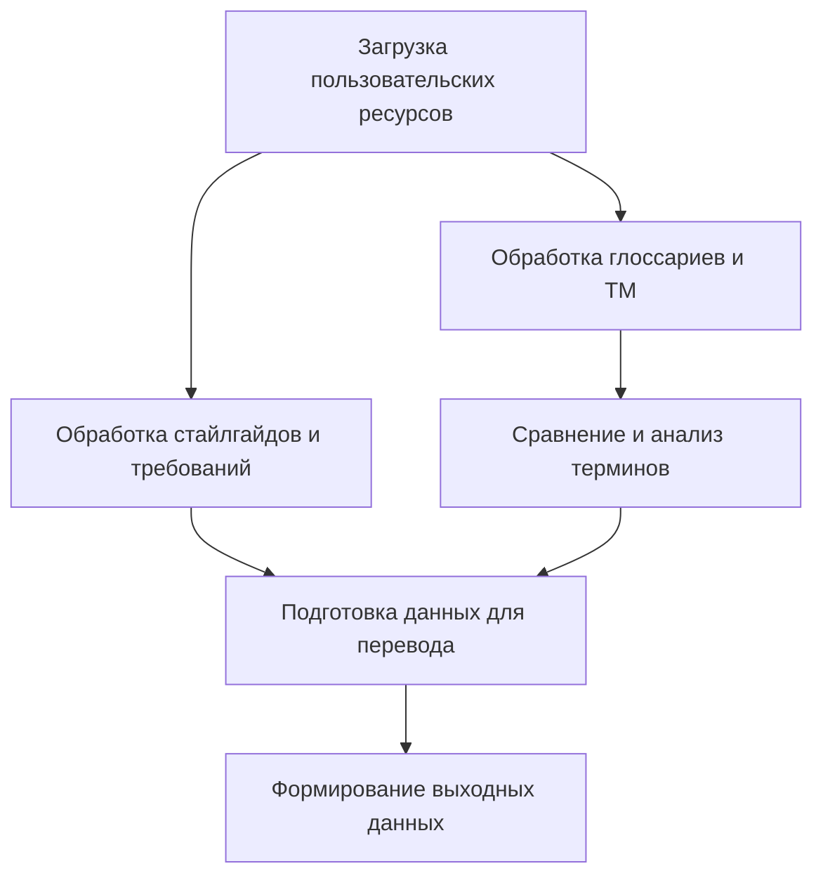
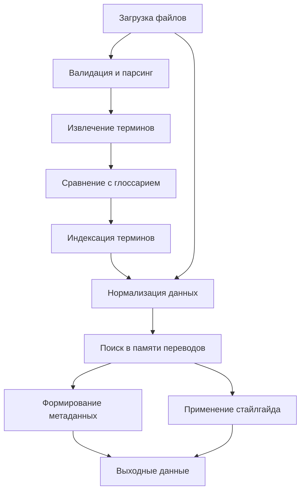

# Модуль взаимодействия с пользовательскими данными

## 1. Общая архитектура системы и потоки данных

### 1.1. Общая схема взаимодействия модулей

### 1.2. Схема потоков данных

### 1.3. Интерфейсы взаимодействия между модулями

- **Выходные интерфейсы модуля**:
    - `ProcessedUserResourcesAPI`: Предоставляет доступ к обработанным пользовательским ресурсам
        - Методы: `getGlossary()`, `getTM()`, `getStyleGuides()`, `getRequirements()`
        - Формат данных: Унифицированные JSON-структуры для каждого типа ресурсов
    - `TranslationPrepDataAPI`: Предоставляет подготовленные данные для перевода
        - Методы: `getSegmentsWithResources()`, `getTranslationContext(segmentId)`
        - Формат данных: Сегменты с привязанными ресурсами и контекстной информацией
- **Входные зависимости**:
    - `SegmentedDocumentAPI`: Получение сегментированного документа (от модуля сегментации)
        - Требуемые методы: `getSegments()`, `getSegmentById(id)`
    - `UserAuthenticationAPI`: Интерфейс для проверки прав доступа
        - Требуемые методы: `validateUserAccess()`, `getUserPreferences()`
- **Механизмы синхронизации**:
    - События обработки ресурсов: `onGlossaryProcessed`, `onTMProcessed`
    - Очереди задач для асинхронной обработки с помощью RabbitMQ/Kafka
    - Транзакционный подход к обновлению связанных ресурсов

## 2. Этапы обработки

### 2.1. Загрузка пользовательских ресурсов

- Поддержка различных форматов (TMX, XLSX, CSV, TBX, XML, TXT для глоссариев и памяти переводов)
- Поддержка стайлгайдов в форматах PDF, DOCX, HTML, TXT
- Валидация загружаемых файлов (структура, кодировка, целостность)
- Интерфейс для ручного ввода требований к переводу
- Предварительный анализ объёма и структуры загруженных данных
- Обнаружение языков в пользовательских ресурсах с использованием моделей langid, fastText или Hugging Face
- Управление версиями загруженных ресурсов с возможностью отката
- Автоматическое тестирование соответствия загруженных ресурсов ожидаемым форматам и структуре

### 2.2. Обработка пользовательского глоссария

- Извлечение терминов и их переводов из загруженного глоссария
- Нормализация терминов с учётом языковых особенностей и грамматических форм (с использованием Spacy/NLTK)
- Построение поискового индекса для оптимизации сравнения
- Обработка синонимов и вариаций терминов
- Учёт специфичных для предметной области особенностей терминологии
- Индексация дополнительных метаданных (определения, примечания)
- Поддержка многоязычных глоссариев с несколькими вариантами перевода
- Поддержка иерархических терминов (гипонимы/гиперонимы)
- Семантическое обогащение терминов с использованием внешних онтологий (Wikidata)
- Версионирование глоссариев с полной историей изменений

### 2.3. Сравнение извлечённых терминов с пользовательским глоссарием

- Точное сопоставление терминов с учётом регистра и морфологии
- Нечёткое сопоставление с использованием расстояния Левенштейна
- Семантическое сопоставление на основе векторных представлений
- Контекстуальное сравнение с учётом окружающих слов
- Ранжирование результатов сопоставления по релевантности
- Обработка многословных выражений и их вариаций
- Выявление новых терминов, отсутствующих в глоссарии
- Обнаружение противоречий между извлечёнными терминами и глоссарием
- Hybrid Matching: комбинация fuzzy matching и семантического поиска с обучаемыми весами
- Кросс-языковое сопоставление с использованием MUSE или LASER эмбеддингов
- Adaptive Thresholds: автоматическая настройка порогов для fuzzy matching в зависимости от языка
- Использование NER (Named Entity Recognition) для повышения точности сопоставления именованных сущностей

### 2.4. Обработка памяти переводов

- Парсинг файлов в формате TMX и других форматов памяти переводов
- Сегментация переводческих единиц на языковые пары
- Извлечение метаданных (дата создания, автор, проект и т.д.)
- Нормализация сегментов для оптимального сравнения
- Построение эффективных индексов для быстрого поиска
- Кластеризация сегментов по тематике и стилю с использованием LDA или BertTopic
- Анализ качества и консистентности переводов в памяти
- Автоматическая очистка дубликатов и сегментов с низким качеством на основе Heuristic Scoring
- Ранжирование TM по качеству с использованием BLEU, TER или специальных метрик
- Автоматическое версионирование и архивирование TM для контроля качества

### 2.5. Поиск совпадений в памяти переводов

- Точное сопоставление сегментов (100% совпадение)
- Нечёткое сопоставление с расчётом процента совпадения
- Поиск совпадений на уровне подсегментов (фраз и предложений)
- Использование алгоритмов fuzzy matching с настраиваемыми порогами
- Применение контекстных эмбеддингов для семантического поиска
- Поиск с учётом тематики и стиля исходного текста
- Ранжирование найденных совпадений по релевантности
- Учёт временной актуальности переводов при ранжировании
- Гибридный подход, сочетающий лексическое и семантическое сопоставление
- Использование специализированных тематических эмбеддингов для контекстного поиска

### 2.6. Обработка стайлгайдов и требований к переводу

- Извлечение текста и структуры из форматов стайлгайдов
- Классификация правил по категориям (лексика, грамматика, форматирование и т.д.)
- Идентификация конкретных предписаний и ограничений
- Выделение примеров правильного и неправильного использования
- Формализация правил для дальнейшего применения в переводе
- Проверка на непротиворечивость правил с автоматическим выявлением конфликтов
- Извлечение и индексация примеров для справочного использования
- Обработка пользовательского ввода требований и их нормализация
- Генерация регулярных выражений на основе текстовых описаний с помощью LLM
- Автоматический анализ применимости правил к конкретным типам текста

### 2.7. Подготовка данных для модуля перевода

- Согласование глоссария с памятью переводов (разрешение противоречий)
- Формирование единого каталога терминов с приоритетами
- Структурирование правил стайлгайда для их применения в процессе перевода
- Предварительное применение памяти переводов к сегментам исходного текста
- Маркировка сегментов с различной степенью совпадения
- Подготовка контекстной информации для точного перевода
- Оптимизация данных для эффективной передачи в модуль перевода
- Создание метаданных для отслеживания происхождения переводов
- Автоматическое определение оптимальной стратегии перевода для каждого сегмента

### 2.8. Выходные данные

- Обогащённый глоссарий с отметками о совпадениях и различиях
- Таблица соответствий между извлечёнными терминами и глоссарием
- Структура сегментов с предварительными переводами из TM
- Формализованные правила стайлгайда для применения в переводе
- Метаданные о качестве сопоставлений и степени доверия
- Статистика использования пользовательских ресурсов
- Форматированный отчёт для пользовательского ознакомления
- API-интерфейс для передачи данных в модуль перевода
- Метрики качества предварительной обработки для последующего анализа

## 3. Модули проекта

### 3.1. Модуль загрузки пользовательских данных

- Интерфейс загрузки для различных типов файлов
- Валидаторы для проверки структуры и целостности данных
- Парсеры для извлечения содержимого из различных форматов
- Предпросмотр загруженных данных
- Обработчики для крупных файлов с потоковой обработкой
- Конвертеры между различными форматами ресурсов
- Система управления версиями пользовательских данных
- Обработка пакетной загрузки нескольких файлов
- Автоматическое тестирование соответствия загруженных файлов ожидаемым форматам
- Механизм отката к предыдущим версиям в случае ошибок

### 3.2. Модуль обработки глоссариев

- Парсеры для различных форматов глоссариев (CSV, XLSX, TBX, XML)
- Нормализаторы терминов с учётом языка и грамматических форм
- Индексаторы для быстрого поиска терминов
- Валидаторы терминологической консистентности
- Обработчики многоязычных глоссариев
- Экстракторы дополнительных данных (контекст, определения)
- Преобразователи форматов глоссариев в единый внутренний формат
- Управление метаданными терминов (домен, источник, статус)
- Поддержка иерархических отношений между терминами
- Интеграция с внешними онтологиями и терминологическими базами

### 3.3. Модуль сравнения терминологии

- Алгоритмы точного сопоставления
- Алгоритмы нечёткого сопоставления (Левенштейна, Джаро-Винклера)
- Векторные модели для семантического сопоставления
- Обработчики морфологических вариаций
- Ранжировщик результатов сопоставления
- Детектор новых терминов, отсутствующих в глоссарии
- Генератор отчётов по терминологическому анализу
- Визуализаторы терминологических сопоставлений
- Гибридные методы сопоставления с обучаемыми весами
- Модуль кросс-языкового сопоставления с использованием многоязычных эмбеддингов
- Адаптивные пороги сопоставления для различных языков
- NER-компонент для анализа именованных сущностей

### 3.4. Модуль обработки памяти переводов

- Парсеры для TMX и других форматов TM
- Сегментаторы переводческих единиц
- Нормализаторы сегментов для сравнения
- Индексаторы для быстрого поиска в памяти переводов
- Классификаторы сегментов по тематике с использованием LDA/BertTopic
- Экстракторы метаданных из TM
- Анализаторы консистентности переводов
- Объединители различных TM в единую базу
- Очистители дубликатов и некачественных переводов
- Ранжировщики по метрикам качества перевода

### 3.5. Модуль сопоставления сегментов

- Алгоритмы точного сопоставления сегментов
- Инструменты нечёткого сопоставления с настраиваемыми порогами
- Поисковики подсегментных совпадений
- Ранжировщик результатов по релевантности
- Калькуляторы процента совпадения
- Модели контекстных эмбеддингов для семантического поиска
- Детекторы структурных подобий в сегментах
- Генератор статистики по совпадениям в TM
- Гибридные методы поиска с адаптивными порогами
- Обработчик многоязычного поиска с использованием кросс-лингвистических моделей

### 3.6. Модуль обработки стайлгайдов

- Экстракторы текста из документов стайлгайда
- Классификаторы правил по типам и категориям
- Формализаторы предписаний для машинного применения
- Валидаторы непротиворечивости правил с автоматическим выявлением конфликтов
- Парсеры примеров использования
- Интерфейс для ручного ввода требований
- Преобразователь текстовых требований в структурированный формат
- Генератор контрольных списков для проверки соответствия стайлгайду
- Генератор регулярных выражений на основе текстовых описаний с использованием LLM
- Система приоритетов для разрешения конфликтов между правилами

### 3.7. Модуль подготовки данных для перевода

- Объединители данных из разных источников
- Разрешители конфликтов между ресурсами
- Генераторы предварительного перевода на основе TM
- Маркировщики сегментов с различной степенью совпадения
- Оптимизаторы данных для передачи
- Форматировщики выходных данных
- Интерфейс для модуля перевода
- Система отслеживания происхождения переводов
- Селекторы оптимальных стратегий перевода для разных типов сегментов
- Обогатители контекстуальной информацией для более точного перевода

### 3.8. Модуль управления пользовательскими настройками

- Интерфейс для установки параметров сопоставления
- Настройки порогов для нечёткого сопоставления
- Конфигуратор приоритетов между различными источниками
- Настройка языковых пар и направлений перевода
- Управление предпочтениями пользователя
- Сохранение и загрузка профилей настроек
- Система авторизации для многопользовательского доступа с JWT-аутентификацией
- Журналирование действий пользователя
- Механизм автоматической настройки параметров на основе обратной связи
- Управление правами доступа к различным ресурсам

### 3.9. Модуль статистики и аналитики

- Сборщик метрик по загруженным данным
- Анализатор охвата памятью переводов
- Калькулятор терминологического покрытия
- Визуализатор статистики сопоставлений
- Генератор отчётов об использовании ресурсов
- Прогнозирование эффективности перевода
- Анализатор качества пользовательских ресурсов
- Система рекомендаций по улучшению ресурсов
- Мониторинг производительности системы с использованием Prometheus и Grafana
- Анализ тенденций и паттернов в работе с системой

### 3.10. Модуль кэширования

- Система промежуточного хранения обработанных данных
- Механизмы инвалидации кэша при обновлении ресурсов
- Оптимизаторы для быстрого доступа к часто используемым данным
- Управление жизненным циклом кэша с использованием Redis Expiration Policies
- Распределённое кэширование для многопользовательских систем
- Асинхронная подгрузка данных в кэш
- Приоритезация данных для кэширования
- Мониторинг эффективности кэша
- Стратегии предварительного кэширования на основе паттернов использования
- Система автоматического управления размером кэша в зависимости от нагрузки

### 3.11. Модуль логирования и мониторинга

- Централизованное логирование с различными уровнями (INFO, WARNING, ERROR)
- Трейсинг запросов для отслеживания всего цикла обработки
- Агрегация логов из различных микросервисов
- Алерты при критических ошибках или аномальной производительности
- Дашборды для мониторинга системы в реальном времени
- Хранение и ротация логов с политиками хранения
- Анализатор логов для выявления типичных проблем
- Интеграция с системами SIEM для обеспечения безопасности
- Автоматизированная генерация отчётов на основе логов
- Визуализация метрик работы системы

### 3.12. Модуль тестирования

- Автоматическое тестирование всех критичных компонентов
- Валидаторы входных данных
- Интеграционное тестирование между модулями
- Нагрузочное тестирование для оценки производительности
- Инструменты для A/B тестирования новых алгоритмов
- Генераторы синтетических данных для тестирования
- Регрессионное тестирование при обновлении функционала
- CI/CD интеграция для автоматического запуска тестов
- Эмуляторы пользовательских сценариев
- Метрики покрытия тестами кодовой базы

### 3.13. Модуль безопасности и доступа

- Система аутентификации с поддержкой JWT
- Авторизация с гранулярными правами доступа
- Шифрование чувствительных данных
- Аудит доступа к ресурсам
- Механизмы защиты от типовых атак
- Регулярное резервное копирование данных
- Политики безопасного хранения паролей и ключей
- Безопасная передача данных между компонентами
- Соответствие требованиям защиты персональных данных
- Механизмы восстановления после сбоев

### 3.14. API-модуль

- RESTful API для взаимодействия с внешними системами
- Версионирование API для обеспечения обратной совместимости
- Документация API с использованием Swagger/OpenAPI
- Контроль доступа к API с использованием JWT
- Ограничители скорости для предотвращения DoS-атак
- Валидация входных и выходных данных
- Обработка ошибок с информативными сообщениями
- Мониторинг использования API
- Асинхронные API для длительных операций
- SDK для популярных языков программирования

## 4. Архитектурные принципы

### 4.1. Микросервисная архитектура

- Выделение модулей в отдельные сервисы с чётко определёнными границами ответственности
- API-первый подход к разработке компонентов
- Независимое масштабирование отдельных сервисов с учётом нагрузки
- Отказоустойчивость через изоляцию отказов
- Возможность разработки и развёртывания сервисов независимыми командами
- Схема взаимодействия микросервисов:
    - Сервис загрузки пользовательских данных
    - Сервис обработки глоссариев
    - Сервис памяти переводов
    - Сервис обработки стайлгайдов
    - Сервис сопоставления и анализа
    - Сервис подготовки данных для перевода
    - Сервис аутентификации и авторизации
    - Сервис администрирования и настроек

### 4.2. Принципы работы с данными

- Иммутабельность данных для обеспечения воспроизводимых результатов
- Версионирование всех пользовательских ресурсов
- Отслеживаемость (все преобразования данных сохраняют метаданные о происхождении)
- Кэширование с чёткими стратегиями инвалидации
- Параллельная обработка данных там, где это возможно
- Бэкапирование с возможностью восстановления на любую точку

### 4.3. Принципы безопасности

- Принцип минимальных привилегий для всех компонентов
- Изоляция окружений разработки, тестирования и продакшена
- Аутентификация и авторизация на всех уровнях взаимодействия
- Шифрование данных при хранении и передаче
- Регулярный аудит безопасности
- Защита от типовых атак (OWASP Top 10)

### 4.4. Принципы масштабирования

- Горизонтальное масштабирование для обработки растущей нагрузки
- Асинхронная обработка длительных операций
- Балансировка нагрузки между компонентами
- Динамическое выделение ресурсов в зависимости от нагрузки
- Распределённое кэширование с географической репликацией при необходимости
- Стратегии обработки пиковых нагрузок

## 5. Технологический стек

### 5.1. Инструменты для обработки файлов

- ElementTree/lxml - для работы с XML и TMX
- polars - для эффективной работы с табличными данными (CSV, XLSX)
- pyarrow - для низкоуровневой обработки данных и оптимизации памяти
- PyPDF2/pdfplumber - для извлечения текста из PDF стайлгайдов
- python-docx - для работы с документами Word
- BeautifulSoup - для обработки HTML

### 5.2. Инструменты для языковой обработки

- langid/fastText/Hugging Face - для точного определения языка
- Spacy - для NLP-обработки и NER
- NLTK - для основной лингвистической обработки
- Stanza - для языков с ограниченной поддержкой в других инструментах
- Transformers (Hugging Face) - для современных NLP моделей
- MUSE/LASER - для кросс-языковых эмбеддингов
- HuggingFace Tokenizers - для эффективной токенизации
- SentenceTransformers - для создания эмбеддингов предложений
- BERTopic - для тематического моделирования

### 5.3. Инструменты для обработки глоссариев

- TBXTools - для работы с терминологическими базами
- TerminusDB - для хранения и управления терминологией
- SQLite/PostgreSQL - для локального хранения терминологических данных
- polars - для высокопроизводительной обработки табличных глоссариев
- pyarrow - для оптимизации памяти при работе с большими глоссариями
- WikidataIntegrator - для обогащения терминов данными из Wikidata
- NetworkX - для моделирования иерархических отношений между терминами

### 5.4. Инструменты для обработки памяти переводов

- translate-toolkit - для работы с TMX и другими форматами переводов
- Elasticsearch - для индексации и поиска в памяти переводов
- Levenshtein - для нечёткого сопоставления строк
- FuzzyWuzzy - для расчёта нечётких совпадений
- rapidfuzz - оптимизированная библиотека для нечёткого сопоставления
- SQLite/PostgreSQL - для хранения и индексации TM
- polars - для эффективной обработки больших объёмов данных из памяти переводов
- sacrebleu/sacremoses - для оценки качества переводов
- SentenceTransformers - для семантического поиска в TM

### 5.5. Инструменты для сопоставления и анализа

- scikit-learn - для векторизации и кластеризации
- SentenceTransformers - для создания семантических эмбеддингов
- FAISS - для быстрого поиска по векторным представлениям
- Milvus/Qdrant - для масштабируемого хранения и поиска векторных представлений
- NumPy - для эффективных числовых вычислений
- NLTK/Spacy - для лингвистической обработки
- Hunspell - для морфологического анализа
- polars - для масштабируемой обработки результатов сопоставления
- XGBoost/LightGBM - для ранжирования результатов сопоставления
- BERT/XLM-RoBERTa - для кросс-языкового сопоставления

### 5.6. Инструменты для обработки стайлгайдов

- Spacy - для обработки естественного языка
- NLTK - для лингвистической обработки
- SQLite/PostgreSQL - для хранения структурированных правил
- RegEx - для формализации языковых шаблонов
- PyTorch/TensorFlow - для моделей распознавания правил из текста
- OpenAI API/Anthropic API - для генерации регулярных выражений из текстовых описаний
- NetworkX - для анализа зависимостей и конфликтов между правилами

### 5.7. Инструменты для визуализации и отчётности

- Matplotlib/Seaborn - для визуализации статистики
- Plotly - для интерактивных визуализаций
- ReportLab - для генерации PDF-отчётов
- Jinja2 - для шаблонизации отчётов в HTML
- Dash - для создания интерактивных дашбордов
- Prometheus/Grafana - для мониторинга и визуализации метрик производительности

### 5.8. Инструменты для масштабирования и распределённой обработки

- Redis - для кэширования и управления очередями с поддержкой TTL и Expiration Policies
- Celery - для обработки асинхронных задач
- FastAPI/Flask - для API-интерфейсов
- Docker - для контейнеризации компонентов
- Kubernetes - для оркестрации сервисов в продакшн-окружении
- Ray - для распределённых вычислений и оптимизации обработки данных
- Dask - как альтернатива для параллельной обработки данных
- RabbitMQ/Kafka - для надёжной передачи сообщений между компонентами
- Airflow - для организации сложных рабочих процессов

### 5.9. Инструменты для логирования и мониторинга

- ELK Stack (Elasticsearch, Logstash, Kibana) - для централизованного логирования
- Prometheus - для сбора метрик
- Grafana - для визуализации метрик и создания дашбордов
- Jaeger/Zipkin - для распределённого трейсинга
- Sentry - для отслеживания ошибок в реальном времени
- InfluxDB - для хранения временных рядов метрик
- Alertmanager - для управления оповещениями

### 5.10. Инструменты для тестирования и CI/CD

- pytest - для модульного и интеграционного тестирования
- Locust - для нагрузочного тестирования
- pytest-cov - для измерения покрытия кода тестами
- Jenkins/GitLab CI - для автоматизации сборки и тестирования
- Docker Compose - для создания тестовых окружений
- Faker - для генерации синтетических тестовых данных
- Hypothesis - для property-based тестирования

### 5.11. Инструменты для безопасности

- PyJWT - для работы с JWT токенами
- Authlib - для OAuth/OpenID Connect аутентификации
- Passlib - для безопасного хранения паролей
- cryptography - для криптографических операций
- OWASP ZAP - для поиска уязвимостей
- SQLMap - для проверки на SQL-инъекции
- ModSecurity - как WAF для защиты API
- Vault - для безопасного хранения секретов

### 5.12. Метрики эффективности обработки пользовательских данных

- Скорость и точность сопоставления с глоссарием (время поиска, процент корректных соответствий)
- Эффективность поиска в памяти переводов (время отклика, релевантность результатов)
- Метрики производительности для обработки глоссариев различного объема
- Оценка качества нечеткого поиска (fuzzy matching precision для различных порогов)
- Эффективность интеграции с пользовательскими ресурсами (время обработки TMX/TBX файлов)
- Метрики удобства использования пользовательского интерфейса
- Оценка эффективности синхронизации данных между сессиями

## 6. Защита, приватность и синхронизация пользовательских данных

### 6.1. Механизмы приватности и анонимизации данных

#### 6.1.1. Основные принципы обеспечения приватности

- Минимизация собираемых данных (data minimization) - сбор только необходимых для функционирования данных
- Изоляция критичных данных в отдельных хранилищах с повышенным уровнем защиты
- Разграничение доступа на основе ролевой модели (RBAC) с детализацией до уровня отдельных полей
- Прозрачность обработки данных с ведением журналов всех операций
- Автоматическое удаление данных по истечении срока хранения (TTL-based deletion)
- Разделение чувствительных данных от аналитических путем агрегации и деперсонализации
- Реализация механизма отзыва согласия на обработку с полным удалением всех пользовательских данных

#### 6.1.2. Технологии анонимизации

- K-анонимность (k-anonymity) при формировании аналитических выборок данных
- Дифференциальная приватность (differential privacy) для защиты статистической информации
- Псевдонимизация идентификаторов пользователей с использованием HMAC и rotatable ключей
- Токенизация чувствительных данных с хранением маппингов в отдельном защищенном хранилище
- Необратимое хеширование личных идентификаторов с применением salt и pepper техник
- Техники размытия (blurring) и обобщения (generalization) для снижения точности чувствительных данных
- Использование приватных федеративных вычислений для обучения моделей без передачи исходных данных

#### 6.1.3. Управление согласиями на обработку данных

- Детализированная система управления согласиями (consent management)
- Ведение истории изменений согласий с возможностью отката
- Автоматическая фильтрация данных на основе актуальных согласий
- Проактивное уведомление пользователей об изменениях в политике обработки данных
- Верифицируемый журнал всех операций с согласиями пользователей
- Интеграция с правовыми требованиями различных юрисдикций (GDPR, CCPA, 152-ФЗ)
- Механизм автоматического применения политик хранения данных на основе типа согласия

#### 6.1.4. Технические средства обеспечения приватности

- Внедрение Privacy by Design на всех этапах разработки и эксплуатации системы
- Использование Zero-knowledge proofs для верификации пользовательских данных без их раскрытия
- Шифрование пользовательских глоссариев и TM на стороне клиента (client-side encryption)
- Homomorphic encryption для проведения операций над зашифрованными данными
- Private Set Intersection (PSI) для безопасного сравнения терминологических баз
- Secure Multi-party Computation (SMPC) для коллаборативного анализа данных
- Использование изолированных контейнеров (sandboxes) для обработки конфиденциальных данных
- Техники безопасного удаления данных с гарантированным затиранием (secure data erasure)

### 6.2. Протоколы синхронизации при оффлайн-режиме работы

#### 6.2.1. Архитектура оффлайн-синхронизации

- Поддержка модели данных на основе CRDT (Conflict-free Replicated Data Types)
- Локальное хранилище на устройстве пользователя с использованием IndexedDB/SQLite
- Очереди операций с приоритизацией для эффективной синхронизации при восстановлении соединения
- Двунаправленная синхронизация с разрешением конфликтов на основе векторных часов
- Дельта-синхронизация для минимизации передаваемых данных
- Оптимистичная репликация с локальным применением изменений до подтверждения сервером
- Service Workers для фоновой синхронизации данных в браузерных приложениях
- Механизм частичной синхронизации с возможностью выбора типов данных для оффлайн-использования

#### 6.2.2. Механизмы очередей и управления изменениями

- Persistent queues для надежного хранения неотправленных изменений
- Приоритизация очередей по типам операций и критичности данных
- Компрессия и дедупликация операций перед синхронизацией
- Дифференциальные обновления на основе контрольных сумм
- Адаптивные алгоритмы синхронизации с учетом качества и стабильности соединения
- Фоновая предварительная синхронизация часто используемых данных
- Экспоненциальное отступление (exponential backoff) при повторных попытках синхронизации
- Автоматическое восстановление сессии после разрыва соединения с сохранением контекста

#### 6.2.3. Управление версиями при оффлайн-работе

- Гибридный подход с использованием Git-подобной модели для версионирования
- Ветвление версий при длительной оффлайн-работе с возможностью слияния
- Сохранение полной истории изменений с метаданными о происхождении
- Атомарные транзакции для согласованного состояния данных
- Снепшоты состояния для быстрого восстановления и сравнения версий
- Метаданные о родительских версиях для построения графа зависимостей
- Возможность отката к стабильным состояниям при обнаружении проблем синхронизации
- Поддержка веток разработки с изолированными изменениями для тестирования новых терминов

#### 6.2.4. Протоколы передачи при ограниченном соединении

- Адаптивное управление размером пакетов в зависимости от качества соединения
- Progressive enhancement с поэтапной загрузкой от критичных к второстепенным данным
- Сжатие данных с автоматическим выбором оптимального алгоритма
- Возобновляемая передача (resumable transfer) при разрыве соединения
- Chunked encoding для передачи больших объемов данных
- Протокол с подтверждением получения (ACK-based) для обеспечения надежности
- Binary delta compression для минимизации трафика при обновлениях
- Механизм selective sync для приоритетной синхронизации критичных компонентов

### 6.3. Алгоритмы разрешения конфликтов при многопользовательском редактировании

#### 6.3.1. Стратегии обнаружения конфликтов

- Использование векторных часов (Vector Clocks) для определения причинно-следственных связей между изменениями
- Анализ перекрывающихся изменений на уровне отдельных сегментов и терминов
- Отслеживание зависимостей между изменениями для построения графа конфликтов
- Семантический анализ изменений с выявлением логических противоречий
- Детекция неявных конфликтов на основе правил предметной области
- Автоматическая группировка связанных конфликтов для целостного разрешения
- Проактивное обнаружение потенциальных конфликтов перед применением изменений
- Метрики степени конфликтности для приоритизации разрешения

#### 6.3.2. Методы автоматического разрешения конфликтов

- Стратегии на основе правил с учетом типов данных и операций
- Трехсторонняя методика слияния (three-way merge) с использованием общего предка
- Применение алгоритма Operational Transformation (OT) для слияния параллельных изменений
- Использование модели CRDT для автоматического слияния без конфликтов
- Контекстно-зависимые правила разрешения для специфичных типов данных
- Ранжирование конфликтующих изменений на основе метаданных и политик
- Интеллектуальное слияние с использованием ML для предсказания корректных вариантов
- Обучение системы на предыдущих решениях конфликтов для улучшения автоматического разрешения

#### 6.3.3. Интерфейс для ручного разрешения конфликтов

- Визуализация конфликтующих версий с подсветкой различий
- Интерактивное средство объединения изменений с постепенным применением
- Предварительный просмотр результатов слияния перед применением
- Комментирование решений с обоснованием для истории изменений
- Механизм делегирования разрешения конфликтов конкретным экспертам
- Средства групповых обсуждений для коллаборативного разрешения сложных конфликтов
- Инструменты сравнения на различных уровнях детализации (сегмент, предложение, термин)
- Встроенные рекомендации по разрешению на основе правил стайлгайда и глоссария

#### 6.3.4. Механизмы коллаборативного редактирования

- Real-time коллаборация с отображением курсоров и выделений других пользователей
- Блокировка редактируемых сегментов с уведомлением других пользователей (pessimistic locking)
- Разделение ресурсов на логические области ответственности для минимизации конфликтов
- Временные "рабочие копии" для безопасного экспериментирования
- Механизм предложений изменений с процессом рецензирования
- Система уведомлений о потенциальных конфликтах в реальном времени
- Авторизация изменений на основе ролей и полномочий пользователей
- Встроенные механизмы коммуникации между редакторами для согласования изменений

### 6.4. Механизмы верификации целостности пользовательских данных

#### 6.4.1. Технологии обеспечения целостности данных

- Использование криптографических хешей (SHA-256, BLAKE3) для верификации данных
- Цифровые подписи (ECDSA) для аутентификации источника изменений
- Merkle Trees для эффективной проверки целостности больших наборов данных
- Инкрементальные контрольные суммы для оптимизации проверки частичных изменений
- Временные метки с защитой от подделки (tamper-evident timestamps)
- Защищенные журналы аудита с использованием append-only структур данных
- Независимая верификация целостности данных через доверенных свидетелей (witnesses)
- Blockchain-inspired подход для неизменяемой истории критичных изменений

#### 6.4.2. Процедуры проверки целостности

- Автоматическая проверка контрольных сумм при каждой операции чтения
- Периодическое сканирование всего хранилища данных на предмет повреждений
- Многоуровневая верификация с разной степенью глубины проверки
- Cross-checking между репликами для выявления расхождений
- Проверка структурной целостности (schema validation) при каждой операции записи
- Мониторинг аномалий в данных с помощью статистических моделей
- Интеллектуальный анализ целостности семантических связей между сущностями
- Непрерывная верификация с использованием фоновых процессов (background validators)

#### 6.4.3. Обнаружение и исправление повреждений

- Алгоритмы самовосстановления на основе избыточного кодирования (Reed-Solomon)
- Восстановление из резервных копий с минимальной потерей данных
- Инкрементальное восстановление с приоритезацией критичных компонентов
- Использование версионного хранилища для восстановления предыдущих состояний
- Автоматическая изоляция поврежденных данных для предотвращения распространения ошибок
- Механизмы кворумного восстановления из нескольких источников
- Репликация с многоуровневой защитой от распространения повреждений
- Журналирование операций восстановления с аудитом результатов

#### 6.4.4. Защита при передаче данных

- TLS 1.3 с Perfect Forward Secrecy для безопасной передачи
- Дополнительный уровень шифрования данных внутри защищенного канала
- Message Authentication Codes (HMAC) для защиты от подмены данных в пути
- Challenge-response протоколы для верификации целостности больших передач
- Защита от replay-атак с использованием nonce и временных меток
- Мониторинг аномалий в паттернах передачи для выявления вторжений
- Многослойная модель безопасности с независимыми механизмами проверки
- Post-quantum криптографические алгоритмы для защиты от будущих угроз

### 6.5. Реализация многопользовательского доступа

#### 6.5.1. Архитектура управления доступом

- Гранулярная RBAC-система с настраиваемыми ролями и разрешениями
- Контекстно-зависимые политики доступа на основе атрибутов (ABAC)
- Временные и условные права доступа с автоматическим истечением
- Иерархический доступ к данным с наследованием и переопределением прав
- Разделение прав на чтение, запись, удаление, администрирование и аудит
- Динамическое применение политик доступа в режиме реального времени
- Разделение управления данными на уровни с независимыми политиками
- Делегирование управления доступом с контролируемым распространением полномочий

#### 6.5.2. Механизмы изоляции пользовательских данных

- Multi-tenancy архитектура с полной изоляцией пользовательских окружений
- Логическое разделение данных в рамках единого хранилища (row-level security)
- Шифрование данных с индивидуальными ключами для каждого пользователя
- Клиентская маршрутизация запросов в соответствии с правами доступа
- Песочницы (sandboxes) для безопасного выполнения пользовательских сценариев
- Маскирование чувствительных данных при межпользовательском взаимодействии
- Privacy-preserving средства коллаборации без раскрытия конфиденциальной информации
- Безопасное удаление с гарантированной невозможностью восстановления

#### 6.5.3. Механизмы отслеживания и аудита

- Неизменяемые (immutable) журналы аудита для всех операций доступа
- Детальное логирование всех действий с метаданными (кто, что, когда, откуда)
- Централизованная система мониторинга событий безопасности
- Предупреждения о подозрительной активности в режиме реального времени
- Анализ поведенческих паттернов для выявления аномалий (behavior analytics)
- Визуализация активности пользователей для администраторов безопасности
- Автоматизированные отчеты о соответствии политикам и стандартам
- Независимая система аудита с защитой от манипуляций

#### 6.5.4. Федерированная аутентификация и авторизация

- Поддержка стандартов OAuth 2.1, OpenID Connect и SAML 2.0
- Интеграция с корпоративными каталогами (Active Directory, LDAP)
- Single Sign-On с поддержкой различных IdP провайдеров
- Многофакторная аутентификация с адаптивной сложностью
- Временный доступ через одноразовые токены с ограниченным сроком действия
- Безопасное делегирование прав между системами с использованием федеративного доверия
- Кросс-доменная аутентификация для распределенных рабочих сред
- Непрерывная верификация с Zero Trust подходом

### 6.6. Соответствие регуляторным требованиям

#### 6.6.1. Поддержка международных и локальных стандартов

- Соответствие GDPR, CCPA, LGPD, PIPEDA и другим законам о защите данных
- Реализация механизмов для соблюдения требований 152-ФЗ и ПП №1119
- Поддержка отраслевых стандартов (HIPAA, GLBA, SOX, PCI DSS)
- Сертификация по международным стандартам безопасности (ISO 27001, SOC 2)
- Инструменты для управления согласиями в соответствии с требованиями разных юрисдикций
- Возможность локализации хранения данных для соответствия требованиям о резидентности
- Механизмы для реализации права на забвение и портабельность данных
- Интерфейсы для оперативного реагирования на запросы субъектов данных

#### 6.6.2. Инструменты для обеспечения соответствия

- Автоматизированные оценки воздействия на защиту данных (DPIA)
- Шаблоны и мастеры для создания документации по защите данных
- Система управления согласиями с прозрачной историей и аудитом
- Автоматизированные механизмы удаления данных в соответствии с политиками хранения
- Инструменты для псевдонимизации и анонимизации в соответствии со стандартами
- Средства контроля и отчетности для демонстрации соответствия требованиям
- Процессы для обработки инцидентов безопасности с учетом регуляторных сроков
- Периодическое тестирование и оценка защитных мер

#### 6.6.3. Локализация подходов к защите данных

- Адаптивное применение политик в зависимости от географического расположения пользователя
- Матрица соответствия между различными юрисдикциями для определения наиболее строгих требований
- Индивидуальные настройки обработки данных для разных регионов
- Механизмы для трансграничной передачи данных в соответствии с локальными требованиями
- Адаптация интерфейса получения согласий под законодательство конкретных стран
- Мультиязычные политики конфиденциальности с автоматическим версионированием
- Разделение данных по региональным серверам для соблюдения требований о локализации
- Автоматизированное отслеживание изменений в законодательстве различных юрисдикций