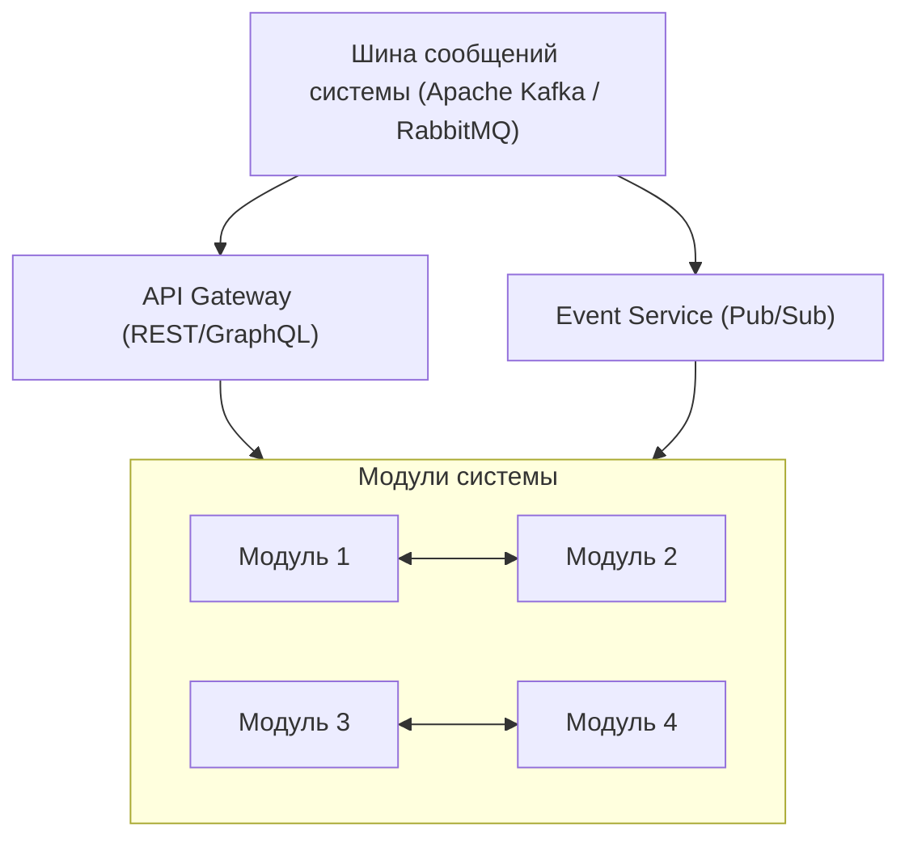

## 1. Общая архитектура системы

Система машинного перевода построена на принципах слабой связанности и высокой сплоченности компонентов, реализуя модульную архитектуру с четко определенными интерфейсами между компонентами.

### 1.1. Архитектурные принципы

- **Контрактное программирование**: каждый модуль определяет четкий контракт входных и выходных интерфейсов
- **Механизм событий**: асинхронная коммуникация между модулями через систему публикации/подписки
- **Стандартизированные форматы данных**: унифицированные структуры для обмена информацией
- **Версионирование интерфейсов**: поддержка обратной совместимости при обновлениях

### 1.2. Основные компоненты системы

Система состоит из следующих основных модулей:

1. **Сегментация**: анализ и разделение исходного документа на логические сегменты
2. **Извлечение терминов**: выделение ключевых терминов и выражений из текста
3. **Работа с пользовательскими данными**: обработка глоссариев, памяти переводов и требований пользователя
4. **Перевод и утверждение глоссария**: управление терминологией и ее переводом
5. **Машинный перевод**: основной механизм перевода с использованием различных стратегий
6. **Ревизия, редактирование и корректура**: автоматизированная проверка и улучшение качества перевода
7. **Пользовательское редактирование**: интерфейс для работы пользователя с переведенным текстом
8. **Интеграция и обработка TM/TB**: сохранение и обработка памяти переводов и терминологических баз

### 1.3. Схема взаимодействия компонентов

### 1.4. Матрица зависимостей модулей

|Модуль|Предоставляет (выходные интерфейсы)|Потребляет (входные зависимости)|
|---|---|---|
|Сегментация|SegmentedDocumentAPI|DocumentProcessingAPI, ConfigurationAPI|
|Извлечение терминов|ExtractedTerminologyAPI|SegmentedDocumentAPI, ConfigurationAPI|
|Работа с пользовательскими данными|ProcessedUserResourcesAPI, TranslationPrepDataAPI|SegmentedDocumentAPI, UserAuthenticationAPI|
|Перевод и утверждение глоссария|TranslatedGlossaryAPI, GlossaryEventsAPI|ExtractedTerminologyAPI, ProcessedUserResourcesAPI, TranslationEngineAPI|
|Машинный перевод|TranslatedDocumentAPI, TranslationFeedbackAPI|SegmentedDocumentAPI, TranslatedGlossaryAPI, ProcessedUserResourcesAPI, TranslationEngineProvidersAPI|
|Ревизия, редактирование и корректура|RevisedDocumentAPI, EditingInsightsAPI|TranslatedDocumentAPI, TranslatedGlossaryAPI, StyleGuideAPI, QualityAssuranceAPI|
|Пользовательское редактирование|UserEditedDocumentAPI, FeedbackCollectionAPI|RevisedDocumentAPI, TranslatedGlossaryAPI, ProcessedUserResourcesAPI, QualityCheckAPI|
|Интеграция и обработка TM/TB|EnhancedTranslationMemoryAPI, InternalGlossaryAPI, ModelTrainingDataAPI|UserEditedDocumentAPI, TranslatedGlossaryAPI, FeedbackCollectionAPI, TranslationEngineAPI|

## 2. Модули системы и их функциональность

### 2.1. Модуль сегментации

**Назначение**: Подготовка документа к переводу через сегментацию текста на логические единицы.

**Основные компоненты**:

- Загрузчик документов различных форматов (PDF, DOCX, XLSX, HTML и др.)
- Сегментатор текста с поддержкой сложных случаев и контекстов
- Анализатор языка и структуры документа
- Предварительный оценщик сложности документа
- Индексатор сегментов и метаданных для быстрого доступа

**Ключевые особенности**:

- Контекстное окно для сохранения связности текста
- Многоуровневая стратегия сегментации для разных типов текста
- Алгоритмы эффективной обработки больших документов
- Восстановление структуры при неполных или поврежденных данных
- Обработка многоязычных документов с выделением языка для каждого сегмента

### 2.2. Модуль извлечения терминов

**Назначение**: Выделение ключевых терминов и выражений из сегментированного текста.

**Основные компоненты**:

- Компоненты обработки текста (токенизация, лемматизация)
- Экстракторы ключевых слов и выражений
- Системы кластеризации и семантического анализа
- Модули постобработки и ранжирования терминов
- Компоненты оценки качества и визуализации терминов

**Ключевые особенности**:

- Комбинация статистических, графовых и ML-методов извлечения терминов
- Выделение многословных выражений и коллокаций
- Семантическая кластеризация терминов с использованием контекстных эмбеддингов
- Интеграция с доменными моделями (SciSpacy, Med7, Legal-BERT и др.)
- Построение графа связей между терминами

### 2.3. Модуль работы с пользовательскими данными

**Назначение**: Интеграция и управление пользовательскими ресурсами (глоссарии, память переводов, стайлгайды).

**Основные компоненты**:

- Интерфейс загрузки пользовательских ресурсов
- Системы валидации и нормализации данных
- Механизмы сравнения извлеченных терминов с пользовательским глоссарием
- Поисковые системы для работы с памятью переводов
- Процессоры стилистических требований

**Ключевые особенности**:

- Поддержка различных форматов ресурсов (TMX, TBX, CSV и др.)
- Нечеткий поиск в памяти переводов с настраиваемыми порогами
- Кластеризация сегментов для оптимального поиска в TM
- Многоуровневое кэширование данных для повышения производительности
- Интеллектуальный анализ глоссария и предложение новых терминов

### 2.4. Модуль перевода и утверждения глоссария

**Назначение**: Обеспечение терминологической консистентности через перевод и управление глоссарием.

**Основные компоненты**:

- Анализаторы и классификаторы терминов
- Генераторы вариантов перевода терминов
- Интерфейс для представления и редактирования глоссария
- Система цветовой маркировки терминов
- Хранилище утвержденного глоссария

**Ключевые особенности**:

- Семантическая кластеризация терминов на основе Sentence-BERT
- Многоуровневая стратегия перевода для новых терминов
- Контекстно-зависимое предложение вариантов перевода
- Цветовая маркировка терминов (розовая для существующих, зеленая для новых)
- Система обогащения внутренних глоссариев через пользовательский выбор

### 2.5. Модуль машинного перевода

**Назначение**: Реализация ядра системы перевода с поддержкой различных стратегий и моделей.

**Основные компоненты**:

- Стратегический планировщик переводов
- Системы прямого и промежуточного перевода
- Механизмы проверки качества через обратный перевод
- Ансамблевые методы объединения результатов
- Система оценки и маркировки качества сегментов

**Ключевые особенности**:

- Адаптивный выбор стратегии перевода на основе характеристик сегмента
- Многоуровневое кэширование для оптимизации производительности
- Интеграция с внутренними переводческими памятями
- Цветовая маркировка сегментов по уровню уверенности (зеленый, желтый, красный)
- Анализ проблемных элементов с использованием внешних API

### 2.6. Модуль ревизии, редактирования и корректуры

**Назначение**: Автоматизированное улучшение качества перевода через многоуровневое редактирование.

**Основные компоненты**:

- Системы технического редактирования (терминология, формулы)
- Компоненты литературного редактирования (стиль, читаемость)
- Модули корректорской правки (пунктуация, числа, единицы измерения)
- Механизмы унификации и разрешения конфликтов между правками
- Генераторы отчетов о внесенных изменениях

**Ключевые особенности**:

- Многоуровневый подход к улучшению качества текста
- Приоритизация обработки на основе цветовой маркировки сегментов
- Адаптивная глубина обработки в зависимости от типа контента
- Разрешение конфликтов между различными типами правок
- Сохранение структуры и форматирования при редактировании

### 2.7. Модуль пользовательского редактирования

**Назначение**: Предоставление интерфейса для просмотра, редактирования и утверждения перевода пользователем.

**Основные компоненты**:

- Интерактивный редактор текста
- Системы управления глоссарием и памятью переводов
- Компоненты валидации пользовательских правок
- Механизмы применения изменений глоссария к тексту
- Системы формирования выходных данных

**Ключевые особенности**:

- Виртуализированное отображение сегментов для эффективной работы с большими документами
- Адаптивный пользовательский интерфейс с различными режимами работы
- Оптимизированная работа с терминологией с контекстно-зависимым распознаванием
- Интеллектуальные механизмы замены терминов с учетом грамматики и синтаксиса
- Коллаборативное редактирование с поддержкой многопользовательского режима

### 2.8. Модуль интеграции и обработки TM/TB

**Назначение**: Сохранение и обработка собранных данных для обогащения внутренних баз памяти переводов и терминологии.

**Основные компоненты**:

- Системы валидации и интеграции пользовательских данных
- Компоненты хранения и индексации лингвистических ресурсов
- Анализаторы данных для обучения нейросети
- Механизмы формирования тренировочных датасетов
- Системы дообучения нейросетевых моделей

**Ключевые особенности**:

- Глубокая верификация лингвистических данных перед интеграцией
- Многоуровневая архитектура хранения с оптимизацией доступа
- Интеллектуальный анализ данных для формирования сбалансированных датасетов
- Стратегия инкрементального обучения с предотвращением катастрофического забывания
- Автоматическая оценка качества данных для обучения

## 3. Технологический стек

### 3.1. Языки программирования и фреймворки

- **Основные языки**: Python 3.8+, TypeScript, Go, C++/Rust для высокопроизводительных компонентов
- **Фреймворки для бэкенда**: FastAPI, Express, Django
- **Фреймворки для фронтенда**: React, Vue.js, Angular
- **Фреймворки для ML**: PyTorch, TensorFlow, Hugging Face Transformers
- **Инструменты для обработки данных**: Pandas/NumPy, Polars, Apache Arrow

### 3.2. Базы данных и хранилища

- **Реляционные БД**: PostgreSQL, SQLite
- **NoSQL БД**: MongoDB, Cassandra
- **Системы кэширования**: Redis, Memcached
- **Поисковые движки**: Elasticsearch, FAISS, Lucene
- **Хранилища временных рядов**: InfluxDB, TimescaleDB
- **Распределенные хранилища**: HDFS, S3

### 3.3. Инструменты для NLP и лингвистического анализа

- **Базовая обработка текста**: spaCy, NLTK, Stanza
- **Векторные представления**: SentenceTransformers, fastText, Word2Vec
- **Терминологические инструменты**: TBX-Tools, termer, TMX-Tools
- **Инструменты для перевода**: MarianMT, Opus-MT, mBART
- **Извлечение ключевых слов**: YAKE!, KeyBERT, TextRank
- **Оценка качества перевода**: SacreBLEU, METEOR, BERTScore, COMET

### 3.4. Инструменты для масштабирования и распределенных вычислений

- **Оркестрация контейнеров**: Docker, Kubernetes
- **Очереди сообщений**: RabbitMQ, Kafka
- **Распределенные вычисления**: Dask, Ray, Spark
- **Балансировка нагрузки**: Nginx, HAProxy
- **Мониторинг и логирование**: Prometheus, Grafana, ELK Stack
- **CI/CD**: Jenkins, GitLab CI, GitHub Actions

### 3.5. Инструменты для пользовательских интерфейсов

- **UI-компоненты**: Material-UI, Ant Design, Bootstrap
- **Визуализация данных**: D3.js, Chart.js, Plotly
- **Редакторы текста**: Draft.js, Slate.js, Monaco Editor
- **Отображение различий**: DiffMatchPatch, react-diff-viewer
- **Виртуализация**: react-virtualized, react-window
- **Коллаборативное редактирование**: Yjs, ShareDB, Operational Transform

## 4. Интеграционные аспекты

### 4.1. Стратегии интеграции модулей

- **Система обмена сообщениями**: асинхронная коммуникация через RabbitMQ/Kafka
- **REST API**: синхронное взаимодействие через HTTP/JSON
- **GraphQL**: гибкие запросы с точной спецификацией необходимых данных
- **WebSocket**: реактивные обновления для коллаборативной работы
- **gRPC**: эффективная внутренняя коммуникация между микросервисами

### 4.2. Механизмы синхронизации и согласованности данных

- **Двухфазная фиксация (2PC)** для обеспечения целостности данных при обновлении нескольких модулей
- **Компенсирующие транзакции** для обработки ошибок в распределенных операциях
- **Оптимистическая блокировка** для параллельного редактирования с контролем версий
- **Кэширование с инвалидацией** для повышения производительности при сохранении согласованности

### 4.3. Интеграция с внешними системами

- **Стандартизированные форматы обмена**: TBX, TMX, XLIFF
- **API для систем управления переводами (TMS)**: двунаправленная синхронизация
- **Интеграция с системами управления контентом (CMS)**: автоматический импорт/экспорт
- **Поддержка облачных платформ**: AWS, GCP, Azure
- **Webhooks**: оповещения о событиях для внешних систем

### 4.4. Безопасность и контроль доступа

- **Аутентификация и авторизация**: JWT/OAuth с ролевой моделью доступа
- **Шифрование данных**: защита в покое и при передаче
- **Аудит действий**: логирование всех операций с чувствительными данными
- **Изоляция данных**: логическое разделение данных разных клиентов/проектов
- **Соответствие нормативным требованиям**: GDPR, HIPAA и другие применимые стандарты

## 5. Жизненный цикл процесса перевода

### 5.1. Последовательность операций

1. **Загрузка и первичная обработка документа**:
    
    - Импорт исходного документа в систему
    - Сегментация на логические единицы перевода
    - Определение языка и структуры документа
    - Предварительная оценка сложности
2. **Подготовка терминологической базы**:
    
    - Извлечение терминов из сегментированного документа
    - Сравнение с пользовательским глоссарием
    - Предложение вариантов перевода для новых терминов
    - Утверждение терминологии пользователем
3. **Машинный перевод с учетом терминологии**:
    
    - Применение оптимальных стратегий перевода для разных сегментов
    - Использование утвержденного глоссария
    - Оценка качества через обратный перевод
    - Маркировка сегментов по уровню уверенности
4. **Автоматическое улучшение качества перевода**:
    
    - Техническое редактирование
    - Литературное редактирование
    - Корректорская правка
    - Унификация и разрешение конфликтов
5. **Пользовательское редактирование**:
    
    - Предоставление удобного интерфейса для редактирования
    - Валидация пользовательских правок
    - Применение изменений глоссария к тексту
    - Формирование финального документа
6. **Обогащение внутренних баз знаний**:
    
    - Сохранение пользовательских правок в памяти переводов
    - Интеграция утвержденных терминов в глоссарий
    - Формирование датасетов для дообучения моделей
    - Анализ и улучшение качества перевода

### 5.2. Ключевые показатели эффективности

- **Качество перевода**: метрики BLEU, METEOR, TER, BERTScore, экспертная оценка
- **Производительность**: время обработки различных типов документов, масштабируемость
- **Эффективность работы переводчика**: сокращение времени редактирования, уменьшение когнитивной нагрузки
- **Терминологическая точность**: соответствие пользовательскому глоссарию, консистентность
- **Пользовательский опыт**: удовлетворенность, время освоения, эффективность интерфейса

## 6. Механизмы обеспечения качества и надежности

### 6.1. Управление качеством перевода

- **Многоуровневый подход**: от базовой проверки до сложного семантического анализа
- **Автоматизированная валидация**: терминологии, грамматики, стилистики
- **Постоянный анализ обратной связи**: от пользователей и экспертов
- **Метрики улучшения**: сравнение до и после редактирования

### 6.2. Надежность и отказоустойчивость

- **Распределенная архитектура**: избыточность компонентов
- **Механизмы самовосстановления**: для обработки сбоев
- **Контрольные точки**: сохранение промежуточных состояний
- **Резервное копирование**: защита данных от потери
- **Мониторинг и раннее предупреждение**: опережающее выявление проблем

### 6.3. Масштабируемость и производительность

- **Горизонтальное масштабирование**: для обработки растущей нагрузки
- **Вертикальная оптимизация**: для эффективного использования ресурсов
- **Асинхронная обработка**: для длительных операций
- **Распределенные вычисления**: для ресурсоемких задач
- **Многоуровневое кэширование**: для повышения скорости работы

## 7. Перспективы развития системы

### 7.1. Направления технологического развития

- **Интеграция с продвинутыми LLM**: использование новейших достижений в области NLP
- **Мультимодальный перевод**: поддержка перевода в сочетании с изображениями и видео
- **Усовершенствованные механизмы самообучения**: на основе пользовательских действий
- **Расширение языковой поддержки**: особенно для низкоресурсных языков
- **Глубокая персонализация**: адаптация к индивидуальным стилям и предпочтениям

### 7.2. Функциональные расширения

- **Расширенный анализ обратной связи**: для непрерывного улучшения качества
- **Интеграция с голосовыми интерфейсами**: для перевода речи
- **Улучшенные инструменты визуализации**: для анализа качества и процессов
- **Усовершенствованная коллаборативная работа**: для командного перевода
- **Интеграция с инструментами авторинга**: для многоязычного создания контента

## Заключение

Представленная архитектура системы машинного перевода обеспечивает комплексное решение задачи перевода с высоким качеством, гибкостью и эффективностью. Модульная структура системы позволяет независимо развивать и масштабировать отдельные компоненты, а также обеспечивает отказоустойчивость и высокую производительность. Интеграция современных технологий обработки естественного языка и машинного обучения с удобными пользовательскими интерфейсами создает платформу, способную удовлетворить широкий спектр потребностей в области перевода – от небольших текстов до масштабных проектов локализации.