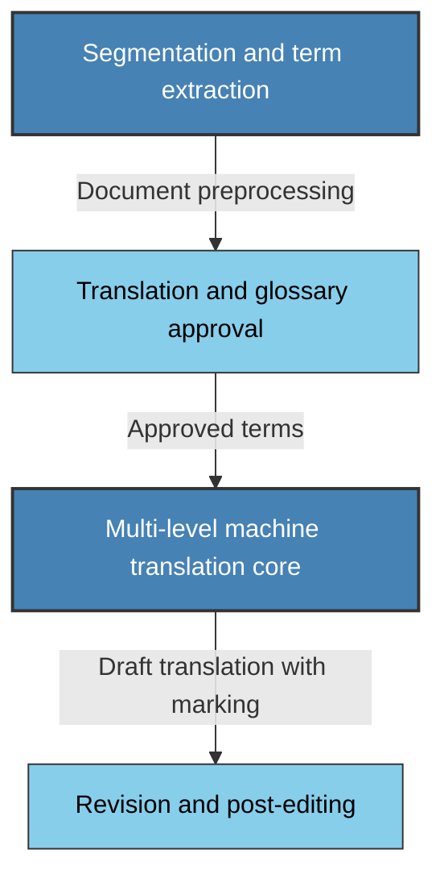
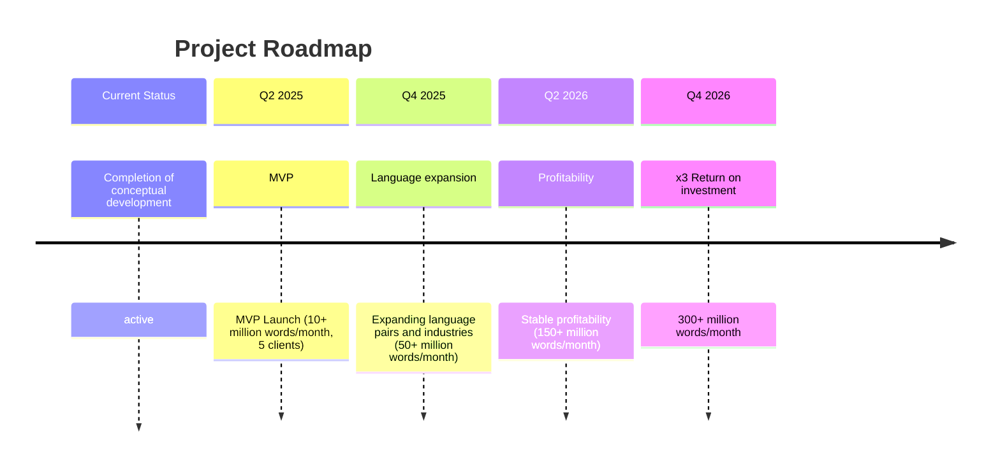

# Next-Generation Modular Machine Translation System

## Slide 1: Title Slide

**Title:** Modular Machine Translation System for Specialized Texts

**Key Value Proposition:** Reducing specialized translation costs by 93-97% (14-33 times cheaper) while improving accuracy by 30%

---

## Slide 2: Problem

### Existing solutions struggle with specialized texts

- **Insufficient accuracy** in translating terminology in professional fields
- **Lack of domain specialization** for specific industries
- **Inconsistency** in terminology use within a single document

**Scale of the problem:**

- Global companies spend **$30-50 billion annually** on translating specialized documents
- Up to **45% of translation budgets** is spent on post-editing machine translations

---

## Slide 3: Solution

### Comprehensive machine translation system focused on terminological accuracy

1. **Intelligent processing of specialized terminology**
    
    - Automatic extraction, classification, and translation of terms considering context
2. **Modular adaptive translation with evolutionary architecture**
    
    - Intelligent document structure recognition and selection of optimal translation strategy
3. **Color marking of problematic segments**
    
    - Highlighting text sections by translation confidence level

---

## Slide 4: Solution Architecture

**Evolutionary modular architecture:**

**Key advantages:**

- **Each module is independent** and can be improved without affecting others
- **High scalability** thanks to microservice architecture
- **Phased development:** MVP with basic modules ready for commercial use

---

## Slide 5: Technology Strategy

### MVP and product development

**MVP (Q2 2025)**

- Basic terminology control functionality
- Specialization of models for automotive and oil & gas industries
- Main language pairs: English ↔ Russian, German, French
- **Key advantage:** readiness for immediate commercialization

**Product development (Q3-Q4 2025)**

- Expansion of industry specialization
- Addition of new language pairs
- Improvement of post-editing tools

**Adaptation to technological breakthroughs:**

- Modular architecture for quick integration of new technologies
- Focus on industry expertise rather than basic translation models

---

## Slide 6: Market Opportunity and Competitors

### Growing market for specialized translations

- **Machine translation market: $800 million** (2024) with 18.9% annual growth
- **Specialized translation segment: $280 million** (35% of the market)
- **Target market share by 2026: 2%** of the specialized segment (~$6 million)
- **Market volume forecast by 2026: $400+ million** (considering growth dynamics)

**Competitive advantages:**

|Criteria|Our solution|DeepL|Google|Microsoft|
|---|---|---|---|---|
|**Specialization in domain texts**|✓✓✓|✓✓|✓|✓✓|
|**Automatic terminology extraction**|✓✓✓|✗|✗|✓|
|**Color marking of problematic segments**|✓✓✓|✗|✗|✗|
|**Integration with corporate glossaries**|✓✓✓|✓|✓|✓✓|

---

## Slide 7: Business Model and Unit Economics

### Monetization model: pay per translated word

**Pricing plan:**

- **Base rate:** $0.003 per translated word
- **Corporate rates:** discounts from 10% for volumes over 1 million words per month
- **Included in the price:**
    - Automatic terminology extraction
    - Color marking of problematic segments
    - API access and integration with workflows

**Unit Economics Analysis:**

|Metric|Value|Notes|
|---|---|---|
|**Average client**|2,000,000 words/month|Typical volume for a medium translation agency|
|**Revenue per client**|$6,000/month|At the base rate of $0.003/word|
|**Annual revenue per client**|$72,000|ARR per average client|
|**Variable costs**|$0.0006/word|20% of the rate (computational resources)|
|**Gross margin**|80%|Percentage of profit after variable costs|
|**CAC**|$2,400|Cost of acquiring one client|
|**LTV**|$216,000|With an average client lifetime of 3 years|
|**LTV/CAC**|9.0|Target efficiency indicator >3|

**ROI calculation for the client:**

- **Client currently pays for translation:** $0.04-0.1/word
- **Our cost:** $0.003/word
- **Savings:** 93-97% (14-33 times cheaper!)

**With a volume of 2 million words/month:**

- **Traditional translation:** $80,000-$200,000/month
- **Our solution:** $6,000/month
- **Savings:** $74,000-$194,000/month (93-97%)
- **ROI:** 1,230-3,230% in the first year

---

## Slide 8: Team

### Unique combination of expertise

**Alexey Zhuravlev** — _Linguistic expertise_

- 25 years of experience in technical translation
- Specialization in automotive, oil refining, and gold mining industries

**Ateve Company** — _Technology partner_

- 18 years of project development experience
- Key competencies in processing and analyzing multilingual content
- Experience in creating scalable systems for processing large volumes of data

**Focused team for quick launch:**

- Compact technology team (3-4 developers)
- Engagement of industry experts on a contract basis

---

## Slide 9: Financial Forecasts

### Projected financial indicators for 2 years

|Indicator|Q2 2025 (MVP)|Q3-Q4 2025|Q1-Q2 2026|Q3-Q4 2026|
|---|---|---|---|---|
|**Volume of translated words**|10 million|50 million|150 million|300 million|
|**Revenue**|$30,000|$150,000|$450,000|$900,000|
|**Expenses**|$100,000|$150,000|$180,000|$220,000|
|**Profit/Loss**|($70,000)|$0|$270,000|$680,000|
|**Clients (cumulative)**|5|15|30|50|

**Breakeven point:** Q3-Q4 2025 (4-6 months after MVP launch)

**Investment attractiveness:**

- Initial investment: $300,000
- Annual revenue by Q4 2026: $1.8 million
- Company valuation by Q4 2026: $4.5-5.4 million (15-18x return on initial investment)
- Basis for valuation: annual revenue of $1.8 million with a multiplier of 2.5-3.0x

---

## Slide 10: Investment Use Plan and Roadmap

### Required investment: $300,000

**Investment allocation:**

- **MVP development:** $150,000 (50%)
    - Creation of basic modules and integration
    - Model training for 2-3 main industries
    - Development of post-editing tools
- **Operating expenses:** $60,000 (20%)
    - Infrastructure and computational resources
    - Development team salaries
- **Marketing and client acquisition:** $60,000 (20%)
    - Targeted campaigns for translation agencies
    - Participation in industry events
- **Creation of terminology databases:** $30,000 (10%)
    - Development of industry glossaries
    - Tools for automatic terminology extraction

**Key risks and mitigation strategies:**

- Risk: Emergence of new base translation models
- Mitigation: Modular architecture allows for quick integration of new technologies while maintaining our advantage in domain specialization

### Roadmap

**Key milestones:**

- **Q2 2025:** MVP launch (10+ million words/month, 5 clients)
- **Q4 2025:** Expansion of language pairs and industries (50+ million words/month)
- **Q2 2026:** Stable profitability (150+ million words/month)
- **Q4 2026:** 3x return on investment (300+ million words/month)

---

## Slide 11: Contacts

**Thank you for your attention!**

### Contact us for additional information

**Contact information:**

- **Alexey Zhuravlev** — Head of Linguistic Expertise
- **Sergey Korovkin** — Technical Director, Ateve
- Email: info@adatranslate.ai
- Phone: +7 (495) XXX-XX-XX

### Materials available upon request

- Detailed business plan and financial model
- Technical documentation on solution architecture
- Demonstration of the system prototype