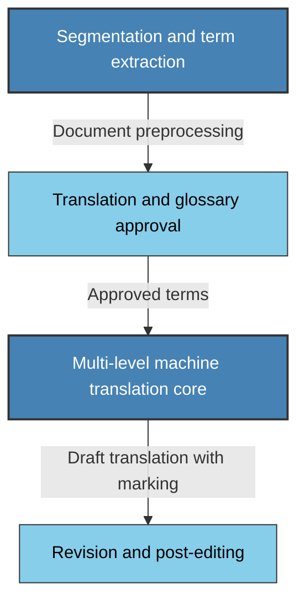
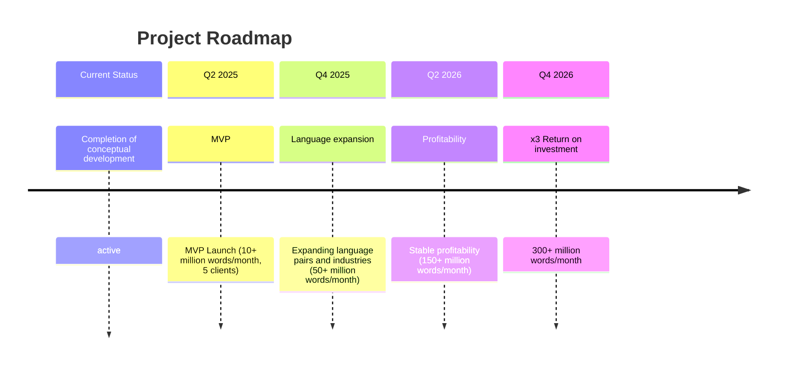

# Next-Generation Modular Machine Translation System

## Slide 1: Title Slide

**Title:** Modular Machine Translation System for Specialized Texts

**Key Value Proposition:** Reducing specialized translation costs by 93-97% (14-33x cheaper) while improving accuracy by 30%

---

## Slide 2: Problem

### Current solutions struggle with specialized content

- **Insufficient accuracy** when translating technical terminology
- **Limited domain specialization** across industries
- **Inconsistent terminology** within single documents

**Scale of the problem:**

- Global enterprises spend **$30-50 billion annually** on specialized document translation
- Up to **45% of translation budgets** go toward post-editing machine translations

---

## Slide 3: Solution

### Comprehensive machine translation system focused on terminology accuracy

1. **Intelligent processing of specialized terminology**
    
    - Automatic extraction, classification, and context-aware translation of terms
2. **Modular adaptive translation with evolutionary architecture**
    
    - Smart document structure recognition and optimal translation strategy selection
3. **Color-coded confidence marking**
    
    - Highlighting text sections by translation confidence level

---

## Slide 4: Solution Architecture

**Evolutionary modular architecture:**

**Key advantages:**

- **Independent modules** that can be enhanced without affecting others
- **High scalability** through microservice architecture
- **Phased development:** MVP with core modules ready for commercial deployment

---

## Slide 5: Technology Strategy

### MVP and product development

**MVP (Q2 2025)**

- Core terminology control functionality
- Specialized models for automotive and oil & gas sectors
- Primary language pairs: English ↔ Russian, German, French
- **Key advantage:** immediate commercial viability

**Product development (Q3-Q4 2025)**

- Expansion across industry verticals
- Addition of new language pairs
- Enhanced post-editing tools

**Adaptation to technological advances:**

- Modular architecture enabling rapid integration of emerging technologies
- Focus on industry expertise rather than foundational translation models

---

## Slide 6: Market Opportunity and Competitors

### Growing specialized translation market

- **Machine translation market: $800 million** (2024) with 18.9% annual growth
- **Specialized translation segment: $280 million** (35% of the market)
- **Target market share by 2026: 2%** of the specialized segment (~$6 million)
- **Market forecast by 2026: $400+ million** (based on current growth trajectory)

**Competitive advantages:**

| Criteria                                  | Our solution | DeepL | Google | Microsoft |
| ----------------------------------------- | ------------ | ----- | ------ | --------- |
| **Specialization in domain texts**        | ✓✓✓          | ✓✓    | ✓      | ✓✓        |
| **Automatic terminology extraction**      | ✓✓✓          | ✗     | ✗      | ✓         |
| **Color-coded confidence marking**        | ✓✓✓          | ✗     | ✗      | ✗         |
| **Integration with corporate glossaries** | ✓✓✓          | ✓     | ✓      | ✓✓        |

---

## Slide 7: Business Model and Unit Economics

### Monetization model: pay per translated word

**Pricing plan:**

- **Base rate:** $0.003 per translated word
- **Enterprise rates:** 10%+ discounts for volumes exceeding 1 million words per month
- **Included features:**
    - Automatic terminology extraction
    - Color-coded confidence marking
    - API access and workflow integration

**Unit Economics Analysis:**

| Metric                        | Value                 | Notes                                             |
| ----------------------------- | --------------------- | ------------------------------------------------- |
| **Average client**            | 2,000,000 words/month | Typical volume for a mid-sized translation agency |
| **Revenue per client**        | $6,000/month          | At the base rate of $0.003/word                   |
| **Annual revenue per client** | $72,000               | ARR per average client                            |
| **Variable costs**            | $0.0006/word          | 20% of the rate (computational resources)         |
| **Gross margin**              | 80%                   | Percentage of profit after variable costs         |
| **CAC**                       | $2,400                | Cost of acquiring one client                      |
| **LTV**                       | $216,000              | With an average client lifespan of 3 years        |
| **LTV/CAC**                   | 9.0                   | Target efficiency indicator >3                    |

**ROI calculation for clients:**

- **Current translation costs:** $0.04-0.1/word
- **Our solution:** $0.003/word
- **Savings:** 93-97% (14-33x cheaper!)

**With a volume of 2 million words/month:**

- **Traditional translation:** $80,000-$200,000/month
- **Our solution:** $6,000/month
- **Monthly savings:** $74,000-$194,000 (93-97%)
- **ROI:** 1,230-3,230% in the first year

---

## Slide 8: Team

### Unique combination of expertise

**Alexey Zhuravlev** — _Linguistic expertise_

- 25 years of experience in technical translation
- Specialization in automotive, oil refining, and mining industries

**Ateve Company** — _Technology partner_

- 18 years of software development experience
- Core competencies in multilingual content processing and analysis
- Track record in building scalable big data systems

**Focused team for rapid launch:**

- Streamlined technology team (3-4 developers)
- Industry experts engaged on a contract basis

---

## Slide 9: Financial Projections

### Projected financial performance over 2 years

| Indicator                      | Q2 2025 (MVP) | Q3-Q4 2025 | Q1-Q2 2026  | Q3-Q4 2026  |
| ------------------------------ | ------------- | ---------- | ----------- | ----------- |
| **Volume of translated words** | 10 million    | 50 million | 150 million | 300 million |
| **Revenue**                    | $30,000       | $150,000   | $450,000    | $900,000    |
| **Expenses**                   | $100,000      | $150,000   | $180,000    | $220,000    |
| **Profit/Loss**                | ($70,000)     | $0         | $270,000    | $680,000    |
| **Clients (cumulative)**       | 5             | 15         | 30          | 50          |

**Breakeven point:** Q3-Q4 2025 (4-6 months after MVP launch)

**Investment highlights:**

- Initial investment: $300,000
- Annual revenue by Q4 2026: $1.8 million
- Company valuation by Q4 2026: $4.5-5.4 million (15-18x ROI)
- Valuation basis: annual revenue of $1.8 million with a multiplier of 2.5-3.0x

---

## Slide 10: Investment Allocation and Roadmap

### Required investment: $300,000

**Investment allocation:**

- **MVP development:** $150,000 (50%)
    - Creation of core modules and integration
    - Model training for 2-3 primary industries
    - Development of post-editing tools
- **Operating expenses:** $60,000 (20%)
    - Infrastructure and computational resources
    - Development team compensation
- **Marketing and client acquisition:** $60,000 (20%)
    - Targeted campaigns for translation agencies
    - Industry event participation
- **Terminology database development:** $30,000 (10%)
    - Creation of industry-specific glossaries
    - Tools for automatic terminology extraction

**Key risks and mitigation strategies:**

- Risk: Emergence of new foundational translation models
- Mitigation: Our modular architecture enables swift integration of new technologies while maintaining our competitive edge in domain specialization

### Roadmap

**Key milestones:**

- **Q2 2025:** MVP launch (10+ million words/month, 5 clients)
- **Q4 2025:** Expansion of language pairs and industries (50+ million words/month)
- **Q2 2026:** Stable profitability (150+ million words/month)
- **Q4 2026:** 3x return on investment (300+ million words/month)

---

## Slide 11: Contact Information

**Thank you for your attention!**

### Contact us for additional information

**Contact details:**

- **Alexey Zhuravlev** — Head of Linguistic Expertise
- **Sergey Korovkin** — Chief Technology Officer, Ateve
- Email: a.o.zhuravlev@adatranslate.ai
- Phone: +1 (555) XXX-XXXX

### Additional materials available

- Comprehensive business plan and financial model
- Technical documentation on solution architecture
- System prototype demonstration