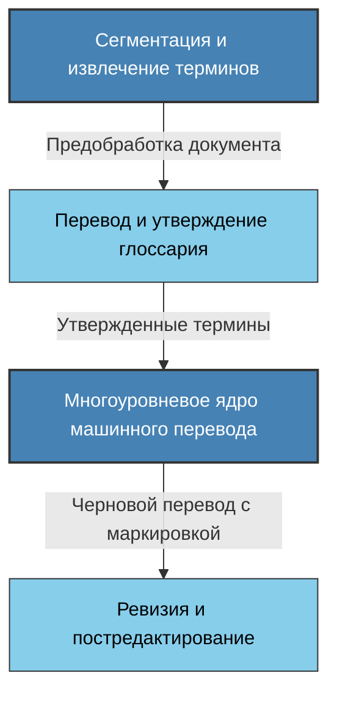
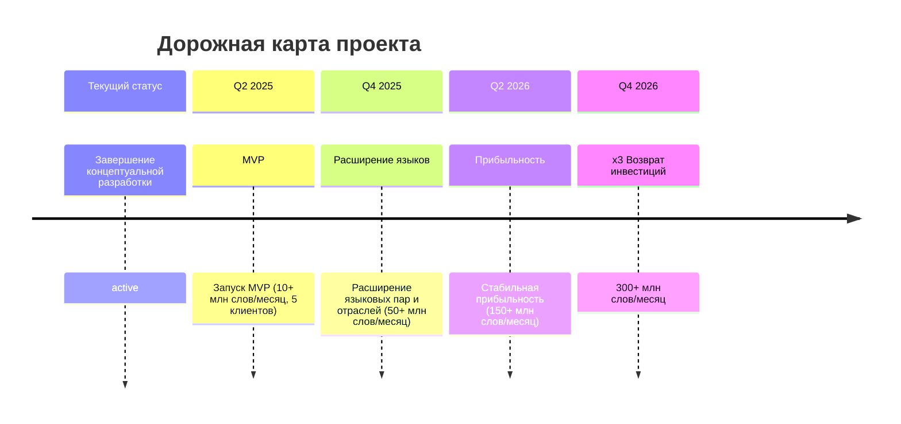

# Модульная система машинного перевода нового поколения

## Слайд 1: Титульный слайд

**Название:** Модульная система машинного перевода для специализированных текстов

**Ключевой тезис:** Сокращение затрат на специализированный перевод на 40% при повышении точности на 30%

---

## Слайд 2: Проблема

### Существующие решения не справляются со специализированными текстами

- **Недостаточная точность** перевода терминологии в профессиональных областях
- **Отсутствие доменной специализации** для конкретных отраслей
- **Непоследовательность** в использовании терминов в рамках одного документа

**Масштаб проблемы:**

- Глобальные компании тратят **$30-50 млрд ежегодно** на перевод специализированных документов
- До **45% бюджета** на перевод уходит на постредактирование машинного перевода

---

## Слайд 3: Решение

### Комплексная система машинного перевода с фокусом на терминологическую точность

1. **Интеллектуальная обработка специализированной терминологии**
    
    - Автоматическое извлечение, классификация и перевод терминов с учетом контекста
2. **Модульный адаптивный перевод с эволюционной архитектурой**
    
    - Интеллектуальное распознавание структуры документа и выбор оптимальной стратегии перевода
3. **Цветовая маркировка проблемных сегментов**
    
    - Выделение участков текста по уровню достоверности перевода

---

## Слайд 4: Архитектура решения

**Эволюционная модульная архитектура:**

**Ключевые преимущества:**

- **Каждый модуль независим** и может быть улучшен без влияния на другие
- **Высокая масштабируемость** благодаря микросервисной архитектуре
- **Поэтапная разработка:** MVP с базовыми модулями готов к коммерческому использованию

---

## Слайд 5: Технологическая стратегия

### MVP и развитие продукта

**MVP (Q2 2025)**

- Базовый функционал терминологического контроля
- Специализация моделей на автомобильную и нефтегазовую отрасли
- Основные языковые пары: английский ↔ русский, немецкий, французский
- **Ключевое преимущество:** готовность к немедленной коммерциализации

**Развитие продукта (Q3-Q4 2025)**

- Расширение отраслевой специализации
- Добавление новых языковых пар
- Усовершенствование инструментов постредактирования

**Адаптация к технологическим прорывам:**

- Модульная архитектура для быстрой интеграции новых технологий
- Фокус на отраслевой экспертизе, а не на базовых моделях перевода

---

## Слайд 6: Рыночная возможность и конкуренты

### Растущий рынок специализированных переводов

- **Рынок машинного перевода: $800 млн** (2024) с ростом 18,9% ежегодно
- **Сегмент специализированных переводов: $280 млн** (35% рынка)
- **Целевая доля рынка к 2026 году: 2%** специализированного сегмента (~$6 млн)

**Конкурентные преимущества:**

|Критерий|Наше решение|DeepL|Google|Microsoft|
|---|---|---|---|---|
|**Специализация на доменных текстах**|✓✓✓|✓✓|✓|✓✓|
|**Автоматическое извлечение терминологии**|✓✓✓|✗|✗|✓|
|**Цветовая маркировка проблемных сегментов**|✓✓✓|✗|✗|✗|
|**Интеграция с корпоративными глоссариями**|✓✓✓|✓|✓|✓✓|

---

## Слайд 7: Бизнес-модель и Unit Economics

### Модель монетизации: оплата за переведенное слово

**Тарифный план:**

- **Базовая ставка:** $0.002 за переведенное слово
- **Корпоративные тарифы:** скидки от 10% при объеме более 1 млн слов в месяц
- **Включено в стоимость:**
    - Автоматическое извлечение терминологии
    - Цветовая маркировка проблемных сегментов
    - API-доступ и интеграция с рабочими процессами

**Анализ Unit Economics:**

| Метрика                     | Значение             | Примечания                                           |
| --------------------------- | -------------------- | ---------------------------------------------------- |
| **Средний клиент**          | 2,000,000 слов/месяц | Типичный объем для среднего переводческого агентства |
| **Доход с клиента**         | $4000/месяц          | При базовой ставке $0.002/слово                      |
| **Годовой доход с клиента** | $48,000              | ARR на одного среднего клиента                       |
| **Переменные затраты**      | $0.0004/слово        | 20% от ставки (вычислительные ресурсы)               |
| **Валовая маржа**           | 80%                  | Процент прибыли после переменных затрат              |
| **CAC**                     | $2,400               | Стоимость привлечения одного клиента                 |
| **LTV**                     | $144,000             | При среднем сроке жизни клиента 3 года               |
| **LTV/CAC**                 | 6.0                  | Целевой показатель эффективности >3                  |

**Расчёт ROI для клиента:**

- **Средняя стоимость специализированного перевода:** $0.12-0.15/слово
- **Экономия при использовании нашего решения:** 135-400%
- **ROI для клиента:** >400% в первый год

---

## Слайд 8: Команда

### Уникальное сочетание экспертизы

**Алексей Журавлёв** — _Лингвистическая экспертиза_

- 25 лет опыта в переводе технических текстов
- Специализация в автомобильной, нефтеперерабатывающей, золотодобывающей отраслях

**Компания Ateve** — _Технологический партнер_

- 18 лет опыта разработки проектов
- Ключевые компетенции в обработке и анализе многоязычного контента
- Опыт создания масштабируемых систем обработки больших объемов данных

**Сфокусированная команда для быстрого запуска:**

- Компактная технологическая команда (3-4 разработчика)
- Привлечение отраслевых экспертов на контрактной основе

---

## Слайд 9: Финансовые прогнозы

### Прогнозируемые финансовые показатели на 2 года

| Показатель                       | Q2 2025 (MVP) | Q3-Q4 2025 | Q1-Q2 2026 | Q3-Q4 2026 |
| -------------------------------- | ------------- | ---------- | ---------- | ---------- |
| **Объем переведенных слов**      | 10 млн        | 50 млн     | 150 млн    | 300 млн    |
| **Выручка**                      | $20 тыс.      | $100 тыс.  | $300 тыс.  | $600 тыс.  |
| **Расходы**                      | $100 тыс.     | $150 тыс.  | $180 тыс.  | $220 тыс.  |
| **Прибыль/Убыток**               | ($80 тыс.)    | ($50 тыс.) | $120 тыс.  | $380 тыс.  |
| **Клиенты (нарастающим итогом)** | 5             | 15         | 30         | 50         |

**Точка безубыточности:** Q1 2026 (через 6-8 месяцев после запуска MVP)

**x3 выход через 18 месяцев:**

- Первоначальные инвестиции: $300,000
- Оценка компании к Q4 2026: $900,000+ (x3)
- Основание для оценки: годовая выручка $1.2 млн с мультипликатором 2.5-3.0x

---

## Слайд 10: План использования инвестиций и дорожная карта

### Требуемые инвестиции: $300,000

**Распределение инвестиций:**

- **Разработка MVP:** $150,000 (50%)
    - Создание базовых модулей и интеграция
    - Обучение моделей для 2-3 основных отраслей
    - Разработка инструментов постредактирования
- **Операционные расходы:** $60,000 (20%)
    - Инфраструктура и вычислительные ресурсы
    - Заработная плата команды разработчиков
- **Маркетинг и привлечение клиентов:** $60,000 (20%)
    - Таргетированные кампании для переводческих агентств
    - Участие в отраслевых мероприятиях
- **Создание терминологических баз:** $30,000 (10%)
    - Разработка отраслевых глоссариев
    - Инструменты для автоматического извлечения терминологии

### Дорожная карта

**Ключевые вехи:**

- **Q2 2025:** Запуск MVP (10+ млн слов/месяц, 5 клиентов)
- **Q4 2025:** Расширение языковых пар и отраслей (50+ млн слов/месяц)
- **Q2 2026:** Стабильная прибыльность (150+ млн слов/месяц)
- **Q4 2026:** x3 возврат инвестиций (300+ млн слов/месяц)

---

## Слайд 11: Контакты

**Спасибо за внимание!**

### Свяжитесь с нами для дополнительной информации

**Контактная информация:**

- **Алексей Журавлёв** — Руководитель лингвистической экспертизы
- **Сергей Коровкин** — Технический директор, Ateve
- Email: info@adatranslate.ai
- Телефон: +7 (495) XXX-XX-XX

### Доступные материалы по запросу

- Детальный бизнес-план и финансовая модель
- Техническая документация по архитектуре решения
- Демонстрация прототипа системы