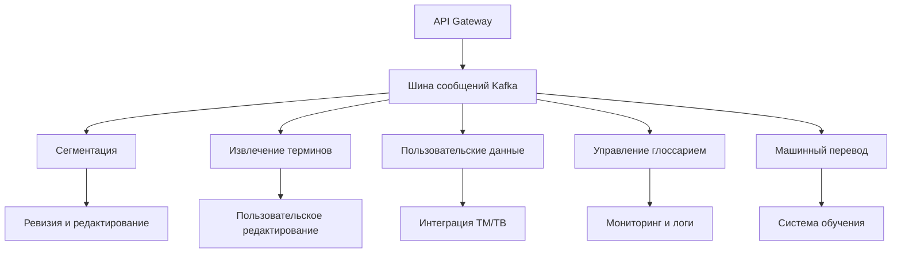
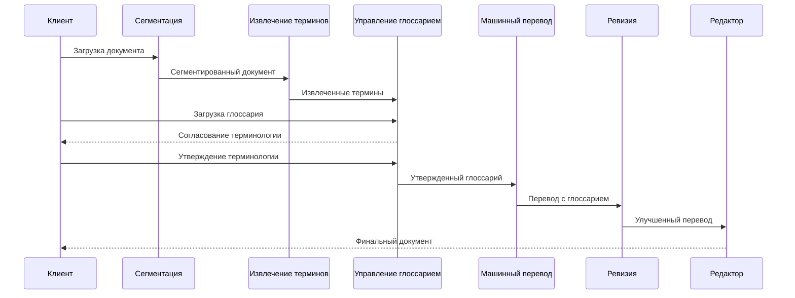

### 4.3.1. Принципы модульной организации

Система машинного перевода построена на принципах слабой связанности и высокой сплочённости компонентов, обеспечивая гибкость разработки и масштабирования:

- **Контрактное программирование** — каждый модуль имеет чётко определённые интерфейсы с версионированием
- **Изоляция компонентов** — каждый модуль отвечает за чётко ограниченную область функциональности
- **Стандартизированные форматы данных** — унифицированные структуры обмена информацией
- **Отказоустойчивый обмен сообщениями** — устойчивость к сбоям при межмодульной коммуникации

### 4.3.2. Ядро системы и основные модули

Система включает следующие взаимосвязанные модули:

1. **Модуль сегментации** — разделяет исходный документ на логические единицы перевода
2. **Модуль извлечения терминов** — выделяет ключевые термины и выражения из текста
3. **Модуль работы с пользовательскими данными** — интегрирует глоссарии и памяти переводов
4. **Модуль управления глоссарием** — обеспечивает перевод и утверждение терминологии
5. **Модуль машинного перевода** — реализует основные алгоритмы перевода
6. **Модуль ревизии и редактирования** — автоматически улучшает качество перевода
7. **Модуль пользовательского редактирования** — предоставляет интерфейс для работы с переводом
8. **Модуль интеграции TM/TB** — обрабатывает и сохраняет лингвистические данные

### 4.3.3. Коммуникационная инфраструктура

Модули взаимодействуют через:

- **Шину сообщений** (Apache Kafka) — для асинхронной коммуникации с гарантированной доставкой
- **API Gateway** (nginx + Kong) — унифицированная точка входа для внешних систем
- **Сервис событий** — обеспечивает механизм публикации/подписки с маршрутизацией



### 4.3.4. Полная матрица зависимостей модулей

|Модуль|Предоставляемые API (выходные)|Потребляемые API (входные)|Метрики производительности|
|---|---|---|---|
|Сегментация|SegmentedDocumentAPI|DocumentProcessingAPI, ConfigurationAPI|Время сегментации: <2с/10K слов|
|Извлечение терминов|ExtractedTerminologyAPI|SegmentedDocumentAPI, ConfigurationAPI|Точность выделения: >85%|
|Работа с пользовательскими данными|ProcessedUserResourcesAPI, TranslationPrepDataAPI|SegmentedDocumentAPI, UserAuthenticationAPI|Время поиска в TM: <100мс|
|Управление глоссарием|TranslatedGlossaryAPI, GlossaryEventsAPI|ExtractedTerminologyAPI, ProcessedUserResourcesAPI|Консистентность терминологии: >95%|
|Машинный перевод|TranslatedDocumentAPI, TranslationFeedbackAPI|SegmentedDocumentAPI, TranslatedGlossaryAPI|Производительность: >5K слов/мин|
|Ревизия и редактирование|RevisedDocumentAPI, EditingInsightsAPI|TranslatedDocumentAPI, QualityAssuranceAPI|Среднее улучшение качества: >15%|
|Пользовательское редактирование|UserEditedDocumentAPI, FeedbackAPI|RevisedDocumentAPI, TranslatedGlossaryAPI|Задержка отклика UI: <100мс|
|Интеграция TM/TB|EnhancedTMAPI, ModelTrainingDataAPI|UserEditedDocumentAPI, FeedbackAPI|Скорость обновления TM: <5с|

### 4.3.5. Диаграмма последовательности ключевого сценария

Пример: Обработка нового проекта перевода с пользовательским глоссарием

### 4.3.6. Механизмы интеграции и обеспечения качества

#### Интеграционные механизмы

- **Асинхронный обмен сообщениями** с гарантией доставки (не менее одного раза)
- **Двухфазный коммит** для распределённых транзакций при обновлении критических данных
- **Компенсирующие транзакции** для обработки сбоев и восстановления согласованности
- **Версионированные контракты API** с поддержкой нескольких версий одновременно

#### Наблюдаемость и мониторинг

- **Распределённая трассировка** (Jaeger) — отслеживание запросов через модули
- **Мониторинг в реальном времени** (Prometheus/Grafana) с настраиваемыми дашбордами
- **Централизованное логирование** (ELK Stack) с корреляцией сообщений между модулями
- **Проактивные оповещения** при обнаружении аномалий в межмодульном взаимодействии

#### Метрики качества взаимодействия

- Минимальное время отклика между модулями: <50мс для синхронных запросов
- Пропускная способность шины сообщений: >5000 сообщений/с
- Задержка доставки сообщений: <200мс (99-й процентиль)
- Процент успешных транзакций: >99.9%

### 4.3.7. Стратегия развёртывания

- **Независимое развёртывание модулей** через контейнеризацию (Docker + Kubernetes)
- **Сине-зелёные деплойменты** для обновления без простоев
- **Канареечные релизы** для тестирования новых версий на ограниченной аудитории
- **Автоматический откат** при обнаружении проблем в новых версиях

#### Этапы внедрения модулей:

1. Базовые модули (сегментация, машинный перевод, пользовательское редактирование)
2. Дополнительные модули повышения качества (извлечение терминов, ревизия)
3. Расширенные аналитические возможности (обучение, адаптация, оптимизация)

### 4.3.8. Конкретные примеры интеграции модулей

#### Пример 1: Обновление терминологии

1. Пользователь добавляет новый термин "neural architecture" → "нейросетевая архитектура"
2. Модуль управления глоссарием публикует событие `GlossaryUpdated` с идентификатором проекта
3. Модуль машинного перевода получает оповещение и обновляет кэш терминологии
4. Модуль ревизии получает событие и проверяет все сегменты на наличие нового термина
5. При обнаружении несогласованного использования публикуется событие `TerminologyInconsistencyDetected`
6. Пользовательский интерфейс отображает предупреждение о несогласованности

```json
// Пример события GlossaryUpdated
{
  "event_type": "GlossaryUpdated",
  "project_id": "PRJ-2023-0042",
  "timestamp": "2025-03-06T08:42:15Z",
  "terms": [
    {
      "source": "neural architecture",
      "target": "нейросетевая архитектура",
      "domain": "artificial_intelligence",
      "confidence": 0.95
    }
  ]
}
```

#### Пример 2: Определение качества перевода

1. Модуль машинного перевода передаёт сегмент в модуль ревизии
2. Модуль ревизии выполняет многофакторный анализ качества:
    - Терминологическая точность: 100%
    - Грамматическая корректность: 92%
    - Стилистическое соответствие: 85%
3. Модуль публикует оценку с метриками в событии `TranslationQualityEvaluated`
4. Пользовательский интерфейс отображает цветовую маркировку качества
5. Модуль интеграции TM сохраняет оценки для последующего анализа

Данная модульная структура обеспечивает гибкость, масштабируемость и устойчивость системы машинного перевода, позволяя эффективно обрабатывать проекты различного объёма и сложности, а также быстро адаптироваться к эволюции технологий машинного перевода.