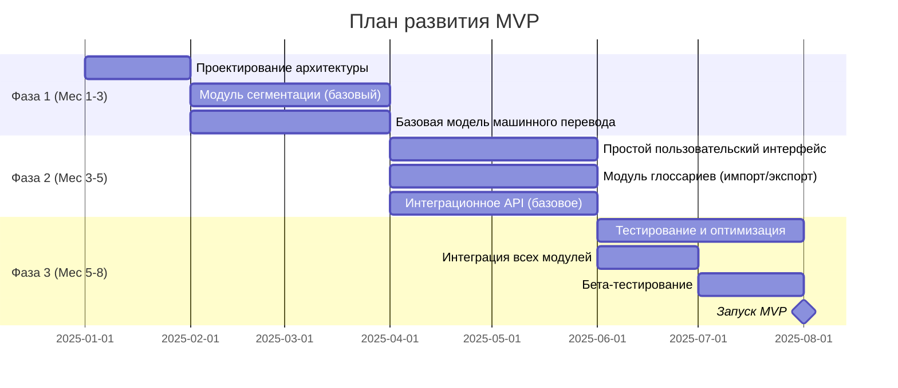
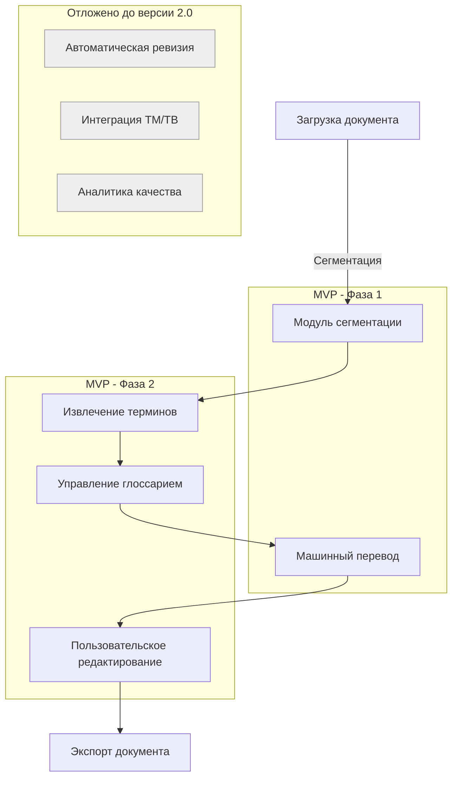

### Ключевые функциональные модули MVP

MVP системы машинного перевода фокусируется на основных модулях, обеспечивающих базовую функциональность и демонстрирующих ключевые конкурентные преимущества:

1. **Критические модули**:
    
    - Сегментация (поддержка DOCX, HTML)
    - Базовый машинный перевод
    - Пользовательское редактирование
2. **Упрощённые модули**:
    
    - Извлечение терминов (только статистический метод)
    - Работа с глоссариями (импорт/экспорт CSV)
    - Простое API для интеграций

### Поэтапный план развёртывания модулей

### Технические ограничения MVP

- **Языковые пары**: только EN-RU, EN-DE, EN-FR, ZH-RU
- **Объём документов**: до 25 000 слов на проект
- **Форматы**: только DOCX, HTML, TXT
- **Память переводов**: до 50 000 сегментов на проект

### Оптимизированная инфраструктура для MVP

Вместо выделенных серверов выбрана облачная инфраструктура с оплатой по мере использования:

- **Облачные ресурсы**:
    
    - 2-4 виртуальные машины с 8 vCPU, 32 GB RAM (масштабирование по необходимости)
    - GPU-инстансы на время обработки (NVIDIA T4 эквивалент)
    - Объектное хранилище вместо выделенных SSD
- **Программное обеспечение**:
    
    - Docker и Kubernetes для гибкого масштабирования
    - PostgreSQL для реляционных данных
    - Redis для кэширования
    - RabbitMQ для асинхронной коммуникации

### Упрощённая модульная структура MVP

### Показатели производительности MVP

- **Скорость перевода**: не менее 1500 слов/мин
- **Время отклика UI**: до 500 мс для основных операций
- **Доступность**: 98% (до 14 часов простоя в месяц)
- **Экономия времени редактирования**: не менее 40% по сравнению с обычным переводом

### Бюджет разработки MVP

- **Расходы на разработку**: $300,000 - $350,000
    - Команда разработки: 4-6 разработчиков
    - Инженеры ML: 1-2 специалиста
    - UX/UI: 1 дизайнер
- **Инфраструктурные расходы**: $3,000 - $5,000/месяц
    - Облачные сервисы: $2,000 - $3,500/месяц
    - Сторонние API и сервисы: $500 - $1,500/месяц

### Модель монетизации MVP

- **Ценовая модель**:
    
    - Базовая подписка: $50/месяц (до 50,000 слов)
    - Профессиональная: $200/месяц (до 250,000 слов)
    - Enterprise: индивидуальное ценообразование
- **Целевые метрики**:
    
    - Конверсия бесплатных пользователей в платные: 5%
    - Средний доход на пользователя (ARPU): $120/месяц
    - Удержание клиентов через 3 месяца: 60%

### План масштабирования после MVP

1. **Расширение функциональности (Q3-Q4 2025)**:
    
    - Модуль автоматической ревизии и редактирования
    - Расширенная поддержка форматов (PPTX, XLSX, PDF)
    - Расширение языковых пар до 10-15
2. **Интеграционная фаза (Q1-Q2 2026)**:
    
    - Полноценная интеграция с популярными TMS-системами
    - API для встраивания в сторонние продукты
    - Мобильное приложение для проверки и утверждения переводов
3. **Масштабирование (Q3-Q4 2026)**:
    
    - Запуск Enterprise-версии с локальным развёртыванием
    - Партнёрская программа для переводческих агентств
    - Поддержка низкоресурсных языков

### Управление рисками

|Риск|Вероятность|Влияние|Стратегия митигации|
|---|---|---|---|
|Низкое качество перевода для некоторых пар языков|Высокая|Высокое|Сосредоточиться на 3 языковых парах с наилучшими результатами и постепенно расширять|
|Превышение сроков разработки|Средняя|Среднее|Внедрение agile-методологии, еженедельные релизы и быстрая обратная связь|
|Технические проблемы интеграции модулей|Средняя|Высокое|Создание прототипов критических компонентов в первую очередь|
|Превышение бюджета|Средняя|Среднее|Облачная инфраструктура с оплатой по мере использования|
|Низкий пользовательский интерес|Низкая|Высокое|Привлечение бета-тестеров из целевой аудитории на ранних стадиях разработки|

### Стратегия pre-MVP для раннего тестирования

Для получения ранней обратной связи и привлечения инвесторов перед полным MVP:

1. **Демонстрационный прототип (3-й месяц)**:
    
    - Веб-интерфейс с ограниченной функциональностью
    - Перевод текстов до 1000 слов
    - Поддержка только EN-RU
    - Цель: демонстрация концепции потенциальным клиентам и инвесторам
2. **Партнёрство с существующими TMS-системами**:
    
    - Интеграция через API с 1-2 популярными системами управления переводами
    - Предоставление технологии перевода как дополнительной опции в их системах
    - Получение доступа к существующей клиентской базе

### Критерии успеха MVP

MVP будет считаться успешным, если в течение трёх месяцев после запуска:

1. Минимум 10 пилотных клиентов завершат хотя бы по одному проекту перевода
2. Достигнуто сокращение времени редактирования на 40% или более
3. Не менее 70% пользователей готовы рекомендовать систему (NPS ≥ 30)
4. Конверсия из бесплатного в платный тариф составит не менее 5%

Данный подход к MVP обеспечивает оптимальный баланс между быстрым выходом на рынок, экономией ресурсов и демонстрацией ключевых преимуществ системы потенциальным клиентам и инвесторам.