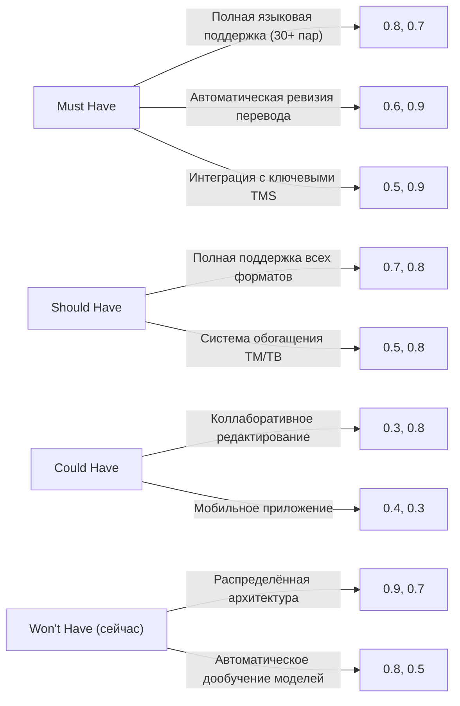
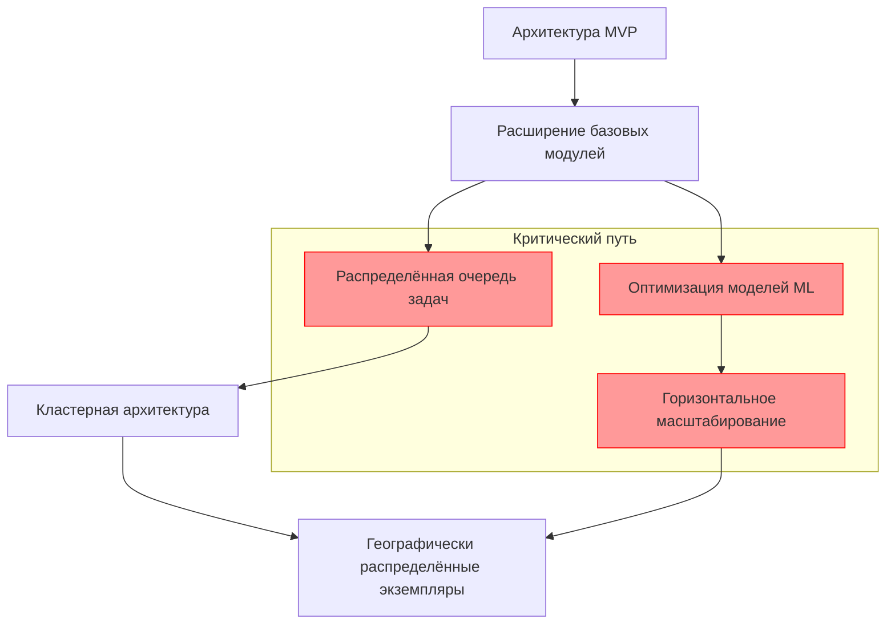

## 4.4.2. Требования для полной версии продукта

### Сравнительный анализ MVP и полной версии

| Аспект             | MVP                            | Полная версия                                | Метрики улучшения                                  |
| ------------------ | ------------------------------ | -------------------------------------------- | -------------------------------------------------- |
| Языковые пары      | 4 (EN-RU, EN-DE, EN-FR, ZH-RU) | 30+ пар                                      | 10x расширение языкового охвата                    |
| Форматы документов | DOCX, HTML, TXT                | DOCX, XLSX, PPTX, PDF, HTML, XML, IDML, JSON | Полная поддержка основных отраслевых форматов      |
| Объём документов   | До 25 000 слов                 | До 1 млн слов                                | 40x увеличение ёмкости                             |
| Скорость перевода  | 1500 слов/мин                  | 10 000 слов/мин                              | 6.7x повышение производительности                  |
| Модули системы     | 3 ключевых + 3 упрощённых      | Все 8 модулей с полной функциональностью     | 100% функциональная комплектность                  |
| Доступность        | 98%                            | 99.9%                                        | Снижение времени простоя с 14.4 до 8.8 часов/месяц |
| Качество перевода  | BLEU: 30-35                    | BLEU: 40-45, COMET: 0.85+                    | 30% улучшение автоматических метрик качества       |

### Приоритизация требований по методологии MoSCoW

### Функциональная архитектура и технологические зависимости

Полная версия реализует все восемь модулей с использованием расширенного технологического стека:

| Модуль                               | Базовые технологии MVP | Дополнительные технологии полной версии                  | Приоритет   |
| ------------------------------------ | ---------------------- | -------------------------------------------------------- | ----------- |
| Сегментация                          | Python, spaCy          | C++/Rust для высокопроизводительной обработки, PyMorphy2 | Must Have   |
| Извлечение терминов                  | Python, NLTK           | SentenceTransformers, BERT/XLM-RoBERTa, KeyBERT          | Must Have   |
| Управление пользовательскими данными | PostgreSQL, Redis      | Elasticsearch, FAISS для векторного поиска               | Should Have |
| Управление глоссарием                | Python, FastAPI        | Okapi Framework, TBX-Tools                               | Must Have   |
| Машинный перевод                     | PyTorch, Hugging Face  | Распределённое обучение (Ray), GPU кластеризация         | Must Have   |
| Ревизия и редактирование             | Python                 | LanguageTool, BERTScore, COMET для оценки                | Should Have |
| Пользовательское редактирование      | React, TypeScript      | Draft.js/ProseMirror, WebSocket для коллаборации         | Must Have   |
| Интеграция TM/TB                     | MongoDB                | Cassandra для распределённого хранения, MLflow           | Could Have  |

### Архитектурная эволюция и критический путь разработки

### Технические KPI и методология измерения

| KPI               | Целевое значение              | Методология измерения                                           | Влияние на бизнес                        |
| ----------------- | ----------------------------- | --------------------------------------------------------------- | ---------------------------------------- |
| Скорость перевода | 10 000 слов/мин               | Автоматизированные тесты на стандартных корпусах разных объёмов | Повышение пропускной способности системы |
| Время отклика UI  | <200 мс (95-й перцентиль)     | Синтетические тесты + RUM (Real User Monitoring)                | Улучшение пользовательского опыта        |
| Точность терминов | >95%                          | Автоматическая проверка против утверждённых глоссариев          | Повышение качества перевода              |
| Доступность       | 99.9%                         | Распределённые проверки доступности, SLO мониторинг             | Надёжность для бизнес-процессов          |
| Эффективность TM  | >85% совпадений               | A/B тестирование алгоритмов поиска в TM                         | Снижение объёма новых переводов          |
| Время обработки   | <30 мин для проекта 100k слов | Измерение полного цикла обработки документов                    | Ускорение рабочих процессов              |

### Технические решения для обеспечения SLA (99.9%)

1. **Архитектура высокой доступности**:
    
    - Мультизональное размещение с автоматическим переключением
    - Минимум N+1 избыточность для всех критических компонентов
    - Асинхронная репликация данных с RTO <15 минут, RPO <5 минут
2. **Мониторинг и обнаружение отказов**:
    
    - Распределённый мониторинг с Prometheus/Grafana
    - Сквозная трассировка запросов с Jaeger
    - Проактивное обнаружение аномалий с автоматическими оповещениями
3. **Автоматическое восстановление**:
    
    - Самовосстанавливающиеся Kubernetes-операторы
    - Автоматизированные процедуры отката при неудачных обновлениях
    - Изоляция сбоев на уровне отдельных компонентов

### Поэтапный план масштабирования архитектуры

1. **Этап 1: Оптимизация модулей MVP** (1-2 месяц после MVP)
    
    - Замена узких мест в архитектуре
    - Внедрение микросервисной структуры для ключевых компонентов
    - Оптимизация хранения и индексации данных
2. **Этап 2: Распределённая обработка** (3-4 месяц)
    
    - Внедрение Kafka/RabbitMQ для асинхронной коммуникации
    - Сегментирование обработки данных по шардам
    - Внедрение кэширования промежуточных результатов
3. **Этап 3: Горизонтальное масштабирование** (5-6 месяц)
    
    - Автомасштабирование ресурсов на основе нагрузки
    - Балансировка нагрузки между компонентами
    - Оптимизация использования GPU-ресурсов
4. **Этап 4: Географическое распределение** (7-10 месяц)
    
    - Мультирегиональное развёртывание с учётом локальных требований
    - CDN для статических ресурсов
    - Геораспределённые базы данных с локальными репликами

### Технические требования для вертикальных отраслей

| Отрасль                  | Технические требования                                                                                                                | Используемые технологии                                                     |
| ------------------------ | ------------------------------------------------------------------------------------------------------------------------------------- | --------------------------------------------------------------------------- |
| Медицина                 | - Интеграция с UMLS и SNOMED CT - Модели, точные на 98%+ для медицинских терминов - Соответствие FDA/EMA требованиям            | BioBERT, MedicalTransformer, PubMed Embeddings                              |
| Юриспруденция            | - Распознавание 95%+ юридических конструкций - Проверка терминологической консистентности - Сохранение структуры юр. документов | Legal-BERT, контекстно-зависимые глоссарии, анализаторы структуры           |
| Техническая документация | - Обработка сложных таблиц и диаграмм - Сохранение тегов XML/DITA - Единообразный перевод UI элементов                          | Domain-specific модели, спец. модули сегментации, системы контроля качества |

### Интеграционная матрица с внешними системами

| Система       | Тип интеграции    | Технические требования           | Приоритет   |
| ------------- | ----------------- | -------------------------------- | ----------- |
| SDL Trados    | Bidirectional API | XLIFF/TMX/TBX поддержка, плагин  | Must Have   |
| memoQ         | API + Plugin      | API v2, поддержка memoQ server   | Must Have   |
| Smartcat      | API               | OAuth2, асинхронная обработка    | Should Have |
| WordPress     | CMS Connector     | Автоматический перевод контента  | Could Have  |
| GitHub/GitLab | VCS Connector     | CI/CD интеграция для локализации | Could Have  |

### Требования к безопасности и соответствию нормативам

- **Шифрование данных**: в покое (AES-256) и при передаче (TLS 1.3)
- **Аутентификация**: MFA, SSO, RBAC с детальным контролем доступа
- **Соответствие стандартам**: ISO 27001, GDPR, HIPAA (для медицинских переводов)
- **Изоляция данных**: строгое разделение данных разных клиентов
- **Аудит**: полное логирование действий пользователей с невозможностью удаления

Полная версия системы машинного перевода представляет собой комплексное решение, которое не только автоматизирует рутинные аспекты перевода, но и создаёт интеллектуальную среду для повышения продуктивности профессиональных переводчиков, обеспечивая высокое качество переводимых материалов в промышленных масштабах.