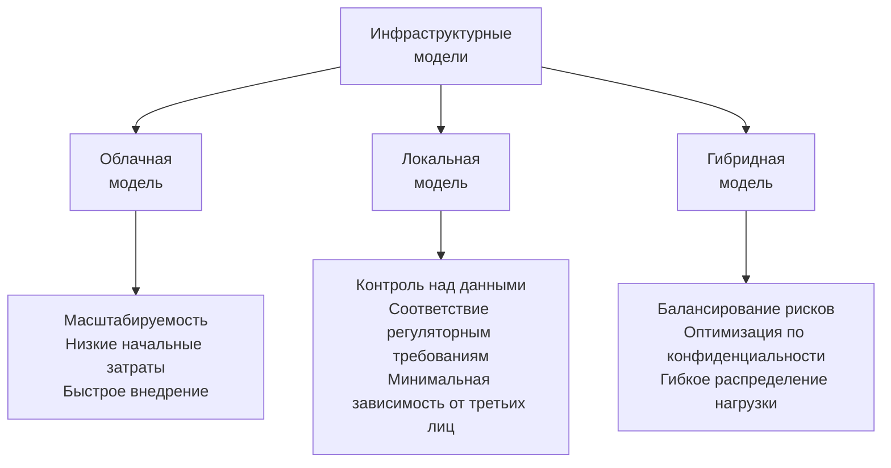
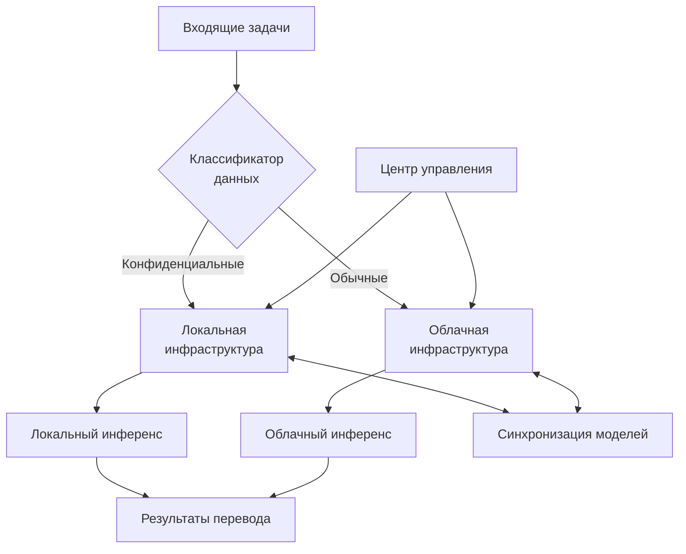

На основе рекомендаций к разделу 4.4.3 я подготовлю обновленную версию, сделав раздел более информативным, но при этом сохраняя лаконичность.

## 4.4.3. Облачная vs локальная инфраструктура

### Сравнительный анализ инфраструктурных моделей

### Экономическая эффективность моделей развёртывания

| Параметр             | Облачная   | Локальная   | Гибридная  |
| -------------------- | ---------- | ----------- | ---------- |
| Начальные инвестиции | $30-50K    | $250-400K   | $150-250K  |
| Ежемесячные расходы  | $5-15K     | $8-12K      | $6-14K     |
| TCO (3 года)         | $210-590K  | $538-832K   | $366-754K  |
| ROI (3 года)         | 185-240%   | 95-140%     | 120-180%   |
| Время запуска        | 2-4 недели | 3-6 месяцев | 2-4 месяца |

### Производительность и технические параметры

| Параметр                        | Облачная модель                              | Локальная модель                | Гибридная модель                |
| ------------------------------- | -------------------------------------------- | ------------------------------- | ------------------------------- |
| Пиковая пропускная способность  | 15,000+ слов/мин                             | 8,000-12,000 слов/мин           | 14,000+ слов/мин                |
| Время отклика                   | 150-300 мс                                   | 50-120 мс (локально)            | 70-250 мс                       |
| Деградация при пиковой нагрузке | Минимальная (горизонтальное масштабирование) | Средняя (фиксированные ресурсы) | Низкая (распределение нагрузки) |
| Среднее время восстановления    | 5-15 минут                                   | 30-90 минут                     | 10-40 минут                     |

### Матрица соответствия регуляторным требованиям

| Стандарт       | Облачная | Локальная | Гибридная |
| -------------- | -------- | --------- | --------- |
| GDPR           | ●●○      | ●●●       | ●●●       |
| HIPAA          | ●○○      | ●●●       | ●●○       |
| ISO 27001      | ●●●      | ●●●       | ●●○       |
| PCI DSS        | ●●○      | ●●●       | ●●○       |
| Гос. стандарты | ○○○      | ●●●       | ●○○       |

_Примечание: ●●● - полное соответствие, ●●○ - соответствие с дополнительными мерами, ●○○ - частичное соответствие, ○○○ - сложности в соответствии_

### Архитектура гибридной модели

### Рекомендации по выбору инфраструктуры для типов клиентов

| Тип клиента                 | Рекомендуемая модель             | Ключевые преимущества                         |
| --------------------------- | -------------------------------- | --------------------------------------------- |
| Переводческие агентства     | Облачная SaaS                    | Минимальные инвестиции, быстрый старт         |
| Корпорации (общие)          | Облачная с выделенными ресурсами | Производительность, надёжность                |
| Регулируемые отрасли        | Гибридная                        | Соответствие нормативам + гибкость            |
| Государственные организации | Локальная                        | Полный контроль, соответствие требованиям     |
| Фармацевтика/Медицина       | Гибридная/Локальная              | Защита IP, соответствие отраслевым стандартам |

### Стратегия миграции между моделями

| Сценарий миграции    | Ключевые шаги                                                                                                               | Время перехода | Примерные затраты |
| -------------------- | --------------------------------------------------------------------------------------------------------------------------- | -------------- | ----------------- |
| Облачная → Локальная | 1. Развёртывание инфраструктуры 2. Перенос данных и настроек 3. Параллельное тестирование 4. Переключение трафика  | 4-8 недель     | $80-150K          |
| Локальная → Облачная | 1. Подготовка облачных ресурсов 2. Поэтапный перенос данных 3. Автоматизация процессов 4. Постепенное переключение | 3-6 недель     | $40-80K           |
| Любая → Гибридная    | 1. Классификация данных 2. Настройка маршрутизации 3. Синхронизация компонентов 4. Тестирование сценариев          | 6-10 недель    | $60-120K          |

### Оптимизация затрат и эффективности

- **Облачная**:
    
    - Резервирование инстансов (30-40% экономии)
    - Спот-инстансы для неприоритетных задач (60-80% экономии)
    - Автоматическое масштабирование по расписанию
- **Локальная**:
    
    - Поэтапное приобретение оборудования
    - Виртуализация (повышение утилизации на 40-60%)
    - Интеграция с существующей инфраструктурой
- **Гибридная**:
    
    - Умная маршрутизация задач по стоимости
    - Автоматическая классификация данных
    - Балансировка загрузки между средами

### Стратегические рекомендации

1. **Начать с облачной инфраструктуры** для MVP и быстрого выхода на рынок
2. **Подготовить решение для локального развёртывания** к моменту выхода полной версии
3. **Разработать гибридную модель** как оптимальное решение для enterprise-клиентов
4. **Обеспечить бесшовную миграцию** между различными моделями развёртывания
5. **Внедрить единую систему мониторинга** для всех типов инфраструктур
6. **Сертифицировать решения** по ключевым стандартам безопасности и соответствия

Этот подход позволит гибко адаптироваться к потребностям различных клиентских сегментов, обеспечивая оптимальное соотношение безопасности, производительности и стоимости на каждом этапе развития продукта.