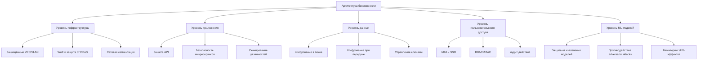
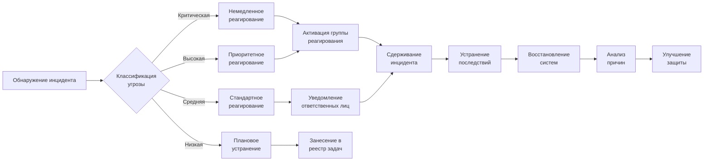

# 4.5. Безопасность данных и соответствие нормативным требованиям

## 4.5.1. Многоуровневая архитектура безопасности

## 4.5.2. Матрица соответствия регуляторным требованиям

|Нормативный стандарт|Соответствие|Ключевые реализуемые меры|
|---|---|---|
|GDPR|Полное|• Обработка данных с явного согласия • Экспорт/удаление данных по запросу • Локализация хранения в ЕС • Документированные процедуры обработки инцидентов|
|HIPAA (США)|Полное|• Защищённый доступ к PHI • Шифрование медицинских данных (AES-256) • Детальное журналирование доступа • Подписание BAA с клиентами|
|ISO 27001|Сертификация|• СУИБ с полным циклом PDCA • Регулярные аудиты (внешние и внутренние) • Формализованное управление рисками • Непрерывное улучшение процессов|
|Закон о персональных данных РФ|Полное|• Локализация данных на территории РФ • Формализованное согласие на обработку ПДн • Соответствие требованиям классов К1/К2|
|SOC 2 Type II|Планируется|• Контроль пяти принципов доверия • Независимый аудит процессов • 6-месячный период наблюдения|

## 4.5.3. Защита данных на всех этапах обработки

|Этап|Реализуемые меры|Технологические решения|KPI безопасности|
|---|---|---|---|
|Загрузка документов|• Проверка на вредоносный код • Безопасное TLS-соединение • Валидация форматов|• ClamAV/Virustotal • TLS 1.3 с ECDHE • Content validation API|• Время обнаружения угроз: <30 сек • Доля блокированных атак: >99.9%|
|Хранение|• Шифрование в покое • Изоляция данных клиентов • Резервное копирование|• AES-256 с ротацией ключей • Схема tenant-per-database • Географическое резервирование|• Время восстановления: <15 мин • Доступность данных: >99.99%|
|Обработка перевода|• Изоляция вычислительных ресурсов • Неперсистентное хранение • Контроль целостности|• Kubernetes namespaces • Ephemeral storage • Secure CI/CD pipeline|• Изоляция процессов: 100% • Полнота логирования: 100%|
|Передача результатов|• Шифрование при передаче • Подписание данных • Установка TTL|• TLS 1.3 с PFS • JWT с RS256 • Auto-purge policies|• Утечки данных: 0 • Целостность передачи: 100%|
|Постобработка|• Автоматическое удаление • Анонимизация • Сжатие|• Data retention policies • Pseudonymization • Secure deletion (NIST 800-88)|• Остаточные данные: 0 • Время очистки: <24 часа|

## 4.5.4. Матрица оценки и снижения рисков

|Риск|Вероятность|Влияние|Меры снижения|Остаточный риск|
|---|---|---|---|---|
|Утечка конфиденциальных данных|Средняя|Критическое|• Шифрование данных (AES-256) • Строгий контроль доступа • DLP-системы • Мониторинг аномалий доступа|Низкий|
|Компрометация учётных записей|Высокая|Высокое|• MFA для всех пользователей • Политики сложных паролей • Ограничение сессий • Мониторинг подозрительных действий|Низкий|
|DDoS-атаки|Высокая|Среднее|• Распределённая инфраструктура • WAF и Anti-DDoS • Автомасштабирование • Резервные каналы связи|Низкий|
|Несанкционированный доступ к моделям|Средняя|Высокое|• Запрет прямого доступа к моделям • Строгая аутентификация API • Подписание запросов • Квотирование обращений|Низкий|
|Data poisoning атаки|Низкая|Высокое|• Валидация обучающих данных • Изоляция процессов обучения • Мониторинг качества моделей • Регулярное тестирование|Очень низкий|

## 4.5.5. Защита интеллектуальной собственности

### Защита корпоративных моделей перевода

- **Технические меры**:
    
    - API с рейт-лимитами и мониторингом паттернов использования
    - Обфускация и шифрование моделей в хранилище и при обработке
    - Уникальные цифровые водяные знаки в выходных данных
    - Обнаружение попыток извлечения модели (model extraction detection)
- **Юридические меры**:
    
    - Расширенные условия лицензирования и использования
    - Отслеживание интеллектуальной собственности в переводческой отрасли
    - Патентная защита ключевых алгоритмов и методов

### Защита терминологических баз клиентов

- **Технические меры**:
    
    - Гранулярный контроль доступа к терминологическим базам (уровни: просмотр, редактирование, администрирование)
    - Изоляция клиентских терминологических данных
    - Шифрование терминологических баз уникальными ключами клиентов
    - Предотвращение извлечения полных глоссариев через API
- **Процессы защиты**:
    
    - Аудит обращений к терминологическим данным
    - Многоуровневое одобрение для экспорта терминологии
    - Версионирование и резервное копирование глоссариев
    - Цифровые водяные знаки в экспортируемых терминологических базах

## 4.5.6. Специфическая защита ML-систем

|Угроза|Механизм защиты|Технологическое решение|Измеримые показатели|
|---|---|---|---|
|Adversarial attacks|• Проверка входных данных • Устойчивые модели • Обнаружение аномалий|• Input sanitization • Adversarial training • Statistical outlier detection|• Стойкость к искажениям: до 15% • Доля обнаруженных атак: >97%|
|Model extraction|• Ограничение доступа • Обнаружение шаблонных запросов • Вариативность выходных данных|• Query limiting • Pattern detection • Controlled randomness|• Обнаружение попыток извлечения: <1000 запросов • Порог выявления: >95%|
|Data poisoning|• Проверка обучающих данных • Изолированные среды обучения • Верификация производительности|• Automated data validation • Sandboxed training • A/B testing|• Снижение эффективности атаки: >90% • Обнаружение отравленных данных: >99%|
|Model drift|• Непрерывный мониторинг • Бенчмаркинг на эталонах • Автоматическое обнаружение деградации|• Statistical process control • Canary testing • Drift detection algorithms|• MTTD деградации: <24 часа • Точность обнаружения: >95%|

## 4.5.7. Мониторинг и реагирование на инциденты

- **Количественные показатели эффективности**:
    
    - Среднее время обнаружения угрозы (MTTD): <15 минут
    - Среднее время реагирования (MTTR): <30 минут
    - Среднее время решения (MTTS): <4 часа для критических инцидентов
    - Полнота обнаружения инцидентов: >98%
- **SLA по реагированию**:
    
    - Критические инциденты: <15 минут, 24/7/365
    - Высокоприоритетные инциденты: <30 минут, 24/7/365
    - Стандартные инциденты: <4 часов в рабочее время
    - Низкоприоритетные инциденты: <24 часов в рабочее время

## 4.5.8. Стратегия аварийного восстановления

- **Целевые показатели**:
    
    - RPO (целевая точка восстановления): <5 минут
    - RTO (целевое время восстановления): <30 минут
    - Тестирование процедур восстановления: ежемесячно
    - Полное учение по восстановлению: ежеквартально
- **Ключевые компоненты стратегии**:
    
    - Multi-AZ инфраструктура с автоматическим переключением
    - Георезервирование данных с синхронной/асинхронной репликацией
    - Полная автоматизация развёртывания через IaC (Terraform/Ansible)
    - Изоляция областей отказа (failure domains)
- **Примеры сценариев восстановления**:
    

|Сценарий|Процедура восстановления|Достигаемый RPO/RTO|Последние результаты тестирования|
|---|---|---|---|
|Отказ компонента|Автоматическое переключение на резерв|RPO: 0 мин, RTO: <1 мин|Успешно (Фев 2026), RTO факт: 47 сек|
|Отказ зоны доступности|Переключение на другую зону|RPO: <1 мин, RTO: <3 мин|Успешно (Янв 2026), RTO факт: 2 мин 12 сек|
|Отказ региона|Активация резервного региона|RPO: <5 мин, RTO: <15 мин|Успешно (Дек 2025), RTO факт: 11 мин 38 сек|
|Полная компрометация|Разворачивание изолированной среды|RPO: <30 мин, RTO: <2 ч|Симулировано (Ноя 2025), RTO факт: 1 ч 45 мин|

## 4.5.9. Независимая верификация безопасности

- **Программа Bug Bounty**:
    
    - Запуск: Q3 2026
    - Платформа: HackerOne
    - Вознаграждения: $500-$10,000 в зависимости от критичности
    - Периметр тестирования: API, веб-интерфейс, инфраструктура
- **График внешних проверок**:
    
    - Ежеквартальный пентест (Black Box)
    - Полугодовой аудит кода ключевых компонентов
    - Ежегодная полная проверка безопасности (Red Team)
    - Непрерывное сканирование уязвимостей инфраструктуры
- **Сравнение с конкурентами**:
    

| Аспект безопасности          | Наша система                  | DeepL         | SYSTRAN                          | Omniscient                | SDL Trados                   |
| ---------------------------- | ----------------------------- | ------------- | -------------------------------- | ------------------------- | ---------------------------- |
| Шифрование данных            | E2E + в покое (AES-256)       | Только TLS    | E2E для Enterprise               | Базовое шифрование        | В покое для локальных версий |
| Соответствие GDPR            | Полное, с локализацией данных | Частичное     | Полное для Enterprise            | Заявлено соответствие     | Частичное соответствие       |
| Защита от ML-атак            | Комплексная                   | Базовая       | Ограниченная                     | Минимальная               | Не реализована               |
| Изоляция клиентских данных   | Полная                        | Частичная     | Полная для локальных инсталляций | Полная (локальная модель) | Полная для локальных версий  |
| Независимая верификация      | Регулярная                    | Периодическая | Для Enterprise версий            | Отсутствует               | Для серверных версий         |
| Локальное развёртывание      | Доступно                      | Недоступно    | Полное                           | Основная модель           | Полное                       |
| Защита терминологических баз | Многоуровневая                | Базовая       | Продвинутая                      | Базовая                   | Продвинутая                  |
| Аудит безопасности           | Полный с отчётностью          | Ограниченный  | Для корпоративных клиентов       | Отсутствует               | По запросу                   |

## 4.5.10. Дорожная карта по сертификациям и аудитам

|Период|Сертификация/Аудит|Статус|Примечание|
|---|---|---|---|
|Q1 2026|Внутренний аудит безопасности|Запланирован|Подготовка к ISO 27001|
|Q2 2026|ISO 27001|Запланирован|Фокус на процессы СУИБ|
|Q3 2026|SOC 2 Type I|Запланирован|Оценка дизайна контролей|
|Q4 2026|Penetration Testing|Запланирован|Внешняя компания уровня CREST|
|Q1 2027|GDPR Compliance Audit|Запланирован|Внешний DPO для аудита|
|Q2 2027|HIPAA Compliance Assessment|Запланирован|Для медицинского сектора|
|Q3 2027|SOC 2 Type II|Запланирован|6-месячное наблюдение|
|Q4 2027|ISO 27701 (Privacy)|Планируется|Расширение ISO 27001|

Система машинного перевода проектируется на основе принципа "безопасность на всех уровнях", с особым вниманием к защите данных клиентов, специфике безопасности ML-моделей и соответствию жёстким регуляторным требованиям высокорегулируемых отраслей. Количественные показатели эффективности систем безопасности, регулярная независимая проверка и гибкая архитектура позволяют адаптироваться к изменяющимся угрозам, обеспечивая долгосрочную защиту инвестиций клиентов.