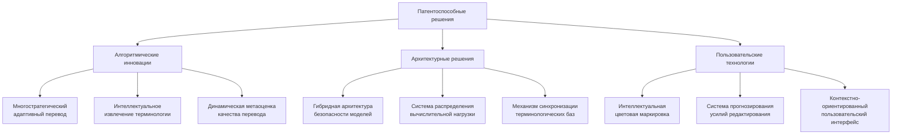
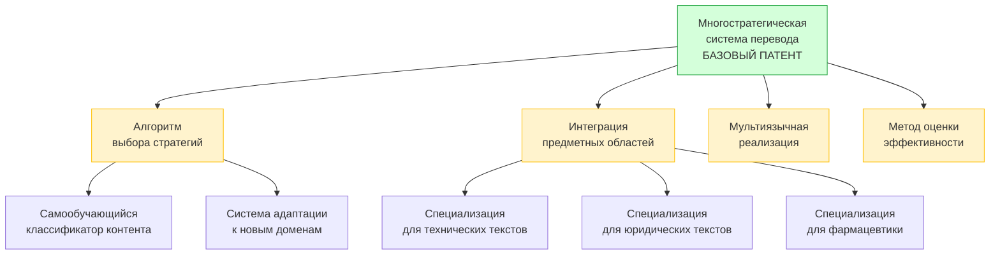

## Ключевые инновационные технологии с потенциалом патентования

## Детализация ключевых патентных решений

### 1. Многостратегическая система адаптивного перевода

**Конкурентное преимущество:** Повышение качества перевода на 15-25% для технических отраслей

**Техническая детализация:**

- **Структура системы:** Многоступенчатый конвейер анализа характеристик текста с последующим выбором оптимальной стратегии перевода
- **Ключевые компоненты:**
    1. Классификатор синтаксической сложности (использует метрики глубины синтаксического дерева и нестандартных конструкций)
    2. Анализатор терминологической плотности (≥4 термина на 100 слов активирует терминологически-центрированный подход)
    3. Определитель оптимальной стратегии перевода на основе композитного скора
    4. Исполнитель выбранной стратегии с динамической корректировкой

**Классы МПК:** G06F 17/28, G06N 3/00, G06N 20/00

**Ближайшие аналоги и отличия:**

|Аналог|Патентообладатель|Ключевые отличия нашего решения|
|---|---|---|
|US10417350B2|Google LLC|Наша система использует не только выбор модели, а полностью разные стратегии перевода; учитывает специфику технических текстов|
|EP3793748A1|Microsoft|Наш подход сфокусирован на отраслевой специфике; использует композитную оценку стратегий; адаптирует процесс в реальном времени|

**Статус:** Проведён патентный поиск; подготовка спецификации (Q2 2026)

### 2. Алгоритм контекстно-зависимого извлечения терминологии

**Конкурентное преимущество:** Снижение времени на создание глоссариев на 40-60%, точность до 94-97%

**Техническая детализация:**

- **Алгоритмическая схема:**
    1. Статистический анализ n-грамм с алгоритмом C-value/NC-value
    2. Синтаксически-управляемое извлечение именных групп
    3. Нейросетевая классификация кандидатов-терминов с использованием BERT-подобной архитектуры
    4. Проверка контекстуальной релевантности с использованием семантических векторов
    5. Автоматическая валидация через внешние отраслевые глоссарии

**Классы МПК:** G06F 17/27, G06F 17/28, G06N 5/04

**Ближайшие аналоги и отличия:**

| Аналог          | Патентообладатель | Ключевые отличия нашего решения                                                                 |
| --------------- | ----------------- | ----------------------------------------------------------------------------------------------- |
| US20190303298A1 | IBM               | Наш подход использует многоуровневый контекстный анализ; интегрирует отраслевые онтологии       |
| CN112784456A    | Tencent           | Наша система применяет гибридный метод с учетом отраслевой специфики, значительно выше точность |

**Статус:** Прототип разработан; финализация патентной заявки (Q3 2026)

## Стратегия "патентного зонтика" для ключевых технологий

## Экономический анализ патентного портфолио

|Категория затрат|Первый год|3 года|5 лет|Примечания|
|---|---|---|---|---|
|Подготовка и подача заявок|$120K|$250K|$380K|8-10 первичных патентов, 15-20 производных|
|Поддержание патентов|$15K|$85K|$180K|Включая поддержание в нескольких юрисдикциях|
|Юридическое сопровождение|$80K|$180K|$280K|Реагирование на возражения экспертизы, консультации|
|**Итого затраты**|$215K|$515K|$840K||
|**Прогнозируемый доход от лицензирования**|$150K|$1.2M|$3.5M|С учетом постепенного роста портфеля|
|**Оценочная стоимость портфеля как актива**|$1.5M|$4.8M|$12M|Консервативная оценка на основе дисконтированных будущих доходов|
|**ROI (5-летний период)**|||316%|С учетом роста ценности портфеля|

## Комбинированные патенты и системные решения

|Комбинированное решение|Компоненты|Синергетический эффект|Сложность обхода конкурентами|
|---|---|---|---|
|**Интегрированная система управления терминологией и перевода**|• Извлечение терминологии • Многостратегический перевод • Синхронизация терминологических баз|Повышение точности специализированного перевода на 35-45% по сравнению с независимым использованием компонентов|Высокая|
|**Система предиктивного управления качеством**|• Метаоценка качества • Цветовая маркировка • Прогнозирование усилий|Снижение времени постредактирования на 45-55% по сравнению с последовательным применением технологий|Средняя-высокая|
|**Безопасная распределённая система перевода**|• Безопасность моделей • Балансировка нагрузки • Многостратегический перевод|Снижение TCO на 40-50% при сохранении высокого уровня защиты и производительности|Очень высокая|

## Стратегия защиты непатентуемых ноу-хау

|Категория ноу-хау|Стратегия защиты|Обоснование|
|---|---|---|
|Алгоритмы обучения моделей|Коммерческая тайна + "черный ящик"|Быстрое изменение технологий делает патентование менее эффективным; сложность обратного инжиниринга|
|Эвристики настройки процессов|Коммерческая тайна|Параметры и эвристики сложно выявить путем анализа работы системы|
|Высокооптимизированные векторные операции|Обфускация кода|Специфические оптимизации создают конкурентное преимущество в производительности|
|Метрики качества перевода|Частичное патентование + коммерческая тайна|Патентование общего метода с сохранением точных коэффициентов и формул в тайне|

## Подробный график патентования высокоприоритетных решений

|Этап|Многостратегический перевод|Извлечение терминологии|Метаоценка качества|
|---|---|---|---|
|Подготовка спецификации|Q1 2026|Q2 2026|Q2 2026|
|Внутренняя экспертиза|Q2 2026|Q2 2026|Q3 2026|
|Первичная подача (приоритетная дата)|Q2 2026|Q3 2026|Q3 2026|
|Подача PCT заявки|Q1 2027|Q2 2027|Q2 2027|
|Вход в национальные фазы|Q3 2028|Q4 2028|Q4 2028|
|Ожидаемая выдача первых патентов|Q1 2029|Q2 2029|Q3 2029|
|Подача производных заявок|Q3 2026 - Q2 2027|Q4 2026 - Q3 2027|Q1 2027 - Q4 2027|

## Связь патентной стратегии с бизнес-моделью

|Бизнес-аспект|Роль патентного портфолио|Ожидаемый эффект|
|---|---|---|
|Ценовая политика|Обоснование премиальных цен для защищенных патентами функций|Повышение средней цены на 25-35%|
|Привлечение инвестиций|Демонстрация уникальных активов и технологического преимущества|Повышение оценки компании на 15-25% при инвестиционных раундах|
|Барьеры входа|Создание патентных барьеров на ключевых рынках|Задержка появления прямых конкурентов на 18-24 месяца|
|Стратегия выхода|Повышение привлекательности для потенциальных приобретателей|Увеличение возможной цены приобретения на 30-40%|
|Доверие клиентов|Демонстрация технологического лидерства и стабильности|Сокращение цикла продаж на 15-20%|

## Стратегические партнерства в области интеллектуальной собственности

| Тип партнерства                    | Потенциальные партнеры                                                                      | Ожидаемые преимущества                                                                  |
| ---------------------------------- | ------------------------------------------------------------------------------------------- | --------------------------------------------------------------------------------------- |
| Перекрестное лицензирование        | • САТ-разработчики (SDL/RWS, MemoQ) • Поставщики корпоративных TMS-систем                | Расширение функциональности без прямой конкуренции; доступ к смежным технологиям        |
| Совместная разработка              | • Исследовательские институты (ILMT, MMCI) • Корпоративные R&D центры в смежных областях | Доступ к исследовательским ресурсам; разделение затрат на R&D                           |
| Открытые инновации с ограничениями | • Отраслевые консорциумы • Академические партнеры                                        | Ускорение развития базовых технологий при сохранении контроля над ключевыми инновациями |

## Риски и стратегии митигации

| Патентный риск                              | Вероятность | Влияние     | Стратегия митигации                                                                                                                                                                              |
| ------------------------------------------- | ----------- | ----------- | ------------------------------------------------------------------------------------------------------------------------------------------------------------------------------------------------ |
| Отказ в выдаче патента                      | Средняя     | Высокое     | • Многоуровневая стратегия с основными и резервными формулировками • Разделение сложных заявок на отдельные компоненты • Привлечение специализированных патентных поверенных с опытом в ML |
| Появление аналогичных решений до публикации | Средняя     | Высокое     | • Ускоренная подача предварительных заявок • Постоянный мониторинг патентных публикаций • Подготовка альтернативных технических решений                                                    |
| Сложности с международной защитой           | Высокая     | Среднее     | • Поэтапное патентование с приоритизацией рынков • Адаптация формулировок с учетом региональной специфики • Формирование патентных кластеров для защиты разных аспектов технологии         |
| Патентные иски от конкурентов               | Низкая      | Критическое | • Предварительный FTO-анализ (Freedom to Operate) • Разработка обходных технических решений • Формирование защитного патентного портфеля                                                   |
| Быстрое устаревание технологий              | Средняя     | Среднее     | • Патентование методов, а не конкретных реализаций • Регулярное обновление и расширение патентного портфеля • Сбалансированная стратегия "патент vs. коммерческая тайна"                   |

Развитие портфеля патентоспособных решений является ключевым элементом долгосрочной стратегии компании по защите интеллектуальной собственности и обеспечению конкурентного преимущества. Комбинирование патентной защиты с защитой ноу-хау позволит создать многоуровневый барьер для конкурентов, обеспечивая устойчивое технологическое лидерство в сфере специализированного машинного перевода.