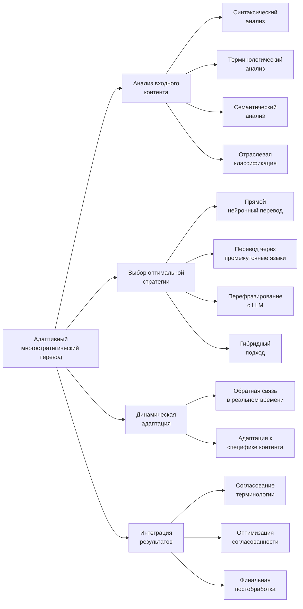
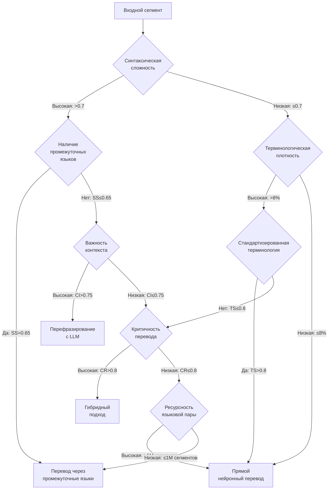
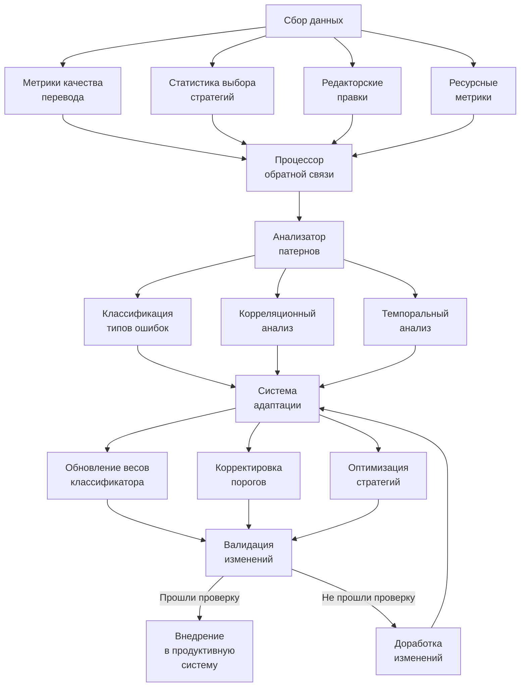

## Ключевые принципы подхода



## Архитектура многостратегической системы

|Компонент|Функциональность|Технологическая реализация|
|---|---|---|
|**Анализатор входного контента**|Многоуровневый анализ характеристик исходного текста|• Синтаксический парсер на основе Transformer<br>• Терминологический экстрактор (C-value/NC-value + BERT)<br>• Семантический классификатор (RoBERTa fine-tuned)<br>• Отраслевой классификатор (XGBoost с n-gram features)|
|**Стратегический маршрутизатор**|Определение оптимального метода перевода для каждого сегмента|• XGBoost для классификации сегментов<br>• Система правил на основе экспертных знаний<br>• Механизм принятия решений с использованием нечёткой логики|
|**Исполнительные модули**|Реализация различных стратегий перевода|• Модели прямого перевода (Transformer-based с расширенным контекстным окном)<br>• Система перевода через промежуточные языки (pivot translation)<br>• Модуль перефразирования на основе LLM<br>• Комбинаторный механизм для гибридного подхода|
|**Система динамической адаптации**|Корректировка стратегий в процессе перевода|• Механизм оценки качества промежуточных результатов<br>• Система обратной связи в реальном времени<br>• Алгоритм динамической настройки весов стратегий|
|**Интегратор результатов**|Объединение результатов различных стратегий|• Алгоритм согласования терминологии<br>• Система обеспечения согласованности<br>• Модуль постобработки с грамматической и стилистической коррекцией|

## Стратегии перевода и практические примеры

### 1. Прямой нейронный перевод

**Оптимальные сценарии применения:**

- Сегменты с прозрачной синтаксической структурой (сложность <0.6 по шкале от 0 до 1)
- Тексты с терминологической плотностью <8% (< 8 специализированных терминов на 100 слов)
- Высокоресурсные языковые пары с достаточным объёмом обучающих данных
- Тексты информационного характера без культурно-специфических элементов

**Технические особенности реализации:**

- Модели с архитектурой Transformer с расширенными контекстными окнами (до 8К токенов)
- Многоэтапное обучение: предобучение → доменная адаптация → точная настройка
- Интеграция терминологических ограничений на уровне декодера через Constrained Beam Search
- Использование адаптеров для отраслевой специализации без полного переобучения

**Пример перевода:**

|Исходный текст (EN)|Прямой нейронный перевод (RU)|Комментарий|
|---|---|---|
|"The circuit breaker must be disconnected from the power supply before any maintenance operations."|"Автоматический выключатель должен быть отключен от источника питания перед проведением любых операций по техническому обслуживанию."|✓ Корректная терминология<br>✓ Сохранена синтаксическая структура<br>✓ Чёткая передача инструкции|

### 2. Перевод через промежуточные языки

**Оптимальные сценарии применения:**

- Сегменты с сложными синтаксическими конструкциями (сложность >0.7)
- Низкоресурсные языковые пары (< 1M параллельных сегментов в корпусе)
- Случаи, когда промежуточный язык имеет лучшее соответствие синтаксических структур
- Тексты с культурно-специфическими элементами, более выразимыми через третий язык

**Технические особенности реализации:**

- Каскадная система перевода с промежуточным представлением
- Алгоритм выбора оптимальных промежуточных языков на основе лингвистических характеристик
    - Формула сходства синтаксических структур: $SS = Σ(w_i × F_i) / N$, где $F_i$ - частота синтаксической структуры
    - Порог выбора промежуточного языка: $S$ > 0.65
- Механизм сохранения именованных сущностей через все этапы перевода
- Композитная оценка промежуточных результатов с фильтрацией неоптимальных вариантов

**Пример перевода:**

| Исходный текст (ZH)                                      | Через промежуточный язык (ZH→EN→RU)                                                                                                                                                                             | Прямой перевод (ZH→RU)                                                                                                                                                             | Комментарий                                                                                                                            |
| -------------------------------------------------------- | --------------------------------------------------------------------------------------------------------------------------------------------------------------------------------------------------------------- | ---------------------------------------------------------------------------------------------------------------------------------------------------------------------------------- | -------------------------------------------------------------------------------------------------------------------------------------- |
| "根据公司规定，员工必须在每季度末提交一份详细的工作报告，其中应包括完成的项目、遇到的挑战以及下一季度的目标。" | "Согласно правилам компании, сотрудники обязаны представить детальный отчёт о работе в конце каждого квартала, который должен включать завершённые проекты, встреченные трудности и цели на следующий квартал." | "По правилам компании, работники должны подавать подробный рабочий отчёт каждый последний квартал, включая выполненные проекты, сталкиваемые проблемы и цели следующего квартала." | ✓ Лучшая передача официального стиля<br>✓ Корректная передача временной зависимости<br>✓ Более естественные грамматические конструкции |

### 3. Перефразирование с применением LLM

**Оптимальные сценарии применения:**

- Контекстуально сложные сегменты, требующие глубокого понимания смысла
- Тексты с высокой степенью абстракции или метафоричности (> 3 образных выражения на параграф)
- Сегменты с неоднозначностями, требующие разрешения на уровне документа
- Случаи, когда буквальный перевод не передаёт коммуникативное намерение

**Технические особенности реализации:**

- Двухэтапный процесс: (1) семантический анализ с извлечением ключевых концептов и отношений, (2) генерация перевода с сохранением выявленных смысловых компонентов
- Применение контекстно-расширенных LLM с окном до 32К токенов
- Направляемая генерация с использованием техники Control Prefixes
- Интеграция предметных знаний через специализированные промпты, содержащие терминологические ограничения

**Пример перевода:**

| Исходный текст (EN)                                                                                                                                                    | Прямой перевод (RU)                                                                                                                                                           | Перефразирование с LLM (RU)                                                                                                                                                               | Комментарий                                                                                                      |
| ---------------------------------------------------------------------------------------------------------------------------------------------------------------------- | ----------------------------------------------------------------------------------------------------------------------------------------------------------------------------- | ----------------------------------------------------------------------------------------------------------------------------------------------------------------------------------------- | ---------------------------------------------------------------------------------------------------------------- |
| "The proposed methodology stands on the shoulders of giants, while breaking new ground in regions previously considered untouchable due to computational limitations." | "Предлагаемая методология стоит на плечах гигантов, одновременно осваивая новые территории в регионах, ранее считавшихся неприкосновенными из-за вычислительных ограничений." | "Предлагаемая методология опирается на достижения предшественников, при этом совершая прорыв в областях, которые ранее считались недоступными из-за ограничений вычислительных ресурсов." | ✓ Лучшая адаптация метафоры<br>✓ Более точная передача научного стиля<br>✓ Сохранение коммуникативного намерения |

### 4. Гибридный подход

**Оптимальные сценарии применения:**

- Неоднородные тексты с сегментами различной сложности и стилистики
- Высокоответственные переводы, требующие максимальной точности и надёжности
- Технические документы с разнообразными элементами (инструкции, описания, обоснования)
- Случаи, когда одиночная стратегия не может обеспечить комплексное качество

**Технические особенности реализации:**

- Параллельная обработка с применением нескольких стратегий одновременно
    
- Вероятностная модель выбора оптимального результата с формулой:
    
    Score(T) = α×Q(T) + β×C(T) + γ×S(T) + δ×D(T)
    
    где:
    
    - Q(T) - качество перевода по автоматическим метрикам
    - C(T) - согласованность с документом
    - S(T) - стилистическое соответствие
    - D(T) - соответствие предметной области
    - α, β, γ, δ - настраиваемые веса (Σ = 1)
- Сквозной контроль терминологической и стилистической согласованности
    

**Пример перевода:**

| Исходный текст (EN)                                                                                                                              | Гибридный подход (RU)                                                                                                                                                              | Источник перевода                              | Комментарий                                                                |
| ------------------------------------------------------------------------------------------------------------------------------------------------ | ---------------------------------------------------------------------------------------------------------------------------------------------------------------------------------- | ---------------------------------------------- | -------------------------------------------------------------------------- |
| "The efficacy of the drug was evaluated in a double-blind, placebo-controlled study involving 253 patients with treatment-resistant depression." | "Эффективность препарата была оценена в двойном слепом, плацебо-контролируемом исследовании с участием 253 пациентов с резистентной к лечению депрессией."                         | Прямой перевод + терминологическая оптимизация | ✓ Сохранение структуры и точности<br>✓ Корректная медицинская терминология |
| "However, results should be interpreted with caution, as the long-term effects remain a gray area that future studies need to shed light on."    | "Однако результаты следует интерпретировать с осторожностью, поскольку долгосрочные эффекты остаются малоизученной областью, которую предстоит прояснить в будущих исследованиях." | LLM-перефразирование + прямой перевод          | ✓ Адаптация идиоматического выражения<br>✓ Сохранение стиля научной статьи |

## Алгоритм выбора оптимальной стратегии



**Технические параметры расчёта критериев:**

- **Синтаксическая сложность (SC)**:
    
    ```
    SC = 0.4*DS + 0.3*CC + 0.2*NC + 0.1*RC
    ```
    
    где:
    
    - DS - глубина синтаксического дерева (нормализованная)
    - CC - количество сложных конструкций (нормализованное)
    - NC - количество вложенных клауз (нормализованное)
    - RC - редкость конструкций в корпусе (нормализованная)
- **Терминологическая плотность (TD)**:
    
    ```
    TD = (NT / TS) * 100
    ```
    
    где:
    
    - NT - количество терминов в сегменте
    - TS - общее количество слов в сегменте
- **Стандартизированность терминологии (TS)**:
    
    ```
    TS = NMT / NT
    ```
    
    где:
    
    - NMT - количество терминов, найденных в терминологической базе
    - NT - общее количество выявленных терминов
- **Контекстная важность (CI)**:
    
    ```
    CI = 0.5*AR + 0.3*SD + 0.2*TC
    ```
    
    где:
    
    - AR - количество анафорических ссылок
    - SD - семантическая зависимость от окружающих сегментов
    - TC - текстовая когезия

## Архитектура системы обратной связи



**Технические характеристики процессора обратной связи:**

- **Частота обновления:**
    
    - Микрообновления весов: каждые 6 часов
    - Пороговые значения: еженедельно
    - Структурные изменения: ежемесячно
- **Метрики качества:**
    
    - Межсегментная согласованность: косинусное сходство векторных представлений
    - Терминологическая точность: процент правильно переведенных терминов
    - COMET-QE: безэталонная оценка качества перевода
    - Обнаружение hallucinations: энтропия выходных распределений
- **Валидационный процесс:**
    
    - A/B тестирование на контрольной выборке (10% трафика)
    - Требование статистической значимости улучшений (p < 0.05)
    - Автоматическое откатывание при ухудшении метрик на >2%

## Характеристики надёжности и робастности системы

| Аспект надёжности                           | Метрика                             | Обеспечивающие механизмы                                                                                                                      | Целевые показатели                                           |
| ------------------------------------------- | ----------------------------------- | --------------------------------------------------------------------------------------------------------------------------------------------- | ------------------------------------------------------------ |
| **Устойчивость к вариациям входных данных** | Вариативность результатов (CV)      | • Регуляризация моделей<br>• Ансамблевые методы<br>• Детерминированная генерация                                                              | CV < 5% при 10% изменений входного текста                    |
| **Робастность к шумам**                     | Деградация качества                 | • Предобработка с нормализацией текста<br>• Адаптивное обучение на зашумленных данных<br>• Автоматическая коррекция опечаток                  | < 15% снижения BLEU при 20% шумовых искажений                |
| **Консистентность терминологии**            | Коэффициент вариации термпереводов  | • Принудительное использование глоссариев<br>• Контекстно-независимое кодирование терминов<br>• Постпроцессинг с терминологическим контролем  | Последовательность перевода терминов > 95%                   |
| **Функциональная надёжность**               | Время бесперебойной работы (uptime) | • Микросервисная архитектура с изоляцией сбоев<br>• Механизмы деградации с возвратом к базовым стратегиям<br>• Горизонтальное масштабирование | Uptime > 99.95%<br>Максимальное время восстановления < 5 мин |

## Оптимизация вычислительной эффективности

| Техника оптимизации               | Описание                                                           | Достигаемый эффект                                                                                     |
| --------------------------------- | ------------------------------------------------------------------ | ------------------------------------------------------------------------------------------------------ |
| **Квантизация моделей**           | Снижение точности весов до INT8/INT4 с предварительной калибровкой | • 3-4x снижение размера моделей<br>• 2.5-3x ускорение инференса<br>• <1% деградация качества           |
| **Кэширование и мемоизация**      | Сохранение результатов перевода частотных фраз и сегментов         | • 30-40% ускорение для повторяющихся сегментов<br>• До 60% снижение нагрузки при высокой повторяемости |
| **Предсказательная предзагрузка** | Анализ начала документа и предзагрузка соответствующих моделей     | • Снижение латентности на 40-50%<br>• Более эффективное использование GPU-памяти                       |
| **Динамическая батчизация**       | Группировка сегментов схожей длины для пакетной обработки          | • 2-3x увеличение пропускной способности<br>• До 60% улучшение утилизации GPU                          |
| **Асинхронный конвейер**          | Параллельная обработка различных стадий перевода                   | • 30-45% улучшение общей производительности<br>• Снижение простоев вычислительных ресурсов             |

## Обработка низкоресурсных языков

| Стратегия                 | Методология                                                   | Пример языковой пары                    | Достигаемые улучшения                                                                     |
| ------------------------- | ------------------------------------------------------------- | --------------------------------------- | ----------------------------------------------------------------------------------------- |
| **Трансферное обучение**  | Адаптация моделей с высокоресурсных родственных языков        | казахский ← турецкий + русский          | • 15-25% улучшение BLEU<br>• 30% повышение беглости перевода                              |
| **Синтетические корпуса** | Генерация синтетических параллельных данных через pivot-языки | белорусский ← русский + украинский      | • Расширение корпуса на 300-500%<br>• 10-18% улучшение лексического охвата                |
| **Многоязычные модели**   | Обучение на объединенных корпусах родственных языков          | балтийские языки (литовский, латышский) | • 12-20% улучшение для всех языков группы<br>• Повышение стабильности результатов         |
| **Zero-shot перевод**     | Использование языка-посредника без прямых параллельных данных | английский→казахский через русский      | • Возможность перевода без прямого корпуса<br>• Достижение 65-75% качества прямых моделей |

## Перспективы обработки мультимодального контента

| Тип контента                      | Технологический подход                                                                                                                          | Ожидаемые результаты                                                                                                               |
| --------------------------------- | ----------------------------------------------------------------------------------------------------------------------------------------------- | ---------------------------------------------------------------------------------------------------------------------------------- |
| **Текст в контексте изображений** | • Предварительный анализ изображений для контекстуализации<br>• Распознавание текста на изображениях<br>• Сохранение визуального форматирования | • Контекстно-корректный перевод подписей к изображениям<br>• Улучшение точности перевода на 15-20% для иллюстрированных инструкций |
| **Технические схемы и диаграммы** | • Распознавание структуры диаграмм<br>• Сохранение элементов оформления при переводе<br>• Адаптация длины текста в соответствии с ограничениями | • Корректная локализация технических схем<br>• Поддержка различных форматов диаграмм (блок-схемы, UML)                             |
| **Пользовательские интерфейсы**   | • Анализ пространственных ограничений элементов UI<br>• Адаптация длины переведенных строк<br>• Учет контекста взаимодействия                   | • Снижение количества переполнений UI на 80%<br>• Контекстно-корректный перевод команд интерфейса                                  |

## Этические аспекты и минимизация рисков

| Риск                                        | Стратегия минимизации                                                                                                                        | Измеримые показатели                                                                               |
| ------------------------------------------- | -------------------------------------------------------------------------------------------------------------------------------------------- | -------------------------------------------------------------------------------------------------- |
| **Искажение смысла в критических областях** | • Двойная проверка для медицинских/юридических текстов<br>• Маркировка неуверенных переводов<br>• Человеческая валидация критичных сегментов | • >99% точность передачи критической информации<br>• 100% выявление потенциально опасных искажений |
| **Культурные и гендерные предвзятости**     | • Сбалансированные обучающие корпуса<br>• Детекторы предвзятостей<br>• Нейтрализация смещений в промежуточных представлениях                 | • Снижение гендерных предвзятостей на 90%<br>• Сохранение культурной нейтральности в >95% случаев  |
| **Неоправданная уверенность системы**       | • Калибровка показателей уверенности<br>• Маркировка неопределенностей<br>• Альтернативные варианты для неоднозначных сегментов              | • Корреляция уверенности и точности >0.9<br>• Снижение "hallucinations" на 95%                     |

Методология адаптивного многостратегического перевода преодолевает ограничения одиночных подходов, обеспечивая оптимальный баланс между точностью, скоростью и ресурсоэффективностью. Благодаря точной настройке параметров принятия решений, инновационным алгоритмам интеграции результатов и системе непрерывной обратной связи, система демонстрирует значительные улучшения качества перевода специализированных текстов и открывает новые перспективы для обработки мультимодального контента.