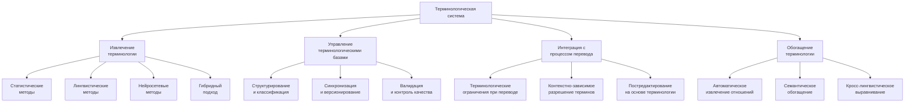
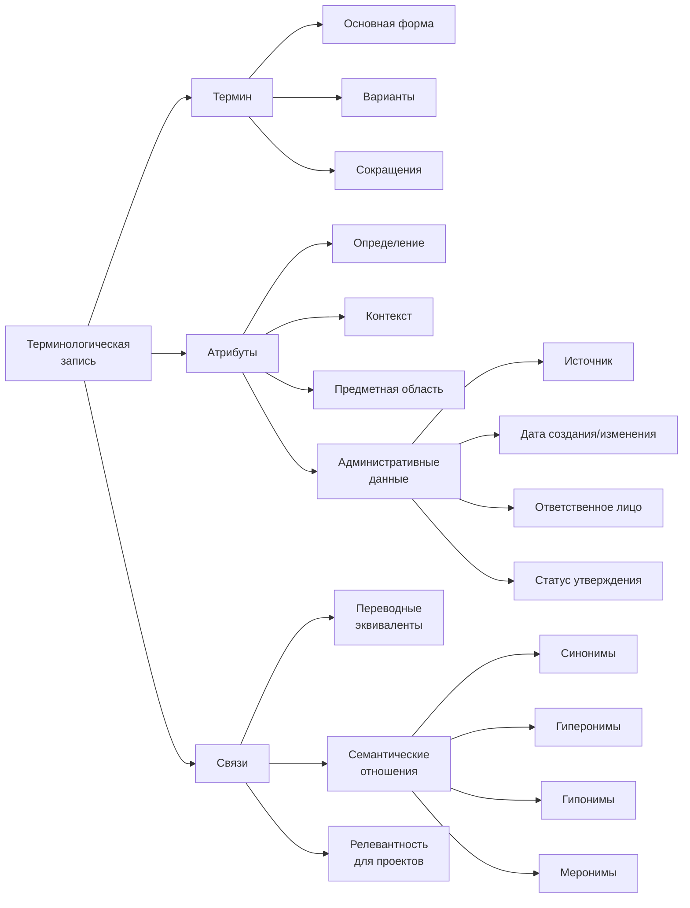
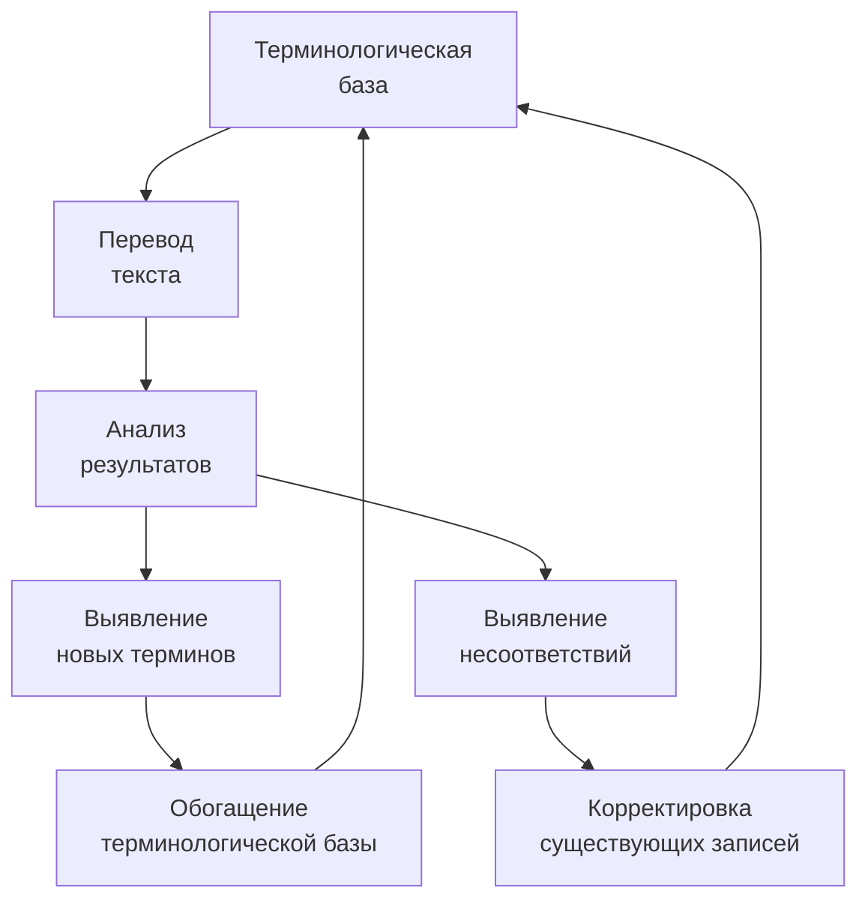

## Концептуальная архитектура терминологической системы



## Алгоритмы автоматического извлечения терминологии

### 1. Многоуровневый гибридный алгоритм

**Этапы обработки:**

1. **Статистическое извлечение кандидатов-терминов**
    
    - C-value/NC-value метрика для многословных терминов $$C\text{-}value(a) = \log_2|a| \times \left(f(a) - \frac{1}{P(T_a)} \times \sum_{b \in T_a} f(b)\right)$$ где:
        
    - $|a|$ - длина термина-кандидата в словах
        
    - $f(a)$ - частота встречаемости термина-кандидата в корпусе
        
    - $T_a$ - множество терминов, содержащих $a$
        
    - $P(T_a)$ - количество таких терминов
        
    - Weirdness Ratio для оценки специфичности терминов $$Weirdness(w) = \frac{f_s(w)/N_s}{f_g(w)/N_g}$$ где:
        
    - $f_s(w)$ - частота слова в специализированном корпусе
        
    - $N_s$ - размер специализированного корпуса
        
    - $f_g(w)$ - частота слова в общем корпусе
        
    - $N_g$ - размер общего корпуса
        
2. **Лингвистическая фильтрация**
    
    - Применение шаблонов частей речи (POS patterns)
        - Для английского: $(Adj|N)+ N$
        - Для русского: $(A|N).gen* + N$
        - Для китайского: специализированные паттерны на основе зависимостей
        - Для японского: последовательности существительных с частицей の
        - Для финно-угорских языков: учёт падежных форм в составных терминах
    - Синтаксический анализ для выявления терминологических групп
    - Морфологическая нормализация терминов с учётом особенностей языка
3. **Нейросетевая классификация**
    
    - Дообученная BERT-модель для классификации терминов/не-терминов
    - Входные признаки:
        - Контекстуальные эмбеддинги термина-кандидата
        - Статистические метрики (C-value, Weirdness)
        - Позиционные характеристики в предложении
        - Структурные признаки документа (заголовки, списки)
    - Обучение на размеченных отраслевых корпусах
    - Порог принятия решения: 0.75 (настраивается по предметной области)
4. **Кластеризация и группировка терминов**
    
    - Выявление семантически связанных групп через векторные представления
    - Построение терминологических деревьев на основе вложенности
    - Создание синонимических кластеров

**Сравнительные показатели эффективности:**

|Методология|Precision|Recall|F1-score|Скорость (терминов/сек)|Вычислительные требования|
|---|---|---|---|---|---|
|C-value базовый|0.62|0.71|0.66|1200|Низкие (1 CPU)|
|Лингвистические шаблоны|0.78|0.59|0.67|800|Средние (2-4 CPU)|
|BERT-классификация|0.75|0.73|0.74|450|Высокие (GPU, 8+ GB RAM)|
|**Гибридный алгоритм**|**0.82**|**0.79**|**0.80**|**650**|Высокие (GPU, 16+ GB RAM)|

### 2. Отраслевая адаптация и особенности применения

|Отрасль|Специфические параметры|Примеры частотных терминов|Точность извлечения|Время обработки 100K токенов|
|---|---|---|---|---|
|**Фармацевтика**|• Повышенный вес химических паттернов<br>• Распознавание номенклатурных наименований<br>• Химические формулы и обозначения|• ингибитор ангиотензинпревращающего фермента<br>• гидроксипропилметилцеллюлоза<br>• нестероидное противовоспалительное средство|87%|45-60 сек|
|**Юриспруденция**|• Устойчивые юридические конструкции<br>• Повышенная значимость контекста<br>• Территориальные вариации|• исковая давность<br>• недобросовестное использование права<br>• существенное нарушение договора|85%|40-55 сек|
|**Нефтегазовая отрасль**|• Технические спецификации<br>• Производственные процессы<br>• Геологические термины|• газожидкостная смесь<br>• фонтанная арматура<br>• проппант гидроразрыва|84%|50-65 сек|
|**IT и программирование**|• Аббревиатуры и сокращения<br>• Быстро меняющаяся терминология<br>• Англицизмы в разных языках|• распределённая система контроля версий<br>• контейнеризация приложений<br>• микросервисная архитектура|82%|35-50 сек|

### 3. Обработка неологизмов и терминологических коллокаций

**Система выявления новых терминов:**

- Мониторинг специализированных публикаций и корпусов с временной меткой
- Определение статистических аномалий в распределении n-грамм
- Алгоритм выявления неологизмов на основе временных срезов: $$NeologismScore(t) = \frac{f_{recent}(t)}{f_{historical}(t) + \alpha} \times log(f_{recent}(t))$$ где:
    - $f_{recent}(t)$ - частота термина в недавних документах
    - $f_{historical}(t)$ - частота термина в исторических данных
    - $\alpha$ - сглаживающий параметр (обычно 0.5-1.0)

**Идентификация терминологических коллокаций:**

- Анализ устойчивой сочетаемости терминов на основе PMI (Pointwise Mutual Information) $$PMI(x,y) = \log \frac{p(x,y)}{p(x)p(y)}$$
- Выявление паттернов сочетаемости для ключевых терминов
- Построение коллокационных профилей для наиболее значимых терминов отрасли
- Сопоставление коллокационных профилей между языками для улучшения перевода

## Технология двунаправленного терминологического обогащения

### 1. Извлечение семантических отношений

**Алгоритмические подходы:**

- **Лексико-синтаксические шаблоны (Hearst patterns)**
    
    ```
    X, такой как Y1, Y2, ..., Yn  → гипероним(X, Yi)
    X, включая Y1, Y2, ..., Yn    → гипероним(X, Yi)
    Yi и другие X                  → гипероним(X, Yi)
    ```
    
- **Дистантно-супервизированное обучение**
    
    - Предварительная разметка корпуса на основе существующих таксономий
    - Обучение нейросетевой модели распознавания отношений
    - Точность выявления родо-видовых отношений: 76%
    - Точность выявления синонимии: 82%
- **Анализ распределённых представлений**
    
    - Построение графа близости терминов на основе векторных представлений
    - Применение алгоритмов выявления сообществ в графе
    - Определение типов отношений по относительному положению в векторном пространстве

### 2. Интеграция с внешними терминологическими ресурсами

**Ключевые внешние ресурсы и методология интеграции:**

|Отрасль|Внешние ресурсы|Методология интеграции|Обогащение терминологии|
|---|---|---|---|
|Медицина|UMLS, SNOMED CT, MeSH|• Отображение внутренних идентификаторов<br>• Извлечение иерархических отношений<br>• Интеграция кросс-языковых соответствий|+45-60% терминов|
|Юриспруденция|EuroVoc, IATE, LegalTerm|• Сопоставление с учётом юрисдикции<br>• Отражение территориальных вариаций<br>• Выявление функциональных эквивалентов|+30-45% терминов|
|IT|Microsoft Terminology, IATE|• API-интеграция<br>• Периодическая синхронизация<br>• Приоритизация источников|+35-50% терминов|
|Химия|ChEBI, PubChem|• Сопоставление идентификаторов<br>• Извлечение структурных отношений<br>• Согласование номенклатур|+40-55% терминов|

**Стратегии разрешения конфликтов:**

- Система весов для различных источников терминологии
- Принцип "новизны" для непротиворечивых обновлений
- Экспертное разрешение для критических расхождений
- Сохранение альтернативных вариантов с метаданными о происхождении

### 3. Кросс-лингвистическое выравнивание терминов

**Ключевые компоненты:**

- **Тройной алгоритм поиска переводных эквивалентов**
    
    1. Прямое извлечение из параллельных текстов
        - Статистическое выравнивание слов (using word alignments)
        - Извлечение терминологических пар с уверенностью >0.8
    2. Векторное сопоставление в межъязыковом пространстве
        - Построение совмещённого векторного пространства для языковой пары
        - Поиск ближайших соседей для терминов в многоязычном пространстве
        - Ранжирование кандидатов с использованием дополнительных сигналов
    3. Нейросетевой перевод с адаптацией к предметной области
        - Специализированная модель перевода терминов
        - Валидация результатов через обратный перевод
        - Человеческий контроль для критичных терминов
- **Оценка надёжности переводных эквивалентов** $$Reliability = 0.4 \times DT + 0.3 \times VS + 0.2 \times BT + 0.1 \times FC$$ где:
    
    - $DT$ - уверенность прямого перевода (0-1)
    - $VS$ - косинусное сходство в векторном пространстве (0-1)
    - $BT$ - соответствие при обратном переводе (0-1)
    - $FC$ - частотная корреляция в корпусах (0-1)

**Эффективность кросс-лингвистического выравнивания:**

|Языковая пара|Точность|Полнота|ROI для переводчика|Когнитивная нагрузка|
|---|---|---|---|---|
|английский-русский|89%|83%|Экономия 35-45% времени|Снижение на 40%|
|английский-немецкий|91%|85%|Экономия 30-40% времени|Снижение на 37%|
|английский-китайский|84%|76%|Экономия 40-50% времени|Снижение на 45%|
|китайский-русский|81%|72%|Экономия 45-55% времени|Снижение на 48%|
|финский-английский|79%|68%|Экономия 35-45% времени|Снижение на 42%|
|японский-русский|77%|65%|Экономия 40-50% времени|Снижение на 46%|

**Особенности работы с морфологически богатыми языками:**

- Анализ словоизменительных парадигм для согласования терминологии
- Генерация всех необходимых форм для флективных языков
- Специализированные правила склонения составных терминов
- Алгоритмы согласования морфологических признаков в славянских языках

## Система управления терминологическими базами

### 1. Структура терминологической базы



### 2. Механизмы контроля качества терминологии

**Автоматические проверки:**

- **Формальная валидация**
    
    - Проверка полноты обязательных полей
    - Синтаксическая корректность термина
    - Уникальность в рамках предметной области
- **Семантическая валидация**
    
    - Согласованность определений
    - Непротиворечивость семантических отношений
    - Соответствие контекстным примерам
- **Лингвистическая проверка**
    
    - Согласованность грамматических форм
    - Правильность образования форм множественного числа
    - Корректность словообразовательных моделей

**Процесс рецензирования и утверждения:**

1. Автоматическое извлечение терминов (уверенность >0.8)
2. Предварительная проверка системой контроля качества
3. Рецензирование отраслевым специалистом
4. Лингвистическая проверка терминологом
5. Утверждение и присвоение статуса "verified"

### 3. Синхронизация и версионирование терминологии

**Архитектура распределённой терминологической системы:**

- **Центральный репозиторий**
    
    - Мастер-копия утверждённой терминологии
    - История изменений и полный аудит-трейл
    - Управление правами доступа и ролями
- **Локальные экземпляры**
    
    - Кэшированные копии для автономной работы
    - Селективная синхронизация по предметным областям
    - Локальное расширение и дополнение
- **Процесс синхронизации**
    
    - Двунаправленная модель с разрешением конфликтов
    - Приоритетность утверждённых терминов
    - Объединение дополнительных атрибутов без потери данных

**Механизм версионирования:**

- Инкрементальные обновления с атомарными изменениями
- Маркировка версий с мажорными и минорными номерами
- Возможность отката к предыдущим версиям
- Ветвление для проектно-специфичных адаптаций

### 4. Пользовательский интерфейс терминологической системы

**Ключевые компоненты интерфейса:**

- Интуитивный редактор терминологических записей с валидацией в реальном времени
- Визуализация семантических связей между терминами
- Интерактивные фильтры для навигации по предметным областям
- Система уведомлений об изменениях в критичных терминах

**Процесс взаимодействия пользователя с терминологией:**

- Интеграция терминологической подсветки в редакторы перевода
- Возможность быстрой обратной связи по терминологии прямо из контекста перевода
- Персонализированные рекомендации на основе предыдущих терминологических решений
- Метрики использования и эффективности терминологии с визуализацией

## Безопасность и защита терминологической информации

**Многоуровневая система защиты терминологических активов:**

|Уровень защиты|Технологические решения|Применимость|
|---|---|---|
|Шифрование данных|• AES-256 для хранения<br>• TLS 1.3 для передачи<br>• Изолированное хранение критичных терминов|Для всех клиентов|
|Управление доступом|• Ролевая модель (RBAC)<br>• Детальные права на уровне предметных областей<br>• Двухфакторная аутентификация для администраторов|Для корпоративных клиентов|
|Защита интеллектуальной собственности|• Водяные знаки в экспортируемых глоссариях<br>• Ограничение массового извлечения<br>• Контроль использования критичной терминологии|Для отраслевых глоссариев|
|Аудит и отслеживание|• Полное логирование операций с терминологией<br>• Неизменяемая история изменений<br>• Аналитика аномального доступа|Для регулируемых отраслей|

**Соответствие отраслевым стандартам безопасности:**

- ISO 27001 для управления информационной безопасностью
- GDPR-совместимость для персональных данных в терминологии
- Отраслевые стандарты (HIPAA для медицинской терминологии и т.д.)

## Интеграция терминологии в процесс перевода

### 1. Механизмы применения терминологических ограничений

**Стратегии интеграции на различных этапах перевода:**

- **Предварительная обработка исходного текста**
    
    - Маркировка установленных терминов
    - Нормализация вариантов и форм
    - Разрешение потенциальных неоднозначностей
- **Ограничения при генерации перевода**
    
    - Принудительное включение терминологических эквивалентов
    - Алгоритм Constrained Beam Search для моделей Transformer $$CBS(y_t, T) = BestBeam(Filter(Candidates(y_t), Constraints_T))$$
    - Постепенное включение многословных терминов
    - Адаптация веса терминологических ограничений в зависимости от контекста
- **Постобработка перевода**
    
    - Проверка соответствия терминологии
    - Автоматическое исправление отклонений
    - Маркировка терминологических несоответствий для ручной проверки

**Эффективность терминологических ограничений:**

|Тип контента|Без ограничений|С ограничениями|Улучшение|Влияние на когнитивную нагрузку|
|---|---|---|---|---|
|Техническая документация|72% терм. точность|96% терм. точность|+24%|-45% времени на верификацию|
|Юридические тексты|68% терм. точность|93% терм. точность|+25%|-50% времени на верификацию|
|Медицинские тексты|74% терм. точность|97% терм. точность|+23%|-55% времени на верификацию|
|Маркетинговые материалы|65% терм. точность|91% терм. точность|+26%|-40% времени на верификацию|

### 2. Контекстно-зависимое разрешение терминологии

**Проблема и алгоритмическое решение:**

- **Выявление многозначных терминов**
    
    - Кластеризация контекстов употребления
    - Определение домено-специфичных значений
    - Построение контекстных профилей для неоднозначных терминов
- **Дизамбигуация на основе контекста**
    
    - Анализ локального контекста (окно ±5 слов)
    - Учёт тематики документа и предметной области
    - Модель Transformer-XL для захвата дальних зависимостей
    - Точность разрешения неоднозначности: 88-92%
- **Примеры разрешения неоднозначности:**
    

|Термин|Контекст|Выбранный перевод|Альтернативный перевод|
|---|---|---|---|
|agent|software development|агент (программный)|агент (посредник)|
|compression|data processing|сжатие (данных)|компрессия (механическая)|
|power|electrical engineering|мощность|питание, энергия|
|rate|finance|ставка|коэффициент, частота|
|application|software|приложение|заявка, применение|
|cell|biology|клетка|ячейка (таблицы)|

### 3. Автоматическая проверка терминологической согласованности

**Алгоритмы выявления непоследовательного использования терминов:**

- Сканирование документа на предмет противоречивых переводов одного термина
- Оценка терминологической консистентности документа: $$TC = \frac{\sum_{t \in T} max_i(count(t_i))}{\sum_{t \in T} \sum_i count(t_i)}$$ где:
    - $t$ - уникальный термин в исходном тексте
    - $t_i$ - различные переводы термина $t$
    - $count(t_i)$ - частота использования варианта перевода $t_i$

**Система автоматического исправления непоследовательностей:**

- Идентификация доминирующего варианта перевода термина
- Анализ контекста для проверки допустимости замены
- Предложение исправлений с различными уровнями уверенности
- Применение исправлений с учётом морфологической согласованности

### 4. Обратная связь и обогащение терминологии из переводов

**Циклический процесс улучшения:**



**Методология обнаружения новых терминов:**

- Сопоставление перевода с терминологической базой
- Выявление последовательно переведённых терминов, отсутствующих в базе
- Применение алгоритма термино-извлечения к новым сегментам
- Автоматическое предложение кандидатов с уровнем уверенности

**Механизм валидации новых терминов:**

- Полуавтоматический процесс с экспертной оценкой
- Проверка частотности и согласованности переводов
- Аккумуляция статистики использования по проектам
- Интеграция отзывов от переводчиков и редакторов

## Перспективы развития терминологических алгоритмов

|Направление|Текущее состояние|Планируемые улучшения|Ожидаемый эффект|Временные рамки|
|---|---|---|---|---|
|**Глубокое семантическое моделирование**|Базовые семантические отношения|• Расширенная онтологическая модель<br>• Автоматическое выявление имплицитных связей<br>• Интеграция с внешними базами знаний|Повышение полноты терминологических баз на 30-40%|Q2-Q4 2026|
|**Мультимодальный анализ терминологии**|Текстовый анализ|• Извлечение терминов из изображений и схем<br>• Связывание визуальных референтов с терминами<br>• Построение мультимодальных терминологических записей|Расширение контекстуального понимания терминов на 25-35%|Q3 2026 - Q2 2027|
|**Генеративное обогащение терминологии**|Извлечение из существующих текстов|• Генерация определений для новых терминов<br>• Автоматическое создание примеров употребления<br>• Предиктивное моделирование терминологических тенденций|Ускорение создания терминологических баз на 40-50%|Q1-Q3 2027|
|**Автоматическая локализация терминов**|Базовая поддержка основных языков|• Адаптация к низкоресурсным языкам<br>• Специализированные алгоритмы для агглютинативных языков<br>• Поддержка различных систем письма|Расширение языкового охвата на 15-20 языков|Q4 2026 - Q3 2027|

Разработанные алгоритмы извлечения и обработки терминологии обеспечивают критически важный фундамент для высококачественного перевода специализированных текстов. Многоуровневый подход к идентификации, структурированию и применению терминологии, в сочетании с механизмами непрерывного обогащения и контроля качества, создаёт самообучающуюся систему, адаптирующуюся к меняющимся отраслевым требованиям и постоянно расширяющую свой терминологический охват.