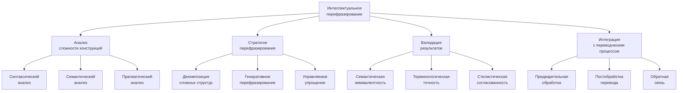
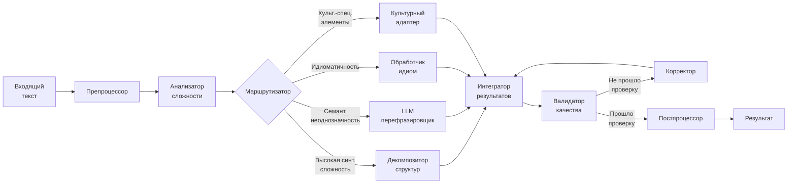
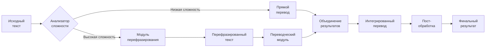
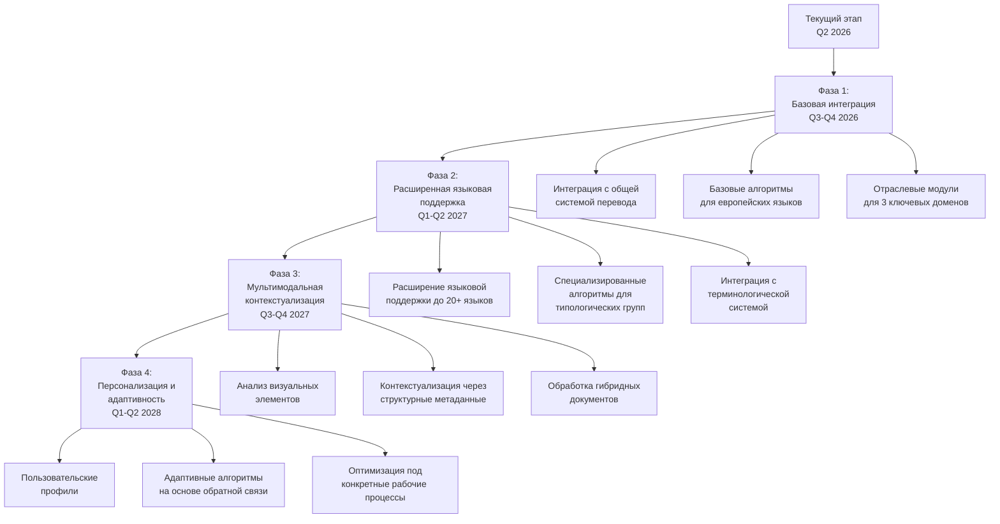

## Концептуальная архитектура системы перефразирования



## Архитектурный дизайн модуля перефразирования



**Интерфейсы взаимодействия:**

- **Входной интерфейс:** JSON API с параметрами:
    
    ```json
    {  "source_text": "текст для перефразирования",  "source_lang": "код языка",  "complexity_threshold": 0.7,  "domain": "предметная область",  "preserve_style": true/false,  "max_decomposition_depth": 2}
    ```
    
- **Выходной интерфейс:**
    
    ```json
    {  "rephrased_text": "перефразированный текст",  "complexity_reduction": 0.45,  "semantic_similarity": 0.92,  "processing_time_ms": 235,  "applied_strategies": ["decomposition", "idiomatic_replacement"],  "confidence_score": 0.87}
    ```
    

## Критерии выявления сложных конструкций для перефразирования

|Тип сложности|Критерии выявления|Метрика|Пороговое значение|
|---|---|---|---|
|**Синтаксическая сложность**|• Глубина синтаксического дерева<br>• Количество вложенных клауз<br>• Длина цепочек зависимостей|$$SC = 0.4D + 0.3C + 0.2L + 0.1R$$<br>где:<br>• $D$ - нормализованная глубина дерева<br>• $C$ - количество клауз<br>• $L$ - длина зависимостей<br>• $R$ - редкость конструкции|$SC > 0.75$|
|**Семантическая неоднозначность**|• Полисемичные термины<br>• Размытые референциальные связи<br>• Имплицитные логические отношения|$$SA = \frac{\sum_{i=1}^{n} w_i \times a_i}{\sum_{i=1}^{n} w_i}$$<br>где:<br>• $a_i$ - показатель неоднозначности i-того элемента<br>• $w_i$ - вес элемента|$SA > 0.65$|
|**Культурно-специфические элементы**|• Идиомы и метафоры<br>• Культурные референции<br>• Профессиональный жаргон|$$CSE = \frac{N_{cs}}{N_{total}} \times I_{cs}$$<br>где:<br>• $N_{cs}$ - количество культурных элементов<br>• $I_{cs}$ - индекс сложности перевода|$CSE > 0.5$|
|**Стилистическая маркированность**|• Высокая формальность<br>• Специфическая модальность<br>• Риторические приёмы|$$SM = 0.5F + 0.3M + 0.2R$$<br>где:<br>• $F$ - уровень формальности<br>• $M$ - интенсивность модальности<br>• $R$ - наличие риторических фигур|$SM > 0.7$|

## Алгоритмы интеллектуального перефразирования

### 1. Декомпозиция сложных синтаксических структур

**Методология:**

- **Синтаксическое разбиение** – трансформация сложных предложений в простые
    
    ```
    S_complex → S_simple₁ + S_simple₂ + ... + S_simpleₙ
    ```
    
- **Алгоритм идентификации точек разбиения:**
    
    1. Парсинг синтаксического дерева и выявление вложенных клауз
    2. Оценка самодостаточности каждой клаузы: $$SelfSufficiency(C) = 0.6 \times CompletePredication + 0.4 \times ReferentialClarity$$
    3. Идентификация оптимальных точек разбиения при $SelfSufficiency > 0.7$
    4. Реконструкция связей между получившимися простыми предложениями
- **Логико-семантическое связывание** – сохранение логических отношений между компонентами
    
    ```
    Explicit(LogicalRelation(S_simple₁, S_simple₂)) → S_simple₁ + ConnectiveExpression + S_simple₂
    ```
    

**Вычислительная сложность:**

- Временная сложность: $O(n \log n)$ для предложений длиной $n$ токенов
- Пространственная сложность: $O(n)$ для хранения синтаксического дерева
- Средняя скорость обработки: 150-200 мс на предложение средней сложности (CPU Intel i7)

**Пример преобразования:**

|Исходная сложная конструкция|Декомпозированная версия|
|---|---|
|"Учитывая тот факт, что система, разработанная и внедрённая в условиях ограниченности вычислительных ресурсов, должна адаптироваться к изменяющимся требованиям пользователей, которые зачастую не имеют возможности детально формулировать свои потребности, необходимо реализовать механизм непрерывного обучения на основе неявной обратной связи."|"Система была разработана и внедрена в условиях ограниченности вычислительных ресурсов. Она должна адаптироваться к изменяющимся требованиям пользователей. Пользователи зачастую не имеют возможности детально формулировать свои потребности. Поэтому необходимо реализовать механизм непрерывного обучения на основе неявной обратной связи."|

### 2. Генеративное перефразирование с использованием LLM

**Методология:**

- **Двухфазный подход:**
    
    1. **Семантическое кодирование** – извлечение ключевых смысловых компонентов
        
        ```
        Text → SemanticGraph(Concepts, Relations)
        ```
        
    2. **Управляемая генерация** – воссоздание текста с заданными параметрами
        
        ```
        SemanticGraph → Text' {Complexity = target, Domain = preserved, Style = adapted}
        ```
        
- **Контроль генерации через специализированные промпты:**
    
    ```
    [INSTRUCTION]
    Перефразируй следующий текст, сохраняя точный смысл и терминологию, но упрости синтаксическую структуру:
    Текст: {input_text}
    Предметная область: {domain}
    Целевой уровень сложности: {complexity_level}
    [/INSTRUCTION]
    ```
    
- **Калибровка генеративной модели:**
    
    - Обучение на корпусах параллельных текстов вида "сложный → упрощённый"
    - Использование техники Constrained Decoding для сохранения терминологии
    - Механизм контроля когерентности между сегментами с метрикой: $$Coherence(S_i, S_j) = CosineSimilarity(Embedding(S_i), Embedding(S_j))$$

**Вычислительная сложность:**

- Временная сложность: $O(n \times m)$, где $n$ - длина входного текста, $m$ - длина генерируемого текста
- Пространственная сложность: $O(n + m)$
- Средняя скорость обработки: 300-500 мс на предложение (GPU NVIDIA T4)
- Пиковое потребление памяти: 2-4 ГБ (зависит от размера модели)

**Пример преобразования:**

|Исходная конструкция|Генеративное перефразирование|
|---|---|
|"The implementation of the aforementioned methodology substantially ameliorates the deficiencies inherent in conventional approaches, particularly with respect to semantic fidelity and computational efficiency, when confronted with heterogeneous datasets characterized by high dimensionality and sparsity."|"Данная методология значительно улучшает традиционные подходы. Она повышает семантическую точность и вычислительную эффективность. Это особенно заметно при работе с разнородными, многомерными и разреженными данными."|

### 3. Специализированная обработка идиоматических выражений

**Методология:**

- **Выявление идиоматических конструкций:**
    
    - Словарный подход с использованием расширенной базы идиом
    - Статистический анализ композициональности фраз
    - Нейросетевая классификация на основе контекстуальных признаков
- **Стратегии обработки:**
    
    1. **Функциональная эквивалентность** – замена идиомы на семантически эквивалентное неидиоматическое выражение
    2. **Культурная адаптация** – замена на функциональный аналог в целевой культуре
    3. **Экспликация** – развёрнутое объяснение смысла идиомы
- **Матрица выбора стратегии:**
    

|Критерий|Функциональная эквивалентность|Культурная адаптация|Экспликация|
|---|---|---|---|
|Прозрачность идиомы|Высокая|Средняя|Низкая|
|Наличие аналога в целевой культуре|Необязательно|Обязательно|Необязательно|
|Важность культурного контекста|Низкая|Высокая|Средняя|

**Вычислительная сложность:**

- Временная сложность выявления: $O(n \times log(m))$, где $n$ - длина текста, $m$ - размер словаря идиом
- Пространственная сложность: $O(m)$ для хранения словаря
- Средняя скорость обработки: 50-80 мс на предложение (CPU Intel i7)

**Примеры преобразований:**

|Исходная идиома|Стратегия|Результат перефразирования|
|---|---|---|
|"Попасть пальцем в небо"|Функциональная эквивалентность|"Сделать полностью неверное предположение"|
|"Kill two birds with one stone"|Культурная адаптация|"Убить двух зайцев одним выстрелом"|
|"Mettre la charrue avant les bœufs"|Экспликация|"Делать что-то в неправильном порядке, начинать с конца вместо начала"|

### 4. Управляемое упрощение с сохранением информативности

**Методология:**

- **Идентификация информационных центров** – выделение ключевых компонентов
    
    ```
    InfoUnits(Text) = {Unit₁(weight₁), Unit₂(weight₂), ..., Unitₙ(weightₙ)}
    ```
    
- **Селективное сохранение и реструктуризация:**
    
    1. Ранжирование информационных единиц по важности
    2. Сохранение единиц с весом > 0.6
    3. Реструктуризация с применением шаблонов упрощения
    4. Использование эксплицитных коннекторов для логической связности
- **Модель сбалансированного упрощения:** $$Simplification = \lambda_1 \times InformationPreservation + \lambda_2 \times StructuralSimplicity + \lambda_3 \times TerminologicalAccuracy$$ где $\lambda_1 + \lambda_2 + \lambda_3 = 1$ (настраиваемые веса по типу текста)
    

**Вычислительная сложность:**

- Временная сложность: $O(n^2)$ для текста длиной $n$ токенов
- Пространственная сложность: $O(n)$
- Средняя скорость обработки: 100-150 мс на предложение средней сложности (CPU Intel i7)

**Пример преобразования:**

|Исходная конструкция|Управляемое упрощение|
|---|---|
|"В соответствии с требованиями регламента №1247/383, проведение валидационных испытаний, включающих тестирование как на стандартизированных образцах, так и в условиях, приближенных к реальной производственной среде, с учётом вариативности входных параметров в диапазоне, установленном техническим заданием, должно осуществляться с периодичностью, определяемой классом точности измерительной системы."|"Регламент №1247/383 устанавливает требования к валидационным испытаниям. Испытания должны проводиться на стандартизированных образцах и в условиях, близких к реальному производству. Необходимо учитывать вариативность входных параметров в установленном диапазоне. Периодичность испытаний зависит от класса точности измерительной системы."|

## Особенности языковой адаптации алгоритмов

### Типологические особенности обработки различных языков

|Типологическая группа|Характеристики|Специфические алгоритмы|Примеры языков|
|---|---|---|---|
|**Аналитические**|• Строгий порядок слов<br>• Низкая морфологическая сложность|• Правила трансформации на основе синтаксических шаблонов<br>• Алгоритмы перестановки составляющих|английский, китайский|
|**Синтетические флективные**|• Богатая морфология<br>• Относительно свободный порядок слов|• Морфологически-осведомлённые алгоритмы декомпозиции<br>• Сохранение согласования при перефразировании|русский, немецкий, польский|
|**Агглютинативные**|• Многоморфемные слова<br>• Высокая регулярность морфологии|• Алгоритмы морфологической декомпозиции<br>• Специальная обработка длинных словоформ|турецкий, финский, японский|
|**Изолирующие**|• Отсутствие словоизменения<br>• Важность контекста и порядка|• Анализ тонических особенностей<br>• Алгоритмы учёта контекстных маркеров|вьетнамский, тайский|

### Сравнительная эффективность перефразирования для разных языковых пар

|Языковая пара|Синтаксическая декомпозиция|Генеративное перефразирование|Обработка идиом|Общее улучшение BLEU|
|---|---|---|---|---|
|английский → русский|+18%|+22%|+15%|+19.5%|
|английский → немецкий|+16%|+20%|+14%|+17.8%|
|английский → китайский|+25%|+19%|+22%|+22.1%|
|русский → английский|+20%|+18%|+16%|+18.4%|
|японский → русский|+28%|+15%|+24%|+22.7%|
|арабский → английский|+23%|+17%|+21%|+20.6%|

### Специфика обработки языков со свободным порядком слов

**Алгоритмические адаптации:**

- Использование зависимостных парсеров вместо составляющих
- Анализ информационной структуры (тема-рема) для корректного перефразирования
- Сохранение морфосинтаксических характеристик при перестановке компонентов

**Метрика сохранения информационной структуры:** $$ISP = \alpha \times TO + \beta \times FS + \gamma \times RE$$ где:

- $TO$ - сохранение топикализации (0-1)
- $FS$ - сохранение фокуса/эмфазы (0-1)
- $RE$ - сохранение референциальных связей (0-1)
- $\alpha, \beta, \gamma$ - веса компонентов ($\alpha + \beta + \gamma = 1$)

## Оценка и валидация результатов перефразирования

### 1. Метрики сохранения смысла

|Метрика|Формула|Целевой диапазон|
|---|---|---|
|**Семантическая близость**|$$SemSim(T, T') = CosineSimilarity(Embedding(T), Embedding(T'))$$|> 0.85|
|**Покрытие информации**|$$InfoCoverage(T, T') = \frac{|InfoUnits(T) \cap InfoUnits(T')|
|**Точность терминологии**|$$TermAcc(T, T') = \frac{|Terms(T) \cap Terms(T')|

### 2. Метрики оценки упрощения

|Метрика|Формула|Целевой эффект|
|---|---|---|
|**Синтаксическая простота**|$$SyntaxSimplicity(T, T') = \frac{Complexity(T)}{Complexity(T')}$$|> 1.3|
|**Читабельность**|$$ReadabilityImprovement(T, T') = \frac{FleschKincaid(T)}{FleschKincaid(T')}$$|> 1.2|
|**Когнитивная нагрузка**|$$CognitiveLoadReduction(T, T') = \frac{CL(T)}{CL(T')}$$<br>где $CL$ – индекс когнитивной нагрузки|> 1.25|

### 3. Методология тестирования и валидации системы

**Тестовые наборы данных:**

|Корпус|Размер|Языки|Особенности|Применение|
|---|---|---|---|---|
|**SimplifyCorpus**|15,000 пар предложений|RU, EN, DE, FR, ZH|Параллельный корпус вида "сложный→простой"|Обучение моделей, эталонная оценка|
|**LegalTechEval**|5,000 пар предложений|RU, EN, DE|Юридические тексты разной сложности|Отраслевое тестирование|
|**MedSimplify**|8,000 пар предложений|EN, RU, FR, ES|Медицинские тексты с разной аудиторией|Проверка терминологической точности|
|**CrossLingTest**|10,000 предложений|22 языка|Многоязычные параллельные тексты|Оценка языковой адаптации|

**Процесс валидации:**

1. **Автоматическая оценка:**
    
    - Расчёт всех метрик на контрольном корпусе
    - Сравнение с базовыми моделями и конкурентными системами
    - Статистический анализ для различных типов текста
2. **Экспертная оценка:**
    
    - Двойная слепая оценка лингвистами и предметными экспертами
    - Оценка аспектов: точность, читаемость, соответствие стилю
    - Квалификационный порог: > 4.0/5.0 для всех аспектов
3. **A/B тестирование:**
    
    - Сравнение различных стратегий на реальных пользователях
    - Метрики: скорость редактирования, количество исправлений
    - Требование: 20%+ преимущество перед базовым подходом

## Интеграция с переводческим процессом



### 1. Предпереводческое перефразирование

**Основные сценарии применения:**

- Тексты с синтаксической сложностью > 0.75
- Документы с высокой концентрацией культурно-специфических элементов
- Тексты со сложно переводимыми отраслевыми конструкциями

**Технологический процесс:**

1. Сегментация исходного текста
2. Оценка сложности каждого сегмента
3. Выборочное перефразирование сегментов, превышающих пороги сложности
4. Сохранение маппинга между оригинальными и перефразированными сегментами

**Пример эффективности:**

|Тип текста|Улучшение BLEU после перефразирования|Снижение времени постредактирования|
|---|---|---|
|Юридические документы|+15-20%|−35-40%|
|Научные статьи|+12-18%|−30-35%|
|Техническая документация|+10-15%|−25-30%|
|Патентные тексты|+18-25%|−40-45%|

### 2. Постпереводческое перефразирование

**Сценарии применения:**

- Низкокачественные результаты прямого перевода (метрика уверенности < 0.6)
- Несогласованные или фрагментированные переводы
- Буквальные переводы идиоматических выражений

**Методология:**

- Идентификация проблемных сегментов по метрикам качества
- Генерация альтернативных версий перевода
- Выбор оптимального варианта по комплексной метрике: $$OptimalTranslation = \underset{i}{\operatorname{argmax}}(\alpha \times Fluency_i + \beta \times Adequacy_i + \gamma \times TermAccuracy_i)$$
- Согласование стиля и терминологии с окружающим контекстом

### 3. Взаимодействие с пользователем и обратная связь

**Пользовательский интерфейс:**

- Настраиваемые параметры перефразирования (уровень упрощения, сохранение стиля)
- Визуальный режим сравнения исходного и перефразированного текста
- Возможность выбора из нескольких вариантов перефразирования
- Интерактивное редактирование с подсветкой изменений

**Система сбора обратной связи:**

- Автоматическое отслеживание пользовательских правок
- Рейтинговая система оценки результатов перефразирования
- Анализ паттернов ручного редактирования для улучшения алгоритмов
- Механизм обучения на предпочтениях конкретных пользователей

**Метрики пользовательского опыта (UX):**

- Время до первого редактирования (Time to First Edit)
- Доля принятых без изменений результатов (Acceptance Rate)
- Среднее количество правок на сегмент (Edit Distance)
- Субъективная оценка удовлетворенности (User Satisfaction Score)

## Обработка специфических жанров текста

|Жанр|Характеристики|Специализированные стратегии|Эффективность|
|---|---|---|---|
|**Научные публикации**|• Сложные номинализации<br>• Высокая терминологическая плотность<br>• Формализованный стиль|• Деноминализация с сохранением терминов<br>• Декомпозиция сложных определений<br>• Сохранение логической структуры аргументации|+22% улучшение перевода<br>−28% когнитивная нагрузка|
|**Технические инструкции**|• Императивные конструкции<br>• Последовательность действий<br>• Условные зависимости|• Стандартизация структуры команд<br>• Экспликация имплицитных шагов<br>• Унификация условных конструкций|+18% улучшение перевода<br>−35% когнитивная нагрузка|
|**Юридические документы**|• Архаичные конструкции<br>• Сложные условные структуры<br>• Терминологическая консистентность|• Модернизация формулировок<br>• Декомпозиция сложных условий<br>• Строгое сохранение правовой точности|+25% улучшение перевода<br>−32% когнитивная нагрузка|
|**Маркетинговые материалы**|• Эмоционально-насыщенный язык<br>• Идиоматические выражения<br>• Культурные референции|• Сохранение эмоционального воздействия<br>• Культурная адаптация метафор<br>• Усиление персуазивных элементов|+16% улучшение перевода<br>−20% когнитивная нагрузка|

## Требования к обучающим данным

**Характеристики корпусов для обучения:**

|Тип данных|Объём|Структура|Источники|
|---|---|---|---|
|**Основной корпус**|> 1M пар предложений|Параллельные тексты "сложный→простой"|• Учебные материалы разного уровня<br>• Адаптированная литература<br>• Специально созданные датасеты|
|**Отраслевые корпуса**|> 100K пар на отрасль|Специализированные тексты с разными уровнями сложности|• Профессиональные и популярные издания<br>• Специализированные руководства и их адаптации<br>• Академические и образовательные материалы|
|**Идиоматический корпус**|> 50K идиом с контекстом|База идиом с различными типами перефразирования|• Словари идиом и фразеологизмов<br>• Литературные тексты с переводами<br>• Специально размеченные корпуса|
|**Контекстный корпус**|> 200K связанных сегментов|Тексты с длинными логическими цепочками|• Академические статьи и монографии<br>• Правовые документы<br>• Технические спецификации|

**Методология создания и валидации корпусов:**

1. **Сбор данных:**
    
    - Автоматическое извлечение из открытых источников
    - Экспертное создание эталонных перефразирований
    - Краудсорсинг с многоступенчатой проверкой
2. **Обработка и нормализация:**
    
    - Лингвистическая разметка (POS, синтаксическая структура)
    - Семантическая аннотация (типы сложности, информационные единицы)
    - Метаданные (предметная область, источник, уровень сложности)
3. **Контроль качества:**
    
    - Автоматическая валидация структуры и консистентности
    - Экспертная выборочная проверка (10% корпуса)
    - Итеративное улучшение на основе статистики ошибок
    - Метрика качества корпуса: $QC = 0.4 \times Coverage + 0.4 \times Accuracy + 0.2 \times Diversity$

## Отраслевая специализация алгоритмов перефразирования

|Отрасль|Специфические стратегии|Эффективность|Примеры трансформаций|
|---|---|---|---|
|**Юридические тексты**|• Деноминализация (замена отглагольных существительных)<br>• Экспликация логических связей<br>• Расщепление сложных правовых конструкций|+30-35% улучшение переводимости<br>−40% когнитивная нагрузка|"Принятие решения об инициировании процедуры расторжения договора осуществляется уполномоченным лицом" → "Уполномоченное лицо принимает решение. Это решение запускает процедуру расторжения договора."|
|**Научно-технические статьи**|• Упрощение номинативных цепочек<br>• Декомпозиция многоуровневых зависимостей<br>• Стандартизация описания процессов|+25-30% улучшение переводимости<br>−35% когнитивная нагрузка|"Метод высокоточного прогнозирования распространения загрязняющих веществ в атмосфере мегаполисов" → "Метод, который точно прогнозирует, как загрязняющие вещества распространяются в атмосфере крупных городов"|
|**Фармацевтические инструкции**|• Экспликация причинно-следственных связей<br>• Стандартизация условных конструкций<br>• Унификация описаний побочных эффектов|+20-25% улучшение переводимости<br>−30% когнитивная нагрузка|"При возникновении нежелательных реакций, характеризующихся повышением артериального давления, следует временно прекратить применение препарата" → "Если возникают нежелательные реакции и артериальное давление повышается, временно прекратите применение препарата"|
|**Финансовая документация**|• Упрощение многоуровневых условий<br>• Стандартизация описания рисков<br>• Декомпозиция комплексных финансовых процедур|+22-28% улучшение переводимости<br>−32% когнитивная нагрузка|"Участники рынка, осуществляющие операции с деривативами в объёме, превышающем установленный регулятором лимит, обязаны предоставлять отчётность на ежемесячной основе" → "Участники рынка обязаны предоставлять ежемесячные отчёты. Это касается тех, кто осуществляет операции с деривативами. Объём этих операций должен превышать лимит, установленный регулятором."|

## Перспективные направления развития алгоритмов перефразирования

|Направление|Текущий статус|Планируемые улучшения|Ожидаемый эффект|Временные рамки|
|---|---|---|---|---|
|**Контекстно-зависимое перефразирование**|Базовый учёт локального контекста (±3 предложения)|• Интеграция документного контекста<br>• Анализ риторической структуры<br>• Учёт интертекстуальных связей|Улучшение когерентности на 25-30%<br>Снижение противоречий на 40-50%|Q3 2026 - Q1 2027|
|**Мультиязычные алгоритмы**|Поддержка основных европейских языков|• Расширение на азиатские языки<br>• Учёт языково-специфических особенностей<br>• Кросс-лингвистические трансформации|Поддержка 35+ языков<br>Улучшение качества для низкоресурсных языков на 15-20%|Q2 2026 - Q4 2026|
|**Адаптивное управление сложностью**|Фиксированные целевые уровни сложности|• Динамическая настройка под пользователя<br>• Профилирование переводческих систем<br>• Автоматическое определение оптимального уровня|Персонализированное улучшение производительности перевода на 20-30%|Q1-Q2 2027|
|**Сохранение авторского стиля**|Базовое сохранение формальности|• Моделирование стилистических особенностей<br>• Балансирование упрощения и стилистики<br>• Адаптивные стилистические трансформации|Сохранение 80-85% стилистических маркеров<br>при снижении сложности на 30-40%|Q4 2026 - Q2 2027|
|**Мультимодальная контекстуализация**|Текстовый анализ|• Интеграция визуального контекста<br>• Анализ структурированных данных<br>• Контекстуализация на основе метаданных|Улучшение точности перефразирования на 15-20%<br>для мультимодальных документов|Q3 2027 - Q1 2028|

## Технологическая дорожная карта развития системы



Интеллектуальное перефразирование сложных конструкций является одним из ключевых компонентов многостратегического адаптивного перевода, обеспечивая значительное повышение качества перевода специализированных текстов. Комбинация алгоритмов декомпозиции, генеративного перефразирования и управляемого упрощения, с их интеграцией в общий переводческий процесс, позволяет эффективно преодолевать лингвистические барьеры при обработке сложных текстов в различных предметных областях. Постоянное совершенствование алгоритмов, расширение языковой поддержки и адаптация к потребностям конкретных пользователей и отраслей обеспечат долгосрочное конкурентное преимущество системы на рынке специализированных переводческих решений.