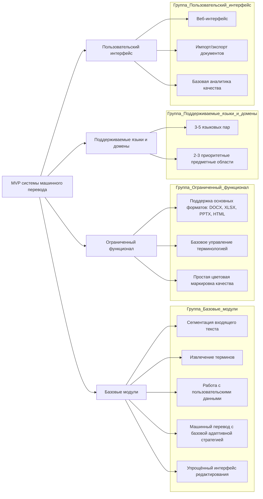

Для быстрого выхода на рынок и валидации ключевых технологических и бизнес-гипотез предлагается создание MVP системы машинного перевода со следующими характеристиками.

## Цели MVP

1. Продемонстрировать уникальные преимущества системы в области перевода узкоспециализированных текстов
2. Получить обратную связь от первых пользователей для итеративного улучшения продукта
3. Валидировать ключевую технологию многостратегического адаптивного перевода
4. Сократить время выхода на рынок и обеспечить быстрый возврат инвестиций

## Ключевые компоненты MVP

## Функциональные возможности MVP

### 1. Базовые модули

- **Сегментация входящего текста**: Точное разделение документа на логические единицы с точностью до 96% для сложноструктурированных текстов
- **Извлечение терминов**: Автоматическое выявление ключевой терминологии с точностью 80-85%, включая многословные термины в техническом контексте
- **Работа с пользовательскими данными**: Интеграция глоссариев (CSV, XLSX, TBX, XML) и памяти переводов (TMX, XLIFF)
- **Машинный перевод с адаптивной стратегией**: Упрощённая версия многостратегического подхода с базовой классификацией сегментов по сложности и выбором оптимального метода перевода
- **Упрощённый интерфейс редактирования**: Оптимизированный для профессиональных переводчиков интерфейс с цветовой маркировкой качества и интуитивным процессом редактирования

### 2. Поддерживаемые форматы документов

- Microsoft Office: DOCX, XLSX, PPTX
- Веб-форматы: HTML, TXT
- Обменные форматы: XLIFF (базовая поддержка)

### 3. Языковые пары и предметные области

- **Языковые пары**:
    
    - Английский ↔ Русский
    - Английский ↔ Немецкий
    - Английский ↔ Французский
    - Китайский ↔ Русский
- **Приоритетные предметные области**:
    
    - Техническая документация (инженерия, IT)
    - Нефтегазовая отрасль
    - Автомобильная промышленность

### 4. Пользовательский интерфейс и управление

- Веб-интерфейс с адаптивным дизайном, оптимизированным для профессиональных переводчиков
- Управление пользователями с ролями: администратор, редактор, переводчик
- Система проектов и заданий с базовым отслеживанием статусов
- Интуитивно понятный процесс загрузки документов с предпросмотром

## Технические характеристики MVP

- **Архитектура**: Микросервисная с Docker-контейнерами и оркестрацией через Kubernetes
- **Производительность**:
    - Скорость перевода: 400-450 страниц/час (при средней плотности текста ~300 слов/страница)
    - Поддержка документов объёмом до 25 000 слов (~50-60 страниц в стандартном формате)
    - Возможность параллельной обработки нескольких документов
    - Одновременная работа до 10 пользователей
- **Развёртывание**: Облачная инфраструктура (AWS/Azure/GCP) с возможностью локальной установки
- **Безопасность**: Шифрование данных, HTTPS, аутентификация, авторизация, базовое логирование действий

## Ключевые метрики успеха MVP

1. **Качество перевода**:
    
    - Улучшение BLEU-score на 15-20% по сравнению со стандартными решениями в целевых доменах
    - Терминологическая точность выше 85% в специализированных доменах
    - Снижение времени постредактирования на 30-40% по сравнению с базовыми системами МТ
2. **Пользовательские метрики**:
    
    - Конверсия от тестирования к платному использованию: целевой показатель 15-20%
    - Удовлетворённость пользователей (по опросам): целевой показатель 4.0+ из 5.0
    - Время освоения: не более 2 часов для базовых функций
    - Повторное использование: 70%+ пользователей возвращаются в течение первого месяца
3. **Бизнес-метрики**:
    
    - Привлечение 10-15 пилотных клиентов в течение первых 3 месяцев
    - Получение детальной обратной связи от 80%+ пользователей
    - ROI для первых клиентов: окупаемость в течение 6-9 месяцев

## План разработки и запуска MVP

|Этап|Сроки|Результаты|Промежуточные метрики|
|---|---|---|---|
|Разработка базовых модулей|3-4 месяца|Функционирующие основные компоненты системы|Успешная интеграция 5 модулей, 80% покрытие тестами|
|Интеграция и тестирование|1-2 месяца|Полностью интегрированная система с проверенным качеством|Завершение 90% автоматизированных тестов, достижение целевых показателей качества перевода|
|Пилотное внедрение|2-3 месяца|Запуск с 5-7 ключевыми клиентами и сбор обратной связи|80% удовлетворённость первых пользователей, сокращение времени редактирования на 25%+|
|Итерационные улучшения|1-2 месяца|Внесение критических изменений на основе обратной связи|Улучшение 3-5 ключевых показателей на основе пользовательской обратной связи|
|Коммерческий запуск MVP|Контрольная точка|Официальный выход продукта на рынок|Готовность маркетинговых материалов, обучающего контента и каналов продаж|

## Стратегия привлечения первых клиентов

1. **Таргетированный подход**:
    
    - Прямые контакты с 30-40 потенциальными клиентами из приоритетных отраслей
    - Участие в 2-3 отраслевых выставках/конференциях
    - Партнёрство с 3-5 консалтинговыми компаниями, специализирующимися на локализации
2. **Программа раннего доступа**:
    
    - Специальные условия для первых 10 клиентов (скидка 50% на первые 3 месяца)
    - Персональное онбординг-сопровождение
    - Приоритетная техническая поддержка
    - Возможность влияния на дорожную карту продукта
3. **A/B-тестирование**:
    
    - Тестирование различных вариантов пользовательского интерфейса редактирования
    - Сравнение эффективности разных подходов к многостратегическому переводу
    - Оценка результативности различных ценовых моделей

## Ресурсы для создания MVP

1. **Команда**:
    
    - 3-4 разработчика бэкенда
    - 2 разработчика фронтенда
    - 1 DevOps инженер
    - 2 NLP/ML специалиста
    - 1 UX/UI дизайнер со специализацией на профессиональных инструментах
    - 1 QA инженер
    - 1 продуктовый менеджер
    - 1 технический лингвист-консультант
    - 1 отраслевой эксперт (part-time) для консультаций по терминологии
2. **Инфраструктура**:
    
    - Облачные ресурсы для разработки и тестирования
    - Базовая инфраструктура для пилотных внедрений
    - Тестовые серверы для валидации производительности
3. **Данные**:
    
    - Предварительно собранные корпуса текстов для целевых доменов
    - Базовые терминологические базы для приоритетных отраслей
    - Тестовые наборы данных для валидации качества
4. **Бюджет**:
    
    - Общий бюджет на разработку MVP: $300,000-$350,000
    - Распределение: 65% - разработка, 15% - инфраструктура, 10% - тестирование, 10% - маркетинг и продажи

## Монетизация MVP

- **Модель**: Комбинированная модель с базовой абонентской платой и оплатой за объём переведённых слов сверх базового лимита
- **Базовый тариф**: $500/месяц с включённым объёмом до 100,000 слов
- **Цена за дополнительный объём**: $0.03-0.05 за слово в зависимости от языковой пары
- **Специальные условия**: Доступны корпоративные тарифы с фиксированной стоимостью для больших объёмов

## Ограничения MVP и план дальнейшего развития

В MVP сознательно ограничены следующие аспекты, которые будут развиваться в последующих версиях:

1. **Ограниченное количество языковых пар** (расширение до 15-20 пар в течение 8 месяцев после запуска)
2. **Базовая реализация многостратегического подхода** (полная реализация в следующей версии)
3. **Упрощённый интерфейс редактирования** (расширение до коллаборативных инструментов)
4. **Ограниченная интеграция с внешними системами** (развитие API и коннекторов)

## План реагирования на риски

1. **Если метрики качества ниже целевых**:
    
    - Привлечение дополнительных специалистов по NLP/ML
    - Увеличение объёма тренировочных данных для проблемных доменов
    - Временное снижение цены с соответствующей коммуникацией клиентам
2. **Если конверсия ниже ожидаемой**:
    
    - Проведение глубинных интервью с потенциальными клиентами
    - Пересмотр ценовой политики и модели монетизации
    - Усиление дифференцирующих особенностей продукта
3. **Если скорость разработки отстаёт от плана**:
    
    - Фокусировка на критически важных функциях
    - Временное привлечение дополнительных разработчиков
    - Пересмотр сроков с чёткой коммуникацией заинтересованным сторонам

## Заключение

MVP системы машинного перевода представляет собой сбалансированное решение, которое позволит в кратчайшие сроки выйти на рынок с продуктом, демонстрирующим ключевые преимущества нашего подхода. Фокус на технологии многостратегического адаптивного перевода, даже в упрощённой форме, обеспечит значимую дифференциацию от конкурентов.

Чёткие метрики успеха, конкретный план разработки с промежуточными контрольными точками и продуманная стратегия привлечения первых клиентов обеспечивают структурированный подход к валидации продукта на рынке. Ограниченный, но тщательно отобранный набор функций MVP позволит получить максимальную обратную связь при минимальных затратах ресурсов и времени.