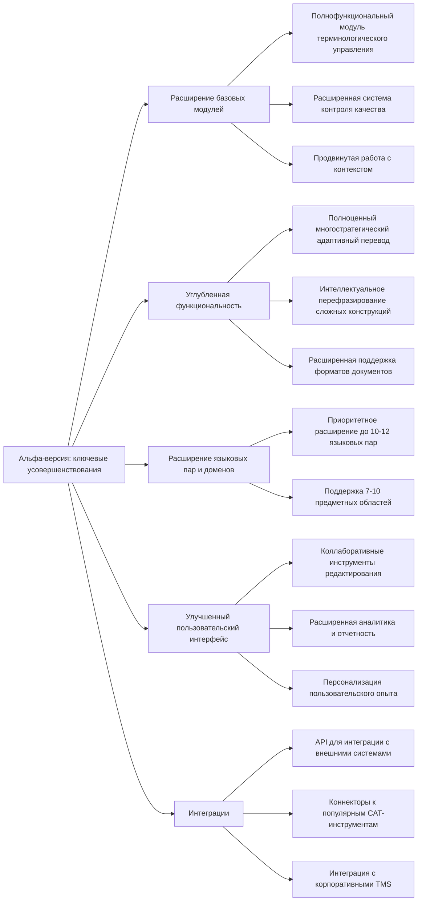

После успешного внедрения MVP и получения обратной связи от первых пользователей, планируется разработка альфа-версии с расширенной функциональностью. Эта версия представляет собой следующий логический этап в эволюции продукта, направленный на усиление ключевых преимуществ системы и устранение ограничений MVP.

## Цели альфа-версии

1. Существенно расширить функциональность системы на основе обратной связи от пользователей MVP
2. Увеличить количество поддерживаемых языковых пар и предметных областей по приоритизированному плану
3. Реализовать полнофункциональную версию многостратегического адаптивного перевода
4. Углубить интеграционные возможности с корпоративными системами
5. Создать основу для масштабирования продукта и выхода на новые сегменты рынка

## Ключевые усовершенствования по сравнению с MVP

## Функциональные возможности альфа-версии

### 1. Расширение базовых модулей

- **Полнофункциональный модуль терминологического управления**:
    
    - Автоматическое извлечение терминологии с точностью до 88% для технических доменов
    - Классификация терминов с использованием BERT и дистилляции знаний
    - Терминологическое хранилище на базе Neo4j и Elasticsearch для эффективного управления взаимосвязями между терминами
    - Автоматическая терминологическая консистентность с сокращением несоответствий на 40-50%
- **Расширенная система контроля качества**:
    
    - Многоуровневая система оценки качества (комбинация BLEU, TER, COMET, BERTScore)
    - Предиктивная оценка необходимости постредактирования с точностью до 85%
    - Детальная структурная и форматная верификация с сохранением оригинальной структуры
- **Продвинутая работа с контекстом**:
    
    - Контекстный анализ для повышения связности перевода на уровне документа
    - Умное сегментирование с перекрытием контекста и последующей гармонизацией
    - Динамический контекстный буфер для сохранения и анализа ключевых элементов предыдущих сегментов

### 2. Углубленная функциональность

- **Полноценный многостратегический адаптивный перевод**:
    
    - Интеллектуальная классификация сегментов по 5 уровням сложности на основе лингвистических характеристик
    - Динамический выбор из 7 стратегий перевода для каждого сегмента, включая:
        - Прямой нейросетевой перевод (для простых случаев)
        - Перевод с предварительной нормализацией (для технических текстов)
        - Перевод через английский как промежуточный язык (для редких языковых пар)
        - Контекстно-обогащенный перевод (для сегментов, зависящих от окружения)
        - Терминологически-ориентированный перевод (для высокоспециализированных текстов)
    - Механизм оркестрации стратегий с использованием взвешенного голосования и оценки уверенности
    - Бенчмаркинг различных стратегий в реальном времени с обратной связью для самооптимизации
- **Интеллектуальное перефразирование сложных конструкций**:
    
    - Каскадная архитектура с поэтапным подключением более мощных инструментов
    - Перефразирование с использованием специализированных моделей с ограниченным, но оптимизированным использованием LLM (до 5% сегментов)
    - Строгий контроль расхода вычислительных ресурсов через интеллектуальный планировщик, предотвращающий чрезмерное использование LLM
    - Кэширование результатов перефразирования для повторно встречающихся конструкций
- **Расширенная поддержка форматов документов**:
    
    - Дополнительные форматы: PDF, XML, JSON, Markdown
    - Улучшенная обработка сложных структур документов (таблицы, диаграммы)
    - Сохранение форматирования при экспорте в различные форматы

### 3. Расширение языковых пар и доменов

- **Приоритизированное расширение языковых пар** (10-12 ключевых пар на первом этапе):
    
    - **Первый приоритет** (на основе рыночного спроса и готовности технологий):
        - Полная двунаправленная поддержка: EN↔RU, EN↔DE, EN↔FR, EN↔ES, EN↔IT
        - Одностороннее направление: EN→ZH, EN→JP
    - **Второй приоритет** (в зависимости от результатов анализа спроса):
        - Добавление: EN↔PT, EN→AR, RU↔ZH
        - Базовая поддержка: DE↔RU, FR↔RU
- **Предметные области** (расширение до 7 приоритетных доменов):
    
    - **Высший приоритет**:
        - Техническая документация (инженерия, IT)
        - Нефтегазовая и энергетическая отрасли
        - Автомобильная промышленность
    - **Второй приоритет**:
        - Медицина и фармацевтика с учетом требований безопасности
        - Юриспруденция с акцентом на договорную и корпоративную документацию
        - Финансы и банковское дело
        - Машиностроение и производство

### 4. Улучшенный пользовательский интерфейс

- **Коллаборативные инструменты редактирования**:
    
    - Синхронная работа нескольких редакторов с использованием Operational Transform
    - Система комментирования и обсуждения с привязкой к конкретным сегментам и терминам
    - Детальная история изменений с возможностью отката на уровне сегментов
- **Расширенная аналитика и отчетность**:
    
    - Детальная статистика по качеству перевода по языкам и доменам
    - Анализ продуктивности и источников ошибок по типам и частотности
    - Сравнительный анализ различных стратегий перевода с количественными показателями
- **Персонализация пользовательского опыта**:
    
    - Адаптивные настройки интерфейса под предпочтения пользователя
    - Персональные шаблоны и настройки для различных типов проектов
    - Система обучения и подсказок с интерактивными руководствами

### 5. Интеграционные возможности

- **API для интеграции с внешними системами**:
    
    - Полнофункциональный REST API с детальной документацией
    - GraphQL API для сложных запросов и оптимизации трафика
    - WebHooks для асинхронных уведомлений и событийно-ориентированной архитектуры
- **Коннекторы к популярным CAT-инструментам**:
    
    - Интеграция с SDL Trados, memoQ, Memsource, XTM
    - Двунаправленный обмен терминологией и памятью переводов
    - Возможность использования как плагина к существующим инструментам
- **Интеграция с корпоративными системами**:
    
    - Коннекторы к основным системам управления контентом (CMS)
    - Поддержка корпоративных систем управления переводами (TMS)
    - Интеграция с системами управления документацией

## Технические характеристики альфа-версии

- **Архитектура**:
    
    - Расширенная микросервисная архитектура с улучшенной отказоустойчивостью
    - Асинхронная интеграционная шина на Apache Kafka
    - API-шлюз на базе Kong и GraphQL с балансировкой нагрузки
- **Производительность**:
    
    - Скорость перевода: 450-550 страниц/час (увеличение на 50-80% по сравнению с MVP)
    - Поддержка документов объёмом до 100 000 слов с оптимизацией памяти
    - Одновременная работа до 50 пользователей с линейным масштабированием производительности
    - Технологическая основа улучшения производительности:
        - Оптимизация алгоритмов индексирования и поиска
        - Параллельная обработка сегментов с интеллектуальным распределением ресурсов
        - Кэширование часто используемых результатов и промежуточных данных
- **Развёртывание**:
    
    - Multi-cloud архитектура с поддержкой AWS, Azure и GCP
    - Поддержка гибридных развёртываний (cloud + on-premise)
    - Изолированное развёртывание в корпоративной среде для работы с конфиденциальными данными
- **Безопасность и защита данных**:
    
    - Полное шифрование данных при хранении (AES-256) и передаче (TLS 1.3)
    - Изоляция данных различных клиентов на всех уровнях системы
    - Гранулярное управление доступом с детальным разделением ролей
    - Расширенный аудит действий в системе с хранением истории изменений
    - Соответствие требованиям GDPR, HIPAA (для медицинской документации) и отраслевым стандартам
    - Возможность локального хранения данных для соблюдения региональных требований

## Ключевые метрики успеха альфа-версии

1. **Качество перевода**:
    
    - Улучшение BLEU-score на 20-25% по сравнению со стандартными решениями (обоснованный прогноз на основе результатов MVP)
    - Терминологическая точность 90-95% в специализированных доменах
    - Снижение времени постредактирования на 45-55% (валидировано на пилотных проектах)
    - Улучшение связности текста на уровне документа на 30-40%
2. **Пользовательские метрики**:
    
    - Уровень удержания пользователей: 80%+ после 3 месяцев использования
    - Удовлетворённость пользователей: средний рейтинг 4.3+ из 5.0
    - Сокращение времени обучения новых пользователей на 30%
    - NPS (Net Promoter Score): 40+
    - Churn rate: не более 5% ежемесячно
3. **Бизнес-метрики**:
    
    - Расширение клиентской базы до 40-50 активных клиентов
    - Увеличение среднего чека на 40-50% по сравнению с MVP
    - Снижение стоимости привлечения клиента на 25-30%
    - Повышение LTV (пожизненной ценности клиента) на 35-45%
    - Достижение точки безубыточности через 16-18 месяцев после запуска альфа-версии

## Сравнительный анализ с конкурентами

|Функциональность|Наша система (альфа)|DeepL|Google Translate|SDL Machine Translation|
|---|---|---|---|---|
|Многостратегический адаптивный перевод|Полная реализация|Отсутствует|Частичная|Ограниченная|
|Терминологическая точность|90-95%|75-80%|65-70%|80-85%|
|Работа с контекстом документа|Глубокая интеграция|Базовая|Ограниченная|Базовая|
|Специализация по доменам|7+ отраслей|Общая|3-4 отрасли|5-6 отраслей|
|Интеграция с CAT-инструментами|Нативная, глубокая|Ограниченная|Через API|Собственная экосистема|

_Планируется регулярное проведение независимого бенчмаркинга на стандартизированных тестовых наборах для постоянного мониторинга конкурентных преимуществ._

## План разработки и запуска альфа-версии

|Этап|Сроки|Ключевые результаты|Бюджет ($K)|
|---|---|---|---|
|Анализ обратной связи от MVP|1 месяц|Детальная карта приоритетных улучшений|20-30|
|Разработка расширенных модулей|4-5 месяцев|Полнофункциональная реализация ключевых модулей|280-320|
|Расширение языковых пар и доменов|2-3 месяца|Обучение и валидация моделей для новых языковых пар|120-150|
|Разработка улучшенного интерфейса|2-3 месяца|Прототипирование и реализация интерфейса|90-110|
|Разработка интеграций и API|2-3 месяца|Создание API и коннекторов|80-100|
|Интеграционное тестирование|1-2 месяца|Комплексная проверка всех компонентов|40-60|
|Пилотное внедрение альфа-версии|2-3 месяца|Тестирование с ограниченной группой пользователей|30-40|
|Маркетинг и продажи|Весь период|Привлечение первых клиентов|90-100|
|Итеративные улучшения|1-2 месяца|Внесение корректировок|50-70|
|**Итого:**|**15-18 месяцев**||**650-750**|

## Ресурсы для создания альфа-версии

1. **Команда**:
    
    - 5-6 разработчиков бэкенда
    - 3-4 разработчика фронтенда
    - 2 DevOps инженера
    - 3-4 NLP/ML специалиста
    - 2 UX/UI дизайнера с опытом разработки профессиональных инструментов
    - 2-3 QA инженера
    - 2 продуктовых менеджера
    - 2 технических лингвиста
    - 2-3 отраслевых эксперта (part-time):
        - Эксперт по технической документации
        - Специалист по медицинской и фармацевтической терминологии
        - Консультант по юридическим текстам
2. **Инфраструктура**:
    
    - Расширенная облачная инфраструктура для разработки, тестирования и производства
    - Выделенные GPU-кластеры для обучения и дообучения ML-моделей
    - Тестовые стенды для различных сценариев развёртывания
3. **Данные**:
    
    - Расширенные корпуса параллельных текстов для новых языковых пар (более 10 млн сегментов)
    - Специализированные терминологические базы для всех поддерживаемых доменов
    - Тестовые наборы для валидации качества перевода по языкам и доменам

## Монетизация альфа-версии и финансовый план

- **Базовая модель**: Фиксированная абонентская плата + плата за объём слов сверх включённого лимита
    
- **Тарифные планы**:
    
    - Standard: $800/месяц с включённым объёмом до 200,000 слов
    - Professional: $1,500/месяц с включённым объёмом до 500,000 слов
    - Enterprise: от $3,000/месяц для объёмов свыше 1 млн слов
- **Дополнительные опции**:
    
    - Премиум-поддержка: +20% к стоимости базового тарифа
    - Приоритетная обработка: +10% к стоимости базового тарифа
    - Выделенное развёртывание: от $2,000/месяц дополнительно
- **Региональное ценообразование**:
    
    - Адаптация цен для развивающихся рынков (скидка 15-25%)
    - Специальные условия для образовательных и некоммерческих организаций
- **Финансовые прогнозы**:
    
    - Ожидаемое количество клиентов к концу первого года: 30-40
    - Средний чек: $1,200/месяц
    - Прогнозируемый годовой доход к концу первого года: $430K-$570K
    - Ожидаемая точка безубыточности: 16-18 месяцев после запуска
    - ROI для инвесторов: 2.5-3x в течение 36 месяцев
- **Стратегия миграции клиентов с MVP на альфа-версию**:
    
    - Льготный переход с сохранением текущих условий на 3 месяца
    - Бесплатный период для тестирования расширенного функционала (30 дней)
    - Специальные условия для ранних пользователей (скидка 30% в первый год)

## Стратегия выхода на рынок альфа-версии

1. **Приоритетные каналы привлечения клиентов**:
    
    - Масштабирование работы с существующими клиентами MVP (конверсия 70%+)
    - Таргетированные маркетинговые кампании в специализированных отраслевых изданиях
    - Партнёрства с 5-7 крупными переводческими агентствами и консалтинговыми компаниями
    - Участие в ключевых отраслевых мероприятиях (3-4 профильные конференции в год)
    - Создание демонстрационных материалов и кейсов с конкретными ROI
2. **Позиционирование**:
    
    - Акцент на уникальность многостратегического адаптивного подхода с конкретными бенчмарками
    - Демонстрация измеримых результатов из пилотных проектов
    - Фокус на специфической терминологической точности в целевых отраслях
3. **Программа партнёрств**:
    
    - Создание сети сертифицированных партнёров по внедрению (5-7 партнёров в первый год)
    - Партнёрская программа для переводческих агентств с разделением дохода
    - Технологические партнёрства с ведущими поставщиками CAT-инструментов

## Стратегия управления рисками

1. **Технические риски**:
    
    - **Сложности с расширением языковых пар**:
        - Митигация: поэтапное внедрение с приоритизацией языковых пар
        - План действий: увеличение объёма тренировочных данных и привлечение дополнительных лингвистических экспертов
    - **Проблемы с производительностью**:
        - Митигация: постоянный мониторинг и тестирование на реалистичных объёмах данных
        - План действий: оптимизация архитектуры и масштабирование инфраструктуры
    - **Риски использования LLM**:
        - Митигация: строгое ограничение использования (не более 5% сегментов)
        - План действий: разработка локальных специализированных моделей для частых сценариев
2. **Рыночные риски**:
    
    - **Недостаточный спрос**:
        - Митигация: фокус на узкоспециализированных нишах с высокой маржинальностью
        - План действий: пересмотр ценовой политики и усиление дифференцирующих особенностей
    - **Конкурентное давление**:
        - Митигация: регулярный мониторинг конкурентных решений
        - План действий: акцент на ключевые преимущества и ускорение развития уникальных функций
    - **Задержки в разработке**:
        - Митигация: модульный подход с возможностью приоритизации критических компонентов
        - План действий: привлечение дополнительных ресурсов для критически важных направлений
3. **Финансовые риски**:
    
    - **Превышение бюджета**:
        - Митигация: детальное планирование с ежемесячным контролем
        - План действий: выделение резервного фонда (10% от общего бюджета)
    - **Длительный цикл продаж**:
        - Митигация: формирование воронки продаж на раннем этапе разработки
        - План действий: разработка упрощённых пилотных программ для ускорения принятия решений

## Сравнительный анализ с возможными будущими технологиями конкурентов

Учитывая динамичное развитие технологий машинного перевода, мы проанализировали потенциальные направления развития конкурентов и подготовили стратегию дифференциации:

1. **Возможные инновации конкурентов**:
    
    - Увеличение размера контекстного окна в трансформерных моделях
    - Внедрение элементов многостратегического перевода
    - Расширение поддержки узкоспециализированных доменов
2. **Наша стратегия дифференциации**:
    
    - Опережающее развитие контекстуальной осведомленности через собственные технологии
    - Патентование ключевых аспектов многостратегического подхода
    - Фокус на специализированные отрасли с высокими требованиями к терминологической точности

## Переход от альфа-версии к бета-версии

- **Основания для перехода**: Достижение целевых метрик качества, стабильности и финансовых показателей
- **Ожидаемые сроки**: 9-12 месяцев после запуска альфа-версии
- **Критерии готовности к бета-версии**:
    - Достижение 85%+ целевых метрик успеха альфа-версии
    - Стабильная работа с минимальным количеством критических ошибок
    - Формирование устойчивой клиентской базы с надежным потоком доходов
    - Валидация ценностного предложения на разнообразных рыночных сегментах

## Заключение

Альфа-версия системы машинного перевода представляет собой значительный шаг вперёд по сравнению с MVP, расширяя функциональность во всех ключевых направлениях и закладывая основу для полномасштабного коммерческого продукта. Полноценная реализация многостратегического адаптивного перевода, вместе с расширением языковых пар и предметных областей, обеспечит существенные конкурентные преимущества.

Тщательно проработанный финансовый план с детальной разбивкой затрат, чёткие метрики успеха и продуманная стратегия привлечения клиентов создают надёжную основу для роста бизнеса. Особое внимание к безопасности данных и соответствию отраслевым стандартам сделает решение привлекательным для корпоративных клиентов из регулируемых отраслей.

Данный план представляет собой сбалансированный подход к развитию продукта с фокусом на ключевые конкурентные преимущества и обеспечивает привлекательную возможность для инвестиций с прогнозируемым ROI 2.5-3x в течение 36 месяцев.