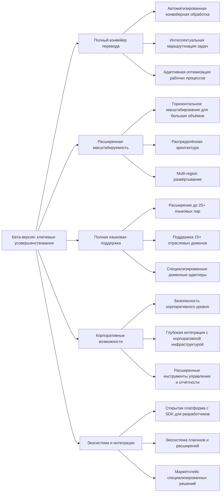

Бета-версия представляет собой полнофункциональный продукт, завершающий основной цикл разработки и готовый к масштабному коммерческому использованию. На этом этапе происходит интеграция всех компонентов в единую систему, обеспечивающую полный конвейер машинного перевода с высоким уровнем автоматизации и надёжности.

## Цели бета-версии

1. Завершить формирование полного конвейера обработки переводов с бесшовной интеграцией всех модулей
2. Обеспечить масштабируемость решения для работы с большими объемами текста и значительным числом пользователей
3. Расширить языковую и доменную поддержку согласно рыночным требованиям и приоритетам
4. Интегрировать продвинутые корпоративные возможности для успешного выхода в корпоративный сегмент
5. Создать платформу с открытой архитектурой для дальнейшего развития через экосистему партнеров

## Ключевые усовершенствования по сравнению с альфа-версией

## Функциональные возможности бета-версии

### 1. Полный конвейер перевода

- **Автоматизированная конвейерная обработка**:
    
    - Интегрированный процесс от загрузки документа до финального экспорта с минимальным участием человека
    - Умное планирование этапов обработки с оптимизацией производительности
    - Интеллектуальный мониторинг и восстановление при сбоях
    - Асинхронная обработка с поддержкой массовых загрузок и очередей
- **Интеллектуальная маршрутизация задач**:
    
    - Автоматическое распределение задач на основе их характеристик и требований
    - Динамическая приоритизация с учетом SLA и критичности проектов
    - Распределение нагрузки между человеческими и автоматизированными ресурсами
    - Предиктивный анализ для оптимизации распределения ресурсов
- **Адаптивная оптимизация рабочих процессов**:
    
    - Автоматическое выявление и устранение узких мест в процессе обработки
    - Самообучающиеся алгоритмы для непрерывного улучшения рабочих процессов
    - Проактивное выявление потенциальных проблем с автоматическим применением корректирующих мер

### 2. Расширенная масштабируемость

- **Горизонтальное масштабирование для больших объемов**:
    
    - Поддержка обработки до 5+ миллионов слов в день с возможностью линейного масштабирования
    - Автоматическое масштабирование ресурсов в зависимости от нагрузки
    - Многоуровневое кэширование для оптимизации производительности
    - Технические основы для увеличения производительности:
        - Оптимизированные алгоритмы параллельной обработки
        - Эффективное использование GPU для моделей машинного обучения
        - Интеллектуальное распределение ресурсов по микросервисам
- **Распределенная архитектура**:
    
    - Независимые микросервисы с изолированными областями ответственности
    - Асинхронное взаимодействие через высокопроизводительные очереди сообщений
    - Отказоустойчивый дизайн с автоматическим восстановлением компонентов
    - Подробное логирование и мониторинг для быстрой диагностики проблем
- **Multi-region развертывание**:
    
    - Поддержка географически распределенных инсталляций
    - Автоматическая репликация данных между регионами
    - Интеллектуальная маршрутизация запросов к ближайшим серверам

### 3. Полная языковая поддержка

- **Расширение до 25+ языковых пар**:
    
    - Поэтапное внедрение новых языковых пар, начиная с наиболее востребованных
    - Оптимизированные языковые модели для каждой пары
    - Программа качества для систематического улучшения перевода для всех языков
- **Поддержка 15+ отраслевых доменов**:
    
    - Приоритетное расширение в высокомаржинальные отрасли согласно маркетинговой стратегии
    - Глубокая терминологическая поддержка для каждого домена
    - Специализированные процессы обработки и проверки качества
- **Специализированные доменные адаптеры**:
    
    - Возможность быстрой адаптации к новым доменам без полного переобучения базовых моделей
    - Автоматизированное построение доменных терминологических баз
    - Интерфейс для дообучения системы на корпоративных данных клиента

### 4. Корпоративные возможности

- **Безопасность корпоративного уровня**:
    
    - Соответствие стандартам SOC 2, ISO 27001, GDPR, HIPAA
    - Расширенные возможности шифрования, включая BYOK (Bring Your Own Key)
    - Детальный аудит с отслеживанием всех операций в системе
    - Интеграция с корпоративными системами аутентификации (SSO, SAML, OIDC)
- **Глубокая интеграция с корпоративной инфраструктурой**:
    
    - Интеграция с корпоративными хранилищами (SharePoint, Box, Dropbox, Google Drive)
    - Поддержка комплексных рабочих процессов с участием нескольких департаментов
    - Возможность гибридного развертывания (облако + локальная инфраструктура)
- **Расширенные инструменты управления и отчетности**:
    
    - Детальная аналитика по использованию системы на всех уровнях
    - Панели мониторинга для различных ролей (руководители, переводчики, администраторы)
    - Инструменты для расчета ROI и TCO для корпоративных клиентов

### 5. Экосистема и интеграции

- **Открытая платформа с SDK для разработчиков**:
    
    - Полноценный SDK для интеграции и расширения функциональности
    - Документация API с интерактивными примерами
    - Поддержка основных языков программирования (Python, Java, C#, JavaScript)
- **Экосистема плагинов и расширений**:
    
    - Архитектура для подключения сторонних модулей и сервисов
    - Механизмы обеспечения безопасности при работе со сторонними компонентами
    - Инструменты для создания и публикации плагинов
- **Маркетплейс специализированных решений**:
    
    - Централизованная площадка для доступа к расширениям и модулям
    - Механизмы контроля качества для решений в маркетплейсе
    - Система рейтингов и отзывов

## Технические характеристики бета-версии

- **Архитектура**:
    
    - Распределенная микросервисная архитектура с изолированными доменами
    - Event-driven дизайн с асинхронной обработкой
    - Сервис-меш архитектура для управления межсервисной коммуникацией
- **Производительность**:
    
    - Скорость перевода: 600-750 страниц/час на стандартной конфигурации (повышение на ~50% по сравнению с альфа-версией)
    - Подтвержденное линейное масштабирование производительности при добавлении ресурсов
    - Поддержка документов практически неограниченного размера через потоковую обработку
    - Одновременная работа 100+ пользователей без деградации производительности
- **Устойчивость и надежность**:
    
    - Автоматическое восстановление после сбоев с минимальной потерей данных
    - Circuit breaker и bulkhead паттерны для изоляции проблем
    - SLA с гарантией доступности 99.9% для корпоративных клиентов

## Поэтапный переход от альфа-версии к бета-версии

Для минимизации рисков и обеспечения контролируемого развития продукта мы реализуем поэтапный переход от альфа к бета-версии:

1. **Фаза 1: Интеграция и стабилизация ядра системы** (Месяцы 1-5)
    
    - Интеграция ключевых модулей альфа-версии в единый конвейер
    - Стабилизация производительности и надежности базовых компонентов
    - Оптимизация архитектуры для будущего масштабирования
    - **Контрольная точка**: Завершенная интеграция базовых модулей с 99.5% стабильностью
2. **Фаза 2: Расширение функциональности и масштабируемости** (Месяцы 5-12)
    
    - Последовательное добавление новых языковых пар и доменных адаптеров
    - Внедрение механизмов масштабирования и высокой доступности
    - Разработка корпоративных возможностей и инструментов безопасности
    - **Контрольная точка**: Функциональная полнота 80% с успешными нагрузочными тестами
3. **Фаза 3: Развитие экосистемы и интеграций** (Месяцы 12-18)
    
    - Разработка SDK и API для внешних разработчиков
    - Создание маркетплейса и инструментов для работы с расширениями
    - Реализация интеграций с популярными корпоративными системами
    - **Контрольная точка**: Завершенная платформа с 10+ интеграциями и базовым SDK
4. **Фаза 4: Пилотное внедрение и итеративные улучшения** (Месяцы 18-24)
    
    - Пилотное внедрение у ключевых корпоративных клиентов
    - Сбор обратной связи и внесение итеративных улучшений
    - Оптимизация производительности на основе реальных рабочих нагрузок
    - **Контрольная точка**: Достижение целевых метрик качества и удовлетворенности клиентов

## 5 ключевых метрик успеха бета-версии

1. **Качество перевода**:
    
    - BLEU-score на 25-30% выше стандартных решений (измеряемое преимущество по сравнению с конкурентами)
    - Снижение времени постредактирования на 55-65% по сравнению с традиционными подходами
2. **Техническая производительность**:
    
    - Доступность системы: 99.9%+ (менее 9 часов простоя в год)
    - Время обработки: 600-750 страниц/час с линейным масштабированием
3. **Удовлетворенность пользователей**:
    
    - NPS (Net Promoter Score): 50+ (уровень "превосходно")
    - Retention rate: 90%+ (годовой показатель удержания клиентов)
4. **Масштабирование продукта**:
    
    - Количество активных корпоративных клиентов: 15-20
    - Общее количество активных клиентов: 80-100
5. **Финансовые показатели**:
    
    - Достижение ARR (Annual Recurring Revenue): $2-2.5M к концу первого года после запуска бета-версии
    - Средний чек: увеличение на 30-40% по сравнению с альфа-версией

## Критерии перехода от бета-версии к релиз-кандидату

Для обеспечения четкого перехода к релиз-кандидату (раздел 7.1.4) определены следующие критерии готовности:

1. **Технические критерии**:
    
    - Не более 5 критических багов в бэклоге
    - Стабильность системы: успешное прохождение 2-недельного стресс-теста без падений
    - Производительность: достижение 95% целевых показателей скорости обработки
    - Безопасность: успешное прохождение внешнего аудита безопасности
2. **Пользовательские критерии**:
    
    - Удовлетворенность пользователей: NPS не ниже 45
    - Успешное прохождение UAT (User Acceptance Testing) у 3+ корпоративных клиентов
    - Положительная обратная связь по ключевым функциям от 80%+ пользователей
3. **Бизнес-критерии**:
    
    - Наличие 5+ производственных внедрений у ключевых клиентов
    - Подтвержденный и измеримый ROI у пилотных клиентов
    - Готовность маркетинговых материалов и стратегии продаж для полноценного запуска

## План разработки бета-версии

|Этап|Сроки|Ключевые результаты|Контрольные метрики|
|---|---|---|---|
|Анализ результатов альфа-версии|1-2 месяца|Детальная карта приоритетов|Утвержденный план развития с KPI|
|Интеграция ядра системы|3-4 месяца|Базовый конвейер обработки|Стабильность работы 99.5%+|
|Расширение языков и доменов|4-6 месяцев|Новые языковые пары и домены|20+ языковых пар с валидацией качества|
|Разработка корпоративных функций|3-4 месяца|Корпоративные возможности|Соответствие требованиям безопасности|
|Создание экосистемы|5-6 месяцев|SDK и маркетплейс|10+ интеграций и базовый набор плагинов|
|Пилотное внедрение|3-4 месяца|Внедрение у ключевых клиентов|5+ производственных внедрений|
|Итеративные улучшения|2-3 месяца|Оптимизация на основе обратной связи|Достижение целевых показателей|
|**Итого:**|**18-24 месяца**|||

## Минимизация технического долга

Для обеспечения долгосрочной устойчивости продукта и соответствия разделу 7.7 "Управление техническим долгом", в бета-версии реализуются следующие меры:

1. **Комплексное тестирование**:
    
    - Достижение показателя покрытия кода тестами >80%
    - Автоматизированное тестирование производительности и регрессионное тестирование
    - Непрерывное фаззинг-тестирование для выявления краевых случаев
2. **Четкие стандарты разработки**:
    
    - Строгое следование стандартам кодирования и архитектурным принципам
    - Регулярные ревью кода и архитектурные ревью
    - Автоматизированная проверка качества кода в CI/CD пайплайне
3. **Целенаправленное рефакторинг**:
    
    - Выделение 15-20% времени разработки на рефакторинг существующего кода
    - Приоритизация рефакторинга критических компонентов системы
    - Плановые "дни технического долга" для всей команды разработки
4. **Документация и передача знаний**:
    
    - Комплексная техническая документация всех компонентов системы
    - Система передачи знаний и внутреннего обучения
    - Подробное документирование архитектурных решений и причин их принятия

## Ресурсы для разработки бета-версии

Требуемые ресурсы для разработки бета-версии согласованы с разделом 10 "Организационная структура" и учитывают поэтапный найм и развитие команды:

1. **Ключевые технические специалисты**:
    
    - 3-4 архитектора программного обеспечения (системная архитектура и интеграция)
    - 6-8 разработчиков бэкенда (микросервисы и ядро системы)
    - 4-5 разработчиков фронтенда (пользовательские интерфейсы)
    - 3-4 NLP/ML специалистов (языковые модели и алгоритмы перевода)
    - 2-3 DevOps инженера (инфраструктура и автоматизация)
    - 2-3 QA инженера (автоматизированное тестирование)
2. **Специалисты предметной области**:
    
    - 3-4 технических лингвиста (оценка качества и лингвистические модели)
    - 2-3 отраслевых эксперта (part-time, для валидации доменных адаптеров)
    - 2 специалиста по пользовательскому опыту (UX/UI дизайн)
3. **Управленческие ресурсы**:
    
    - 2 продуктовых менеджера
    - 1 технический проджект-менеджер
    - 1 менеджер по качеству

## Финансовые аспекты разработки бета-версии

Финансовые параметры разработки бета-версии согласованы с разделами 9 "Финансовый план" и 12 "Инвестиционная стратегия":

1. **Общий бюджет разработки бета-версии**: $1,650,000 - $1,950,000
    
    - Расходы на персонал: 65-70%
    - Инфраструктура и технические ресурсы: 15-20%
    - Тестирование и контроль качества: 10-12%
    - Маркетинг и продвижение: 5-8%
2. **Ожидаемые финансовые результаты** (согласовано с разделом 9.4):
    
    - Достижение ARR: $2-2.5M к концу первого года после запуска
    - Количество клиентов: 80-100 активных клиентов различных категорий
    - Точка безубыточности: 18-20 месяцев после коммерческого запуска бета-версии
3. **Связь с инвестиционной стратегией** (согласовано с разделом 12):
    
    - Финансирование бета-версии осуществляется в рамках Раунда B
    - Предполагаемый промежуточный раунд для масштабирования и развития экосистемы

## Стратегия адаптации к технологическим изменениям

Для обеспечения гибкости в условиях быстро меняющихся технологий (согласно разделу 5) в течение длительной разработки бета-версии предусмотрены следующие механизмы:

1. **Модульная архитектура** с возможностью замены отдельных компонентов без перестройки всей системы
    
2. **Ежеквартальный технологический аудит** для выявления новых технологий, которые могут существенно повлиять на продукт
    
3. **Выделенная R&D команда** (2-3 специалиста) для экспериментов с новыми технологиями и оценки их потенциала
    
4. **Механизмы быстрого прототипирования** для оперативной проверки новых технологических решений
    
5. **Резервный бюджет** (7-10% от общего) для быстрой интеграции критически важных технологических инноваций
    

## Взаимосвязь с маркетинговой стратегией

Технические возможности бета-версии непосредственно поддерживают маркетинговую стратегию (раздел 8) следующим образом:

1. **Позиционирование как корпоративного решения**:
    
    - Реализация корпоративных функций безопасности и управления
    - Масштабируемость для работы с большими объемами данных
    - Интеграционные возможности для встраивания в корпоративную инфраструктуру
2. **Отраслевая специализация**:
    
    - Доменные адаптеры для приоритетных отраслей, определенных в маркетинговой стратегии
    - Специализированные инструменты для каждой целевой отрасли
    - Измеримые показатели качества перевода для каждого домена
3. **Дифференциация от конкурентов**:
    
    - Акцент на многостратегическом адаптивном подходе как ключевом отличии
    - Разработка уникальных технологических преимуществ, выделенных в маркетинговой стратегии
    - Внедрение функций, отсутствующих у конкурентов

## Заключение

Бета-версия системы машинного перевода представляет собой полноценное коммерческое решение с полным конвейером обработки переводов, обширной языковой поддержкой и глубокой отраслевой специализацией. Поэтапный подход к разработке с четкими контрольными точками и критериями успеха обеспечивает управляемый переход от альфа-версии к бета-версии, а затем к релиз-кандидату.

Тщательное внимание к техническому долгу, масштабируемости и безопасности создает прочную основу для долгосрочного развития продукта. Открытая архитектура и экосистемный подход закладывают фундамент для формирования сообщества партнеров и расширения функциональности через сторонние решения.

Интеграция разработки бета-версии с общей инвестиционной стратегией, маркетинговым планом и организационной структурой обеспечивает целостный подход к развитию продукта и бизнеса в целом. Четкие метрики успеха и критерии перехода к релиз-кандидату создают основу для объективной оценки готовности продукта к полномасштабному коммерческому использованию.