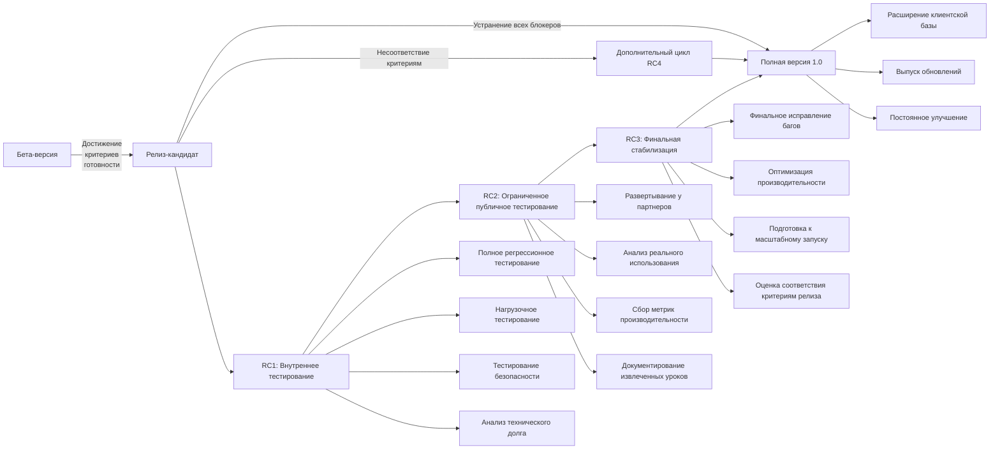

Релиз-кандидат представляет собой финальную стадию разработки перед официальным выпуском полной версии продукта. На этом этапе система проходит всестороннее тестирование в условиях, максимально приближенных к реальному использованию, что позволяет выявить и устранить последние недостатки перед выходом на широкий рынок.

## Цели релиз-кандидата

1. Провести финальную комплексную верификацию и валидацию всей системы
2. Отработать процессы развертывания и масштабирования в реальных условиях
3. Провести всесторонний анализ производительности и безопасности
4. Завершить подготовку документации и обучающих материалов для пользователей
5. Осуществить плавный переход к полноценной коммерческой эксплуатации

## Методология релиз-кандидата

В отличие от предыдущих версий, релиз-кандидат не добавляет принципиально новые функции, а фокусируется на стабильности, надежности и производительности системы. Мы применяем трехэтапный подход к релиз-кандидату:

1. **RC1 (Релиз-кандидат 1)**: Внутреннее тестирование и стабилизация
2. **RC2 (Релиз-кандидат 2)**: Ограниченное публичное тестирование
3. **RC3 (Релиз-кандидат 3)**: Финальная стабилизация перед релизом

## Ключевые задачи релиз-кандидата

### 1. Финальная верификация и валидация

- **Комплексное регрессионное тестирование**:
    
    - Полное покрытие тестами всех функциональных модулей
    - Автоматизированная проверка всех пользовательских сценариев согласно разделу 3.5
    - Тестирование граничных случаев и редких сценариев использования
    - Валидация интеграций со всеми поддерживаемыми внешними системами
- **Всестороннее нагрузочное тестирование**:
    
    - Моделирование пиковых нагрузок, превышающих ожидаемые на 50-100%
    - Длительные стресс-тесты (72+ часа) для выявления утечек ресурсов
    - Проверка механизмов автоматического масштабирования и балансировки
    - Валидация целевых показателей производительности (700-750 страниц/час)
- **Углубленное тестирование безопасности**:
    
    - Независимый аудит безопасности внешними экспертами
    - Penetration testing с моделированием различных векторов атак
    - Проверка соответствия требованиям стандартов (SOC 2, ISO 27001, GDPR)
    - Выявление и устранение потенциальных уязвимостей в защите данных

### 2. Оптимизация производительности и масштабируемости

- **Финальная оптимизация критических путей**:
    
    - Выявление и устранение узких мест в производительности
    - Оптимизация запросов к базам данных и кэширования
    - Снижение времени отклика API и пользовательского интерфейса
    - Минимизация расхода ресурсов при обработке больших объемов данных
- **Проверка масштабируемости**:
    
    - Валидация линейного масштабирования до 10x от базовой нагрузки
    - Тестирование географически распределенных развертываний
    - Проверка процедур автоматизированного развертывания в различных средах
    - Валидация процессов бесшовного обновления без простоев
- **Оптимизация использования ресурсов**:
    
    - Балансировка распределения CPU, памяти и сетевых ресурсов
    - Минимизация затрат на инфраструктуру при сохранении производительности
    - Оптимизация процессов обработки для снижения пиковых нагрузок

### 3. Документация и обучающие материалы

- **Завершение пользовательской документации**:
    
    - Подробные руководства для всех категорий пользователей
    - Интерактивные обучающие материалы и видео-инструкции
    - Документация API и интеграционных возможностей
    - Оптимизация встроенной справочной системы
- **Техническая документация для партнеров и интеграторов**:
    
    - Исчерпывающая документация API с примерами кода
    - Руководства по разработке расширений и плагинов
    - Рекомендации по оптимальным конфигурациям и развертыванию
    - Документация по безопасности и соответствию нормативным требованиям
- **Внутренняя техническая документация**:
    
    - Детальная архитектурная документация для поддержки и развития
    - Описание всех компонентов системы и их взаимодействия
    - Руководства по процедурам обслуживания и обновления
    - Документация для службы поддержки с типовыми решениями проблем

### 4. Управление техническим долгом перед релизом

В соответствии с разделом 7.7 "Управление техническим долгом", на этапе релиз-кандидата проводится финальный анализ и устранение критического технического долга:

- **Аудит кодовой базы**:
    
    - Выявление критических участков с высоким техническим долгом
    - Приоритизация рефакторинга на основе оценки рисков
    - Устранение проблемных участков, которые могут повлиять на стабильность полной версии
- **Ревизия архитектурных решений**:
    
    - Проверка соответствия реализации проектным архитектурным решениям
    - Документирование вынужденных отклонений и технических компромиссов
    - Планирование архитектурных улучшений для будущих версий
- **Оптимизация тестовой инфраструктуры**:
    
    - Повышение эффективности автоматических тестов
    - Устранение нестабильных тестов (flaky tests)
    - Обеспечение полного покрытия критических путей

## План и сроки релиз-кандидата

|Этап|Сроки|Ключевые результаты|Критерии завершения|Индикаторы раннего предупреждения|
|---|---|---|---|---|
|RC1: Внутреннее тестирование|4-6 недель|Выявление и устранение критических проблем|Отсутствие блокирующих багов, стабильность >99.9%|>5 критических багов, падение стабильности ниже 99.5%|
|RC2: Ограниченное публичное тестирование|6-8 недель|Валидация в реальных условиях, сбор обратной связи|Успешное использование 10+ партнерами, NPS >60|NPS <45, >3 клиента прекратили тестирование|
|RC3: Финальная стабилизация|2-4 недели|Финальные оптимизации, подготовка к релизу|Выполнение всех критериев релиза|Невыполнение >2 критических критериев релиза|
|Полная версия 1.0|Контрольная точка|Официальный релиз продукта|Готовность к полномасштабному коммерческому использованию||
|**Общая продолжительность**:|**3-4 месяца**||||

Данный график релиз-кандидата синхронизирован с общим планом проекта (раздел 7.3 "Ключевые вехи и график релизов"), обеспечивая плавный переход от бета-версии к коммерческому релизу в запланированные сроки.

## Критерии перехода от релиз-кандидата к полной версии

Для обеспечения качественного перехода к полной версии 1.0 определены следующие строгие критерии готовности:

1. **Качество и стабильность**:
    
    - Отсутствие критических и блокирующих багов в системе
    - Не более 10 известных несущественных багов в бэклоге
    - Стабильность работы 99.95%+ в течение 30+ дней
    - Успешное прохождение полного набора автоматизированных тестов
2. **Производительность и масштабируемость**:
    
    - Подтвержденная производительность: 700-750 страниц/час на стандартной конфигурации
    - Успешное масштабирование до 5x базовой нагрузки без деградации качества
    - Время отклика API в пределах заданных SLA (95% запросов <200 мс)
    - Успешное тестирование восстановления при сбоях критических компонентов
3. **Пользовательский опыт и бизнес-метрики**:
    
    - NPS от пилотных пользователей: 60+
    - Удовлетворенность пользователей (пользовательское тестирование): 4.5+ из 5.0
    - Завершенность документации и обучающих материалов: 100%
    - Наличие не менее 15 успешных пилотных внедрений с подтвержденными результатами
4. **Готовность к масштабированию**:
    
    - Завершенные процедуры обслуживания и масштабирования
    - Полностью автоматизированное развертывание и обновление
    - Готовые процессы технической поддержки и реагирования на инциденты
    - Обученная команда поддержки и обслуживания

## План действий при несоответствии критериям релиза

В случае, если по завершении этапа RC3 не все критерии релиза будут достигнуты, предусмотрен следующий план действий:

1. **Приоритизация проблем**:
    
    - Классификация несоответствий по критичности и влиянию на пользовательский опыт
    - Определение минимально необходимого набора исправлений для релиза
2. **Дополнительный цикл RC4**:
    
    - Сроки: 2-4 недели в зависимости от объема работ
    - Фокус исключительно на устранении критических несоответствий
    - Сокращенное тестирование, сфокусированное на проблемных областях
3. **Альтернативные сценарии**:
    
    - Релиз с ограниченной функциональностью (если нестабильны некритичные компоненты)
    - Поэтапный выпуск с ограниченным доступом для новых клиентов
    - В крайнем случае – перенос сроков релиза с прозрачной коммуникацией заинтересованным сторонам

## Механизм сбора и обработки обратной связи

Для максимально эффективного сбора и использования обратной связи во время RC2 реализуется комплексный подход:

1. **Многоканальный сбор обратной связи**:
    
    - Встроенные в интерфейс инструменты обратной связи
    - Еженедельные глубинные интервью с ключевыми пользователями
    - Анкетирование по конкретным аспектам использования
    - Автоматический сбор метрик использования и производительности
2. **Структурированная обработка**:
    
    - Категоризация обратной связи (баги, улучшения, пожелания)
    - Оценка влияния на пользовательский опыт
    - Приоритизация на основе частоты упоминания и критичности
    - Еженедельная синхронизация с продуктовой и разработческой командами
3. **Отчетность и прозрачность**:
    
    - Еженедельный отчет о ключевых результатах обратной связи
    - Публичный статус решения выявленных проблем
    - Прямая коммуникация с пользователями о внесенных улучшениях

## Специфические риски этапа релиз-кандидата

В дополнение к общим рискам проекта (раздел 11 "Анализ рисков"), на этапе релиз-кандидата особое внимание уделяется следующим специфическим рискам:

1. **Технические риски**:
    
    - **Недостаточная производительность при реальной нагрузке**:
        - Вероятность: средняя, влияние: высокое
        - Митигация: раннее нагрузочное тестирование, резерв вычислительных ресурсов
    - **Проблемы совместимости в разнородных средах клиентов**:
        - Вероятность: высокая, влияние: среднее
        - Митигация: тестирование в разнообразных конфигурациях, детальная документация по совместимости
2. **Проектные риски**:
    
    - **Затягивание цикла релиз-кандидата**:
        - Вероятность: средняя, влияние: высокое
        - Митигация: резервное время в графике, четкая приоритизация исправлений
    - **Неудовлетворительная обратная связь от пилотных пользователей**:
        - Вероятность: низкая, влияние: критическое
        - Митигация: раннее вовлечение ключевых клиентов, итеративное улучшение на основе обратной связи
3. **Рыночные риски**:
    
    - **Выпуск конкурентного решения во время RC**:
        - Вероятность: средняя, влияние: среднее
        - Митигация: мониторинг конкурентов, гибкость в корректировке сроков релиза
    - **Изменение рыночных ожиданий и требований**:
        - Вероятность: низкая, влияние: высокое
        - Митигация: постоянный анализ рынка, адаптивность в приоритизации функций

## Стратегия адаптации к технологическим изменениям

В соответствии с разделом 5 "Стратегия адаптации к технологическим прорывам", на этапе релиз-кандидата предусмотрены следующие меры для реагирования на возможные технологические изменения:

1. **Постоянный мониторинг технологического ландшафта**:
    
    - Еженедельный анализ новых исследований и релизов в области NLP и машинного перевода
    - Оценка потенциального влияния на конкурентоспособность продукта
2. **Механизм быстрого реагирования**:
    
    - Выделенная R&D группа для быстрой оценки новых технологий
    - Критерии для принятия решения о включении технологических инноваций даже на этапе RC
    - Процедуры безопасной интеграции критически важных технологических улучшений
3. **Стратегический резерв**:
    
    - Технический резерв в архитектуре для интеграции новых компонентов
    - Временной резерв в графике для реакции на значимые технологические прорывы
    - Бюджетный резерв (7-10%) для быстрого освоения новых технологий при необходимости

## Стратегия перехода существующих пользователей

Для обеспечения плавного перехода пользователей бета-версии на полную версию разработан детальный план миграции:

1. **Подготовка пользователей**:
    
    - Заблаговременное уведомление (за 30+ дней) о переходе на полную версию
    - Обучающие материалы по новым функциям и изменениям
    - Вебинары и консультации для ключевых клиентов
2. **Техническая миграция**:
    
    - Автоматическая миграция данных с сохранением всей пользовательской настройки
    - Возможность параллельного использования бета и полной версии в течение переходного периода (30 дней)
    - Инструменты для самостоятельной проверки корректности миграции
3. **Поддержка в переходный период**:
    
    - Усиленная команда поддержки в течение первых 2 недель после релиза
    - Приоритетная обработка запросов от мигрирующих пользователей
    - Механизм быстрого отката к бета-версии при выявлении критических проблем

## Документирование извлеченных уроков

Для систематического улучшения процессов разработки и выпуска будущих версий продукта внедряется структурированный подход к документированию опыта:

1. **Систематический сбор данных**:
    
    - Еженедельные ретроспективы на каждом этапе RC
    - Документирование успешных практик и обнаруженных проблем
    - Сбор метрик эффективности процессов тестирования и отладки
2. **Аналитика и формализация**:
    
    - Квартальный анализ накопленного опыта
    - Формализация лучших практик в виде процедур и шаблонов
    - Обновление методологии разработки и тестирования
3. **Распространение знаний**:
    
    - Внутренние семинары по обмену опытом
    - Обновление документации для разработчиков и тестировщиков
    - Создание базы знаний типовых проблем и их решений

## Ресурсы для этапа релиз-кандидата и полной версии

Требуемые ресурсы согласованы с разделом 10.2 "Команда и кадровые потребности" и адаптированы к специфике этапа релиз-кандидата:

1. **Команда**:
    
    - Основная команда разработки из этапа бета-версии
    - Расширенная команда QA (+3 специалиста) для интенсивного тестирования
    - 2 специалиста по производительности и оптимизации
    - 2 специалиста по безопасности
    - 2 технических писателя для завершения документации
    - Команда поддержки (5 человек) для работы с пилотными клиентами
2. **Инфраструктура**:
    
    - Продакшн-окружение с полным резервированием и отказоустойчивостью
    - Тестовые и предпродакшн среды для валидации изменений
    - Инфраструктура для нагрузочного и стресс-тестирования
    - Среды для пилотных клиентов и партнеров

## Финансовые аспекты релиз-кандидата и полной версии

Финансовые параметры релиз-кандидата согласованы с разделами 9 "Финансовый план" и 12 "Инвестиционная стратегия":

1. **Бюджет релиз-кандидата**:
    
    - Общий бюджет: $350,000 - $450,000
    - Распределение: 55% - персонал, 20% - инфраструктура, 15% - тестирование и QA, 10% - маркетинг
    - Резервный фонд: дополнительно 15% ($50,000-$70,000) для непредвиденных ситуаций или дополнительного цикла RC4
2. **Финансовые прогнозы после релиза**:
    
    - Достижение ARR: $3.5-4M через 12 месяцев после релиза v1.0
    - Показатели unit-экономики согласно разделу 9.3:
        - CAC (стоимость привлечения клиента): $8,000-$12,000
        - LTV (пожизненная ценность клиента): $45,000-$60,000
        - LTV/CAC: 5-6x (превосходит отраслевой ориентир 3x)

## Интеграция с партнерской стратегией

В соответствии с разделом 8.6 "Партнерская стратегия", релиз-кандидат и полная версия интегрируются с развитием партнерской сети следующим образом:

1. **Вовлечение партнеров в RC2**:
    
    - Привлечение 5-7 ключевых партнеров для пилотного тестирования
    - Обучение партнеров работе с продуктом и сбор детальной обратной связи
    - Разработка партнерских кейсов для маркетинговых материалов
2. **Программа раннего доступа для партнеров**:
    
    - Приоритетный доступ партнеров к полной версии за 2 недели до публичного релиза
    - Обучение партнерских команд внедрения и поддержки
    - Совместная подготовка маркетинговых материалов
3. **Официальный запуск партнерской программы**:
    
    - Синхронизация с релизом полной версии
    - Публичное анонсирование первых сертифицированных партнеров
    - Запуск маркетплейса расширений с первыми партнерскими решениями

## Маркетинговая стратегия запуска полной версии

Запуск полной версии сопровождается комплексной маркетинговой кампанией:

1. **Предрелизная активность**:
    
    - Программа раннего доступа для избранных клиентов и партнеров
    - Публикация технических white papers и результатов бенчмаркинга
    - Серия вебинаров и демонстраций для потенциальных клиентов
    - PR-кампания в отраслевых медиа и социальных сетях
2. **Запуск полной версии**:
    
    - Официальное мероприятие для презентации продукта
    - Публикация кейсов и отзывов пилотных клиентов
    - Запуск партнерской программы и маркетплейса
    - Таргетированные кампании для приоритетных отраслей

## Заключение

Этап релиз-кандидата и выпуск полной версии 1.0 представляют собой критически важные фазы в жизненном цикле продукта, обеспечивающие переход от разработки к полноценной коммерческой эксплуатации. Тщательное тестирование, оптимизация производительности и подготовка сопутствующих материалов гарантируют высокое качество продукта при выходе на рынок.

Строгие критерии перехода от релиз-кандидата к полной версии обеспечивают объективную оценку готовности продукта к широкому использованию. После релиза структурированный подход к поддержке и развитию создает основу для долгосрочного успеха продукта и постоянного улучшения его качества и функциональности.

Интеграция этапа релиз-кандидата с общей инвестиционной стратегией, финансовым планом, партнерской программой и стратегией адаптации к технологическим изменениям обеспечивает целостный подход к выводу продукта на рынок, минимизируя риски и создавая прочную основу для коммерческого успеха.