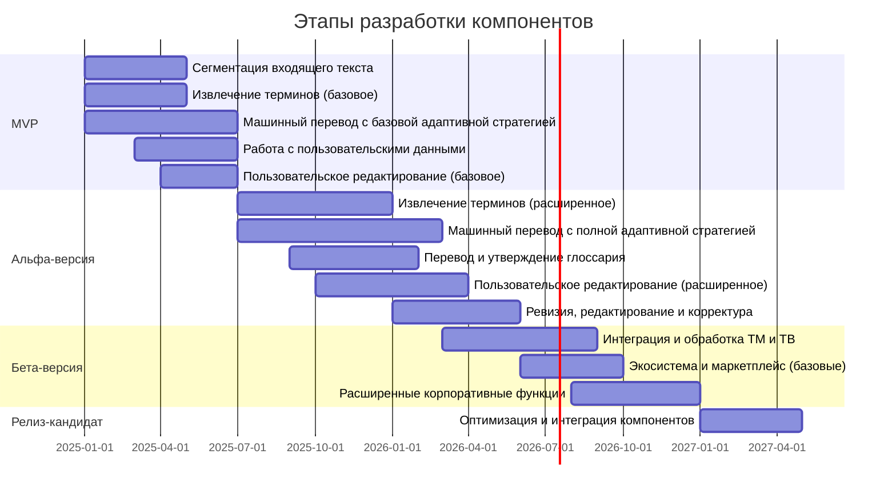
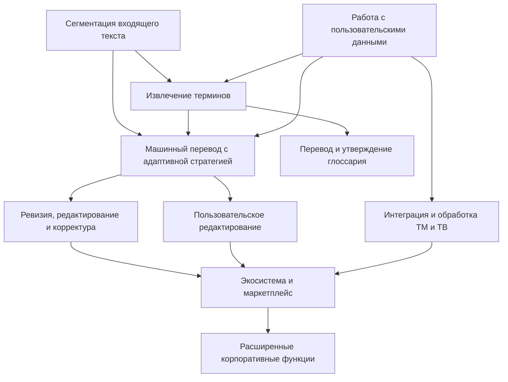

Эффективная разработка и внедрение многомодульной системы машинного перевода требует стратегической приоритизации компонентов, учитывающей как техническую обоснованность, так и бизнес-аспекты проекта. Данный подход обеспечивает максимальную ценность на ранних этапах, снижает риски и согласуется с общей стратегией выхода на рынок.

## Методология приоритизации

Для приоритизации компонентов системы используется комплексный подход, основанный на следующих критериях:

1. **Бизнес-ценность** – непосредственное влияние на ключевые бизнес-показатели и удовлетворенность пользователей
2. **Техническая сложность** – трудоемкость разработки и внедрения компонента
3. **Зависимости между компонентами** – необходимость одних компонентов для функционирования других
4. **Рыночный спрос** – соответствие компонентов потребностям целевых сегментов в соответствии с разделом 8.5
5. **Финансовая эффективность** – соотношение затрат на разработку к ожидаемой отдаче (ROI)
6. **Дифференциация от конкурентов** – степень уникальности компонента на рынке

## Ключевые компоненты и их приоритизация

На основе проведенного анализа определены следующие приоритеты разработки компонентов с учетом их соответствия рыночной стратегии (раздел 8.5):

```mermaid
quadrantChart
    title Матрица приоритизации компонентов
    x-axis "Техническая сложность"
    y-axis "Бизнес-ценность"
    quadrant-1 "ВЫСОКИЙ ПРИОРИТЕТ"
    quadrant-2 "ВТОРОЙ ПРИОРИТЕТ"
    quadrant-3 "НИЗКИЙ ПРИОРИТЕТ"
    quadrant-4 "ТРЕТИЙ ПРИОРИТЕТ"
  
    "Машинный перевод с адаптивной стратегией" : [0.7, 0.9]
    "Сегментация входящего текста" : [0.3, 0.85]
    "Извлечение терминов" : [0.5, 0.8]
    "Работа с пользовательскими данными" : [0.4, 0.7]
    "Перевод и утверждение глоссария" : [0.6, 0.65]
    "Ревизия, редактирование и корректура" : [0.5, 0.55]
    "Пользовательское редактирование" : [0.4, 0.6]
    "Интеграция и обработка TM и TB" : [0.6, 0.43]
    "Экосистема и маркетплейс" : [0.8, 0.37]
    "Расширенные корпоративные функции" : [0.7, 0.28]
```
### Приоритет 1: Ядро системы и ключевые дифференцирующие технологии

Эти компоненты обеспечивают основную ценность продукта и формируют фундамент для дальнейшей разработки:

1. **Машинный перевод с адаптивной стратегией**
    
    - **Бизнес-ценность:** Критически высокая (9/10) – основное конкурентное преимущество
    - **Техническая сложность:** Высокая (7/10) – требует значительных исследований и оптимизации
    - **Расчетная стоимость разработки:** $450,000-550,000
    - **Соответствие рыночной стратегии:** Критически важный компонент для дифференциации от универсальных решений, таких как Google Titans, особенно для технических бюро переводов и электротехнического сектора (Этап 1 в Go-to-Market)
    - **Ожидаемый ROI:** 4.5x в течение 24 месяцев
    - **Критерии успеха:** Улучшение BLEU-score на 15-20% против стандартных решений в технических доменах
2. **Сегментация входящего текста**
    
    - **Бизнес-ценность:** Высокая (8/10) – критически важна для точности перевода
    - **Техническая сложность:** Средняя (3/10) – существуют готовые алгоритмы, требующие адаптации
    - **Расчетная стоимость разработки:** $180,000-220,000
    - **Соответствие рыночной стратегии:** Базовая функциональность, необходимая для всех целевых сегментов
    - **Ожидаемый ROI:** 6.0x в течение 24 месяцев
    - **Критерии успеха:** Точность сегментации >98% для технической документации
3. **Извлечение терминов**
    
    - **Бизнес-ценность:** Высокая (8/10) – критически важна для специализированных текстов
    - **Техническая сложность:** Средне-высокая (5/10) – требует создания специализированных алгоритмов
    - **Расчетная стоимость разработки:** $300,000-350,000
    - **Соответствие рыночной стратегии:** Ключевой компонент для всех вертикальных рынков, особенно важен для электротехнического сектора и фармацевтики (Этапы 1-2 в Go-to-Market)
    - **Ожидаемый ROI:** 5.2x в течение 24 месяцев
    - **Критерии успеха:** Точность извлечения >85% для технических терминов

### Приоритет 2: Пользовательский опыт и работа с данными

Компоненты, обеспечивающие эффективное взаимодействие пользователей с системой и работу с лингвистическими данными:

4. **Работа с пользовательскими данными**
    
    - **Бизнес-ценность:** Высокая (7/10) – обеспечивает персонализацию системы
    - **Техническая сложность:** Средняя (4/10) – требует интеграции с различными форматами данных
    - **Расчетная стоимость разработки:** $220,000-270,000
    - **Соответствие рыночной стратегии:** Важный компонент для интеграции с существующими процессами клиентов в технических бюро переводов (Этап 1)
    - **Ожидаемый ROI:** 4.8x в течение 24 месяцев
    - **Критерии успеха:** Поддержка 10+ форматов данных, время интеграции <3 дней
5. **Перевод и утверждение глоссария**
    
    - **Бизнес-ценность:** Высокая (7/10) – критична для терминологической согласованности
    - **Техническая сложность:** Средне-высокая (6/10) – требует разработки специализированных интерфейсов
    - **Расчетная стоимость разработки:** $280,000-330,000
    - **Соответствие рыночной стратегии:** Ключевой компонент для работы с автомобильной промышленностью и нефтегазовым сектором (Этап 2)
    - **Ожидаемый ROI:** 4.3x в течение 24 месяцев
    - **Критерии успеха:** Терминологическая консистентность >90%, снижение времени утверждения на 50%
6. **Пользовательское редактирование**
    
    - **Бизнес-ценность:** Средне-высокая (6/10) – важна для конечного качества перевода
    - **Техническая сложность:** Средняя (4/10) – требует разработки интуитивных интерфейсов
    - **Расчетная стоимость разработки:** $240,000-290,000
    - **Соответствие рыночной стратегии:** Необходим для бюро переводов и всех клиентов, требующих постредактирования (Этапы 1-2)
    - **Ожидаемый ROI:** 3.9x в течение 24 месяцев
    - **Критерии успеха:** Сокращение времени редактирования на 40%, удовлетворенность пользователей >85%

### Приоритет 3: Расширенные возможности качества и интеграции

Компоненты, повышающие качество выходного текста и обеспечивающие интеграцию с существующими системами:

7. **Ревизия, редактирование и корректура**
    
    - **Бизнес-ценность:** Средне-высокая (6/10) – важна для финального качества
    - **Техническая сложность:** Средняя (5/10) – требует комбинации различных подходов
    - **Расчетная стоимость разработки:** $260,000-310,000
    - **Соответствие рыночной стратегии:** Важен для нефтегазового сектора и фармацевтики, где критична точность (Этапы 2-3)
    - **Ожидаемый ROI:** 3.5x в течение 24 месяцев
    - **Критерии успеха:** Сокращение количества ошибок на 80%, время автоматической проверки <1 мин на 1000 слов
8. **Интеграция и обработка TM и TB**
    
    - **Бизнес-ценность:** Средняя (5/10) – важна для корпоративных пользователей
    - **Техническая сложность:** Средне-высокая (6/10) – требует интеграции с различными форматами
    - **Расчетная стоимость разработки:** $290,000-340,000
    - **Соответствие рыночной стратегии:** Необходим для интеграции с корпоративными рабочими процессами (Этап 3)
    - **Ожидаемый ROI:** 3.2x в течение 24 месяцев
    - **Критерии успеха:** Поддержка 15+ форматов TM/TB, скорость индексации >10,000 единиц/мин

### Приоритет 4: Экосистемные и корпоративные функции

Компоненты, расширяющие возможности системы и обеспечивающие интеграцию в корпоративную среду:

9. **Экосистема и маркетплейс**
    
    - **Бизнес-ценность:** Средне-низкая (4/10) – важна для долгосрочного роста
    - **Техническая сложность:** Высокая (8/10) – требует разработки сложной инфраструктуры
    - **Расчетная стоимость разработки:** $350,000-400,000
    - **Соответствие рыночной стратегии:** Компонент для этапа масштабирования и экспансии (Этап 3)
    - **Ожидаемый ROI:** 2.8x в течение 24 месяцев
    - **Критерии успеха:** Привлечение 15+ партнеров, 30+ расширений в маркетплейсе
10. **Расширенные корпоративные функции**
    
    - **Бизнес-ценность:** Средне-низкая (3/10) – важны для крупных предприятий
    - **Техническая сложность:** Высокая (7/10) – требует интеграции с корпоративными системами
    - **Расчетная стоимость разработки:** $320,000-370,000
    - **Соответствие рыночной стратегии:** Необходим для выхода на корпоративных клиентов на Этапе 3
    - **Ожидаемый ROI:** 2.5x в течение 24 месяцев
    - **Критерии успеха:** Соответствие требованиям SOC 2, GDPR, ISO 27001, успешные внедрения у 5+ корпоративных клиентов

## Сценарный подход к приоритизации

Для обеспечения гибкости в условиях меняющегося рынка и возможных технологических изменений разработаны три сценария приоритизации:

### Базовый сценарий (вероятность 60%)

Предполагает равномерный рост рынка машинного перевода (CAGR 18-20%) и постепенную вертикальную специализацию существующих решений.

**Приоритеты:**

1. Последовательная разработка компонентов в соответствии с основной приоритизацией
2. Фокус на качество реализации ключевых дифференцирующих технологий
3. Поэтапное расширение на новые отрасли в соответствии с Go-to-Market стратегией

**Триггеры перехода к этому сценарию:**

- Стабильный рост спроса на многоязычный контент
- Успешное внедрение MVP у первых клиентов
- Отсутствие радикальных технологических прорывов у конкурентов

### Сценарий быстрого роста рынка (вероятность 25%)

Предполагает взрывной рост рынка специализированного машинного перевода (CAGR 25-30%) и ускоренное формирование вертикальных сегментов.

**Приоритеты:**

1. Параллельная разработка ключевых компонентов для быстрого выхода на рынок
2. Ускоренный переход к компонентам интеграции для охвата большего числа клиентов
3. Раннее включение корпоративных функций для выхода на крупных заказчиков

**Триггеры перехода к этому сценарию:**

- Превышение плановых показателей выручки на ≥30% в течение двух последовательных кварталов
- Резкий рост потребности в локализации в целевых сегментах
- Появление стратегического партнера с обширной клиентской базой

### Сценарий технологической дезрапции (вероятность 15%)

Предполагает появление принципиально новых подходов к машинному переводу или радикальное улучшение существующих технологий (например, развитие Google Titans).

**Приоритеты:**

1. Переоценка технологического ядра с возможным пивотом
2. Усиленный фокус на создание уникальных активов (терминологические базы, отраслевая экспертиза)
3. Приоритизация интеграций с внешними системами для сохранения рыночных позиций

**Триггеры перехода к этому сценарию:**

- Появление прорывных технологий с качеством перевода, значительно превосходящим текущий уровень
- Выход на рынок непрофильных технологических гигантов с конкурентными продуктами
- Радикальное изменение экономики отрасли и бизнес-моделей

## Этапы разработки компонентов

На основе приоритизации и согласования с Go-to-Market стратегией (раздел 8.5) разработка компонентов распределяется по следующим этапам:


### Этап MVP (6-8 месяцев): Соответствие Этапу 1 Go-to-Market

Основная цель этапа — создание минимально жизнеспособного продукта, демонстрирующего ключевые преимущества системы для технических бюро переводов и первых клиентов из электротехнического сектора:

1. **Базовые компоненты ядра** (месяцы 1-4):
    
    - Сегментация входящего текста
    - Базовое извлечение терминов
    - Начало разработки многостратегического подхода
    - **Бюджет на данный этап:** $400,000-500,000
2. **Расширение функциональности** (месяцы 4-6):
    
    - Базовая работа с пользовательскими данными
    - Упрощенный интерфейс редактирования
    - Интеграция компонентов в единую систему
    - **Бюджет на данный этап:** $300,000-350,000
3. **Соответствие маркетинговым целям**:
    
    - Поддержка 3-5 языковых пар с фокусом на EN-RU, EN-DE для технической документации
    - Точность перевода технической терминологии >85%
    - Возможность использования в программе раннего доступа для пилотных клиентов

### Этап Альфа-версии (8-12 месяцев): Соответствие Этапу 2 Go-to-Market

Основная цель этапа — расширение функциональности для укрепления позиций в сегменте технических бюро переводов и выхода в электротехнический сектор, автомобильную промышленность и нефтегазовый сектор:

1. **Развитие ядра системы** (месяцы 1-8):
    
    - Расширенное извлечение терминов
    - Полноценная реализация многостратегического адаптивного перевода
    - Углубленная работа с контекстом
    - **Бюджет на данный этап:** $450,000-550,000
2. **Улучшение пользовательского опыта** (месяцы 3-12):
    
    - Разработка системы перевода и утверждения глоссария
    - Расширенные инструменты пользовательского редактирования
    - Внедрение системы ревизии, редактирования и корректуры
    - **Бюджет на данный этап:** $400,000-500,000
3. **Соответствие маркетинговым целям**:
    
    - Расширение до 10-15 языковых пар
    - Специализированные функции для автомобильной промышленности и нефтегазового сектора
    - Готовность к использованию в коммерческих проектах среднего масштаба

### Этап Бета-версии (8-10 месяцев): Соответствие Этапу 3 Go-to-Market

Основная цель этапа — создание полнофункциональной системы для масштабирования и экспансии, выхода в новые вертикальные рынки и международного развития:

1. **Интеграционные компоненты** (месяцы 1-6):
    
    - Полноценная интеграция и обработка TM и TB
    - Разработка API и интеграций с внешними системами
    - Поддержка корпоративных форматов и рабочих процессов
    - **Бюджет на данный этап:** $350,000-450,000
2. **Экосистемные функции** (месяцы 4-10):
    
    - Создание базовой экосистемы и маркетплейса
    - Разработка расширенных корпоративных функций
    - Углубленная работа с безопасностью и масштабируемостью
    - **Бюджет на данный этап:** $400,000-500,000
3. **Соответствие маркетинговым целям**:
    
    - Полная поддержка 20+ языковых пар
    - Поддержка географической экспансии на рынки Западной Европы и СНГ
    - Готовность к внедрению в масштабных корпоративных проектах

## Влияние внешних факторов и конкурентной среды

В соответствии с разделом 2.4.5 "Прогноз развития конкурентной среды", при приоритизации компонентов учитываются следующие внешние факторы:

### Реакция на технологические тренды

1. **Мультимодальные модели перевода**:
    
    - Влияние: Высокое - может изменить подход к переводу технической документации
    - Корректировка приоритетов: Добавление поддержки мультимодальности в альфа-версию для документов с изображениями и схемами
    - Триггер переоценки: Массовое внедрение мультимодальных моделей конкурентами
2. **Специализированные архитектуры (тип Google Titans)**:
    
    - Влияние: Критически высокое - может сделать универсальные решения более конкурентоспособными
    - Корректировка приоритетов: Усиление модульности архитектуры для быстрой адаптации к новым подходам
    - Триггер переоценки: Существенное повышение качества перевода у конкурентов (+20-30% к метрикам)
3. **Федеративное обучение и приватность**:
    
    - Влияние: Среднее - важно для регулируемых индустрий
    - Корректировка приоритетов: Повышение приоритета корпоративных функций безопасности при входе на рынки фармацевтики и юриспруденции
    - Триггер переоценки: Изменения в законодательстве о защите данных

### Стратегия адаптации к конкурентным действиям

1. **Выход на рынок новых специализированных решений**:
    
    - Влияние: Высокое - может усилить конкуренцию в ключевых нишах
    - Корректировка приоритетов: Ускорение разработки отраслевых функций для укрепления позиций в приоритетных вертикалях
    - Триггер переоценки: Появление 2+ конкурентов с аналогичным позиционированием
2. **Ценовая конкуренция от крупных игроков**:
    
    - Влияние: Среднее - может снизить привлекательность продукта
    - Корректировка приоритетов: Усиление интеграционных возможностей и уникальных функций для защиты от ценовой конкуренции
    - Триггер переоценки: Снижение цен основными конкурентами на 30%+
3. **Консолидация рынка через M&A**:
    
    - Влияние: Среднее - может изменить структуру рынка
    - Корректировка приоритетов: Повышение приоритета компонентов, создающих уникальную ценность
    - Триггер переоценки: Объединение крупных игроков на целевых рынках

## Механизм регулярной переоценки приоритетов

Для обеспечения актуальности приоритизации в быстро меняющихся рыночных условиях внедряется следующий механизм регулярной переоценки:

1. **Ежеквартальная плановая переоценка**:
    
    - Сроки: Последняя неделя каждого квартала
    - Ответственные: Продуктовая команда, технический директор, представители маркетинга и продаж
    - Процесс:
        - Анализ рыночных тенденций и конкурентной среды
        - Оценка прогресса и результатов разработки
        - Обзор обратной связи от клиентов
        - Пересмотр оценок бизнес-ценности и технической сложности
    - Результат: Обновленный план приоритизации компонентов для следующего квартала
2. **Внеплановая переоценка при триггерных событиях**:
    
    - Триггеры:
        - Существенные технологические прорывы у конкурентов
        - Отклонение финансовых показателей от плана на 30%+
        - Значительные изменения в потребностях ключевых клиентов
        - Радикальные изменения рыночных условий
    - Процесс: Экспресс-анализ ситуации с привлечением ключевых заинтересованных сторон
    - Сроки выполнения: 7-10 рабочих дней с момента выявления триггера
    - Результат: Скорректированный план с учетом новых обстоятельств
3. **Критерии пересмотра приоритетов**:
    
    - Количественные:
        - Изменение рентабельности компонента (ROI) более чем на 25%
        - Увеличение технической сложности более чем на 40%
        - Изменение сроков разработки более чем на 3 месяца
    - Качественные:
        - Появление новых рыночных требований
        - Изменение стратегических направлений компании
        - Отзывы ранних пользователей

## Финансовые аспекты приоритизации

Приоритизация компонентов тесно связана с финансовым планированием и бюджетированием проекта:
### Распределение инвестиций по компонентам и этапам

|Этап разработки|Бюджет этапа|Доля от общих инвестиций|Ключевые компоненты|Ожидаемая отдача|
|---|---|---|---|---|
|MVP|$700,000-850,000|25-30%|Ядро системы, базовые функции|Валидация концепции, привлечение первых 5-7 клиентов|
|Альфа-версия|$850,000-1,050,000|30-35%|Расширенные функции, отраслевая специализация|Расширение до 25-35 клиентов, MRR $100-150K|
|Бета-версия|$750,000-950,000|25-30%|Интеграции, корпоративные функции, экосистема|Масштабирование до 80-120 клиентов, ARR $4.5-7M|
|Релиз-кандидат|$350,000-450,000|10-15%|Оптимизация, стабилизация|Подготовка к полномасштабному выходу на рынок|
|**Итого**|**$2,650,000-3,300,000**|**100%**|||

### Оценка ROI компонентов по сегментам рынка

|Компонент|Технические бюро переводов|Электротехнический сектор|Автомобильная промышленность|Нефтегазовый сектор|
|---|---|---|---|---|
|Машинный перевод с адаптивной стратегией|Очень высокий (5.0x)|Высокий (4.5x)|Высокий (4.3x)|Средне-высокий (4.0x)|
|Извлечение терминов|Высокий (4.8x)|Очень высокий (5.2x)|Высокий (4.5x)|Высокий (4.7x)|
|Пользовательское редактирование|Очень высокий (5.1x)|Средний (3.8x)|Средний (3.6x)|Средний (3.5x)|
|Интеграция TM и TB|Средний (3.5x)|Высокий (4.1x)|Высокий (4.2x)|Средне-высокий (3.9x)|
|Корпоративные функции|Низкий (2.2x)|Средний (3.4x)|Высокий (4.0x)|Очень высокий (4.8x)|

### Риск-анализ инвестиций в компоненты

|Компонент|Финансовый риск|Вероятность успешной реализации|Зависимость от внешних факторов|Риск-стратегия|
|---|---|---|---|---|
|Машинный перевод с адаптивной стратегией|Высокий|75-85%|Высокая|Поэтапная разработка с промежуточными MVP|
|Извлечение терминов|Средний|85-90%|Средняя|Раннее прототипирование и валидация|
|Пользовательское редактирование|Низкий|90-95%|Низкая|Итеративная разработка с пользовательским тестированием|
|Экосистема и маркетплейс|Высокий|70-80%|Высокая|Отложенные инвестиции до валидации основной ценности|
|Расширенные корпоративные функции|Средний|80-85%|Средняя|Модульная разработка с приоритизацией по клиентскому спросу|

## Зависимости между компонентами

Для эффективной разработки необходимо учитывать зависимости между компонентами, влияющие на порядок их реализации:


### Критические пути разработки

На основе анализа зависимостей выделяются следующие критические пути разработки:

1. **Основной конвейер обработки**:
    
    - Сегментация → Извлечение терминов → Машинный перевод → Редактирование/Ревизия
    - Оценка сроков разработки: 12-15 месяцев
    - Риски задержек: Техническая сложность адаптивного перевода, интеграция компонентов
2. **Терминологический путь**:
    
    - Сегментация → Извлечение терминов → Перевод и утверждение глоссария → Интеграция TM/TB
    - Оценка сроков разработки: 14-18 месяцев
    - Риски задержек: Сложность терминологического управления, необходимость отраслевой экспертизы
3. **Экосистемный путь**:
    
    - Базовые компоненты → Интеграция TM/TB → Экосистема и маркетплейс → Корпоративные функции
    - Оценка сроков разработки: 18-24 месяца
    - Риски задержек: Сложность разработки экосистемы, зависимость от внешних интеграций

### Управление зависимостями и рисками задержек

1. **Механизмы снижения рисков**:
    
    - Модульная архитектура с четко определенными интерфейсами
    - Раннее прототипирование сложных компонентов
    - Регулярные интеграционные сессии для выявления проблем на ранних этапах
2. **Обходные пути для критических блокировок**:
    
    - Временные решения и заглушки для блокирующих компонентов
    - Поэтапная реализация функциональности с промежуточными версиями
    - Аутсорсинг некритических компонентов при нехватке ресурсов

## Заключение

Приоритизация компонентов системы машинного перевода основана на комплексном анализе бизнес-ценности, технической сложности, финансовых аспектов и соответствия стратегии выхода на рынок. Ключевые дифференцирующие технологии, такие как машинный перевод с адаптивной стратегией и извлечение терминов, имеют наивысший приоритет, поскольку обеспечивают основное конкурентное преимущество продукта.

Сценарный подход к приоритизации обеспечивает гибкость в условиях меняющегося рынка и возможных технологических изменений. Регулярный механизм переоценки приоритетов позволяет своевременно реагировать на внешние факторы и обратную связь от пользователей.

Этапы разработки компонентов тщательно согласованы с Go-to-Market стратегией, что обеспечивает последовательное выполнение бизнес-целей и эффективное использование ресурсов. Детальный анализ финансовых аспектов и ROI компонентов предоставляет прочное обоснование инвестиционных решений.

Предложенная приоритизация компонентов создает оптимальный баланс между техническими возможностями, рыночными потребностями и финансовыми ограничениями, обеспечивая максимальную эффективность разработки и коммерциализации системы машинного перевода для специализированных текстов.