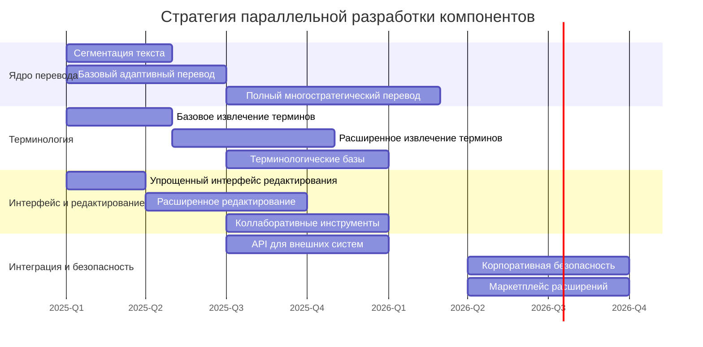

## Стратегия поэтапного выпуска

Разработка и выпуск модульной системы машинного перевода планируется по принципу итеративного наращивания функциональности с регулярной валидацией рыночной ценности продукта. Такой подход позволит:

1. Обеспечить раннюю рыночную валидацию ключевых технологических гипотез
2. Своевременно корректировать планы разработки на основе обратной связи пользователей
3. Снизить инвестиционные риски путём поэтапного финансирования
4. Гибко адаптироваться к изменениям технологического ландшафта и конкурентной среды
5. Создать устойчивую клиентскую базу ещё до выпуска полной версии продукта

## Основные этапы разработки и выпуска

### 1. MVP (Q2 2025)
- **Сроки разработки**: Q1 2025 - Q2 2025 (6 месяцев)
- **Ключевые функции**:
  - Сегментация входящего текста с точностью до 96%
  - Базовое извлечение терминов с точностью 80-85%
  - Машинный перевод с упрощённой адаптивной стратегией
  - Работа с пользовательскими данными (импорт глоссариев и TM)
  - Упрощённый интерфейс редактирования
- **Языковые пары**: EN↔RU, EN↔DE, EN↔FR, CN↔RU (всего 4 пары)
- **Поддерживаемые домены**: техническая документация, нефтегаз, автомобилестроение
- **Финансовая потребность**: $700,000-850,000
- **Ключевые показатели успеха**:
  - **Технические**: BLEU-score на 15-20% выше стандартных решений, точность терминологии >85%
  - **Бизнес**: 10-15 пилотных клиентов, конверсия от тестирования к оплате 15-20%

### 2. Альфа-версия (Q1 2026)
- **Сроки разработки**: Q3 2025 - Q1 2026 (7-8 месяцев)
- **Ключевые улучшения**:
  - Полнофункциональное терминологическое управление (точность до 88%)
  - Многостратегический адаптивный перевод (5 уровней сложности, 7 стратегий)
  - Интеллектуальное перефразирование сложных конструкций
  - Коллаборативные инструменты редактирования
  - API для интеграции с внешними системами
- **Языковые пары**: расширение до 10-12 пар
- **Поддерживаемые домены**: расширение до 7 отраслей
- **Финансовая потребность**: $850,000-1,050,000
- **Ключевые показатели успеха**:
  - **Технические**: улучшение BLEU-score на 20-25%, терминологическая точность 90-95%
  - **Бизнес**: 40-50 активных клиентов, NPS >40, MRR $100K-$150K

### 3. Бета-версия (Q1 2027)
- **Сроки разработки**: Q2 2026 - Q1 2027 (9 месяцев)
- **Ключевые улучшения**:
  - Полный конвейер машинного перевода с автоматизированной обработкой
  - Горизонтальное масштабирование для больших объёмов (до 5+ млн слов/день)
  - Расширение до 20+ языковых пар
  - SDK для разработчиков и маркетплейс для расширений
  - Безопасность корпоративного уровня (SOC 2, ISO 27001, GDPR)
- **Языковые пары**: расширение до 20+ пар согласно рыночному спросу
- **Поддерживаемые домены**: расширение до 12+ отраслей с адаптерами
- **Финансовая потребность**: $750,000-950,000
- **Ключевые показатели успеха**:
  - **Технические**: BLEU-score на 25-30% выше стандартных решений, скорость 600-750 страниц/час
  - **Бизнес**: 80-100 активных клиентов, ARR $2-2.5M, LTV/CAC >3.0x

### 4. Релиз-кандидат и Версия 1.0 (Q3 2027)
- **Сроки разработки**: Q1 2027 - Q3 2027 (3-4 месяца)
- **Фокус разработки**:
  - Комплексное регрессионное тестирование
  - Нагрузочное тестирование и оптимизация
  - Независимый аудит безопасности
  - Завершение документации и обучающих материалов
- **Расширение возможностей**:
  - Дополнительные языковые пары (до 25+)
  - Расширение до 15+ отраслевых доменов
  - Интеграция с популярными корпоративными системами
- **Финансовая потребность**: $350,000-450,000
- **Ключевые показатели успеха**:
  - **Технические**: стабильность >99.95%, отсутствие критических багов
  - **Бизнес**: 15+ успешных внедрений, NPS >60, готовность к масштабированию продаж

## Детальный график с промежуточными вехами

| Период | Основная веха | Промежуточные технические вехи | Промежуточные бизнес-вехи | Инвестиционные события | Отраслевые события |
|--------|---------------|--------------------------------|---------------------------|------------------------|-------------------|
| **Q1 2025** | Начало разработки MVP | • Архитектурный дизайн системы • Создание первых прототипов сегментации и извлечения терминов • Сборка базового конвейера перевода | • Формирование команды • Предварительные переговоры с потенциальными пилотными клиентами | Посевной раунд $1M | |
| **Q2 2025** | **РЕЛИЗ MVP** | • Завершение интеграции основных модулей • Валидация точности 4 языковых пар • Тестирование пользовательского интерфейса | • Запуск программы раннего доступа • Привлечение первых 5-7 пилотных клиентов • Первые демонстрации на отраслевых мероприятиях | | Конференция AMTA 2025 Выставка Localization World |
| **Q3 2025** | Начало разработки Альфа-версии | • Полнофункциональный механизм извлечения терминов • Разработка архитектуры многостратегического перевода • Начало разработки коллаборативного редактирования | • Анализ обратной связи от клиентов MVP • Расширение клиентской базы до 15+ пользователей • Выявление потребностей для новых отраслей | | Выставка CeBIT Translation Forum Russia |
| **Q4 2025** | Промежуточная веха Альфа-версии | • Интеграция 7 стратегий перевода • Разработка системы перевода и утверждения глоссария • Расширение до 8 языковых пар | • Расширение до 25+ клиентов • Достижение MRR $50K-$70K • Разработка стратегии выхода на новые рынки | | tekom Europe Форум IT-технологий |
| **Q1 2026** | **РЕЛИЗ АЛЬФА-ВЕРСИИ** | • Завершение интеграции коллаборативных инструментов • Финализация API для внешних систем • Валидация качества перевода на 10-12 языковых парах | • Начало коммерциализации Альфа-версии • Активация партнерской программы • Запуск международного маркетинга | Раунд А $3M-$4M | LocWorld North America AI Summit |
| **Q2 2026** | Начало разработки Бета-версии | • Проектирование полного конвейера перевода • Разработка механизмов горизонтального масштабирования • Начало разработки SDK для партнёров | • Расширение до 45-55 клиентов • Первые корпоративные внедрения • Анализ метрик удержания клиентов | | WWDC 2026 Machine Translation Summit |
| **Q3 2026** | Промежуточная веха Бета-версии | • Внедрение корпоративной безопасности • Расширение до 15+ языковых пар • Разработка базы для маркетплейса | • Достижение MRR $150K-$180K • Первые партнёрские интеграции • Подготовка к выходу на новые географические рынки | | Japan IT Week GITEX Technology Week |
| **Q4 2026** | Вторая промежуточная веха Бета-версии | • Расширение до 18+ языковых пар • Завершение интеграции отраслевых адаптеров • Начало нагрузочного тестирования | • Расширение до 70-80 клиентов • Достижение ARR $1.8M-$2.2M • Формирование стратегии выхода версии 1.0 | Мостовой раунд $2M-$2.5M | Форум "Открытые инновации" AI Expo |
| **Q1 2027** | **РЕЛИЗ БЕТА-ВЕРСИИ** | • Завершение полного конвейера перевода • Интеграция SDK и маркетплейса • Достижение целевых показателей производительности | • Достижение 80-100 активных клиентов • Запуск расширенной партнёрской программы • Начало пилотов с корпоративными клиентами | | CES 2027 Digital Enterprise Show |
| **Q2 2027** | Разработка Релиз-кандидата | • Комплексное тестирование и аудит безопасности • Оптимизация производительности • Финализация документации | • Подготовка маркетинговой кампании к запуску 1.0 • Расширение команды продаж и поддержки • Формирование сообщества разработчиков | | London Tech Week Translation Technology Fair |
| **Q3 2027** | **РЕЛИЗ ВЕРСИИ 1.0** | • Финальное тестирование и оптимизация • Расширение до 25+ языковых пар • Завершение интеграции с корпоративными системами | • Официальное мероприятие запуска • Активация международных каналов продаж • Реализация планов масштабирования | Раунд В $10M-$15M | DMEXCO Global AI Conference |

## Сценарное планирование

Для обеспечения гибкости и адаптивности к меняющимся условиям рынка разработаны три сценария реализации графика релизов:

### Базовый сценарий (вероятность 60%)
Соответствует представленному выше основному графику с общим сроком разработки от начала до версии 1.0 в 2,5 года. Предполагает стабильные рыночные условия, отсутствие радикальных технологических прорывов у конкурентов и планомерное развитие потребностей целевых сегментов.

### Ускоренный сценарий (вероятность 25%)
Данный сценарий предусматривает ускорение разработки при условии быстрого роста рынка или активизации конкурентов:

- **MVP**: сокращение срока до 4-5 месяцев за счёт параллельной разработки компонентов и привлечения дополнительных ресурсов (+30% к бюджету)
- **Альфа-версия**: выпуск через 6 месяцев после MVP с фокусом на ключевых дифференцирующих функциях
- **Бета-версия**: выпуск через 7-8 месяцев после Альфа-версии
- **Версия 1.0**: выпуск через 2-3 месяца после Бета-версии

Общий срок: около 20 месяцев (сокращение на 6-8 месяцев)

**Триггеры для перехода на этот сценарий**:
- Появление прямых конкурентов с аналогичным позиционированием
- Рост запросов от клиентов на >40% выше прогнозируемого
- Существенные технологические прорывы, требующие быстрой адаптации
- Сверхплановое привлечение инвестиций

### Консервативный сценарий (вероятность 15%)
Данный сценарий предусматривает более осторожный подход при неблагоприятных рыночных условиях или технических сложностях:

- **MVP**: увеличение срока до 7-8 месяцев с дополнительной валидацией технических решений
- **Альфа-версия**: выпуск через 10-12 месяцев после MVP с итеративными промежуточными релизами
- **Бета-версия**: выпуск через 12-14 месяцев после Альфа-версии
- **Версия 1.0**: выпуск через 4-5 месяцев после Бета-версии

Общий срок: около 34-36 месяцев (увеличение на 6-8 месяцев)

**Триггеры для перехода на этот сценарий**:
- Технические сложности с реализацией ключевых компонентов
- Существенно более низкие, чем ожидалось, показатели качества перевода
- Замедление роста рынка или снижение интереса инвесторов
- Недостаточные результаты коммерциализации ранних версий

## Стратегия параллельной разработки

Для оптимизации графика разработки и снижения рисков несоблюдения сроков применяется стратегия параллельной разработки ключевых компонентов системы:

### Преимущества параллельной разработки:
1. **Снижение общих сроков разработки** на 15-20%
2. **Раннее выявление критических проблем** в ключевых компонентах
3. **Гибкость в перераспределении ресурсов** между параллельными треками
4. **Возможность приоритизации компонентов с высоким рыночным потенциалом**
5. **Снижение рисков задержек** на критическом пути разработки

### Стратегия управления зависимостями:
- Использование симуляторов и заглушек для компонентов с сильными зависимостями
- Четкая спецификация API между компонентами на ранних этапах
- Регулярная интеграция разрабатываемых параллельно модулей
- Выделенная команда системной интеграции для координации параллельных треков

## Ресурсное обеспечение этапов разработки

| Этап                            | Команда                                                                                                                                                                                                                                              | Инфраструктура                                                                                                                                                   | Внешние ресурсы                                                                                                                | Ключевые изменения относительно предыдущего этапа                                                                                          |
| ------------------------------- | ---------------------------------------------------------------------------------------------------------------------------------------------------------------------------------------------------------------------------------------------------- | ---------------------------------------------------------------------------------------------------------------------------------------------------------------- | ------------------------------------------------------------------------------------------------------------------------------ | ------------------------------------------------------------------------------------------------------------------------------------------ |
| **MVP**                         | • 3-4 разработчика бэкенда • 2 разработчика фронтенда • 1 DevOps инженер • 2 NLP/ML специалиста • 1 UX/UI дизайнер • 1 QA инженер • 1 продуктовый менеджер • 1 технический лингвист                                             | • Базовая облачная инфраструктура • Среда разработки • Тестовые серверы                                                                                    | • Предварительно собранные корпуса текстов • Базовые терминологические базы • Консультации отраслевых экспертов          | Формирование ядра команды                                                                                                                  |
| **Альфа-версия**                | • 5-6 разработчиков бэкенда • 3-4 разработчика фронтенда • 2 DevOps инженера • 3-4 NLP/ML специалиста • 2 UX/UI дизайнера • 2-3 QA инженера • 2 продуктовых менеджера • 2 технических лингвиста                                 | • Расширенная облачная инфраструктура • GPU-кластеры для обучения моделей • Тестовые среды для различных конфигураций                                      | • Расширенные корпуса текстов • Специализированные терминологические базы • Контракты с отраслевыми консультантами       | • +50-60% увеличение размера команды • Существенное расширение вычислительных ресурсов • Добавление специализированных компетенций   |
| **Бета-версия**                 | • 6-8 разработчиков бэкенда • 4-5 разработчиков фронтенда • 3 DevOps инженера • 4 NLP/ML специалиста • 2 UX/UI дизайнера • 3 QA инженера • 2 продуктовых менеджера • 3 технических лингвиста • 2 специалиста по безопасности | • Продакшн-инфраструктура с балансировкой нагрузки • Multi-region развёртывание • Системы мониторинга и алертинга • Среды для нагрузочного тестирования | • Лицензирование дополнительных технологий • Аудит безопасности • Партнёрские интеграции                                 | • +30% увеличение размера команды • Фокус на производительность и безопасность • Формирование команды поддержки                      |
| **Релиз-кандидат и Версия 1.0** | • Сохранение размера технической команды • +3 специалиста QA • +2 специалиста по производительности • +5 человек в команде поддержки • Расширение команды продаж и маркетинга                                                            | • Полностью резервированная инфраструктура • Географически распределённые ресурсы • Изолированные среды для корпоративных клиентов                         | • Независимый аудит безопасности • Сертификация SOC 2, ISO 27001 • Юридические консультации по международному расширению | • Акцент на масштабирование и надёжность • Формирование полноценных команд поддержки и продаж • Инфраструктура корпоративного уровня |

## Финансовое планирование по этапам

| Этап | Общий бюджет | Распределение затрат | Ожидаемые финансовые результаты | Инвестиционные раунды |
|------|--------------|----------------------|----------------------------------|------------------------|
| **MVP** | $700,000-850,000 | • Разработка: 65% • Инфраструктура: 15% • Тестирование: 10% • Маркетинг и продажи: 10% | • 10-15 пилотных клиентов • MRR: $30K-$50K к концу периода • CAC: $12K-$15K | Посевной раунд: $1M (покрывает MVP и часть Альфа-версии) |
| **Альфа-версия** | $850,000-1,050,000 | • Разработка: 60% • Инфраструктура: 15% • Тестирование: 10% • Маркетинг и продажи: 15% | • 40-50 активных клиентов • MRR: $100K-$150K • CAC: $10K-$12K • Retention rate: 80%+ | Раунд А: $3M-$4M (покрывает Альфа и Бета-версии) |
| **Бета-версия** | $750,000-950,000 | • Разработка: 55% • Инфраструктура: 20% • Тестирование: 15% • Маркетинг и продажи: 10% | • 80-100 активных клиентов • ARR: $2M-$2.5M • CAC: $8K-$10K • LTV/CAC: 3.0-3.5x | Мостовой раунд: $2M-$2.5M (при необходимости ускорения роста) |
| **Релиз-кандидат и Версия 1.0** | $350,000-450,000 | • Разработка: 40% • Инфраструктура: 20% • Тестирование: 25% • Маркетинг и продажи: 15% | • 120-150 активных клиентов к концу года • ARR: $3.5M-$4M • LTV/CAC: 5-6x • Путь к безубыточности | Раунд B: $10M-$15M (после выпуска версии 1.0, для международной экспансии) |

### Ключевые финансовые индикаторы для каждого этапа

**MVP:**
- Ежемесячные затраты на разработку: $115K-$140K
- Точка принятия решения о масштабировании: достижение показателя удержания клиентов >75%
- Пороговое значение конверсии: >15% от тестирования к оплате

**Альфа-версия:**
- Ежемесячные затраты на разработку: $125K-$160K
- Ключевой показатель для привлечения раунда A: >30 активных клиентов и MRR >$80K
- Целевой NPS: >40 для подтверждения product-market fit

**Бета-версия:**
- Ежемесячные затраты на разработку: $130K-$170K
- Ключевой показатель экономической эффективности: снижение CAC на 20-25%
- Целевой показатель для мостового раунда: ARR >$1.8M

**Версия 1.0:**
- Фокус на подготовку к масштабированию
- Ключевой показатель для раунда B: подтверждённый LTV/CAC >4x
- Целевой показатель для международной экспансии: >10 успешных внедрений у корпоративных клиентов

## Механизмы реагирования на отклонения от графика и бюджета

### Механизм раннего выявления отклонений
1. **Еженедельный мониторинг прогресса разработки**:
   - Отслеживание выполнения задач в системе управления проектами
   - Еженедельные статус-митинги с презентацией промежуточных результатов
   - Автоматизированная система контрольных точек с уведомлениями

2. **Финансовый мониторинг**:
   - Еженедельный анализ расходования бюджета по категориям
   - Ежемесячный детальный финансовый отчет
   - Система пороговых значений для раннего выявления отклонений (>10% от плана)

3. **Рыночный мониторинг**:
   - Ежемесячная оценка ключевых метрик привлечения и удержания клиентов
   - Квартальный анализ конкурентной среды
   - Отслеживание технологических новостей и инноваций в отрасли

### Пороговые значения для реагирования
1. **Технические отклонения**:
   - **Незначительные**: задержка 1-2 недели, решаются на уровне технической команды
   - **Средние**: задержка 2-4 недели, требуют вмешательства продуктового комитета и корректировки планов
   - **Критические**: задержка >1 месяца, требуют решения на уровне совета директоров и инвесторов

2. **Бюджетные отклонения**:
   - **Незначительные**: перерасход 5-10%, компенсируется внутри текущего этапа через перераспределение ресурсов
   - **Средние**: перерасход 10-20%, требуют пересмотра приоритетов разработки и возможного сокращения объёма работ
   - **Критические**: перерасход >20%, требуют пересмотра объёма работ, сроков и возможного привлечения промежуточного инвестиционного раунда

3. **Рыночные отклонения**:
   - **Незначительные**: отклонение от плановых показателей на 10-15%, корректируются маркетинговыми активностями
   - **Средние**: отклонение 15-25%, требуют пересмотра ценовой политики и каналов продаж
   - **Критические**: отклонение >25%, требуют переоценки product-market fit и возможного пивота

### Корректирующие действия при отклонениях

1. **При технических отклонениях**:
   - Временное привлечение дополнительных разработчиков (+20-30% к команде на критических направлениях)
   - Пересмотр объёма промежуточных релизов с фокусом на ключевую функциональность
   - Применение ускоренных методологий разработки (экстремальное программирование, парное программирование)
   - Привлечение внешних экспертов для решения узких технических проблем

2. **При бюджетных отклонениях**:
   - Активация резервного фонда (7-10% от общего бюджета каждого этапа)
   - Оптимизация инфраструктурных затрат (временный переход на более экономичные решения)
   - Пересмотр планов найма с фокусом на критические роли
   - Привлечение стратегических партнёров для разделения затрат на разработку специализированных компонентов

3. **При рыночных отклонениях**:
   - Интенсификация работы с пилотными клиентами для улучшения продукта
   - Пересмотр маркетинговой стратегии и ценностного предложения
   - Временное смещение фокуса на более перспективные вертикальные рынки
   - Ускоренная разработка функций с наибольшим влиянием на продажи

## KPI для мониторинга прогресса между основными вехами

Для обеспечения контроля за развитием проекта между ключевыми вехами разработана система промежуточных KPI, позволяющая своевременно выявлять отклонения:

### 1. Технические KPI

| Метрика | Целевое значение | Периодичность измерения | Ответственное лицо |
|---------|------------------|-------------------------|-------------------|
| Скорость завершения задач | 85%+ от запланированного | Еженедельно | Руководитель разработки |
| Покрытие кода тестами | ≥80% | Ежедневно (автоматически) | Руководитель QA |
| Количество критических багов | <5 на компонент | Еженедельно | Руководитель QA |
| Показатели качества перевода (BLEU, TER) | Рост на 2-3% каждые 3 месяца | Ежемесячно | Руководитель NLP-направления |
| Производительность системы | Соответствие целевым показателям ±10% | Еженедельно | DevOps инженер |
| Время автоматического развёртывания | <30 минут | При каждом релизе | DevOps инженер |

### 2. Бизнес KPI

| Метрика | Целевое значение | Периодичность измерения | Ответственное лицо |
|---------|------------------|-------------------------|-------------------|
| Привлечение новых клиентов | ≥3-5 в месяц (MVP), ≥5-8 в месяц (Альфа), ≥8-12 в месяц (Бета) | Ежемесячно | Руководитель продаж |
| Коэффициент удержания | ≥70% (MVP), ≥80% (Альфа), ≥85% (Бета) | Ежемесячно | Продуктовый менеджер |
| NPS | ≥40 | Ежеквартально | Руководитель по работе с клиентами |
| MRR | Рост на 15-20% ежемесячно | Ежемесячно | Финансовый директор |
| CAC | Снижение на 5-7% каждые 3 месяца | Ежеквартально | Маркетинг-директор |
| Время цикла продаж | <45 дней (MVP), <40 дней (Альфа), <30 дней (Бета) | Ежемесячно | Руководитель продаж |

### 3. Рыночные KPI

| Метрика | Целевое значение | Периодичность измерения | Ответственное лицо |
|---------|------------------|-------------------------|-------------------|
| Упоминания в отраслевых СМИ | ≥3 в квартал (MVP), ≥5 в квартал (Альфа), ≥10 в квартал (Бета) | Ежеквартально | PR-менеджер |
| Количество демо-запросов | Рост на 10-15% ежемесячно | Ежемесячно | Руководитель продаж |
| Соотношение продукт/конкуренты в сравнительных тестах | Превосходство по ключевым метрикам на 15-20% | Ежеквартально | Продуктовый менеджер |
| Присутствие на ключевых отраслевых мероприятиях | 2-3 в квартал с ростом охвата | Ежеквартально | Маркетинг-директор |

## Привязка к ключевым отраслевым событиям

Для максимизации маркетингового эффекта и привлечения внимания целевой аудитории график релизов синхронизирован с ключевыми отраслевыми событиями:

### 2025 год
- **Q2 (Релиз MVP)**: 
  - **AMTA 2025** (Ассоциация машинного перевода Америки) – первая публичная демонстрация технологии
  - **Localization World Europe** – презентация для европейских потенциальных клиентов и партнёров
  - **CeBIT** – расширенная демонстрация для технологического сообщества
  
- **Q3-Q4 (Развитие MVP и начало Альфа-версии)**:
  - **Translation Forum Russia** – презентация для русскоязычного рынка
  - **tekom Europe** – фокус на технической документации
  - **TAUS Annual Conference** – обмен опытом с индустриальными лидерами

### 2026 год
- **Q1 (Релиз Альфа-версии)**:
  - **LocWorld North America** – запуск Альфа-версии для североамериканского рынка
  - **AI Summit** – демонстрация технологических инноваций в NLP
  - **GALA Conference** – презентация для глобальной ассоциации локализации

- **Q2-Q4 (Развитие Альфа и начало Бета-версии)**:
  - **WWDC 2026** – возможности интеграции с экосистемой Apple
  - **Machine Translation Summit** – научная презентация технологических инноваций
  - **Japan IT Week** – выход на азиатский рынок
  - **GITEX Technology Week** – презентация для ближневосточного региона

### 2027 год
- **Q1 (Релиз Бета-версии)**:
  - **CES 2027** – демонстрация корпоративных возможностей
  - **Digital Enterprise Show** – акцент на корпоративную интеграцию
  - **SXSW** – привлечение внимания технологических лидеров

- **Q2-Q3 (Релиз версии 1.0)**:
  - **London Tech Week** – официальный запуск на европейском рынке
  - **Translation Technology Fair** – демонстрация полного функционала для отрасли переводов
  - **DMEXCO** – масштабная маркетинговая кампания на глобальном уровне
  - **Global AI Conference** – позиционирование как лидера в области специализированного машинного перевода

## План для "ранних побед" (early wins)

Для демонстрации потенциала решения, повышения интереса инвесторов и создания положительного информационного фона разработан план достижения "ранних побед":

### Первые 3 месяца разработки MVP
1. **Технологическая демонстрация** базового механизма извлечения терминологии на ограниченном наборе данных
   - Создание видеоматериалов для потенциальных инвесторов
   - Публикация технического white paper о подходе к извлечению терминологии

2. **Proof-of-concept** для базового многостратегического перевода
   - Демонстрация на примере 10-15 сложных технических текстов
   - Сравнительный анализ с существующими решениями

### Первые 3 месяца после выпуска MVP
1. **Case study** с первым крупным клиентом (предпочтительно из электротехнического сектора)
   - Документирование процесса внедрения
   - Количественные показатели улучшения качества и скорости перевода

2. **Публичный бенчмаркинг** против ведущих систем машинного перевода
   - Фокус на технической документации в приоритетных отраслях
   - Публикация результатов в отраслевых изданиях

### Первые 3 месяца после выпуска Альфа-версии
1. **Демонстрация экономического эффекта** для ранних клиентов
   - Расчёт ROI и сокращения затрат на локализацию
   - Создание калькулятора ROI для потенциальных клиентов

2. **Технологические партнёрства** с 2-3 известными CAT-системами
   - Публичное анонсирование интеграции
   - Демонстрация сквозного рабочего процесса

## Контрольные точки принятия решений

Для обеспечения гибкости в адаптации к меняющимся условиям и минимизации рисков определены ключевые контрольные точки, в которых принимаются стратегические решения о дальнейшем развитии проекта:

1. **MVP -1 месяц** (за месяц до планируемого релиза MVP):
   - Оценка достигнутого качества перевода
   - Go/No-Go решение по релизу MVP
   - Возможные решения: релиз согласно плану, дополнительный месяц на доработку, сокращение функциональности для соблюдения сроков

2. **MVP +3 месяца** (через 3 месяца после релиза MVP):
   - Анализ рыночного принятия и обратной связи
   - Решение о корректировке объёма и приоритетов Альфа-версии
   - Возможные решения: продолжение согласно плану, переоценка приоритетных компонентов, пересмотр целевых отраслей

3. **Альфа -1,5 месяца**:
   - Комплексная оценка готовности ключевых компонентов
   - Решение о стратегии релиза Альфа-версии
   - Возможные решения: полный релиз, поэтапный релиз (phase release), дополнительное время на интеграцию компонентов

4. **Альфа +4 месяца**:
   - Оценка финансовых показателей и масштабируемости продаж
   - Решение о возможном привлечении дополнительного финансирования
   - Возможные решения: продолжение плана, активация мостового раунда, пересмотр стратегии монетизации

5. **Бета -2 месяца**:
   - Оценка готовности корпоративных функций и масштабируемости
   - Решение о готовности к корпоративному сегменту
   - Возможные решения: релиз согласно плану, фокус на небольших и средних клиентах с отсрочкой корпоративных функций

6. **Версия 1.0 -1 месяц**:
   - Комплексная оценка стабильности и производительности
   - Go/No-Go решение по финальному релизу
   - Возможные решения: релиз согласно плану, дополнительный цикл стабилизации, поэтапный выпуск функциональности

## Стратегия выпуска обновлений после версии 1.0

После выпуска версии 1.0 планируется следующая стратегия регулярных обновлений, обеспечивающая постоянное улучшение продукта и реагирование на новые рыночные требования:

1. **Минорные релизы** (версии 1.x):
   - **Периодичность**: каждые 6-8 недель
   - **Содержание**: 
     - Новые языковые пары и отраслевые адаптеры
     - Улучшения пользовательского интерфейса
     - Расширение интеграционных возможностей
     - Оптимизация производительности
   - **Процесс выпуска**: 
     - Бета-тестирование за 2 недели до релиза
     - Поэтапное развертывание (canary deployment)
     - Отсутствие простоя при обновлении

2. **Точечные исправления** (версии 1.x.y):
   - **Периодичность**: по необходимости, обычно в течение 1-2 недель после выявления проблемы
   - **Содержание**: исправления критических ошибок, проблем безопасности и совместимости
   - **Процесс выпуска**: ускоренное тестирование и автоматическое развертывание

3. **Мажорные релизы** (версии 2.0, 3.0):
   - **Периодичность**: один раз в 12-18 месяцев
   - **Содержание**:
     - Существенные архитектурные улучшения
     - Новые ключевые функции
     - Интеграция прорывных технологий
     - Возможные изменения в бизнес-модели
   - **Процесс выпуска**:
     - Расширенный цикл бета-тестирования (1-2 месяца)
     - Поддержка предыдущей мажорной версии в течение 6-12 месяцев
     - Маркетинговая кампания с предварительным анонсированием

4. **Экстренные обновления**:
   - **Периодичность**: немедленно при выявлении критических уязвимостей
   - **Содержание**: исключительно исправления критических проблем безопасности
   - **Процесс выпуска**: упрощенный цикл тестирования с фокусом на безопасность и стабильность

### График предварительного планирования после версии 1.0

| Период | Тип релиза | Ключевой фокус |
|--------|------------|----------------|
| **Q4 2027** | 1.1 | Добавление 3-5 новых языковых пар, улучшения производительности |
| **Q1 2028** | 1.2 | Расширение корпоративных интеграций, новые отраслевые адаптеры |
| **Q2 2028** | 1.3 | Улучшения в многостратегическом переводе, оптимизация QA |
| **Q3 2028** | 1.4 | Интеграция с новыми CAT-инструментами, расширение API |
| **Q4 2028** | 1.5 | Подготовка к мажорному релизу, стабилизация экосистемы |
| **Q1 2029** | 2.0 | Новая архитектура многостратегического перевода, глубокая интеграция новейших LLM |

## Заключение

Представленная стратегия ключевых вех и график релизов обеспечивают планомерное развитие модульной системы машинного перевода с поэтапным наращиванием функциональности. Последовательность MVP → Альфа → Бета → Полная версия 1.0 с чёткими критериями перехода между этапами минимизирует риски и обеспечивает устойчивый рост с постоянной обратной связью от пользователей.

Детальное финансовое планирование, привязка к инвестиционным раундам и отраслевым событиям создают прочную основу для успешной коммерциализации продукта. Механизмы реагирования на отклонения и контрольные точки принятия решений обеспечивают необходимую гибкость для адаптации к изменяющимся условиям рынка и технологическим вызовам.

Сценарное планирование и стратегия параллельной разработки повышают устойчивость проекта к рискам и создают возможности для ускоренного выхода на рынок при благоприятных условиях. План "ранних побед" способствует созданию положительного информационного фона и привлечению инвесторов на ранних этапах развития проекта.