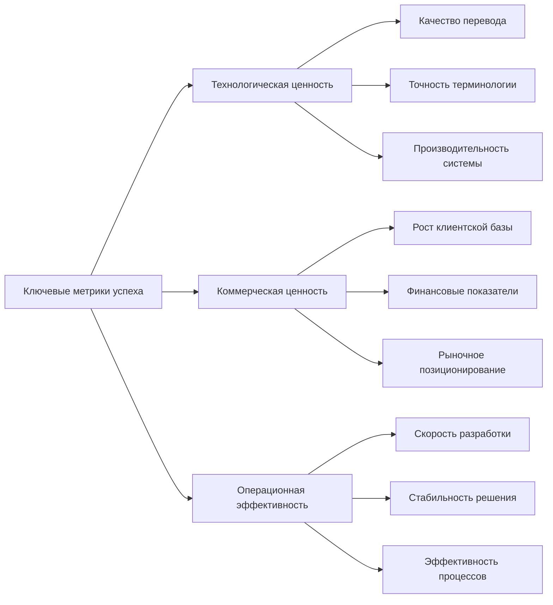

Эффективное управление разработкой модульной системы машинного перевода требует чёткой системы метрик для объективной оценки прогресса и своевременного принятия управленческих решений. Представленная ниже структура охватывает ключевые области, обеспечивая баланс между полнотой контроля и практической применимостью.

## 1. Ключевые метрики успеха проекта

## 2. Критически важные метрики по ключевым областям

Для каждого этапа проекта определены метрики, напрямую связанные с успехом проекта и оценкой готовности к переходу на следующий этап.

### 2.1. Технологическая ценность

|Метрика|Описание|Целевые значения по этапам|Периодичность|Влияние на решения|
|---|---|---|---|---|
|**Улучшение качества перевода**|Процентное улучшение BLEU-score относительно конкурентов в целевых доменах|MVP: +15-20% Альфа: +20-25% Бета: +25-30%|Ежемесячно|Готовность к переходу между этапами, корректировка R&D стратегии|
|**Точность терминологии**|Процент корректно переведённых специализированных терминов|MVP: >85% Альфа: >88% Бета: >93% Версия 1.0: >95%|Ежемесячно|Готовность к выходу в специализированные отрасли|
|**Производительность системы**|Скорость обработки (в страницах/час)|MVP: 400-450 Альфа: 450-550 Бета: 600-750|Еженедельно|Масштабируемость решения, готовность к корпоративным клиентам|
|**Эффективность многостратегического подхода**|Частота выбора оптимальной стратегии перевода|MVP: >70% Альфа: >85% Бета: >90%|Ежемесячно|Валидация ключевой технологической дифференциации|
|**Стабильность системы**|Процент времени безотказной работы|MVP: >99.5% Альфа: >99.8% Бета: >99.9% Версия 1.0: >99.95%|Ежедневно|Готовность к коммерческому использованию|

### 2.2. Коммерческая ценность

| Метрика                            | Описание                                                         | Целевые значения по этапам                                                         | Периодичность | Влияние на решения                                                     |
| ---------------------------------- | ---------------------------------------------------------------- | ---------------------------------------------------------------------------------- | ------------- | ---------------------------------------------------------------------- |
| **Активные клиенты**               | Число компаний, регулярно использующих систему                   | MVP: 10-15 Альфа: 40-50 Бета: 80-100 Версия 1.0: 120-150                  | Ежемесячно    | Валидация product-market fit, корректировка стратегии продаж           |
| **ARR (Annual Recurring Revenue)** | Годовой повторяющийся доход                                      | MVP: $360K-$600K Альфа: $1.2M-$1.8M Бета: $2M-$2.5M Версия 1.0: $3.5M-$4M | Ежемесячно    | Финансовая устойчивость, привлечение инвестиций, масштабирование       |
| **LTV/CAC**                        | Соотношение пожизненной ценности клиента к стоимости привлечения | MVP: >2.0x Альфа: >3.0x Бета: >4.0x Версия 1.0: >5.0x                     | Ежеквартально | Эффективность модели монетизации и маркетинговой стратегии             |
| **NPS (Net Promoter Score)**       | Индекс лояльности клиентов                                       | MVP: >30 Альфа: >40 Бета: >50 Версия 1.0: >60                             | Ежеквартально | Качество продукта с точки зрения клиентов, прогноз органического роста |
| **Уровень удержания**              | Процент клиентов, продолжающих использование через 6 месяцев     | MVP: >70% Альфа: >80% Бета: >85% Версия 1.0: >90%                         | Ежемесячно    | Долгосрочная устойчивость бизнес-модели, качество продукта             |

### 2.3. Операционная эффективность

|Метрика|Описание|Целевые значения по этапам|Периодичность|Влияние на решения|
|---|---|---|---|---|
|**Скорость выполнения спринтов**|Процент задач, завершаемых в рамках спринта|>80% для всех этапов|Каждые 2 недели|Предсказуемость разработки, соблюдение сроков релизов|
|**Время исправления критических багов**|Среднее время от выявления до исправления|MVP: <48 часов Альфа: <36 часов Бета: <24 часа Версия 1.0: <12 часов|Еженедельно|Качество технической поддержки, надёжность для клиентов|
|**Соблюдение графика релизов**|Отклонение от запланированных дат ключевых вех|Не более 10% от плановой длительности этапа|По релизам|Управление ожиданиями инвесторов и клиентов|
|**Эффективность использования инвестиций**|Burn rate относительно плана|Не более 110% от планового бюджета|Еженедельно|Финансовая устойчивость, прогнозирование потребности в инвестициях|
|**Покрытие кода тестами**|Процент кода, покрытого автоматическими тестами|MVP: >70% Альфа: >75% Бета: >80% Версия 1.0: >85%|Ежедневно|Надёжность продукта, эффективность QA-процессов|

## 3. Метрики критического пути для перехода между этапами

Данные метрики служат объективными критериями для принятия решений о готовности проекта к переходу на следующий этап разработки.

### 3.1. Критерии перехода от MVP к Альфа-версии

|Метрика|Пороговое значение|Обоснование|
|---|---|---|
|**Улучшение качества перевода**|≥15% по сравнению с конкурентами в целевых доменах|Подтверждение технологического преимущества|
|**Количество пилотных клиентов**|≥10 активных пользователей|Валидация рыночного интереса|
|**Конверсия от тестирования к оплате**|≥15%|Подтверждение ценности продукта|
|**Сокращение времени постредактирования**|≥30% по сравнению с традиционными решениями|Валидация ключевого преимущества для пользователей|
|**Стабильность работы**|≥99.5%|Готовность к более широкому использованию|

### 3.2. Критерии перехода от Альфа-версии к Бета-версии

|Метрика|Пороговое значение|Обоснование|
|---|---|---|
|**MRR (Monthly Recurring Revenue)**|≥$100K|Финансовая устойчивость для следующего этапа|
|**NPS**|≥40|Подтверждение удовлетворённости пользователей|
|**Эффективность многостратегического подхода**|≥85% корректность выбора стратегии|Валидация ключевой технологии|
|**Количество языковых пар**|≥10|Достаточное покрытие для основных рынков|
|**Уровень удержания клиентов**|≥80%|Долгосрочная ценность для пользователей|

### 3.3. Критерии перехода от Бета-версии к Релиз-кандидату

|Метрика|Пороговое значение|Обоснование|
|---|---|---|
|**ARR**|≥$2M|Финансовая база для полномасштабного запуска|
|**Стабильность системы**|≥99.9%|Готовность к корпоративным внедрениям|
|**Количество активных клиентов**|≥80|Подтверждение масштабируемости бизнес-модели|
|**LTV/CAC**|≥4.0x|Эффективность маркетинга и устойчивость юнит-экономики|
|**Производительность системы**|≥600 страниц/час|Техническая готовность к масштабным внедрениям|

### 3.4. Критерии перехода от Релиз-кандидата к Версии 1.0

|Метрика|Пороговое значение|Обоснование|
|---|---|---|
|**Отсутствие критических багов**|0 открытых критических багов|Продуктовая готовность|
|**Стабильность системы**|≥99.95% в течение 30+ дней|Подтверждённая надёжность|
|**NPS**|≥60|Высокий уровень удовлетворённости пользователей|
|**Успешные корпоративные внедрения**|≥15|Подтверждённая ценность для ключевого сегмента|
|**Точность терминологии**|≥95%|Готовность к использованию в критических отраслях|

## 4. Система мониторинга и отчётности

Для эффективного использования метрик внедряется трёхуровневая система мониторинга и отчётности:

### 4.1. Стратегический уровень

- **Ежемесячный отчёт для руководства и инвесторов**
    
    - Ключевые финансовые показатели
    - Прогресс относительно дорожной карты
    - Метрики рыночного роста
    - Критические риски и их статус
- **Квартальный стратегический обзор**
    
    - Комплексная оценка прогресса по всем ключевым метрикам
    - Корректировка целевых показателей при необходимости
    - Принятие решений о переходе между этапами

### 4.2. Тактический уровень

- **Еженедельный обзор для руководителей направлений**
    
    - Прогресс по функциональным компонентам
    - Метрики качества и стабильности
    - Операционные метрики команд
    - Статус устранения блокеров
- **Автоматический мониторинг с уведомлениями**
    
    - Система оповещений при значительных отклонениях от целевых показателей
    - Автоматические отчёты о трендах ключевых метрик
    - Интерактивные дашборды с актуальной информацией

### 4.3. Операционный уровень

- **Ежедневные стендапы с обзором метрик**
    
    - Статус выполнения задач спринта
    - Операционные метрики качества и производительности
    - Инциденты и проблемы предыдущего дня
- **Командные дашборды**
    
    - Специализированные визуализации для различных команд
    - Фокус на метриках, находящихся в зоне ответственности команды
    - Интеграция с системами разработки и тестирования

## 5. Управление рисками и реагирование на отклонения

### 5.1. Система раннего выявления проблем

|Категория|Сигнальные метрики|Пороговые значения|Процедура реагирования|
|---|---|---|---|
|**Технологические риски**|• Отставание в качестве перевода от целевых показателей • Снижение производительности системы • Рост числа критических багов|• >10% отставание в течение 2 недель • >15% снижение от базовой линии • >3 критических бага в неделю|• Созыв технического комитета • Выделение дополнительных ресурсов • Пересмотр технических решений|
|**Рыночные риски**|• Падение конверсии • Рост оттока клиентов • Снижение NPS|• >20% падение за месяц • >5% рост от базовой линии • Падение >10 пунктов за квартал|• Проведение глубинных интервью с клиентами • Пересмотр ценностного предложения • Корректировка маркетинговой стратегии|
|**Финансовые риски**|• Превышение планового burn rate • Падение MRR • Рост CAC|• >15% в течение 2 месяцев • >10% за месяц • >20% от целевого значения|• Анализ структуры расходов • Оптимизация распределения ресурсов • Пересмотр ценовой политики|

### 5.2. Механизмы корректировки целевых показателей

Для обеспечения актуальности метрик внедряется система регулярного пересмотра целевых показателей:

- **Плановая корректировка** — ежеквартально на основе анализа рыночных тенденций, обратной связи от клиентов и внутренних возможностей
- **Внеплановая корректировка** — при значительных изменениях рыночных условий, технологического ландшафта или внутренних ресурсов

Процесс корректировки включает:

1. Сбор данных и анализ причин отклонений
2. Оценку реалистичности текущих целевых показателей
3. Согласование новых показателей с заинтересованными сторонами
4. Коммуникацию изменений всем участникам проекта

## 6. Взаимосвязь с инвестиционной стратегией

Ключевые метрики напрямую связаны с инвестиционными раундами, обеспечивая прозрачность для инвесторов и объективные критерии для принятия финансовых решений:

|Инвестиционный раунд|Ключевые метрики-триггеры|Целевые значения|Временные рамки|
|---|---|---|---|
|**Посевной раунд**|• Технологическая валидация • Прототип с базовыми функциями|• Улучшение качества перевода >10% • Функциональный MVP|Q1 2025|
|**Раунд A**|• Работающий MVP • Пилотные клиенты • Подтверждённое качество перевода|• 10+ активных клиентов • NPS >30 • Улучшение качества >15%|Q1 2026|
|**Мостовой раунд** (при необходимости)|• Стабильный рост MRR • Расширенная функциональность • Растущий интерес рынка|• MRR >$150K • 40+ активных клиентов • NPS >40|Q4 2026|
|**Раунд B**|• Устойчивая бизнес-модель • Стабильный рост клиентской базы • Техническая готовность к масштабированию|• ARR >$2M • 80+ активных клиентов • LTV/CAC >4.0x|Q3 2027|

## 7. Заключение

Представленная система метрик отслеживания прогресса обеспечивает:

- **Объективную оценку** статуса проекта на всех уровнях
- **Раннее выявление проблем** и возможность своевременной корректировки планов
- **Прозрачность для инвесторов и заинтересованных сторон**
- **Чёткие критерии** для принятия ключевых управленческих решений
- **Согласованность с общей стратегией разработки** и дорожной картой проекта

Система метрик регулярно пересматривается для обеспечения её актуальности и соответствия меняющимся условиям проекта и рынка. Фокус на небольшом числе ключевых показателей позволяет принимать обоснованные решения без информационной перегрузки.