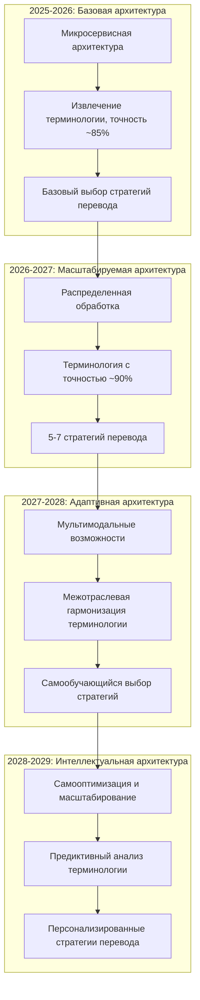

## Краткое резюме

Долгосрочная стратегия развития нашей модульной системы машинного перевода основана на углублении отраслевой специализации, развитии уникальных технологических преимуществ и создании гибкой архитектуры, способной адаптироваться к динамичным изменениям рынка. План объединяет последовательное расширение функциональности и географического присутствия с механизмами раннего выявления технологических и рыночных изменений.

## 1. Стратегические направления развития

### 1.1. Эволюция отраслевой специализации и технологий

|Период|Отраслевой фокус|Ключевые технологические улучшения|Бизнес-метрики|
|---|---|---|---|
|**2025-2026**|• Техническая документация • Фармацевтика|• Базовые терминологические базы • Адаптивные стратегии перевода|• 10-15 ключевых клиентов • ARR $0.5-1M|
|**2026-2027**|• Юридические тексты • Финансовая отчётность|• Контекстно-зависимые стратегии • Интеграции с отраслевыми системами|• 40-50 активных клиентов • ARR $3-5M|
|**2027-2028**|• Научные публикации • Образовательные материалы|• Мультимодальный перевод • Расширенное форматирование|• 80-100 активных клиентов • ARR $10-15M|
|**2028-2029**|• Маркетинговые материалы • Аудиовизуальный контент|• Интеграция с контент-платформами • Культурная адаптация контента|• 120-150 активных клиентов • ARR $25-40M|

### 1.2. Развитие архитектуры и ключевых технологических преимуществ

## 2. Механизмы адаптации к изменениям рынка

### 2.1. Система раннего обнаружения изменений

|Категория мониторинга|Ключевые индикаторы|Пороговые значения для реакции|
|---|---|---|
|**Технологические тренды**|• Новые архитектуры перевода • Качество перевода конкурентов|• Улучшение качества у конкурентов >15% • 3+ научные публикации со схожими идеями|
|**Конкурентная среда**|• Новые игроки на рынке • Изменения в ценовой политике|• Появление прямого конкурента • Снижение цен ключевыми конкурентами >20%|
|**Клиентские потребности**|• Обратная связь клиентов • Запросы новых функций|• Частота запроса функции >25% клиентов • Снижение удержания клиентов >10%|

### 2.2. Организационная гибкость

Для обеспечения быстрой адаптации внедряются следующие механизмы:

1. **Модульная организационная структура**
    
    - Кросс-функциональные команды по ключевым компонентам
    - Гибкое перераспределение ресурсов между направлениями
2. **Культура экспериментирования**
    
    - 15-20% времени команды R&D на исследовательские проекты
    - Регулярные хакатоны и инновационные сессии
3. **Стратегические резервы**
    
    - Финансовый резерв: 10-15% бюджета на быстрое реагирование
    - Технологический резерв: гибкая масштабируемая инфраструктура

## 3. Сценарное планирование

### 3.1. Базовый сценарий (вероятность 60%)

**Условия:** Равномерное развитие рынка, постепенная специализация, умеренная консолидация.

**Стратегия:**

- **2025-2026:** Запуск MVP, валидация, итеративное улучшение
- **2026-2027:** Расширение на юридические и финансовые вертикали
- **2027-2028:** Внедрение мультимодальных возможностей
- **2028-2029:** Формирование экосистемы, рост через интеграции

**Метрики успеха:**

- Рост клиентской базы: 2.5-3x ежегодно в первые 2 года
- ARR: $500K (Год 1) → $3M (Год 2) → $10M+ (Год 4)

### 3.2. Альтернативные сценарии и триггеры

|Сценарий|Ключевые триггеры|Адаптация стратегии|
|---|---|---|
|**Ускоренный рост** (25%)|• Взрывной рост рынка >30% • Быстрое формирование вертикалей|• Ускоренное масштабирование • Активное привлечение инвестиций • Параллельное развитие нескольких вертикалей|
|**Дезрапция рынка** (15%)|• Радикальные технологические изменения • Вход непрофильных гигантов|• Фокус на уникальные активы • Возможный технологический пивот • Консолидация в прибыльных нишах|

## 4. Управление продуктовым портфелем

### 4.1. Расширение продуктовой линейки

|Год|Основное решение|Комплементарные продукты|Интеграции|
|---|---|---|---|
|**2025-2026**|Базовый продукт для технической документации|• Инструмент управления терминологией • Редактор с цветовой маркировкой|• Интеграции с CAT-системами • Базовое API|
|**2026-2027**|Расширенное решение с юридической и финансовой специализацией|• Модуль проверки соответствия нормативам • Система управления рабочими процессами|• Коннекторы для корпоративных CMS • Интеграция с ERP|
|**2027-2028**|Мультимодальный продукт с расширенным охватом отраслей|• Аналитика терминологии • Управление переводческими активами|• Открытая платформа для расширений • Маркетплейс плагинов|
|**2028-2029**|Интегрированная платформа с полным охватом вертикалей|• Локализация программного обеспечения • Инструменты для мультимедиа|• Глубокие интеграции с рабочими процессами • Корпоративные API|

### 4.2. Продуктовая стратегия и тирификация

Многоуровневая продуктовая стратегия для максимального охвата рынка:

1. **Basic** — малые команды и индивидуальные пользователи ($500+/месяц)
2. **Professional** — средние компании и переводческие агентства ($1,500+/месяц)
3. **Enterprise** — крупные корпорации с высокими объёмами ($3,000+/месяц)
4. **Industry Solutions** — вертикально-специализированные решения (+20-30% к базовым тарифам)

## 5. Стратегия защиты от конкурентных угроз

### 5.1. Дифференциация от различных типов конкурентов

|Тип конкурента|Стратегии защиты и дифференциации|
|---|---|
|**Крупные технологические платформы**|• Глубокая вертикальная специализация • Превосходство в узких доменах • Конфиденциальность и локальное развёртывание|
|**Традиционные игроки рынка локализации**|• Современная гибкая архитектура • Превосходство в качестве перевода • Интуитивный пользовательский интерфейс|
|**Инновационные стартапы**|• Активный мониторинг инноваций • Стратегические приобретения • Быстрая адаптация успешных подходов|

### 5.2. Защита интеллектуальной собственности

**Комплексный подход к защите:**

1. **Патентная защита**: 3-5 патентов ежегодно, фокус на ключевых технологиях
2. **Авторско-правовая защита**: код, интерфейсы, документация
3. **Уникальные активы**: терминологические базы, алгоритмы обработки
4. **Юридическая защита**: строгие соглашения о конфиденциальности, лицензионные модели

## 6. Географическое расширение и масштабирование

### 6.1. Поэтапное расширение языковых возможностей и географии

|Этап|Языковые пары|Географическое присутствие|Инфраструктура|
|---|---|---|---|
|**2025-2026**|8 основных языковых пар|Россия, США, Германия, Франция|Централизованное облачное развёртывание|
|**2026-2027**|Расширение до 12-15 пар|+ Великобритания, Италия, Испания|Мультирегиональное развёртывание|
|**2027-2028**|Расширение до 20 пар|+ Япония, Китай, Ю. Корея|Гибридное развёртывание|
|**2028-2029**|25+ языковых пар|Глобальное присутствие|Мультиоблачная стратегия|

## 7. Финансовая устойчивость и стратегия выхода

### 7.1. Ключевые финансовые показатели

|Показатель|2025-2026|2026-2027|2027-2028|2028-2029|
|---|---|---|---|---|
|**ARR**|$0.5-1M|$3-5M|$10-15M|$25-40M|
|**Gross Margin**|65-70%|70-75%|75-80%|80-85%|
|**LTV/CAC**|2.0-2.5x|3.0-3.5x|4.0-4.5x|5.0-6.0x|
|**EBITDA Margin**|Отрицательная|Безубыточность|15-20%|25-30%|

### 7.2. Потенциальные пути выхода (2029+)

1. **Приобретение стратегическим инвестором**
    
    - Потенциальные покупатели: технологические компании, лидеры рынка локализации
    - Целевая оценка: 5-7x ARR
2. **IPO**
    
    - Минимальные метрики: ARR $50M+, рост 40%+, EBITDA margin 20%+
    - Требуется: аудированная отчётность, публичная структура управления
3. **Вторичная продажа доли**
    
    - Промежуточный шаг перед IPO или стратегической продажей
    - Ожидаемая оценка: 4-6x ARR

## 8. Ключевые риски долгосрочного развития

|Риск|Вероятность и влияние|Стратегия митигации|
|---|---|---|
|**Технологическая дезрапция**|Средняя / Высокое|• Модульная архитектура для быстрой адаптации • Активный мониторинг исследований • Диверсификация технологического подхода|
|**Усиление конкуренции**|Высокая / Среднее|• Углубление вертикальной специализации • Акцент на труднокопируемые компоненты • Ускоренное создание уникальных активов|
|**Регуляторные изменения**|Средняя / Среднее|• Гибкая архитектура с локальным развёртыванием • Соответствие высшим стандартам безопасности • Мониторинг законодательных инициатив|
|**Сложности масштабирования**|Средняя / Высокое|• Поэтапный подход к расширению • Приоритизация по ROI • Стратегические партнёрства для ускорения роста|

## 9. Заключение

Долгосрочный план развития нашей модульной системы машинного перевода объединяет чёткую стратегическую направленность с высокой тактической гибкостью. Основой успешной реализации плана станут:

1. **Углубление отраслевой специализации** с последовательным расширением на новые вертикали и создание уникальных экспертных активов
    
2. **Непрерывное совершенствование ключевых технологий**: интеллектуальное управление терминологией, многостратегический адаптивный перевод и визуализация качества
    
3. **Эволюция от продукта к платформе** с открытой экосистемой и развитой партнёрской сетью
    
4. **Эффективные механизмы раннего выявления и адаптации** к изменениям рынка, технологическим прорывам и действиям конкурентов
    
5. **Баланс между амбициозными целями роста** и финансовой устойчивостью с чётким путём к прибыльности
    

Благодаря модульной архитектуре и гибкой стратегии, система сможет успешно адаптироваться к изменениям рынка и технологическим инновациям, обеспечивая устойчивое конкурентное преимущество на протяжении всего планового периода.