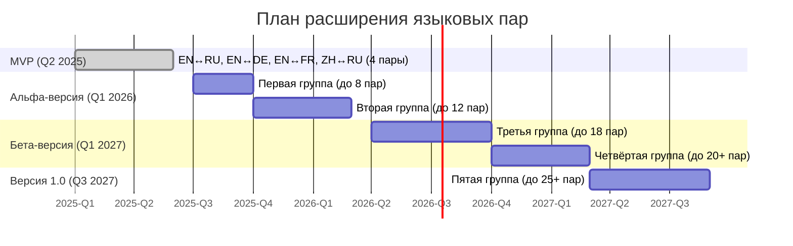

Стратегическое расширение языковых пар является ключевым фактором масштабирования модульной системы машинного перевода, обеспечивающим рост доходов и укрепление рыночных позиций при сохранении высокого качества перевода в специализированных отраслях.

## Текущий статус и обоснование расширения

В MVP система поддерживает 4 базовые языковые пары:

- Английский ↔ Русский
- Английский ↔ Немецкий
- Английский ↔ Французский
- Китайский ↔ Русский

Данный набор охватывает основные потребности приоритетных отраслей (техническая документация, нефтегазовая отрасль, автомобильная промышленность) и демонстрирует ключевые преимущества многостратегического подхода к переводу.

**Экономическое обоснование расширения:**

- Каждая дополнительная языковая пара увеличивает потенциальный TAM (Total Addressable Market) на 15-25%
- Клиенты, использующие 3+ языковые пары, демонстрируют на 40% более высокий уровень удержания
- Средний чек возрастает на 30-35% при добавлении каждых 2-3 новых языковых пар к базовому набору

## Принципы расширения языковых пар

1. **Приоритизация на основе интегрального индекса**:
    
    - Рыночный спрос в целевых отраслях (вес 40%)
    - Техническая сложность реализации (вес 30%)
    - Стратегическая важность для международной экспансии (вес 20%)
    - Конкурентная среда и потенциал дифференциации (вес 10%)
2. **Поэтапное масштабирование с валидацией**:
    
    - Каждая новая группа языковых пар проходит полный цикл валидации качества и рыночного спроса
    - Результаты анализа влияют на приоритизацию последующих групп
    - Корректировка плана возможна на основе обратной связи от клиентов
3. **Сохранение качества перевода в специализированных доменах**:
    
    - Поддержание высоких показателей точности терминологии (≥85%) для всех новых пар
    - Единый стандарт качества многостратегического перевода независимо от языковой пары
    - Строгий контроль качества отраслевой адаптации для каждого языка
4. **Ресурсная эффективность**:
    
    - Использование трансферного обучения и многоязычных моделей для оптимизации затрат
    - Последовательный запуск групп пар для распределения пиковой нагрузки на команду
    - Применение квантизации и дистилляции для снижения вычислительных требований

## Поэтапный план расширения языковых пар

### Матрица принятия решений для языковых пар

|Языковая пара|Рыночный спрос (40%)|Техническая сложность (30%)|Стратегическая важность (20%)|Конкурентное преимущество (10%)|Итоговый индекс|Группа|
|---|---|---|---|---|---|---|
|EN↔ES|Высокий (9)|Низкая (8)|Высокая (9)|Среднее (6)|8.3|1|
|EN↔IT|Средний (7)|Низкая (8)|Средняя (7)|Среднее (6)|7.2|1|
|EN→ZH|Высокий (9)|Высокая (4)|Высокая (9)|Высокое (8)|7.5|1|
|DE↔RU|Средний (7)|Средняя (6)|Высокая (8)|Высокое (9)|7.2|2|
|EN↔PL|Средний (6)|Средняя (5)|Средняя (7)|Высокое (8)|6.2|3|
|EN↔TR|Низкий (4)|Высокая (4)|Средняя (6)|Высокое (8)|5.0|4|

### Расширение в Альфа-версии (до 10-12 пар)

**Первая группа** (Q3-Q4 2025):

- EN↔ES (Английский ↔ Испанский)
- EN↔IT (Английский ↔ Итальянский)
- EN→ZH (Английский → Китайский)
- EN→JP (Английский → Японский)

**Ожидаемый экономический эффект:**

- Увеличение TAM на 30-35%
- Рост конверсии пилотных проектов в платные на 20-25%
- Прогнозируемый ROI для группы: 3.2x в течение 18 месяцев

**Вторая группа** (Q4 2025-Q1 2026):

- EN↔PT (Английский ↔ Португальский)
- EN→AR (Английский → Арабский)
- RU↔ZH (Русский ↔ Китайский - полноценная двунаправленная поддержка)
- DE↔RU (Немецкий ↔ Русский)
- FR↔RU (Французский ↔ Русский)

**Ожидаемый экономический эффект:**

- Усиление позиций на рынках нефтегазового сектора (особенно за счёт арабского языка)
- Увеличение среднего чека на 15-20%
- Прогнозируемый ROI для группы: 2.8x в течение 18 месяцев

### Расширение в Бета-версии (до 20+ пар)

**Третья группа** (Q2-Q3 2026):

- EN↔PL (Английский ↔ Польский)
- EN↔NL (Английский ↔ Нидерландский)
- EN↔SV (Английский ↔ Шведский)
- EN↔KO (Английский ↔ Корейский)
- EN↔TR (Английский ↔ Турецкий)
- JP↔RU (Японский ↔ Русский)

**Экономический эффект:**

- Проникновение на рынки Восточной Европы и Азии с высоким потенциалом роста
- Повышение привлекательности для международных корпораций
- Прогнозируемый ROI для группы: 2.4x в течение 24 месяцев

**Четвёртая группа** (Q4 2026-Q1 2027):

- EN↔CS (Английский ↔ Чешский)
- EN↔FI (Английский ↔ Финский)
- EN↔HU (Английский ↔ Венгерский)
- EN↔RO (Английский ↔ Румынский)
- AR↔RU (Арабский ↔ Русский)
- Расширение существующих языковых пар обратными направлениями

**Экономический эффект:**

- Завершение покрытия ключевых европейских рынков
- Укрепление позиций в автомобильной промышленности (венгерский, чешский)
- Прогнозируемый ROI для группы: 2.0x в течение 24 месяцев

### Версия 1.0 и дальнейшее расширение (до 25+ пар)

**Пятая группа** (Q1-Q3 2027):

- EN↔UK (Английский ↔ Украинский)
- EN↔NO (Английский ↔ Норвежский)
- EN↔DA (Английский ↔ Датский)
- EN↔BG (Английский ↔ Болгарский)
- EN↔HE (Английский ↔ Иврит)

**Экономический эффект:**

- Полное покрытие приоритетных рынков Европы, Ближнего Востока и Азии
- Усиление позиций в фармацевтике и медицине (иврит, скандинавские языки)
- Прогнозируемый совокупный эффект: увеличение ARR на 40-45% по сравнению с базовым набором языковых пар

## Технологический подход и интеграция с сервисной моделью

### Процесс добавления новой языковой пары

1. **Подготовка данных и обучение моделей** (3-6 недель)
2. **Доменная адаптация и терминологическая подготовка** (2-3 недели)
3. **Валидация качества и сравнительное тестирование** (1-2 недели)
4. **Интеграция в продуктовый конвейер и оптимизация** (1-2 недели)

**Ключевые отличия от конкурентов:**

- Сквозное тестирование на отраслевых корпусах (а не только на общих текстах)
- Оптимизация всех компонентов многостратегического подхода для каждой языковой пары
- Формирование специализированных терминологических баз с привлечением отраслевых экспертов

### Интеграция с ценовой и сервисной моделью

Дифференцированный подход к тарификации языковых пар:

|Категория|Характеристики|Относительная стоимость|Пример языков|
|---|---|---|---|
|Базовые|Высокоресурсные языки с полной поддержкой|1.0x (базовая ставка)|EN, DE, FR, RU, ES, IT|
|Стандартные|Языки со средним уровнем ресурсов|1.2x|PL, NL, PT, SV, CS|
|Премиальные|Азиатские и высокосложные языки|1.5x|ZH, JP, KO, AR, HE|
|Нишевые|Языки с ограниченными ресурсами|1.8x|FI, HU, Балтийские языки|

**Преимущества для клиентов:**

- Пакетные предложения со скидкой при использовании нескольких языковых пар
- Программа раннего доступа к новым языковым парам со специальными условиями
- Корпоративные тарифы с неограниченным доступом ко всем языковым парам

## Стратегии для языков с ограниченными ресурсами

Для низкоресурсных языков применяется комплексный подход, обеспечивающий конкурентное преимущество:

1. **Комбинированное использование нейронных и гибридных моделей**:
    
    - Базовый перевод через нейросетевые модели
    - Специализированная постобработка с учётом морфологических особенностей
    - ROI ниже, но высокая маржинальность из-за отсутствия конкуренции
2. **Целевой сбор отраслевых данных**:
    
    - Фокус на получение данных в приоритетных доменах, а не на общий объём
    - Партнёрство с отраслевыми ассоциациями и техническими университетами
    - Ожидаемое улучшение качества: 20-25% по сравнению с универсальными решениями
3. **Многоязычные модели с адаптерами**:
    
    - Базовая многоязычная модель для всех поддерживаемых языков
    - Специализированные языковые и доменные адаптеры
    - Снижение вычислительных затрат на 40-50% по сравнению с отдельными моделями

**Опережение конкурентов:**

- Фокус на отраслевой специализации в противовес универсальным решениям
- Возможность предложить качественный перевод в нишевых языковых парах на 6-12 месяцев раньше конкурентов
- Премиальное ценообразование за счёт уникальности предложения

## Ресурсное обеспечение и операционная эффективность

### Распределение ресурсов по этапам расширения

|Ресурс|Альфа-версия|Бета-версия|Версия 1.0|Относительные затраты|
|---|---|---|---|---|
|Лингвисты|6-8|8-10|10-12|30%|
|ML-инженеры|3-4|4-5|5-6|35%|
|Инфраструктура|GPU-кластер 8 карт|GPU-кластер 16 карт|GPU-кластер 24+ карт|25%|
|Данные|$120K|$200K|$250K|10%|

### Оптимизация затрат и экономическая эффективность

1. **Эффективное использование вычислительных ресурсов**:
    
    - Очередность разработки пар для оптимальной загрузки GPU-кластера
    - Квантизация моделей для снижения требований к памяти и вычислительным ресурсам
    - Экономия 25-30% на инфраструктурных затратах по сравнению с неоптимизированным подходом
2. **Оптимизация сбора данных**:
    
    - Использование синтетических методов расширения корпусов
    - Приоритетное создание отраслевых датасетов над общими корпусами
    - Снижение затрат на сбор данных на 30-35% по сравнению с традиционными методами
3. **Потенциал экономии при масштабировании**:
    
    - Снижение предельных затрат на разработку каждой новой языковой пары на 5-8%
    - Оптимизация процесса, снижающая время разработки пары на 10-15% для каждой последующей группы
    - Возможность одновременной разработки близкородственных языков с экономией до 20% ресурсов

## Ключевые риски и меры по их минимизации

|Риск|Вероятность|Влияние|Стратегия минимизации|Влияние на финансовые показатели|
|---|---|---|---|---|
|Недостаточное качество для сложных языков|Средняя|Высокое|Ранний прототип перед полной интеграцией, дополнительное время на оптимизацию|Резерв 15% бюджета на непредвиденные доработки|
|Неверная приоритизация языков|Низкая|Среднее|A/B-тестирование спроса, опросы клиентов, аналитика запросов|Потенциальная задержка ROI на 3-6 месяцев|
|Технологический прорыв конкурентов|Средняя|Высокое|Постоянный мониторинг, готовность к пивоту, акцент на отраслевой специализации|Возможное снижение маржи на 10-15%|
|Нехватка лингвистических ресурсов|Средняя|Среднее|Партнёрства с университетами, развитие технологий малоресурсного обучения|Увеличение операционных затрат на 10-12%|

**Конкурентная защита:**

- Фокус на специализированные отрасли и терминологию, где универсальные решения типа Titans менее эффективны
- Создание уникальных отраслевых датасетов как конкурентного актива
- Ускоренное развитие многостратегического подхода, сложного для репликации конкурентами

## Метрики успеха и KPI

Ключевые метрики для оценки эффективности стратегии расширения языковых пар:

1. **Рыночные показатели**:
    
    - Процент новых клиентов, привлечённых благодаря специфическим языковым парам: ≥20%
    - Рост среднего чека при использовании многоязычных проектов: ≥25%
    - Процент клиентов, использующих более 3 языковых пар: ≥40%
2. **Технические показатели**:
    
    - Соответствие качества новых пар стандартам базовых пар: 90%+ от уровня базовых пар
    - Время разработки новой языковой пары: сокращение на 5-7% для каждой последующей группы
    - Вычислительная эффективность при масштабировании: ≤60% линейного роста ресурсов
3. **Финансовые показатели**:
    
    - Совокупный ROI программы расширения языковых пар: ≥2.5x через 24 месяца
    - Вклад новых языковых пар в общий ARR: достижение 40%+ к Q4 2027
    - Маржинальность премиальных и нишевых языковых пар: на 15-20% выше базовых

## Заключение

Стратегическое расширение языковых пар является критически важным компонентом масштабирования системы машинного перевода, обеспечивающим устойчивый рост доходов и укрепление рыночных позиций. Предложенный план предусматривает поэтапное увеличение языкового охвата с 4 базовых пар до 25+ к релизу версии 1.0, с приоритизацией на основе комплексного анализа рыночного потенциала, технической реализуемости и стратегической важности.

Ключевым преимуществом данного подхода является баланс между агрессивным расширением и поддержанием высоких стандартов качества перевода в специализированных доменах. Экономическая эффективность обеспечивается за счёт оптимизации процессов разработки, применения трансферного обучения и интеллектуального распределения ресурсов.

Реализация стратегии расширения языковых пар создаст существенный барьер для входа конкурентов, особенно в нишевых отраслях и языковых направлениях, и обеспечит долгосрочное конкурентное преимущество даже в условиях эволюции универсальных моделей перевода типа Google Titans.

