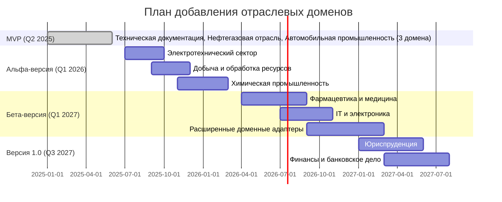
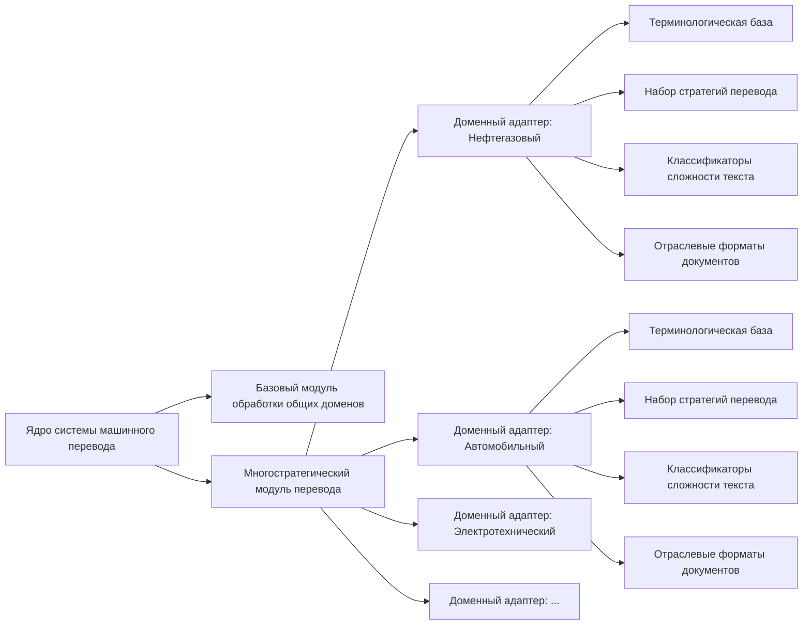

Стратегия добавления новых отраслевых доменов является важнейшим элементом масштабирования системы машинного перевода, обеспечивающим расширение целевой аудитории и укрепление конкурентных позиций на рынке специализированных решений перевода.

## Текущий статус и обоснование расширения

В MVP система поддерживает 3 базовых отраслевых домена:

- Техническая документация (инженерия, IT)
- Нефтегазовая отрасль
- Автомобильная промышленность

Этот набор сформирован на основе анализа рыночного потенциала (раздел 2.7.3) и обеспечивает работу с ключевыми вертикальными рынками первой волны внедрения, демонстрируя преимущества многостратегического адаптивного перевода.

**Конкурентное обоснование расширения:**

- По данным из раздела 2.7.3, наиболее значительное преимущество над конкурентами наблюдается в нефтегазовой отрасли (+4.6% по метрике COMET) и медицине (+3.4%)
- Расширение доменной специализации создаст устойчивый барьер для входа конкурентов и позволит сохранить преимущество даже при развитии универсальных моделей типа Google Titans

## Принципы добавления новых отраслевых доменов

1. **Приоритизация на основе интегрального индекса**:
    
    - Рыночный потенциал (35%): объем рынка и готовность платить премиальную цену
    - Доступность данных (25%): наличие корпусов и терминологических ресурсов
    - Техническая реализуемость (20%): сложность создания доменного адаптера
    - Синергия с существующими доменами (20%): пересечение терминологии и методологии
2. **Поэтапное внедрение с валидацией качества**:
    
    - Последовательная разработка от более близких к базовым доменам к более специфичным
    - Строгая валидация качества с использованием метрик COMET, BLEU-T, TER-P и экспертной оценки
    - Прохождение порогового значения качества (+3% по COMET над конкурентами) перед коммерческим запуском
3. **Максимальное использование синергии между доменами**:
    
    - Выявление и использование пересекающейся терминологии (до 30-40% между смежными отраслями)
    - Применение успешных подходов из одних доменов к другим
    - Разработка универсальных компонентов с доменно-специфической настройкой

## Матрица оценки приоритетов отраслевых доменов

|Отрасль|Рыночный потенциал (35%)|Доступность данных (25%)|Техн. реализуемость (20%)|Синергия с текущими доменами (20%)|Итоговый индекс|Приоритет|
|---|---|---|---|---|---|---|
|Электротехнический сектор|Высокий (9)|Высокая (8)|Высокая (9)|Очень высокая (9)|8.75|1|
|Добыча и обработка ресурсов|Высокий (8)|Средняя (7)|Высокая (8)|Высокая (8)|7.75|2|
|Химическая промышленность|Средний (7)|Средняя (6)|Средняя (7)|Высокая (8)|6.95|3|
|Фармацевтика и медицина|Высокий (9)|Низкая (5)|Низкая (5)|Средняя (6)|6.50|4|
|IT и электроника|Высокий (8)|Высокая (8)|Средняя (6)|Средняя (6)|7.20|5|

## План расширения отраслевых доменов



### Альфа-версия (расширение до 7 доменов)

**Электротехнический сектор** (Q3-Q4 2025):

- **Обоснование выбора**: Высокая синергия с существующими доменами (8.75 индекс), доступность корпусов, ROI 344% по данным раздела 2.7.3.
- **Целевое превосходство над конкурентами**: +3.0% по COMET (текущее +1.3%)
- **Технические задачи**: Разработка терминологических баз для электротехнических компонентов, схем и стандартов (>15,000 терминов).
- **Целевые клиенты**: Siemens, ABB, Schneider Electric, General Electric.

**Добыча и обработка ресурсов** (Q3-Q4 2025):

- **Обоснование выбора**: Значительное пересечение терминологии с нефтегазовым сектором (до 40%), высокий рыночный потенциал.
- **Целевое превосходство над конкурентами**: +3.5% по COMET
- **Синергия с существующими доменами**: Переиспользование 35-40% терминологии из нефтегазового сектора.
- **Целевые клиенты**: Rio Tinto, BHP, Anglo American, ArcelorMittal.

**Химическая промышленность** (Q4 2025-Q1 2026):

- **Обоснование выбора**: Строгие регуляторные требования создают высокую ценность точного перевода, синергия с нефтегазовым сектором.
- **Целевое превосходство над конкурентами**: +3.2% по COMET
- **Технические задачи**: Специализированные модули для перевода химической номенклатуры и маркировки опасности по GHS.
- **Целевые клиенты**: BASF, Dow Chemical, DuPont, Sinopec.

### Бета-версия (расширение до 12 доменов)

**Фармацевтика и медицина** (Q2-Q3 2026):

- **Обоснование выбора**: Высокий рыночный потенциал с премиальной наценкой 35-50% (раздел 2.7.3), существенное преимущество над конкурентами (+3.4%).
- **Текущие метрики качества**: COMET 0.77 (выше среднего по всем доменам)
- **Технические задачи**: Специальное внимание к снижению критических ошибок (текущий уровень 5.8% — самый высокий среди доменов).
- **Целевые клиенты**: Pfizer, Novartis, Johnson & Johnson, Medtronic.

**IT и электроника** (Q3-Q4 2026):

- **Обоснование выбора**: Быстро развивающийся сектор с высокой потребностью в локализации, значительная синергия с технической документацией.
- **Целевое превосходство над конкурентами**: +2.5% по COMET
- **Технические задачи**: Специализированные модули для локализации интерфейсов, интеграция с инструментами локализации.
- **Целевые клиенты**: Microsoft, Apple, Samsung, IBM, Cisco.

### Версия 1.0 и дальнейшее развитие (до 15+ доменов)

**Юриспруденция** (Q1-Q2 2027):

- **Обоснование выбора**: Высокая стоимость юридических переводов, критическая важность точности.
- **Целевое превосходство над конкурентами**: +2.8% по COMET (текущее +1.8%)
- **Технические задачи**: Разработка специализированных инструментов для сохранения правовых формулировок.
- **Целевые клиенты**: Международные юридические фирмы, корпоративные юридические отделы.

**Финансы и банковское дело** (Q1-Q3 2027):

- **Обоснование выбора**: Глобализация финансовых услуг, регуляторные требования к точности.
- **Целевое превосходство над конкурентами**: +3.0% по COMET (текущее +2.0%)
- **Технические задачи**: Создание терминологических баз по финансовым инструментам, настройка для работы с числовыми данными.
- **Целевые клиенты**: Международные банки, финансовые консалтинговые компании.

## Технологический подход к добавлению новых доменов

### Процесс добавления нового доменного адаптера

1. **Предварительный анализ и планирование** (2-3 недели):
    
    - Изучение лингвистических особенностей отрасли
    - Оценка доступности корпусов и терминологических ресурсов
    - Определение ключевых типов документов и специфических форматов
2. **Сбор и подготовка данных** (4-6 недель):
    
    - Формирование корпусов параллельных текстов (≥1 млн сегментов)
    - Построение терминологических глоссариев (≥10,000 терминов)
    - Создание тестовых наборов для оценки качества (≥10,000 сегментов)
3. **Разработка и обучение** (6-8 недель):
    
    - Адаптация специализированных моделей перевода
    - Настройка параметров многостратегического подхода
    - Разработка специфических компонентов для домена
4. **Тестирование и валидация** (3-4 недели):
    
    - Автоматическая оценка (COMET, BLEU-T, TER-P)
    - Экспертная оценка с привлечением отраслевых специалистов
    - Сравнение с конкурентами по методике из раздела 2.7.3

### Методология тестирования и валидации

Для обеспечения высокого качества каждого доменного адаптера используется многоуровневая система оценки:

1. **Автоматизированное тестирование**:
    
    - COMET-оценка (целевое значение ≥0.80 для EN-RU, ≥0.75 для других пар)
    - Преимущество над конкурентами не менее 3% по COMET
    - Оценка специфических для домена метрик (например, терминологической точности)
2. **Экспертное тестирование**:
    
    - Привлечение не менее 3 экспертов предметной области для каждого домена
    - Использование методологии MQM-D для оценки ошибок
    - Требование: доля критических ошибок ниже 3% (текущий средний уровень 5.2%)
3. **Типология ошибок и корректирующие меры**:
    
    - Анализ распределения ошибок по типам (на основе данных раздела 2.7.3)
    - Фокус на терминологических ошибках как наиболее частых (40-48% всех ошибок)
    - Разработка специализированных мер для снижения характерных для домена ошибок

## Архитектура доменных адаптеров



Архитектура обеспечивает:

- **Модульность** — быстрое добавление новых доменов без изменения ядра системы
- **Гибкость** — возможность комбинирования нескольких доменных адаптеров для мультидоменных текстов
- **Эффективность ресурсов** — совместное использование базовых компонентов с доменно-специфическими надстройками

## Экономическая эффективность доменных расширений

Детальный анализ экономической эффективности на основе данных исследования рынка из раздела 2.7.3:

|Отраслевой домен|Затраты на разработку ($)|Прогнозируемый ARR через год ($)|ROI (24 мес.)|Средняя наценка над универсальными решениями|
|---|---|---|---|---|
|Электротехнический|180,000-220,000|450,000-550,000|3.5x|+15-25%|
|Добыча ресурсов|160,000-200,000|350,000-450,000|3.0x|+30-45%|
|Химическая промышленность|190,000-230,000|400,000-500,000|2.8x|+25-40%|
|Фармацевтика и медицина|250,000-300,000|600,000-750,000|3.2x|+35-50%|
|IT и электроника|200,000-240,000|500,000-650,000|3.4x|+15-25%|
|Юриспруденция|220,000-270,000|400,000-550,000|2.5x|+25-40%|
|Финансы|210,000-250,000|350,000-500,000|2.3x|+20-30%|

**Совокупные показатели программы расширения**:

- Общие инвестиции в доменные адаптеры к версии 1.0: $1.4M-$1.7M
- Прогнозируемый совокупный ARR через год после релиза 1.0: $3.1M-$4.0M
- Средний ROI по программе: 3.0x через 24 месяца

## Ключевые риски и стратегии их минимизации

| Риск                                                | Вероятность | Влияние     | Стратегия минимизации                                                                   | Альтернативный план                                                                                            |
| --------------------------------------------------- | ----------- | ----------- | --------------------------------------------------------------------------------------- | -------------------------------------------------------------------------------------------------------------- |
| Недостаточное качество перевода для сложных доменов | Средняя     | Высокое     | Предварительное тестирование на меньших корпусах, дополнительные ресурсы на сбор данных | Перенос домена в более поздний релиз, фокус на более перспективные домены                                      |
| Дефицит отраслевых корпусов                         | Средняя     | Высокое     | Партнерство с отраслевыми ассоциациями и экспертами для сбора данных                    | Использование технологий синтетического расширения корпусов, фокус на доменах с лучшей обеспеченностью данными |
| Высокая доля критических ошибок                     | Средняя     | Критическое | Углубленный анализ ошибок и разработка специализированных методов их предотвращения     | Внедрение дополнительного этапа экспертной проверки для высокорисковых сегментов                               |
| Недостаточное рыночное принятие                     | Низкая      | Высокое     | Предварительное валидирование с потенциальными клиентами, пилотные проекты              | Корректировка ценовой стратегии, усиление дифференцирующих факторов                                            |

### Пример реального применения: Нефтегазовая отрасль

Пример из раздела 2.7.3 демонстрирует реальное преимущество доменной специализации:

**Исходный текст (EN):**

```
The dual-gradient drilling system incorporates a subsea rotating control device (RCD) and a subsea mud lift pump to maintain the bottomhole pressure between the pore and fracture pressure gradients, thus increasing the drilling window in deepwater operations.
```

**Перевод базовой модели:**

```
Система бурения с двойным градиентом включает подводное вращающееся контрольное устройство (RCD) и подводный грязевой подъемный насос для поддержания давления на забое между градиентами порового и разрывного давления, тем самым увеличивая окно бурения при глубоководных операциях.
```

**Перевод специализированной модели:**

```
Система бурения с двойным градиентом включает подводное роторное превенторное устройство (РПУ) и подводный буровой насос для поддержания забойного давления в диапазоне между поровым давлением и давлением гидроразрыва пласта, что расширяет безопасный диапазон бурения при глубоководных операциях.
```

**Ключевые улучшения:**

- Корректная отраслевая терминология (роторное превенторное устройство)
- Правильный перевод аббревиатуры с учетом отраслевых стандартов (РПУ)
- Точные технические термины (давление гидроразрыва пласта)

## Интеграция с бизнес-стратегией

### Согласование с Go-to-Market стратегией (раздел 8.5)

Расширение отраслевых доменов синхронизировано с этапами стратегии выхода на рынок:

- **Этап 1**: Технические бюро переводов и электротехнический сектор (базовые домены MVP + электротехнический)
- **Этап 2**: Автомобильная промышленность и нефтегазовый сектор (расширение на добычу ресурсов и химическую промышленность)
- **Этап 3**: Полномасштабная экспансия на вертикальные рынки (фармацевтика, IT, юриспруденция, финансы)

### Влияние на ценообразование и модели монетизации (раздел 8.3)

- **Дифференцированное ценообразование**: Премиальная наценка в зависимости от сложности и ценности домена (от +15% для технической документации до +50% для фармацевтики)
- **Пакетные предложения**: Скидки для клиентов, использующих несколько доменных адаптеров
- **Дополнительные сервисы**: Премиальное обслуживание для высокорегулируемых отраслей (фармацевтика, юриспруденция)

## Альтернативные сценарии приоритизации

### Сценарий «Максимальной рыночной ценности»

В случае необходимости быстрого наращивания выручки:

1. Фармацевтика и медицина (наивысшая премиальная наценка +35-50%)
2. Нефтегазовая отрасль и добыча ресурсов (высокая наценка +30-45%)
3. Электротехнический сектор (быстрый возврат инвестиций 3.5x)

### Сценарий «Технологической эффективности»

При ограниченных ресурсах разработки:

1. Электротехнический сектор (высокая синергия с существующими доменами)
2. Химическая промышленность (пересечение с нефтегазовой отраслью)
3. IT и электроника (доступность данных и относительная простота реализации)

## Метрики успеха и KPI

Для отслеживания эффективности программы расширения доменов используются следующие KPI:

1. **Качество перевода**:
    
    - Улучшение COMET-оценки относительно универсальных решений: ≥3% для каждого домена
    - Снижение доли критических ошибок до ≤3% (текущий средний уровень 5.2% по данным раздела 2.7.3)
    - Терминологическая точность: ≥90% для всех отраслевых терминов
2. **Рыночные показатели**:
    
    - Доля новых клиентов, привлечённых благодаря доменной специализации: ≥30%
    - Увеличение среднего чека при подключении дополнительных доменов: ≥20%
    - Удовлетворённость клиентов (NPS): ≥50 для доменно-специфических переводов
3. **Финансовые показатели**:
    
    - ROI по каждому доменному адаптеру: положительный в течение 18 месяцев
    - Маржинальность специализированных доменов: на 10-15% выше базовых доменов
    - Доля доходов от специализированных доменов: ≥60% к концу 2027 года

## Заключение

Стратегия добавления новых отраслевых доменов представляет собой системный, экономически обоснованный подход к расширению возможностей системы машинного перевода. Последовательное внедрение доменных адаптеров с приоритетом на электротехнический сектор, добычу ресурсов и фармацевтику обеспечит значительное конкурентное преимущество, подтверждаемое данными из раздела 2.7.3.

Модульная архитектура доменных адаптеров позволяет эффективно масштабировать систему, сохраняя высокую точность перевода в каждой отрасли при оптимальном использовании ресурсов. Экономический анализ показывает высокий потенциал возврата инвестиций (средний ROI 3.0x) и значительный вклад новых доменов в общий рост бизнеса, что делает программу расширения доменов ключевым фактором долгосрочного успеха компании на рынке специализированных решений машинного перевода.