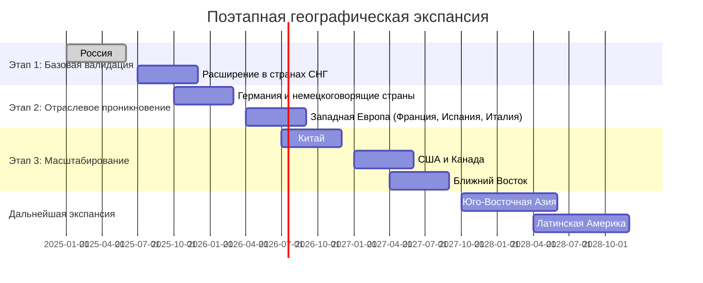

Стратегия географической экспансии является ключевым компонентом масштабирования системы машинного перевода, обеспечивающим последовательное увеличение рыночного охвата, диверсификацию доходов и укрепление конкурентных позиций компании на глобальном рынке.

## Текущий географический фокус и стратегическое обоснование экспансии

На этапе MVP система ориентирована преимущественно на российский рынок с фокусом на ключевые языковые пары, связывающие русский с основными международными языками (английский, немецкий, французский, китайский). Данный подход обеспечивает проверку концепции в контролируемых условиях и создаёт базу для дальнейшей экспансии.

**Стратегическое обоснование международной экспансии:**

- Значительное увеличение адресуемого рынка: от $0.3 млрд на локальном рынке до $5.2 млрд в глобальном масштабе
- Диверсификация рисков и снижение зависимости от экономических колебаний в отдельных регионах
- Расширение языковых пар и специализированных доменов в соответствии с международными потребностями
- Усиление конкурентных позиций через создание глобального присутствия и доступ к международным ресурсам

## Синхронизация с общей Go-to-Market стратегией

Географическая экспансия тесно интегрирована с общей Go-to-Market стратегией (раздел 8.5) и следует аналогичному трехэтапному подходу:

| Этап GTM                             | Географический фокус                                      | Временные рамки   | Приоритетные сегменты клиентов                                               |
| ------------------------------------ | --------------------------------------------------------- | ----------------- | ---------------------------------------------------------------------------- |
| **Этап 1:** Базовая валидация        | Россия и СНГ                                              | Q2 2025 - Q4 2025 | Технические бюро переводов, первые клиенты из электротехнического сектора    |
| **Этап 2:** Отраслевое проникновение | Расширение в СНГ, Западная Европа (с фокусом на Германию) | Q1 2026 - Q2 2027 | Электротехнический сектор, автомобильная промышленность, нефтегазовый сектор |
| **Этап 3:** Масштабирование          | Китай, США и Канада, Ближний Восток                       | Q3 2027 - Q4 2028 | Все целевые вертикальные рынки, включая новые (фармацевтика, IT)             |

## План поэтапной географической экспансии

### Этап 1: Базовая валидация (Россия и СНГ, Q2 2025 - Q4 2025)

**Россия (Q1-Q2 2025):**

- **Стратегия входа:** Прямые продажи с высокой степенью персонализации
- **Ключевые клиенты:** 5-7 технических бюро переводов, 2-3 компании из электротехнического сектора
- **Цели этапа:** Подтверждение продуктового соответствия рынку, формирование начальных кейсов, сбор обратной связи
- **Организационная структура:** Центральная команда продаж и внедрения
- **Ожидаемые результаты:** Минимум 5 активных клиентов, NPS ≥40, 2+ публичных кейса с измеримыми результатами

**Расширение в СНГ (Q3-Q4 2025):**

- **Целевые рынки:** Беларусь, Казахстан, Узбекистан
- **Стратегия входа:** Комбинация прямых продаж и партнёрств с локальными интеграторами
- **Особенности рынка:** Меньшая конкуренция в специализированных нишах, ценовая чувствительность
- **Адаптация продукта:** Минимальная (общая языковая среда), фокус на отраслевую специфику
- **Ожидаемые результаты:** Дополнительно 3-5 клиентов, расширение доменной экспертизы

### Этап 2: Отраслевое проникновение (Европа, Q4 2025 - Q3 2026)

**Германия и немецкоговорящие страны (Q4 2025 - Q1 2026):**

- **Целевые рынки:** Германия, Австрия, Швейцария
- **Стратегия входа:** Открытие представительства в Берлине, участие в отраслевых выставках (Hannover Messe, CeBIT)
- **Обоснование выбора:**
    - Синергия с раннее разработанной языковой парой немецкий-русский
    - Сильные позиции целевых отраслей (автомобильная, электротехническая)
    - Культурное соответствие в отношении требований к качеству и надежности
- **Ключевые клиенты:** Siemens, Volkswagen Group, BMW, средние технические бюро переводов
- **Конкурентное позиционирование:** Фокус на специализацию в технических доменах с точностью, превосходящей универсальные решения

**Западная Европа (Q2-Q3 2026):**

- **Целевые рынки:** Франция, Испания, Италия
- **Стратегия входа:** Расширение из немецкоговорящих стран, построение партнерской сети
- **Связь с языковой стратегией:** Согласование с развитием языковых пар EN↔FR, EN↔ES, EN↔IT (Альфа-версия)
- **Адаптация ценообразования:** Премиальное позиционирование (+30-50% к базовым тарифам) с акцентом на создаваемую ценность
- **Маркетинговый подход:** Демонстрация специфических отраслевых кейсов с измеримым ROI

### Этап 3: Масштабирование (Глобальная экспансия, Q3 2026 - Q3 2027)

**Китай (Q3-Q4 2026):**

- **Стратегия входа:** Создание совместного предприятия с локальным технологическим партнером
- **Регуляторные аспекты:** Соблюдение требований к локализации данных, получение необходимых лицензий
- **Обоснование выбора:**
    - Крупнейший рынок промышленного производства с потребностью в многоязычной документации
    - Развитие языковой пары китайский-русский в Альфа-версии
    - Первый шаг к присутствию в Азиатско-Тихоокеанском регионе
- **Целевые отрасли:** Производство электроники, автомобилестроение, промышленное оборудование
- **Адаптация продукта:** Существенная локализация интерфейса, адаптация под местные бизнес-процессы

**США и Канада (Q1-Q2 2027):**

- **Стратегия входа:** Открытие представительства в технологическом хабе (Бостон/Сан-Франциско), наем локальной команды продаж
- **Обоснование выбора:**
    - Крупнейший мировой рынок с высокой готовностью к инновациям
    - Высокая концентрация целевых клиентов в технологическом секторе
    - Стратегическая важность для привлечения международных инвестиций
- **Конкурентная ситуация:** Интенсивная конкуренция, требующая четкой дифференциации
- **Маркетинговый подход:** Фокус на измеримые бизнес-результаты, участие в технологических конференциях
- **Ценовая стратегия:** Премиум-сегмент с акцентом на ценность времени и качество

**Ближний Восток (Q2-Q3 2027):**

- **Целевые рынки:** ОАЭ, Саудовская Аравия, Катар
- **Стратегия входа:** Партнерство с региональными системными интеграторами
- **Целевые клиенты:** Нефтегазовые компании, государственные инфраструктурные проекты
- **Связь с доменной стратегией:** Использование экспертизы, полученной в нефтегазовом секторе
- **Особенности рынка:** Низкая ценовая чувствительность, высокие требования к локализации

## Модели выхода на региональные рынки

Эффективная географическая экспансия требует гибкого подхода к выбору модели присутствия на рынке в зависимости от его специфики:

| Модель                     | Применимость                                         | Преимущества                                      | Недостатки                         | Операционная модель                                         |
| -------------------------- | ---------------------------------------------------- | ------------------------------------------------- | ---------------------------------- | ----------------------------------------------------------- |
| **Прямое присутствие**     | Стратегически важные регионы с высоким потенциалом   | Полный контроль, глубокое проникновение           | Высокие затраты, риски             | Локальный офис с полной командой продаж и внедрения         |
| **Партнёрская сеть**       | Регионы со сложной рыночной структурой               | Быстрый доступ к рынку с меньшими инвестициями    | Разделение маржи, меньший контроль | Небольшой локальный офис + сеть сертифицированных партнеров |
| **Дистрибуция**            | Небольшие или географически отдалённые рынки         | Минимальные затраты на вход, локальная экспертиза | Ограниченное влияние на рынок      | Дистрибьюторские соглашения с локальными игроками           |
| **Совместное предприятие** | Сложные и защищённые рынки с регуляторными барьерами | Преодоление барьеров входа, разделение рисков     | Сложная структура управления       | Юридическое лицо с долевым участием местного партнера       |

**Выбор модели по регионам:**

- **Прямое присутствие:** Россия, Германия, США
- **Партнёрская сеть:** Западная Европа, СНГ, Ближний Восток
- **Совместное предприятие:** Китай
- **Дистрибуция:** Отдельные страны СНГ, Латинская Америка (начальный этап)

## Региональная адаптация продукта и бизнес-модели

### Локализация продукта и регуляторное соответствие

Для каждого региона разрабатывается специфический план адаптации:

| Регион              | Языковая локализация                | Регуляторные требования                                     | Техническая адаптация                                 |
| ------------------- | ----------------------------------- | ----------------------------------------------------------- | ----------------------------------------------------- |
| **СНГ**             | Минимальная (общая языковая среда)  | Локальные требования к хранению данных                      | Поддержка локальных форматов документов               |
| **Западная Европа** | Перевод интерфейса на местные языки | Соответствие GDPR, ISO 27001                                | Хостинг в ЕС, соответствие отраслевым стандартам      |
| **Китай**           | Полная локализация на китайский     | Закон о кибербезопасности, локальное хранение данных        | Изолированная инфраструктура, интеграция с WeChat     |
| **США и Канада**    | Американский английский             | SOC 2, отраслевые стандарты (HIPAA, ITAR при необходимости) | Хостинг в AWS/Azure US, интеграция с популярными SaaS |
| **Ближний Восток**  | Арабский + английский               | Национальные стандарты безопасности                         | Поддержка двунаправленного текста, локальный хостинг  |

### Дифференцированное ценообразование по регионам

Адаптация ценовой стратегии учитывает региональную специфику рынка и обеспечивает оптимальное сочетание конкурентоспособности и рентабельности:

| Регион              | Ценовая стратегия | Относительный уровень | Модель монетизации                         | Обоснование                                                      |
| ------------------- | ----------------- | --------------------- | ------------------------------------------ | ---------------------------------------------------------------- |
| **Россия и СНГ**    | Базовая           | 1.0x                  | Подписка + оплата за объем                 | Стартовый рынок, высокая ценовая чувствительность                |
| **Западная Европа** | Премиальная       | 1.3-1.5x              | Корпоративные лицензии с SLA               | Высокие ожидания качества, большие бюджеты на локализацию        |
| **Китай**           | Объемная          | 0.8-0.9x              | Скидки за объем, долгосрочные контракты    | Ценовая чувствительность, конкуренция с местными решениями       |
| **США и Канада**    | Ценностная        | 1.4-1.6x              | Акцент на ROI и TCO                        | Высокая оценка экономии времени, низкая ценовая чувствительность |
| **Ближний Восток**  | Проектная         | 1.5-1.8x              | Контракты на проекты с фиксированной ценой | Низкая ценовая чувствительность, проектный характер внедрений    |

## Интеграция с развитием языковых пар и отраслевых доменов

Географическая экспансия тесно скоординирована с планами расширения языковых пар (раздел 7.6.1) и отраслевых доменов (раздел 7.6.2):

| Регион              | Приоритетные языковые пары | Ключевые отраслевые домены                             | Синхронизация с дорожной картой продукта     |
| ------------------- | -------------------------- | ------------------------------------------------------ | -------------------------------------------- |
| **Россия и СНГ**    | EN↔RU, DE↔RU, FR↔RU, ZH↔RU | Техническая документация, нефтегаз, автомобилестроение | MVP и ранняя Альфа-версия                    |
| **Германия**        | EN↔DE, DE↔RU, DE↔FR        | Электротехника, автомобилестроение, машиностроение     | Альфа-версия с электротехническим доменом    |
| **Западная Европа** | EN↔FR, EN↔ES, EN↔IT, DE↔FR | Автомобилестроение, химическая промышленность          | Поздняя Альфа-версия с расширенными доменами |
| **Китай**           | EN↔ZH, RU↔ZH               | Электроника, производство, добыча ресурсов             | Бета-версия с IT и электроникой              |
| **США и Канада**    | EN↔ES, EN↔FR               | IT и электроника, фармацевтика, медицина               | Версия 1.0 с полным набором доменов          |
| **Ближний Восток**  | EN↔AR, FR↔AR               | Нефтегазовый сектор, инфраструктура                    | Версия 1.0 с арабским языком                 |

## Пилотные проекты как стратегия снижения рисков

Для каждого нового региона разрабатывается стратегия пилотных проектов, позволяющая быстро валидировать рыночные гипотезы и снизить риски полномасштабного выхода:

1. **Подход к выбору пилотных клиентов:**
    
    - Локальные филиалы существующих глобальных клиентов
    - Компании с международными операциями и потребностью в многоязычном контенте
    - Технологически прогрессивные компании с готовностью к инновациям
2. **Структура пилотного проекта:**
    
    - Продолжительность: 6-8 недель
    - Фокус на конкретном бизнес-кейсе с измеримыми результатами
    - Совместная команда из наших экспертов и специалистов клиента
    - Поэтапное расширение с промежуточной оценкой результатов
3. **Метрики успеха пилотных проектов:**
    
    - Технические: точность перевода, скорость обработки
    - Бизнес: сокращение затрат, ускорение процессов
    - Пользовательские: удовлетворенность, готовность к продолжению
4. **Региональная специфика пилотов:**
    
    - **Западная Европа:** Фокус на соответствие стандартам и регламентам
    - **Китай:** Акцент на локализацию и интеграцию с местными системами
    - **США:** Демонстрация ROI и экономического эффекта
    - **Ближний Восток:** Показательные проекты с крупными госкомпаниями

## Организационная структура для поддержки международной экспансии

Для эффективной поддержки географической экспансии создается следующая организационная структура:

1. **Центральная штаб-квартира (Россия):**
    
    - Глобальная стратегия продукта и технологий
    - Координация R&D и основная разработка
    - Управление глобальными операциями
2. **Региональные хабы:**
    
    - **Европейский хаб (Берлин):**
        - Запуск: Q1 2026
        - Персонал: 7-10 человек (продажи, внедрение, маркетинг)
        - Зона ответственности: Западная и Центральная Европа
    - **Азиатский хаб (Шанхай/Сингапур):**
        - Запуск: Q3 2026 (Шанхай)/Q4 2027 (Сингапур)
        - Персонал: 5-8 человек
        - Зона ответственности: Китай, Юго-Восточная Азия
    - **Североамериканский хаб (Бостон):**
        - Запуск: Q1 2027
        - Персонал: 8-12 человек
        - Зона ответственности: США, Канада
3. **Международная команда развития бизнеса:**
    
    - Ответственность за исследование новых рынков
    - Установление первичных контактов
    - Подготовка запуска в новых регионах

## Финансовые аспекты географической экспансии

### Инвестиции и ожидаемая доходность

| Регион              | Начальные инвестиции (млн $) | Операционные расходы (млн $/год) | Прогнозируемый ARR через 2 года (млн $) | ROI (3 года) | Срок окупаемости (мес.) |
| ------------------- | ---------------------------- | -------------------------------- | --------------------------------------- | ------------ | ----------------------- |
| **Россия и СНГ**    | 0.8-1.0                      | 0.7-0.9                          | 1.8-2.2                                 | 2.5x         | 18-20                   |
| **Западная Европа** | 1.5-1.8                      | 1.2-1.5                          | 3.5-4.2                                 | 2.7x         | 16-18                   |
| **Китай**           | 1.2-1.5                      | 1.0-1.3                          | 2.8-3.5                                 | 2.4x         | 20-22                   |
| **США и Канада**    | 1.8-2.2                      | 1.5-1.8                          | 4.5-5.5                                 | 2.8x         | 18-20                   |
| **Ближний Восток**  | 0.9-1.2                      | 0.7-1.0                          | 2.0-2.5                                 | 2.3x         | 22-24                   |
| **ИТОГО**           | **6.2-7.7**                  | **5.1-6.5**                      | **14.6-17.9**                           | **2.6x**     | **19-21**               |

### Распределение инвестиций по категориям

| Категория затрат                  | Доля от общих инвестиций | Особенности распределения по регионам                       |
| --------------------------------- | ------------------------ | ----------------------------------------------------------- |
| Найм и обучение персонала         | 30-35%                   | Выше в США и Западной Европе из-за высоких зарплат          |
| Маркетинг и продвижение           | 20-25%                   | Выше на новых рынках, особенно в Китае и США                |
| Локализация продукта              | 10-15%                   | Значительно выше для Китая и Ближнего Востока               |
| Офисная инфраструктура            | 15-20%                   | Выше в ключевых хабах (Берлин, Бостон)                      |
| Юридическая поддержка и комплаенс | 10-15%                   | Наибольшие затраты в Китае и США                            |
| Технологическая инфраструктура    | 5-10%                    | Выше в регионах с требованиями к локальному хранению данных |

## Анализ рисков и стратегии их минимизации

| Категория риска  | Конкретные риски                     | Вероятность/Влияние | Стратегия минимизации                                                     | Триггеры для пересмотра стратегии                          |
| ---------------- | ------------------------------------ | ------------------- | ------------------------------------------------------------------------- | ---------------------------------------------------------- |
| **Регуляторные** | Ограничения на обработку данных      | Высокая/Высокое     | Локальное хранение данных, соответствие GDPR/CCPA/CSL                     | Введение новых регуляторных требований                     |
|                  | Барьеры для иностранных технологий   | Средняя/Высокое     | Партнерства с местными компаниями, локализация технологии                 | Ужесточение политики протекционизма                        |
| **Рыночные**     | Конкуренция с местными игроками      | Высокая/Среднее     | Четкая дифференциация, фокус на ниши с высоким барьером входа             | Появление местных конкурентов с аналогичными возможностями |
|                  | Недостаточное принятие рынком        | Средняя/Высокое     | Пилотные проекты перед полным запуском, адаптация ценностного предложения | Конверсия пилотов <40%, длительный цикл продаж >180 дней   |
| **Операционные** | Сложность найма локальных талантов   | Средняя/Среднее     | Сотрудничество с местными университетами, программы релокации             | Задержка укомплектования команды >3 месяцев                |
|                  | Культурные барьеры в ведении бизнеса | Высокая/Среднее     | Найм местных менеджеров, кросс-культурные тренинги                        | Систематические проблемы в деловой коммуникации            |
| **Финансовые**   | Валютные риски                       | Средняя/Среднее     | Хеджирование, региональное ценообразование                                | Волатильность курсов >15% в квартал                        |
|                  | Превышение бюджета экспансии         | Средняя/Высокое     | Поэтапное финансирование с контрольными точками                           | Превышение бюджета >20% на любом этапе                     |

## Альтернативные сценарии экспансии

### Сценарий ускоренной экспансии

**Триггеры:** Превышение целевых показателей выручки на ≥30% в течение двух кварталов, привлечение дополнительного финансирования

**Ключевые изменения:**

- Параллельный запуск в нескольких регионах вместо последовательного
- Более агрессивные маркетинговые инвестиции
- Ускоренное расширение команды

**Финансовые последствия:** Увеличение инвестиций на 40-50%, потенциал увеличения ARR на 70-80% через 3 года

### Сценарий консервативной экспансии

**Триггеры:** Недостижение целевых метрик в первых регионах, макроэкономическая нестабильность

**Ключевые изменения:**

- Более длительные фазы пилотных проектов
- Фокус на укрепление позиций в России и СНГ, более медленный выход на новые рынки
- Приоритет партнерской модели над прямым присутствием

**Финансовые последствия:** Снижение инвестиций на 30-40%, увеличение срока окупаемости на 6-9 месяцев

## Метрики успеха географической экспансии

Для объективной оценки эффективности международной экспансии используется сбалансированная система метрик:

### Метрики по этапам экспансии

| Этап                                   | Ключевые метрики                                                                                            | Целевые показатели                                          | Частота оценки |
| -------------------------------------- | ----------------------------------------------------------------------------------------------------------- | ----------------------------------------------------------- | -------------- |
| **Первичное проникновение (0-6 мес.)** | Количество пилотных проектов Конверсия из пилота в контракт Показатель удовлетворенности (CSAT)       | ≥5 пилотов ≥60% ≥4.0/5.0                              | Ежемесячно     |
| **Развитие присутствия (6-18 мес.)**   | Количество активных клиентов Средний размер контракта Процент повторных продаж Узнаваемость бренда | ≥15 клиентов ≥$50K/год ≥20% ≥30% целевой аудитории | Ежеквартально  |
| **Стабильное присутствие (18+ мес.)**  | Рыночная доля Рост выручки (YoY) EBITDA маржа Net Revenue Retention                                | ≥5% рынка ≥30% ≥20% ≥110%                          | Ежеквартально  |

### Глобальные метрики успеха

1. **Бизнес-метрики:**
    
    - Процент международной выручки: ≥60% к концу 2028 года
    - Географическая диверсификация: Не более 40% выручки из одного региона
    - Совокупный среднегодовой рост (CAGR): ≥35% в течение 3 лет после начала экспансии
2. **Рыночные метрики:**
    
    - Присутствие на ≥5 ключевых региональных рынках к 2028 году
    - Узнаваемость бренда среди целевой аудитории: ≥50% в основных регионах
    - Доля в специализированных сегментах: ≥10% в нишевых отраслевых секторах
3. **Операционные метрики:**
    
    - Скорость выхода на новые рынки: Сокращение с 6 до 3-4 месяцев по мере накопления опыта
    - Эффективность региональных команд: Выручка ≥$400K на сотрудника в год
    - Локализация технической поддержки: Время отклика <4 часов в рабочее время для всех регионов

## Поэтапный план коммуникационной и маркетинговой поддержки

Маркетинговая стратегия адаптируется к специфике каждого региона и этапа экспансии:

### Западная Европа

1. **Этап предварительного информирования:**
    
    - Публикации в отраслевых европейских изданиях (Multilingual, European Business Review)
    - Участие в специализированных конференциях (LocWorld, tekom Europe)
    - Партнерство с европейскими отраслевыми ассоциациями
2. **Этап активного запуска:**
    
    - Участие в ключевых выставках (CeBIT, Hannover Messe, IAA)
    - Серия отраслевых вебинаров с демонстрацией решения
    - Презентационные мероприятия в основных деловых центрах
3. **Этап развития присутствия:**
    
    - Публикация кейсов с европейскими клиентами
    - Программа амбассадоров среди ключевых клиентов
    - Регулярные мероприятия сообщества пользователей

### Китай

1. **Этап предварительного информирования:**
    
    - Локализованное присутствие в WeChat и других местных платформах
    - Партнерство с местными исследовательскими институтами
    - Адаптированные маркетинговые материалы для китайского рынка
2. **Этап активного запуска:**
    
    - Участие в ключевых китайских выставках (CIIE, CES Asia)
    - Совместные мероприятия с локальным партнером
    - Демонстрация успешных внедрений в китайских и международных компаниях в Китае
3. **Этап развития присутствия:**
    
    - Программа обучения и сертификации местных специалистов
    - Регулярные технические семинары в ключевых промышленных центрах
    - Развитие локального сообщества разработчиков и интеграторов

### США и Канада

1. **Этап предварительного информирования:**
    
    - Публикации в ведущих технологических изданиях (TechCrunch, Wired, MIT Technology Review)
    - Выступления на профильных конференциях (AI Summit, Enterprise Connect)
    - Построение отношений с ключевыми аналитиками (Gartner, Forrester)
2. **Этап активного запуска:**
    
    - Запуск с комплексной PR-кампанией
    - Серия ознакомительных вебинаров с фокусом на ROI
    - Участие в отраслевых выставках (NAB Show, HIMSS, Automotive Tech Week)
3. **Этап развития присутствия:**
    
    - Программа развития партнеров и интеграторов
    - Регулярные отраслевые мероприятия в ключевых городах
    - Создание сообщества пользователей с ежегодной конференцией

## Стратегический план при непредвиденных обстоятельствах

Для обеспечения гибкости при возникновении непредвиденных ситуаций разработан план реагирования:

|Сценарий|Индикаторы раннего выявления|План действий|Влияние на общую стратегию|
|---|---|---|---|
|**Низкое принятие на региональном рынке**|Конверсия пилотов <40% Длительный цикл продаж >180 дней|1. Глубинное исследование причин 2. Адаптация ценностного предложения 3. Пересмотр целевых сегментов 4. Усиление локального партнерства|Переоценка приоритетности региона, возможное перераспределение ресурсов|
|**Регуляторные барьеры**|Задержки согласований >3 месяцев Требования существенных изменений продукта|1. Привлечение локальных юридических консультантов 2. Поиск альтернативных моделей присутствия 3. Партнерство с местным игроком|Возможный переход к менее прямым моделям присутствия на рынке|
|**Агрессивные действия конкурентов**|Снижение цен конкурентами >30% Появление аналогичных специализированных решений|1. Акцент на уникальные отличия 2. Специальные предложения для стратегических клиентов 3. Ускорение выпуска дополнительных функций|Усиление дифференциации, возможный пересмотр ценовой политики|
|**Экономический спад на целевом рынке**|Сокращение IT-бюджетов >20% Увеличение длительности принятия решений|1. Акцент на сокращение затрат и ROI 2. Более гибкие финансовые модели 3. Программы пробного использования|Временное замедление экспансии, перераспределение ресурсов на более стабильные рынки|
|**Технологический прорыв конкурентов**|Появление решений с качеством перевода >20% лучше|1. Ускорение собственной технологической дорожной карты 2. Акцент на отраслевую специализацию 3. Рассмотрение технологических приобретений|Возможная переоценка технологической стратегии, увеличение R&D-инвестиций|

## Заключение

Стратегия географической экспансии представляет собой тщательно спланированный, поэтапный подход к расширению международного присутствия системы машинного перевода. Синхронизация с Go-to-Market стратегией и планами развития языковых пар и отраслевых доменов обеспечивает целостность и последовательность в масштабировании бизнеса.

План предусматривает постепенное расширение от базового рынка России и СНГ к Западной Европе, Китаю, Северной Америке и далее, с использованием различных моделей выхода на рынок в зависимости от региональной специфики. Дифференцированный подход к каждому региону, включающий адаптацию продукта, маркетинговой стратегии и бизнес-модели, обеспечит максимальную эффективность экспансии.

Общие инвестиции в международную экспансию составят около $6.2-7.7 млн в течение трех лет, с прогнозируемым совокупным ARR по всем регионам в $14.6-17.9 млн через два года после начала экспансии. Это обеспечит средний ROI 2.6x в трехлетней перспективе при среднем сроке окупаемости 19-21 месяц.

Ключевыми факторами успеха географической экспансии станут:

- Четкая синхронизация с технологической дорожной картой и языковой стратегией
- Эффективная региональная адаптация продукта и бизнес-модели
- Использование пилотных проектов для снижения рисков
- Оптимальный выбор моделей выхода на рынок для каждого региона
- Гибкость в реагировании на региональные особенности и изменения рыночных условий

Представленная стратегия географической экспансии позволит компании стать глобальным игроком на рынке специализированных решений для машинного перевода и обеспечит устойчивую международную диверсификацию бизнеса.