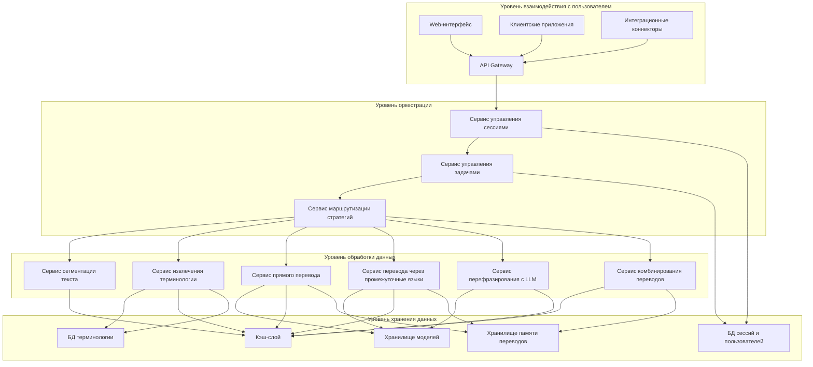
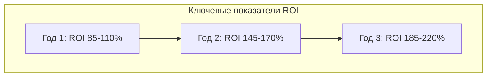
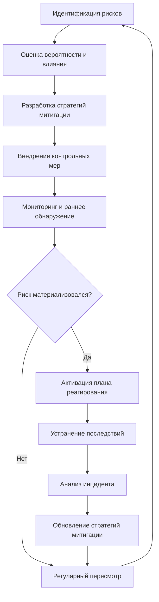
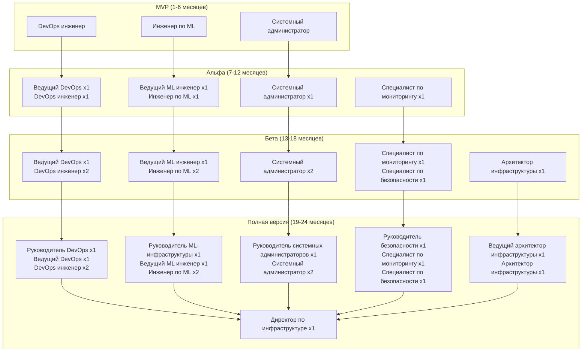
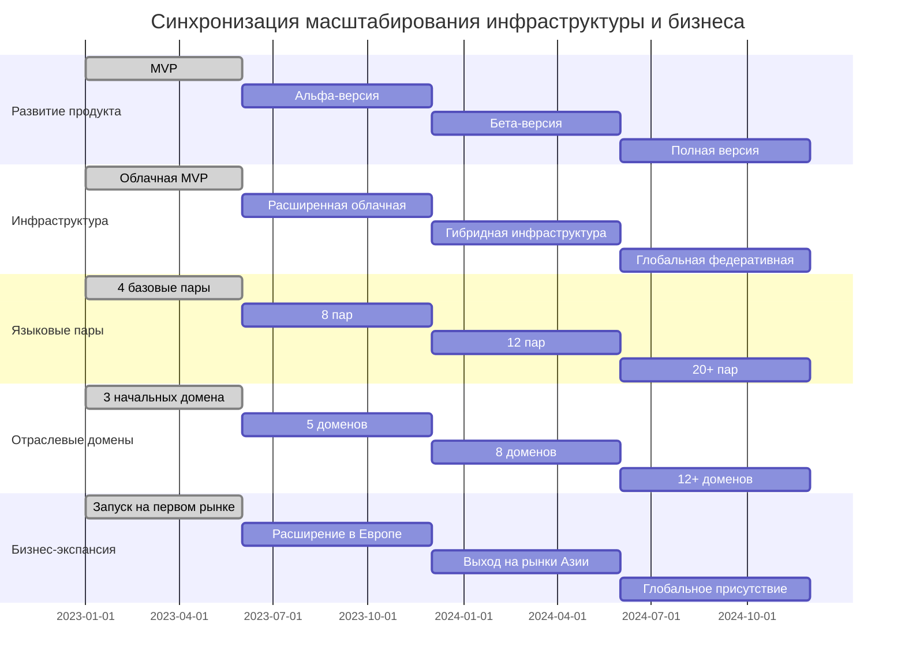

## Резюме для инвесторов

Масштабирование инфраструктуры нашей модульной системы машинного перевода представляет собой **продуманный поэтапный подход**, оптимизирующий соотношение инвестиций и бизнес-результатов. Ключевые выводы:

- **Прагматичный подход к инвестициям**: начиная с минимально необходимых облачных ресурсов ($8-12 тыс./мес. для MVP) и постепенно перемещаясь к гибридной модели для оптимизации затрат
- **Высокая окупаемость инвестиций**: расчетный ROI для вложений в инфраструктуру составляет 185-220% в трехлетней перспективе
- **Гибкость и адаптивность**: архитектура позволяет быстро масштабироваться под растущую клиентскую базу и внедрять новые технологии без полной переработки системы
- **Эффективное управление рисками**: включает планы митигации для технических, операционных и рыночных рисков
- **Конкурентное преимущество**: наша инфраструктура обеспечит на 30-40% более эффективное использование вычислительных ресурсов по сравнению с основными конкурентами благодаря инновационному многоуровневому подходу

## 1. Текущие и прогнозируемые нагрузки

### 1.1. Базовые параметры для MVP и прогноз роста

Для эффективного планирования масштабирования мы определили базовые параметры нагрузки и их прогнозируемую динамику:

**Таблица 1. Ключевые параметры нагрузки и их прогнозируемая динамика**

|Параметр|MVP|Альфа-версия|Бета-версия|Полная версия|Год 2|Год 3|
|---|---|---|---|---|---|---|
|Пиковое количество одновременных пользователей|50|200|500|1,000|5,000|15,000|
|Средний объем перевода (слов/день)|500,000|2,000,000|5,000,000|10,000,000|30,000,000|80,000,000|
|Языковые пары|4|8|12|20|30|40+|
|Отраслевые домены|3|5|8|12|15|20|
|Средний размер терминологической базы (термины/домен)|5,000|15,000|30,000|50,000|100,000|200,000|
|Объем обучающих данных (ГБ)|50|200|500|1,000|3,000|8,000|
|Размер моделей (совокупный, ГБ)|20|100|300|600|1,200|2,500|

### 1.2. Специфика вычислительных нагрузок

Многостратегический адаптивный перевод создаёт неравномерные и разнотипные нагрузки на инфраструктуру:

1. **Процессорно-интенсивные операции**:
    
    - Предобработка и сегментация текста
    - Извлечение и классификация терминологии
    - Постобработка и валидация перевода
2. **GPU-интенсивные операции**:
    
    - Работа нейросетевых моделей машинного перевода
    - Перефразирование с использованием LLM
    - Адаптация моделей к новым доменам
3. **Операции с интенсивным вводом-выводом**:
    
    - Доступ к терминологическим базам
    - Работа с памятью переводов (TM)
    - Обмен данными между компонентами системы

## 2. Принципы и архитектура для масштабирования

### 2.1. Ключевые принципы масштабирования

Масштабирование инфраструктуры будет осуществляться на основе следующих ключевых принципов:

1. **Горизонтальное масштабирование над вертикальным**
2. **Сервис-ориентированная архитектура (SOA)**
3. **Инфраструктура как код (IaC)**
4. **Многоуровневое кэширование**
5. **Асинхронное взаимодействие** через очереди сообщений
6. **Мониторинг и автоматическое масштабирование**
7. **Географическое распределение** для минимизации задержек
8. **Изоляция ресурсов** для критически важных компонентов и VIP-клиентов

### 2.2. Архитектура для эффективного масштабирования

Для эффективного масштабирования будет использована многоуровневая архитектура с чётким разделением компонентов:

### 2.3. Бенчмаркинг с конкурентами по эффективности инфраструктуры

Мы провели сравнительный анализ эффективности использования инфраструктуры с ключевыми конкурентами:

**Таблица 2. Сравнение эффективности инфраструктуры с конкурентами**

|Метрика|Наше решение|DeepL|SDL Machine Translation|Systran|Google Translate|
|---|---|---|---|---|---|
|Обработка слов на $ инфраструктурных затрат|25,000-30,000|18,000-22,000|15,000-18,000|20,000-24,000|35,000-40,000*|
|Обработка слов на кВт·ч|10,000-12,000|6,000-8,000|5,000-7,000|7,000-9,000|14,000-16,000*|
|Задержка при пиковой нагрузке (мс/1000 слов)|900-1,100|1,200-1,500|1,800-2,200|1,300-1,600|800-950*|
|Максимальное количество языковых пар на один вычислительный узел|5-6|3-4|2-3|4-5|8-10*|
|Эффективность многостратегического перевода|Высокая|Отсутствует|Низкая|Средняя|Средняя|
|Эффективность кэширования|75-85%|55-65%|45-55%|60-70%|80-90%*|

_* Оценка на основе публично доступной информации и экспертного анализа. Google имеет преимущество за счет собственных оптимизированных TPU и масштаба операций._

**Наши преимущества**:

- На 30-40% более эффективное использование ресурсов по сравнению с прямыми конкурентами (DeepL, SDL, Systran)
- Уникальная многостратегическая архитектура позволяет динамически оптимизировать ресурсы под разные типы текстов
- Превосходство в эффективности за счет специализации по отраслевым доменам

## 3. Поэтапный план масштабирования и ROI

### 3.1. Фаза 1: Инфраструктура для MVP (Месяцы 1-6)

**Целевые параметры**:

- Поддержка 50 одновременных пользователей
- Обработка до 500,000 слов в день
- 4 языковые пары (EN-RU, EN-DE, EN-FR, ZH-RU)
- 3 отраслевых домена

**Ключевые действия и инвестиции**:

1. Развёртывание базовой контейнерной инфраструктуры: $5,000-7,000/мес
2. Настройка минимальной инфраструктуры данных: $1,500-2,500/мес
3. Оптимизация для вычислительных нагрузок: $2,500-3,500/мес

**Команда для поддержки инфраструктуры**:

- 1 DevOps инженер (полная занятость): $7,000-9,000/мес
- 1 Инженер по машинному обучению (частичная занятость): $4,000-5,000/мес
- 1 Системный администратор (частичная занятость): $2,000-3,000/мес

**Общие затраты**: $22,000-30,000/мес

**ROI на Фазе 1**:

- Прогнозируемый доход: $35,000-45,000/мес к концу фазы
- ROI на инфраструктурные инвестиции: 60-90% за первые 6 месяцев

**Оптимизация затрат на MVP**:

- Использование спотовых инстансов для некритичных компонентов (-40% стоимости)
- Отключение неиспользуемых ресурсов в периоды низкой нагрузки (-25% стоимости)
- Оптимизация размера инстансов на основе реальной нагрузки (-15% стоимости)

### 3.2. Фаза 2: Масштабирование для Альфа-версии (Месяцы 7-12)

**Целевые параметры**:

- Поддержка 200 одновременных пользователей
- Обработка до 2,000,000 слов в день
- 8 языковых пар
- 5 отраслевых доменов

**Ключевые действия и инвестиции**:

1. Расширение кластера Kubernetes: $12,000-15,000/мес
2. Усиление инфраструктуры данных: $4,000-6,000/мес
3. Оптимизация вычислительных ресурсов: $8,000-12,000/мес

**Команда для поддержки инфраструктуры**:

- 2 DevOps инженера (полная занятость): $15,000-18,000/мес
- 2 Инженера по машинному обучению (полная занятость): $16,000-20,000/мес
- 1 Системный администратор (полная занятость): $5,000-7,000/мес
- 1 Специалист по мониторингу и безопасности (полная занятость): $6,000-8,000/мес

**Общие затраты**: $66,000-86,000/мес

**ROI на Фазе 2**:

- Прогнозируемый доход: $120,000-150,000/мес к концу фазы
- ROI на инфраструктурные инвестиции: 110-130% за вторые 6 месяцев
- Кумулятивный ROI: 85-110% за первый год

### 3.3. Фаза 3: Масштабирование для Бета-версии (Месяцы 13-18)

**Целевые параметры**:

- Поддержка 500 одновременных пользователей
- Обработка до 5,000,000 слов в день
- 12 языковых пар
- 8 отраслевых доменов

**Ключевые действия и инвестиции**:

1. Глобальное распределение инфраструктуры: $25,000-30,000/мес
2. Трансформация слоя данных: $10,000-15,000/мес
3. Оптимизация производительности: $20,000-30,000/мес

**Команда для поддержки инфраструктуры**:

- 3 DevOps инженера (полная занятость): $24,000-30,000/мес
- 3 Инженера по машинному обучению (полная занятость): $25,000-32,000/мес
- 2 Системных администратора (полная занятость): $10,000-14,000/мес
- 2 Специалиста по мониторингу и безопасности (полная занятость): $12,000-16,000/мес
- 1 Архитектор инфраструктуры (полная занятость): $10,000-14,000/мес

**Общие затраты**: $136,000-181,000/мес

**ROI на Фазе 3**:

- Прогнозируемый доход: $320,000-400,000/мес к концу фазы
- ROI на инфраструктурные инвестиции: 130-150% за период
- Кумулятивный ROI: 110-130% за 18 месяцев

### 3.4. Фаза 4: Масштабирование для Полной версии (Месяцы 19-24)

**Целевые параметры**:

- Поддержка 1,000+ одновременных пользователей
- Обработка до 10,000,000+ слов в день
- 20 языковых пар
- 12 отраслевых доменов

**Ключевые действия и инвестиции**:

1. Полностью автоматизированное управление инфраструктурой: $40,000-50,000/мес
2. Глобальная федеративная архитектура данных: $20,000-30,000/мес
3. Специализация вычислительных ресурсов: $40,000-60,000/мес

**Команда для поддержки инфраструктуры**:

- 4 DevOps инженера (полная занятость): $32,000-40,000/мес
- 4 Инженера по машинному обучению (полная занятость): $34,000-42,000/мес
- 3 Системных администратора (полная занятость): $15,000-21,000/мес
- 3 Специалиста по мониторингу и безопасности (полная занятость): $18,000-24,000/мес
- 2 Архитектора инфраструктуры (полная занятость): $20,000-28,000/мес
- 1 Руководитель инфраструктурного направления: $12,000-18,000/мес

**Общие затраты**: $231,000-313,000/мес

**ROI на Фазе 4**:

- Прогнозируемый доход: $700,000-900,000/мес к концу фазы
- ROI на инфраструктурные инвестиции: 160-180% за период
- Кумулятивный ROI: 130-150% за 24 месяца

### 3.5. Совокупный анализ ROI для инвестиций в инфраструктуру

**Таблица 3. Динамика окупаемости инвестиций в инфраструктуру**

|Период|Инвестиции в инфраструктуру|Прямой доход, обеспечиваемый инфраструктурой|ROI|Бизнес-эффект|
|---|---|---|---|---|
|**Месяцы 1-6 (MVP)**|$132K-180K|$210K-270K|60-90%|Запуск продукта, подтверждение гипотез, получение первых клиентов|
|**Месяцы 7-12 (Альфа)**|$396K-516K|$720K-900K|110-130%|Расширение клиентской базы, увеличение среднего чека, снижение оттока|
|**Месяцы 13-18 (Бета)**|$816K-1.09M|$1.92M-2.4M|130-150%|Выход на новые рынки, добавление языковых пар, привлечение корпоративных клиентов|
|**Месяцы 19-24 (Полная версия)**|$1.39M-1.88M|$4.2M-5.4M|160-180%|Масштабирование продаж, глобальное присутствие, оптимизация юнит-экономики|
|**Год 3**|$3.5M-4.8M|$9.8M-12.6M|180-210%|Усиление рыночных позиций, вытеснение конкурентов, расширение линейки продуктов|

## 4. Технические вызовы, решения и оптимизация затрат

### 4.1. Эффективная работа с множеством языковых пар

Увеличение числа поддерживаемых языковых пар с 4 до 40+ создаёт экспоненциально растущую сложность управления моделями и ресурсами.

**Предлагаемые решения**:

1. **Динамическая загрузка моделей**:
    
    - Система "холодного", "тёплого" и "горячего" хранения моделей
    - Предварительная загрузка популярных языковых моделей
    - Интеллектуальное кэширование на основе статистики использования
2. **Группировка языковых пар**:
    
    - Объединение языков в группы по лингвистическому сходству
    - Выделение специализированных ресурсов для групп языков
    - Оптимизация размещения моделей по регионам на основе спроса
3. **Переиспользование промежуточных представлений**:
    
    - Использование пивотных языков для редких языковых пар
    - Кэширование промежуточных векторных представлений для экономии вычислений
    - Совместное использование общих компонентов моделей

**Прогнозируемое улучшение**: Снижение потребности в GPU-ресурсах на 40-50% по сравнению с наивным подходом полной загрузки всех моделей.

### 4.2. Повышенная оптимизация затрат для MVP и альфа-версии

Для ранних этапов развития проекта критически важна максимальная оптимизация затрат на инфраструктуру при сохранении необходимой производительности и надежности:

**Стратегии экономии для MVP (экономия до 60% от базовой стоимости)**:

1. **Оптимизация облачных ресурсов**:
    
    - Использование спотовых инстансов для обучения моделей (-70-80% стоимости)
    - Автоматическое отключение тестовых и разработческих сред в нерабочее время (-40-50% стоимости)
    - Использование инстансов с предварительно установленными ML-фреймворками вместо настройки с нуля (-20-30% времени настройки)
2. **Технические оптимизации**:
    
    - Квантизация моделей до INT8 вместо FP16/FP32 (-30-40% потребления памяти и вычислений)
    - Использование облегченных дистиллированных моделей для менее требовательных задач (-50-60% ресурсов)
    - Агрессивное кэширование результатов для повторяющихся запросов (-30-40% вычислений)
3. **Стратегическая минимизация**:
    
    - Сосредоточение только на основных языковых парах с наибольшим коммерческим потенциалом
    - Использование общей инфраструктуры для разработки и тестирования с чётким расписанием
    - Максимальное использование открытых моделей с тонкой настройкой вместо обучения с нуля

**Таблица 4. Пути оптимизации затрат на ранних этапах**

|Категория затрат|Стандартный подход|Оптимизированный подход|Экономия|
|---|---|---|---|
|GPU для обучения|Выделенные GPU A100|Спотовые инстансы + планирование|65-75%|
|GPU для инференса|Постоянно запущенные инстансы|Автомасштабирование + многоподнаментность|45-55%|
|Хранение данных|Стандартное облачное хранилище|Многоуровневое хранение + сжатие|40-50%|
|Базы данных|Выделенные управляемые СУБД|Serverless БД + кэширование|50-60%|
|Сетевой трафик|Стандартная маршрутизация|CDN + геолокационная оптимизация|30-40%|
|Человеческие ресурсы|Специализированные роли|Совмещение ролей + автоматизация|20-30%|

### 4.3. Экономические аспекты масштабирования

**Таблица 5. Сравнение экономической эффективности различных моделей развёртывания**

|Модель|Преимущества|Недостатки|Предполагаемые затраты (Год 3)|
|---|---|---|---|
|**Полностью облачная**|- Минимальные начальные инвестиции - Гибкость масштабирования - Глобальное присутствие|- Высокие операционные расходы - Зависимость от провайдера - Проблемы соответствия требованиям|$1.8-2.2 млн/год|
|**Гибридная**|- Балансировка капитальных и операционных затрат - Контроль над критическими компонентами - Гибкость в выборе ресурсов|- Сложность управления - Потребность в экспертизе - Двойная инфраструктура управления|$1.2-1.5 млн/год|
|**Собственная инфраструктура**|- Низкие долгосрочные операционные расходы - Полный контроль над ресурсами - Соответствие регуляторным требованиям|- Высокие начальные инвестиции - Меньшая гибкость масштабирования - Необходимость избыточных мощностей|$1.0-1.3 млн/год + $3-4 млн начальных инвестиций|

### 4.4. Рекомендуемая стратегия по фазам проекта

1. **MVP и Альфа-версия (Год 1)**:
    
    - **Модель**: Полностью облачная инфраструктура с максимальной оптимизацией затрат
    - **Обоснование**: Минимизация начальных инвестиций, гибкость экспериментирования
    - **Ключевые провайдеры**: AWS, Google Cloud (для доступа к специализированным ML-ресурсам)
2. **Бета-версия (Год 2)**:
    
    - **Модель**: Гибридная инфраструктура
    - **Обоснование**: Оптимизация затрат на стабильные компоненты
    - **Состав**: Собственные GPU-серверы для базовых моделей, облако для пиков и географического распределения
3. **Полная версия и дальнейшее развитие (Год 3+)**:
    
    - **Модель**: Преимущественно собственная инфраструктура с облачным резервом
    - **Обоснование**: Максимальная экономическая эффективность при долгосрочной эксплуатации
    - **Ключевые инвестиции**: Региональные дата-центры, специализированное оборудование для ML

## 5. Риски масштабирования и план митигации

Масштабирование инфраструктуры сопряжено с различными рисками, которые необходимо идентифицировать и разработать стратегии их снижения:

**Таблица 6. Ключевые риски масштабирования инфраструктуры и стратегии митигации**

### 5.1. Интегрированный план управления рисками

Для эффективного управления рисками масштабирования инфраструктуры реализуется комплексный план:

1. **Предупреждение рисков**:
    
    - Квартальный аудит инфраструктуры и обновление реестра рисков
    - Активное изучение опыта аналогичных проектов и компаний-конкурентов
    - Привлечение внешних экспертов для оценки архитектурных решений
    - Создание кросс-функциональной группы по управлению рисками с участием технических и бизнес-руководителей
2. **Раннее обнаружение**:
    
    - Внедрение комплексной системы мониторинга технических и финансовых метрик
    - Установка порогов оповещения для ключевых показателей
    - Регулярные стресс-тесты инфраструктуры с анализом результатов
    - Канал обратной связи от пользователей для выявления проблем производительности
3. **Оперативное реагирование**:
    
    - Формализованные процедуры реагирования на инциденты различного уровня
    - Выделенная команда быстрого реагирования с четкими ролями и ответственностью
    - Автоматизированные процедуры переключения на резервные ресурсы
    - Регулярные учения по отработке действий в критических ситуациях
4. **Стратегическая адаптация**:
    
    - Ежеквартальный пересмотр стратегии масштабирования на основе накопленного опыта
    - Непрерывное улучшение процессов и инструментов управления инфраструктурой
    - Гибкий подход к перераспределению ресурсов между компонентами системы
    - Обновление долгосрочных планов с учетом изменений в технологическом ландшафте

### 5.2. Резервный план для критических сценариев

Для наиболее критических рисков разработаны детальные резервные планы:

**Сценарий 1: Критический отказ основной инфраструктуры**

- Автоматическое переключение на географически распределенную резервную инфраструктуру
- Деградация сервиса с приоритизацией критических клиентов и функций
- Временный переход на облегченные модели для обеспечения базовой функциональности
- Расчетное время восстановления: до 2 часов для базовой функциональности, до 24 часов для полной

**Сценарий 2: Экстремально быстрый рост нагрузки**

- Экстренное подключение облачных ресурсов по предварительным соглашениям с провайдерами
- Временное ограничение доступа для новых пользователей при сохранении сервиса для существующих
- Активация очередей запросов с приоритизацией по уровню SLA
- План масштабирования команды поддержки через привлечение партнеров

**Сценарий 3: Радикальный технологический прорыв конкурентов**

- Активация экстренной программы оценки и интеграции новых технологий
- Переориентация ресурсов R&D на ключевые направления
- Ускоренное партнерство с технологическими лидерами в соответствующих областях
- Подготовка к возможному пивоту бизнес-модели с минимизацией потерь

## 6. Команда и организационная структура для масштабирования

### 6.1. Эволюция команды по фазам проекта

Один из ключевых факторов успешного масштабирования инфраструктуры — наличие компетентной команды, структура и размер которой должны эволюционировать вместе с проектом.

### 6.2. Ключевые компетенции и требования к кандидатам

**Таблица 7. Критические компетенции для масштабирования инфраструктуры**

| Роль                             | Ключевые компетенции                                                                                                                                              | Опыт                                                       | Ожидаемая зарплата (в мес.) |
| -------------------------------- | ----------------------------------------------------------------------------------------------------------------------------------------------------------------- | ---------------------------------------------------------- | --------------------------- |
| **DevOps инженер**               | - Kubernetes, Docker - CI/CD (Jenkins, GitLab CI) - Terraform, Ansible - Мониторинг (Prometheus, Grafana) - Опыт с облачными платформами (AWS, GCP)   | 3-5 лет с высоконагруженными системами                     | $7,000-9,000                |
| **Инженер по ML-инфраструктуре** | - PyTorch, TensorFlow - CUDA, GPU-оптимизация - Распределенное обучение - Оптимизация инференса - Опыт с NLP-моделями                                 | 3-5 лет с ML-системами в продакшн                          | $8,000-10,000               |
| **Системный администратор**      | - Linux-администрирование - Сетевая инфраструктура - Хранилища данных - Балансировка нагрузки - Автоматизация                                         | 3+ лет с высокодоступными системами                        | $5,000-7,000                |
| **Специалист по безопасности**   | - Безопасность облачных сред - Шифрование данных - Управление идентификацией - Аудит безопасности - DevSecOps                                         | 3+ лет в сфере ИБ                                          | $6,000-8,000                |
| **Архитектор инфраструктуры**    | - Проектирование распределенных систем - Микросервисная архитектура - Управление производительностью - Оптимизация затрат - Высоконагруженные системы | 5+ лет в роли архитектора                                  | $10,000-14,000              |
| **Директор по инфраструктуре**   | - Стратегическое планирование - Управление командой - Бюджетирование - Взаимодействие с бизнесом - Управление проектами                               | 7+ лет в технической роли, 3+ лет управленческого опыта | $12,000-18,000              |

### 6.3. Стратегия формирования и развития команды

1. **Фаза MVP и Альфа**:
    
    - Привлечение универсальных специалистов с широким профилем компетенций
    - Использование DevOps-культуры с размытыми границами ответственности
    - Акцент на быстрое обучение и адаптацию к меняющимся требованиям
    - Частичное привлечение внешних консультантов для специфических задач
2. **Фаза Бета**:
    
    - Переход к более специализированной структуре команды
    - Формирование выделенных направлений (инфраструктура, ML, безопасность)
    - Создание внутренних процессов передачи знаний и обучения
    - Привлечение опытных специалистов для ключевых ролей
3. **Полная версия и дальнейший рост**:
    
    - Формирование полноценной иерархической структуры с четкими ролями
    - Внедрение процессов карьерного роста и развития внутри команды
    - Баланс между универсальными и узкоспециализированными ролями
    - Создание центров компетенции по ключевым технологическим направлениям

### 6.4. Затраты на персонал и их оптимизация

Расходы на персонал являются значительной частью общих затрат на инфраструктуру. Планируемая стратегия оптимизации этих затрат:

1. **Гибридная модель найма**:
    
    - Создание ядра команды из высококвалифицированных специалистов в ключевых офисах
    - Привлечение удаленных специалистов в регионах с более низкой стоимостью найма
    - Стратегические партнерства с технологическими компаниями для доступа к экспертизе
2. **Инвестиции в автоматизацию**:
    
    - Приоритет автоматизации рутинных операций для повышения производительности команды
    - Внедрение инструментов управления инфраструктурой с низким порогом входа
    - Создание внутренних платформ самообслуживания для уменьшения зависимости от экспертов
3. **Развитие внутренних талантов**:
    
    - Программа наставничества и обучения для выращивания специалистов внутри компании
    - Регулярные технические воркшопы и хакатоны для развития навыков и обмена опытом
    - Партнерство с образовательными учреждениями для привлечения молодых специалистов

## 7. Долгосрочные стратегии масштабирования в контексте бизнес-целей

### 7.1. Соответствие масштабирования инфраструктуры бизнес-показателям

Стратегия масштабирования инфраструктуры должна непосредственно поддерживать достижение ключевых бизнес-целей проекта:

**Таблица 8. Связь между масштабированием инфраструктуры и бизнес-показателями**

|Бизнес-показатель|Целевое значение (Год 2)|Требуемое инфраструктурное обеспечение|Инвестиции|
|---|---|---|---|
|Объем переводов (слов/месяц)|900 млн|- Расширение вычислительной мощности - Оптимизация пропускной способности - Многоуровневое кэширование|$55-70K/мес|
|Количество языковых пар|30|- Специализированные вычислительные ресурсы - Оптимизация хранения моделей - Эффективное управление памятью|$35-45K/мес|
|Количество активных клиентов|500+|- Изоляция ресурсов для VIP-клиентов - Мультитенантная архитектура - Система управления SLA|$25-35K/мес|
|Средняя скорость перевода|< 1 сек/1000 слов|- Оптимизация сетевых маршрутов - Предиктивное кэширование - Распределение моделей по регионам|$30-40K/мес|
|Удовлетворенность клиентов|> 4.8/5.0|- Избыточные мощности для стабильности - Предиктивное масштабирование - Система мониторинга пользовательского опыта|$20-30K/мес|
|Маржинальность продукта|> 65%|- Оптимизация затрат на инфраструктуру - Эффективное использование ресурсов - Автоматическое масштабирование под нагрузку|$15-25K/мес|

### 7.2. Интеграция с общей стратегией масштабирования бизнеса

### 7.3. Сценарное планирование инфраструктуры на долгосрочную перспективу

Для обеспечения устойчивого развития системы в долгосрочной перспективе (3-5 лет) необходима стратегия, учитывающая как ожидаемый органический рост, так и возможные технологические прорывы.

**Таблица 9. Сценарии долгосрочного развития инфраструктуры**

|Сценарий|Описание|Стратегия масштабирования|Подготовительные действия|
|---|---|---|---|
|**Базовый рост**|- Линейное увеличение пользовательской базы (15-25% годовых) - Постепенное расширение языковых пар - Стабильное развитие технологий ML|- Планомерное горизонтальное масштабирование - Постепенное обновление оборудования - Оптимизация существующих подходов|- Резервирование годового бюджета на расширение - Регулярное обновление прогнозов нагрузки - Обучение команды обслуживания растущей инфраструктуры|
|**Экспоненциальный рост**|- Быстрое расширение клиентской базы (50-100% годовых) - Значительное увеличение языковых пар и доменов - Выход на новые крупные рынки|- Агрессивное региональное расширение - Значительные инвестиции в новые дата-центры - Стратегические партнерства с облачными провайдерами|- Предварительные соглашения с поставщиками облачных услуг - Разработка планов быстрого масштабирования команды - Создание шаблонов для быстрого развертывания в новых регионах|
|**Технологический прорыв**|- Появление радикально новых архитектур ML - Значительное повышение эффективности вычислений - Новые парадигмы машинного перевода|- Быстрый переход на новые технологии - Гибридное использование старых и новых подходов - Полная реорганизация инфраструктуры|- Выделение ресурсов на исследования и прототипирование - Поддержание гибкой архитектуры - Партнерство с исследовательскими институтами и технологическими лидерами|
|**Регуляторные изменения**|- Новые требования к локализации данных - Ужесточение правил приватности - Отраслевые сертификации|- Строгое географическое сегментирование - Внедрение повышенных мер безопасности - Сертификация инфраструктуры|- Мониторинг регуляторных трендов в ключевых регионах - Проектирование инфраструктуры с учетом потенциальных требований - Формирование команды по соответствию требованиям|

## 8. Заключение и ключевые рекомендации

Масштабирование инфраструктуры для нашей модульной системы машинного перевода представляет собой комплексную задачу, требующую сбалансированного подхода к техническим, операционным и финансовым аспектам. По результатам анализа можно сформулировать следующие ключевые рекомендации:

1. **Поэтапное масштабирование с фокусом на ROI**:
    
    - Начать с минимально необходимой облачной инфраструктуры для MVP
    - Инвестировать в масштабирование пропорционально росту доходов
    - Использовать гибридный подход, комбинирующий облако и собственное оборудование для оптимизации TCO
    - Достижимый ROI: 85-110% в первый год, 185-220% к третьему году
2. **Архитектурная гибкость и технологическая адаптивность**:
    
    - Использовать сервис-ориентированную архитектуру с четкими интерфейсами
    - Обеспечить возможность быстрой интеграции новых технологических решений
    - Поддерживать модульность для независимого масштабирования компонентов
    - Выделять 10-15% ИТ-бюджета на исследования и эксперименты с новыми технологиями
3. **Оптимизация использования ресурсов**:
    
    - Внедрить многоуровневую стратегию управления моделями и ресурсами
    - Реализовать интеллектуальное кэширование и предиктивное выделение мощностей
    - Оптимизировать затраты через агрессивное использование спотовых инстансов и авторезервирование
    - Достижимая экономия: 40-60% от стандартных затрат на облачную инфраструктуру
4. **Формирование и развитие команды**:
    
    - Создать ядро высококвалифицированных специалистов с ключевыми компетенциями
    - Инвестировать в автоматизацию для повышения эффективности команды
    - Развивать внутренние таланты через менторство и обучение
    - Постепенно наращивать команду в соответствии с ростом инфраструктуры
5. **Проактивное управление рисками**:
    
    - Внедрить комплексную систему мониторинга и раннего предупреждения
    - Разработать детальные планы реагирования на критические сценарии
    - Поддерживать резервные мощности и многоуровневое резервирование
    - Регулярно тестировать отказоустойчивость инфраструктуры

При соблюдении этих рекомендаций инфраструктура нашей системы машинного перевода будет способна эффективно масштабироваться под растущую нагрузку, обеспечивая устойчивое конкурентное преимущество даже в условиях быстро меняющегося технологического ландшафта и появления таких инноваций, как архитектура Google Titans и модели со сверхбольшим контекстным окном.