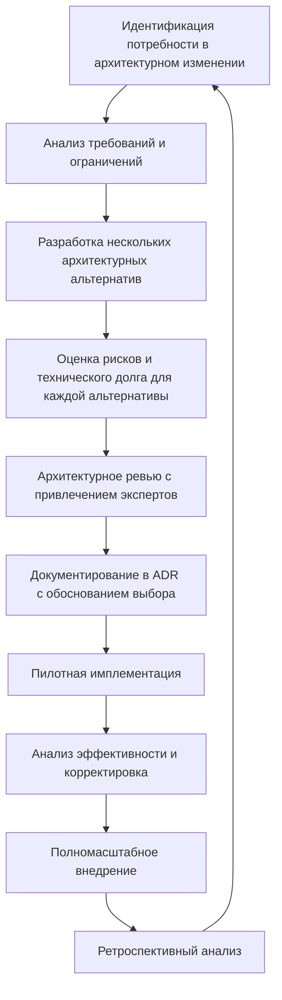
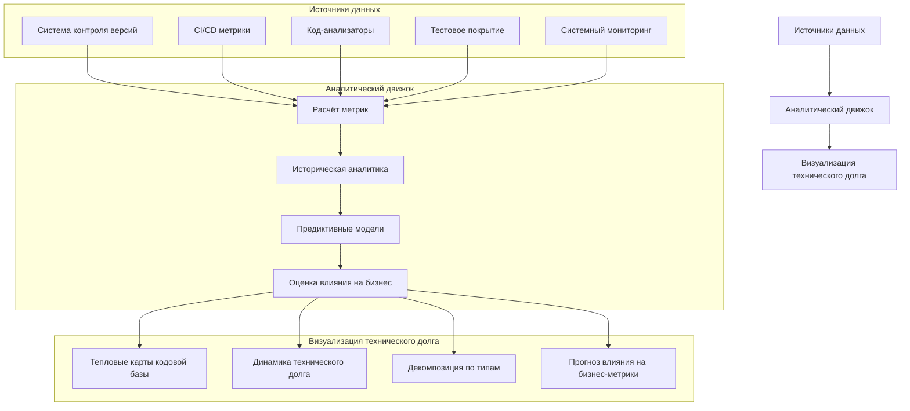
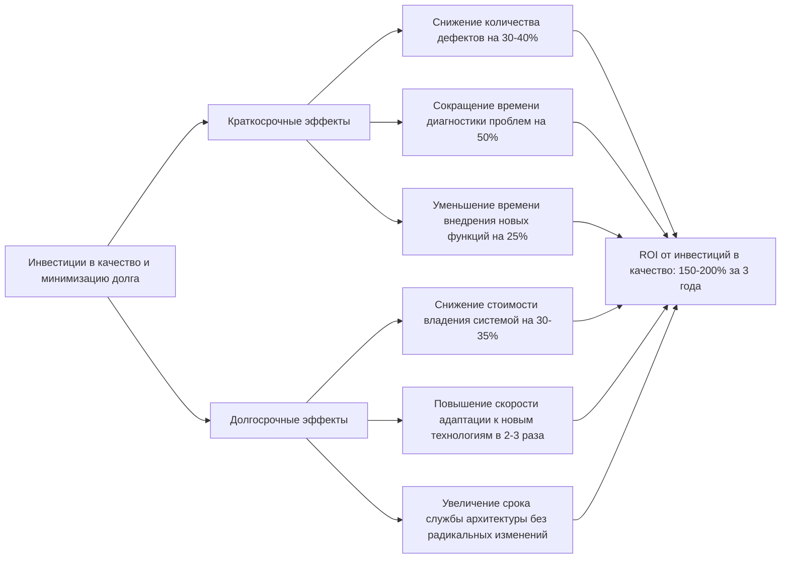

## Введение

Технический долг — неизбежная составляющая разработки инновационных программных продуктов, особенно в области машинного перевода с быстро развивающимися технологиями и высококонкурентной средой. Для системы многостратегического адаптивного перевода специализированных текстов управление техническим долгом становится критически важным фактором долгосрочного успеха, обеспечивающим сохранение гибкости и адаптивности с ростом функциональности и численности пользователей.

В данном разделе представлена комплексная стратегия минимизации технического долга, учитывающая специфику предметной области, модульную архитектуру системы и необходимость быстрой адаптации к новым технологическим реалиям, таким как появление архитектуры Google Titans и моделей со сверхбольшим контекстным окном.

## Классификация технического долга в системе машинного перевода

Для эффективного управления техническим долгом необходимо четко классифицировать его типы с учетом специфики проекта.

**Таблица 1. Классификация технического долга для модульной системы машинного перевода**

|Тип долга|Описание|Примеры в контексте проекта|Приоритет решения|
|---|---|---|---|
|**Архитектурный долг**|Недостатки в дизайне высокоуровневой структуры системы|- Жесткие связи между модулями стратегического перевода - Неоптимальная организация конвейера обработки данных - Несоответствие паттернов доступа к терминологическим базам|Критический|
|**Инфраструктурный долг**|Проблемы в инженерной инфраструктуре, инструментах и процессах|- Ручное масштабирование вычислительных ресурсов - Отсутствие автоматизированного тестирования моделей - Несогласованность сред разработки и продакшена|Высокий|
|**Технологический долг**|Устаревшие технологии и зависимости|- Использование устаревших нейросетевых архитектур - Зависимость от неподдерживаемых библиотек - Несовместимость с новыми технологиями контекстного моделирования|Высокий|
|**Долг качества кода**|Низкое качество реализации функций|- Дублирование кода в различных стратегиях перевода - Сложные, плохо структурированные алгоритмы извлечения терминологии - Недостаточное логирование в критических компонентах|Средний|
|**Тестовый долг**|Недостаточное тестирование|- Отсутствие тестов для редких языковых пар - Неполное покрытие тестами многостратегического конвейера - Ограниченное тестирование на реальных отраслевых данных|Средний|
|**Документационный долг**|Недостаточная или устаревшая документация|- Неактуальные API-спецификации - Отсутствие документации по интеграции новых стратегий перевода - Недокументированные зависимости между модулями|Средний|
|**Знаниевый долг**|Недостаток знаний о системе в команде|- Концентрация экспертизы о работе алгоритмов извлечения терминологии у отдельных сотрудников - Отсутствие общего понимания архитектуры интеграционной шины|Высокий|

## Принципы минимизации технического долга

Наша стратегия минимизации технического долга основана на следующих ключевых принципах:

1. **Проактивное управление** — планирование и предотвращение технического долга на этапе проектирования, а не только реагирование на возникающие проблемы
    
2. **Инкрементальное улучшение** — постоянное, поэтапное улучшение кодовой базы и архитектуры, интегрированное в регулярный процесс разработки
    
3. **Баланс скорости и качества** — принятие осознанных решений о допустимом техническом долге с четким планом его погашения
    
4. **Прозрачность и измеримость** — объективная оценка технического долга через измеримые метрики и ясная коммуникация рисков
    
5. **Модульность и изоляция** — локализация технического долга в изолированных модулях для минимизации его влияния на всю систему
    
6. **Непрерывное обучение** — регулярный анализ причин возникновения технического долга и совершенствование процессов
    

## Превентивные меры для минимизации технического долга

### 1. Архитектурные практики

- **Строгое соблюдение принципов модульности с четкими интерфейсами**:
    
    - Определение четких контрактов между модулями системы (API-интерфейсы, форматы данных)
    - Внедрение механизмов версионирования API для обеспечения обратной совместимости
    - Создание адаптеров для интеграции новых технологических компонентов
- **Практика архитектурных решений (ADR)**:
    
    - Документирование ключевых архитектурных решений с обоснованием выбора
    - Фиксация явных компромиссов и связанных рисков технического долга
    - Регулярный пересмотр исторических решений на соответствие текущим требованиям
- **Архитектурные ревью**:
    
    - Обязательные межфункциональные ревью для значимых архитектурных изменений
    - Привлечение внешних экспертов для оценки архитектуры под конкретные задачи (обработка сверхбольших контекстов, многостратегический перевод)
    - Использование формальных методов оценки архитектуры (ATAM, CBAM)

### 2. Инженерные практики

- **Непрерывная интеграция и доставка (CI/CD)**:
    
    - Автоматизированные сборки и тестирование для раннего выявления проблем
    - Автоматизированный анализ качества кода и зависимостей
    - Стандартизация процесса развертывания через инфраструктуру как код (IaC)
- **Мониторинг качества кода**:
    
    - Внедрение инструментов статического анализа, специализированных для NLP и ML
    - Автоматизированный анализ сложности компонентов и зависимостей
    - Отслеживание трендов в метриках качества кода (цикломатическая сложность, размер функций, связность модулей)
- **Повышение тестового покрытия**:
    
    - Сбалансированная стратегия тестирования с акцентом на критические компоненты
    - Специализированные тесты для оценки качества перевода в различных доменах
    - Автоматизированное тестирование совместимости различных стратегий перевода

### 3. Организационные практики

- **Выделенное время на технический рефакторинг**:
    
    - Правило "бойскаутов": улучшать код при каждом касании
    - Выделение 20% времени Sprint на плановое устранение технического долга
    - Регулярные "технические спринты" для фокусированного улучшения базовых компонентов
- **Четкая стратегия обновления технологий**:
    
    - Стратифицированный подход к библиотекам и зависимостям (core, stable, experimental)
    - Регулярный аудит используемых технологий и планирование обновлений
    - Процесс пилотного внедрения новых технологий с оценкой их влияния
- **Передача знаний и коллективное владение кодом**:
    
    - Регулярные внутренние семинары по ключевым компонентам системы
    - Ротация разработчиков между модулями для распространения знаний
    - Парное программирование для критически важных компонентов

## Метрики оценки и мониторинга технического долга

Для объективного управления техническим долгом внедряется система метрик и инструментов мониторинга:

**Таблица 2. Метрики оценки технического долга**

|Категория|Метрика|Целевое значение|Критическое значение|Инструменты измерения|
|---|---|---|---|---|
|**Структурное качество**|Цикломатическая сложность|< 15|> 25|SonarQube, eslint, pylint|
||Дублирование кода|< 5%|> 10%|SonarQube, jscpd|
||Связность модулей|< 0.4|> 0.7|Архитектурный анализатор (custom)|
|**Тестирование**|Покрытие кода тестами|> 80%|< 60%|Jest, pytest, coverage|
||Покрытие языковых пар тестами|> 90%|< 70%|Система оценки качества перевода (custom)|
||Время выполнения тестов|< 15 мин|> 30 мин|CI/CD метрики|
|**Производительность**|Время перевода 1000 слов|< 1 сек|> 2 сек|Benchmarking suite|
||Использование памяти|< 4GB на модель|> 8GB на модель|Prometheus, resource monitor|
||Время инициализации модели|< 5 сек|> 15 сек|Система мониторинга (custom)|
|**Удобство поддержки**|Время диагностики инцидента|< 30 мин|> 2 часа|MTTR мониторинг|
||Время внедрения новой фичи|< 2 недели|> 4 недели|Jira, метрики разработки|
||Количество дефектов на 1000 строк кода|< 2|> 5|Bug tracking, SonarQube|

### Система визуализации и мониторинга технического долга

## Процесс выявления и устранения технического долга

### 1. Систематическая идентификация технического долга

- **Регулярный аудит кодовой базы**:
    
    - Ежеквартальный глубокий анализ архитектуры и кода
    - Автоматизированное сканирование при каждом коммите
    - Пентесты безопасности и нагрузочное тестирование
- **Система маркировки технического долга**:
    
    - Стандартизированные аннотации в коде (TODO, FIXME, TECHNICAL_DEBT)
    - Связывание меток технического долга с задачами в системе управления проектом
    - Классификация по типу, приоритету и потенциальному влиянию
- **Ретроспективы с фокусом на технический долг**:
    
    - Специальные сессии для анализа накопленного долга
    - Выявление паттернов и системных причин возникновения технического долга
    - Документирование "подводных камней" и потенциальных рисков

### 2. Приоритизация устранения технического долга

**Таблица 3. Матрица приоритизации технического долга**

|Влияние на бизнес|Высокий риск|Средний риск|Низкий риск|
|---|---|---|---|
|**Высокое**|Немедленное устранение • Критические компоненты стратегического выбора • Проблемы масштабирования популярных языковых пар|Приоритетное устранение • Ограничения интеграции с терминологическими базами • Неоптимальная обработка специфичных конструкций|Плановое устранение • Улучшение UX редактора переводов • Оптимизация редких сценариев использования|
|**Среднее**|Приоритетное устранение • Устаревшие модели для ключевых доменов • Проблемы с мониторингом компонентов|Плановое устранение • Рефакторинг подсистемы кэширования • Улучшение процесса обучения моделей|Опциональное устранение • Обновление документации • Улучшение тестов для редких сценариев|
|**Низкое**|Плановое устранение • Технологический апгрейд непервостепенных компонентов • Улучшение кода инструментов анализа|Опциональное устранение • Рефакторинг утилитных библиотек • Улучшение локализации интерфейса|Отложенное устранение • Косметические улучшения кода • Оптимизация сборочных скриптов|

- **Критерии приоритизации**:
    
    - Влияние на качество перевода и пользовательский опыт
    - Потенциальный риск для масштабирования и расширения функциональности
    - Сложность и стоимость устранения
    - Стратегическая важность затрагиваемых компонентов
- **Процесс согласования и утверждения**:
    
    - Формализованный процесс оценки и одобрения значительных рефакторингов
    - Включение ключевых заинтересованных сторон в процесс принятия решений
    - Согласование сроков и ресурсов с учетом бизнес-приоритетов

### 3. Интеграция устранения технического долга в рабочий процесс

- **Встроенный рефакторинг**:
    
    - Включение задач по устранению технического долга в стандартные спринты (15-20% ресурсов)
    - Рефакторинг связанных областей при реализации новой функциональности
    - Регулярные "дни технического совершенства" для фокусированного улучшения кода
- **Выделенные инициативы**:
    
    - Квартальные "технические спринты" для устранения критического долга
    - Кросс-функциональные рабочие группы для решения системных проблем
    - Специальные проекты по миграции на новые технологии и архитектуры
- **Процесс постоянного улучшения**:
    
    - Регулярный анализ эффективности устранения технического долга
    - Корректировка процессов разработки на основе полученного опыта
    - Совершенствование инструментов и методик управления техническим долгом

## Специфика минимизации технического долга по фазам разработки

### Фаза 1: MVP (минимально жизнеспособный продукт)

- **Основные фокусные области**:
    
    - Закладка правильных архитектурных основ для последующего расширения
    - Обеспечение четких интерфейсов между стратегиями перевода
    - Создание надежной инфраструктуры основных языковых пар (EN-RU, EN-DE, EN-FR, ZH-RU)
- **Допустимые компромиссы**:
    
    - Временные ограничения функциональности нечасто используемых сценариев
    - Упрощенная интеграция с внешними системами с планом последующей переработки
    - Ограниченное тестовое покрытие экспериментальных возможностей
- **Недопустимые компромиссы**:
    
    - Нарушение базовых архитектурных принципов модульности
    - Жесткие зависимости между критическими компонентами
    - Отсутствие адекватного логирования и мониторинга

### Фаза 2: Альфа-версия с расширенной функциональностью

- **Основные фокусные области**:
    
    - Ликвидация временных решений из MVP перед расширением
    - Усиление тестирования при добавлении новых языковых пар
    - Оптимизация базовой производительности компонентов
- **Ключевые инициативы**:
    
    - Полная ревизия архитектуры с учетом обратной связи по MVP
    - Проактивное улучшение проблемных областей перед масштабированием
    - Создание полной тестовой инфраструктуры для автоматизированной оценки качества перевода

### Фаза 3: Бета-версия с полным конвейером

- **Основные фокусные области**:
    
    - Оптимизация производительности для увеличенного объема данных
    - Улучшение интероперабельности между компонентами полного конвейера
    - Повышение отказоустойчивости критических компонентов
- **Ключевые инициативы**:
    
    - Глубокий рефакторинг интеграционной шины для улучшения масштабирования
    - Стандартизация интерфейсов между всеми стратегиями перевода
    - Полная документация API и внутренних механизмов системы

### Фаза 4: Релиз-кандидат и полная версия

- **Основные фокусные области**:
    
    - Окончательное устранение известного критического технического долга
    - Подготовка архитектуры к долгосрочной поддержке и развитию
    - Оптимизация для максимальной производительности и масштабируемости
- **Ключевые инициативы**:
    
    - Комплексный аудит безопасности и производительности
    - Финальная оптимизация использования ресурсов
    - Создание полной документации для разработчиков и администраторов

## Подготовка к технологическим прорывам

### Стратегия адаптации к сверхбольшим контекстным моделям

- **Архитектурная готовность**:
    
    - Абстрактные интерфейсы для работы с моделями различной архитектуры
    - Поддержка инкрементальной обработки контекста для бесшовной интеграции новых возможностей
    - Гибкая система управления вычислительными ресурсами для адаптации к требованиям моделей
- **Стратегия постепенного внедрения**:
    
    - Параллельное использование существующих и новых моделей с постепенной миграцией
    - Автоматический A/B тестинг для сравнения эффективности различных подходов
    - Мониторинг баланса качества и производительности с учетом требовательности новых моделей

### Готовность к интеграции с архитектурой Google Titans

- **Технологическая совместимость**:
    
    - Подготовка инфраструктуры к специфическим требованиям Titans-подобных архитектур
    - Адаптеры для обеспечения совместимости с существующими компонентами
    - Оптимизация конвейера данных для эффективного использования особенностей новой архитектуры
- **Минимизация рисков зависимости**:
    
    - Сохранение возможности использования альтернативных технологий и подходов
    - Абстрагирование критических функций от конкретных реализаций
    - Стратегия постепенной миграции с контролируемыми рисками и возможностью отката

## Бюджет и ресурсы на минимизацию технического долга

**Таблица 4. Распределение ресурсов на минимизацию технического долга**

|Фаза разработки|% времени команды на устранение долга|Основные инвестиции|Ожидаемый эффект|
|---|---|---|---|
|**MVP**|10-15%|- Архитектурные ревью - Настройка систем мониторинга - Базовая автоматизация тестирования|- Предотвращение критических архитектурных проблем - Раннее выявление узких мест|
|**Альфа-версия**|15-20%|- Рефакторинг проблемных модулей - Расширение автоматизированного тестирования - Улучшение инфраструктуры CI/CD|- Повышение стабильности при расширении - Сокращение времени диагностики проблем|
|**Бета-версия**|20-25%|- Глубокая оптимизация производительности - Улучшение управления зависимостями - Стандартизация интерфейсов и протоколов|- Повышение масштабируемости - Сокращение времени внедрения новых компонентов|
|**Полная версия**|15-20%|- Комплексный аудит качества - Полная документация системы - Проактивная адаптация к новым технологиям|- Долгосрочная поддерживаемость - Готовность к технологическим прорывам|
|**Поддержка**|25-30%|- Регулярные технические спринты - Плановая модернизация технологий - Обновление архитектуры под новые требования|- Поддержание конкурентного преимущества - Снижение стоимости внедрения новых возможностей|

### Экономическое обоснование инвестиций в минимизацию технического долга

## Показатели успешности стратегии минимизации технического долга

- **Количественные метрики**:
    
    - Сокращение среднего времени от идеи до внедрения новой функциональности на 30-40%
    - Снижение количества дефектов, связанных с техническим долгом, на 50-60%
    - Повышение стабильности системы (снижение незапланированных простоев на 70-80%)
    - Увеличение процента переиспользуемого кода до 60-70%
- **Качественные показатели**:
    
    - Повышение удовлетворенности разработчиков кодовой базой
    - Сокращение времени адаптации новых членов команды
    - Улучшение способности быстро реагировать на изменения рынка
    - Снижение зависимости от ключевых разработчиков

## Заключение

Эффективная стратегия минимизации технического долга является критическим фактором долгосрочного успеха нашей модульной системы машинного перевода. Проактивный подход к выявлению и устранению технического долга, интегрированный в процесс разработки, позволит сохранить гибкость и адаптивность системы в условиях быстро меняющегося технологического ландшафта.

Баланс между скоростью разработки и техническим совершенством, поддерживаемый через четкие метрики и процессы, обеспечит устойчивое конкурентное преимущество в долгосрочной перспективе. Готовность архитектуры к интеграции инноваций, таких как модели со сверхбольшим контекстным окном и архитектура Google Titans, позволит оперативно адаптироваться к технологическим прорывам, сохраняя лидирующие позиции в специализированном сегменте машинного перевода.